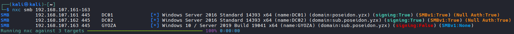

# ETC/HOSTS FILE

## Step 1: Identify all machines and their domains via nxc:

```bash
nxc smb <IP_RANGE>

#Example
nxc smb 192.168.107.161-163

#Results
SMB         192.168.107.161 445    DC01             [*] Windows Server 2016 Standard 14393 x64 (name:DC01) (domain:poseidon.yzx) (signing:True) (SMBv1:True) (Null Auth:True)
SMB         192.168.107.162 445    DC02             [*] Windows Server 2016 Standard 14393 x64 (name:DC02) (domain:sub.poseidon.yzx) (signing:True) (SMBv1:True) (Null Auth:True)
SMB         192.168.107.163 445    GYOZA            [*] Windows 10 / Server 2019 Build 19041 x64 (name:GYOZA) (domain:sub.poseidon.yzx) (signing:False) (SMBv1:None)
```


## How to fill out /etc/hosts based on results

```bash

Step 1: Take each IP and make a row

192.168.107.161
192.168.107.162
192.168.107.163

Step 2: Insert Hostname one space after each IP

192.168.107.161 DC01
192.168.107.162 DC02
192.168.107.163 GYOZA

Step 3: Insert FQDN (Hostname+Domain)

192.168.107.161 DC01 DC01.poseidon.yzx
192.168.107.162 DC02 DC02.sub.poseidon.yzx
192.168.107.163 GYOZA GYOZA.sub.poseidon.yzx

Step 4: Add just the domain name

192.168.107.161 DC01 DC01.poseidon.yzx poseidon.yzx
192.168.107.162 DC02 DC02.sub.poseidon.yzx sub.poseidon.yzx
192.168.107.163 GYOZA GYOZA.sub.poseidon.yzx

#NOTE: GYOZA Shows sub.poseidon.yzx as its domain in the picture. However, since it is NOT the DC in that domain, we delete it to avoid conflic with DC02.

# Final Results
192.168.107.161 DC01 DC01.poseidon.yzx poseidon.yzx
192.168.107.162 DC02 DC02.sub.poseidon.yzx sub.poseidon.yzx
192.168.107.163 GYOZA GYOZA.sub.poseidon.yzx

# Done
```