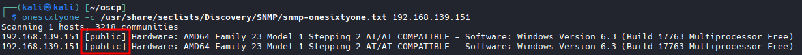
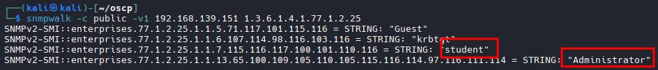

# SNMP Enumeration

## Windows SNMP MIB values
```bash
1.3.6.1.2.1.25.1.6.0	System Processes
1.3.6.1.2.1.25.4.2.1.2	Running Programs
1.3.6.1.2.1.25.4.2.1.4	Processes Path
1.3.6.1.2.1.25.2.3.1.4	Storage Units
1.3.6.1.2.1.25.6.3.1.2	Software Name
1.3.6.1.4.1.77.1.2.25	User Accounts
1.3.6.1.2.1.6.13.1.3	TCP Local Ports
```
## NMAP Network scan for SNMP

```bash
sudo nmap -sU --open -p 161 192.168.50.1-254 -oG open-snmp.txt
```
## Run NMAP Scripts
```bash
nmap -sU -p 161 --script snmp* -Pn <TARGET_IP>
```

## Find Community Strings with tool ONESIXTONE (must find one to continue)

```bash
onesixtyone -c /usr/share/seclists/Discovery/SNMP/snmp-onesixtyone.txt <TARGET_IP>
```


## POSS. Obtain target Email (Used for social engineering)
- SNMP port exposed with the community string "public". This command enumerates the entire MIB tree using the -c option to specify the community string, and -v to specify the SNMP version number, as well as the -t 10 option to increase the timeout period to 10 seconds:

```bash
snmpwalk -c public -v1 -t 10 <TARGET IP>
```

## Enumerates the Windows Users

```bash
snmpwalk -c public -v1 -Oa <TARGET IP> 1.3.6.1.4.1.77.1.2.25
```


## enumerate all the currently-running processes

```bash
snmpwalk -c public -v1 -Oa TARGET IP> 1.3.6.1.2.1.25.4.2.1.2
```

## Installed Software

```bash
snmpwalk -c public -v1 -Oa <TARGET IP> 1.3.6.1.2.1.25.6.3.1.2
```

##  List all the current TCP listening ports
```bash
snmpwalk -c public -v1 -Oa <TARGET IP> 1.3.6.1.2.1.6.13.1.3
```
