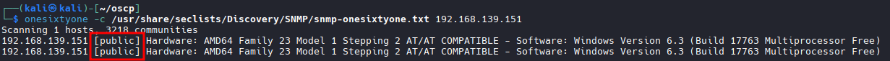
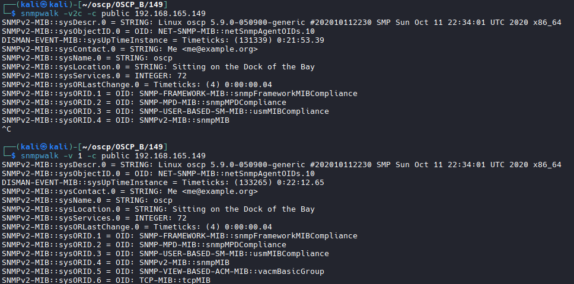
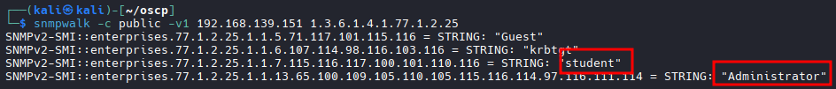

# SNMP Enumeration

## Windows SNMP MIB values
```bash
1.3.6.1.2.1.25.1.6.0	System Processes
1.3.6.1.2.1.25.4.2.1.2	Running Programs
1.3.6.1.2.1.25.4.2.1.4	Processes Path
1.3.6.1.2.1.25.2.3.1.4	Storage Units
1.3.6.1.2.1.25.6.3.1.2	Software Name
1.3.6.1.4.1.77.1.2.25	User Accounts
1.3.6.1.2.1.6.13.1.3	TCP Local Ports
```
## NMAP Network scan for SNMP

```bash
sudo nmap -sU --open -p 161 192.168.50.1-254 -oG open-snmp.txt
```
## Run NMAP Scripts
```bash
nmap -sU -p 161 --script snmp* -Pn <TARGET_IP>
```

## Find Community Strings with tool ONESIXTONE (must find one to continue)

```bash
onesixtyone -c /usr/share/seclists/Discovery/SNMP/snmp-onesixtyone.txt <TARGET_IP>
```


## Find what SNMP Responds to

```bash
snmpwalk -v2c -c `<COMMUNITY_STRING>` <TARGET_IP>

# Or

snmpwalk -v 1 -c <COMMUNITY_STRING> <TARGET_IP>

#NOTE: It may do both
```


## POSS. Obtain target Email (Used for social engineering)
- SNMP port exposed with the community string "public". This command enumerates the entire MIB tree using the -c option to specify the community string, and -v to specify the SNMP version number, as well as the -t 10 option to increase the timeout period to 10 seconds:

```bash
snmpwalk -c public -v1 -t 10 <TARGET IP>
```
# Windows Enumeration
## Enumerates the Windows Users

```bash
# Bulk Query
snmpbulkwalk -c public -v2c 192.168.232.149 .

# THIS IS WINDOWS SPECIFIC
snmpwalk -c public -v1 -Oa <TARGET IP> 1.3.6.1.4.1.77.1.2.25
# Broad Query
snmpwalk -v2c -c public 192.168.165.149 | grep -i user
```


## enumerate all the currently-running processes

```bash
snmpwalk -c public -v1 -Oa TARGET IP> 1.3.6.1.2.1.25.4.2.1.2
```

## Installed Software

```bash
snmpwalk -c public -v1 -Oa <TARGET IP> 1.3.6.1.2.1.25.6.3.1.2
```

##  List all the current TCP listening ports
```bash
snmpwalk -c public -v1 -Oa <TARGET IP> 1.3.6.1.2.1.6.13.1.3
```
# Linux Enumeration
## Enumerate Linux Users
```bash
# Bulk Query
snmpbulkwalk -c public -v2c 192.168.232.149 .

snmpwalk -c public -v2c <TARGET IP> 1.3.6.1.4.1.2021.9
# or check for user accounts via extended MIB
snmpwalk -c public -v2c <TARGET IP> 1.3.6.1.4.1.2021
# Broad Query
snmpwalk -v2c -c public 192.168.165.149 | grep -i user
```
## Enumerate Strings ran
```bash
snmpwalk -v2c -c public 192.168.165.156 NET-SNMP-EXTEND-MIB::nsExtendObjects
# Or
snmpbulkwalk -c public -v2c 192.168.165.149 . | NET-SNMP-EXTEND-MIB
# Results
NET-SNMP-EXTEND-MIB::nsExtendCommand."RESET" = STRING: ./home/john/RESET_PASSWD
```
## Enumerate all currently-running processes
```bash
snmpwalk -c public -v2c <TARGET IP> 1.3.6.1.2.1.25.4.2.1.2
```

## Installed Software
```bash
# Linux doesn't natively expose installed packages via SNMP
# Use this to check running services/software instead
snmpwalk -c public -v2c <TARGET IP> 1.3.6.1.2.1.25.6.3.1.2
```

## List all current TCP listening ports
```bash
snmpwalk -c public -v2c <TARGET IP> 1.3.6.1.2.1.6.13.1.3
```

## Linux-specific: disk/storage info
```bash
snmpwalk -c public -v2c <TARGET IP> 1.3.6.1.4.1.2021.9
```

## Linux-specific: system load/CPU
```bash
snmpwalk -c public -v2c <TARGET IP> 1.3.6.1.4.1.2021.10
```