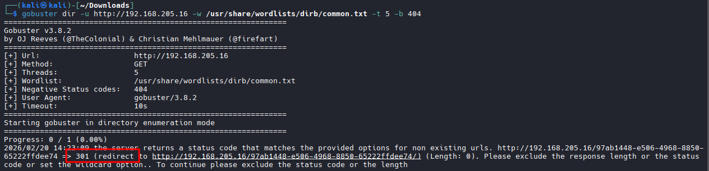
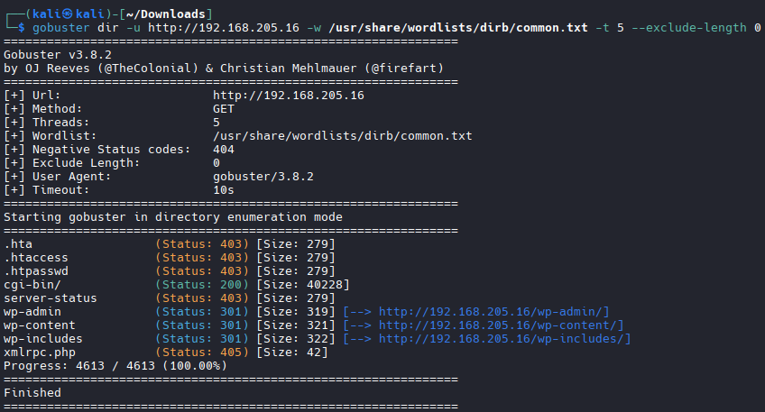

# Gobuster

### Directory Enumeration

```bash
gobuster dir -u <TARGET IP> -w /usr/share/wordlists/dirb/common.txt -t 5

#If you get a redirect (301) run a curl command in order to find out the "Content Length" of a 301 page.

#Example of a 301 notification:
gobuster dir -u http://192.168.205.16 -w /usr/share/wordlists/dirb/common.txt -t 5 -b 404                                  
===============================================================
Gobuster v3.8.2
by OJ Reeves (@TheColonial) & Christian Mehlmauer (@firefart)
===============================================================
[+] Url:                     http://192.168.205.16
[+] Method:                  GET
[+] Threads:                 5
[+] Wordlist:                /usr/share/wordlists/dirb/common.txt
[+] Negative Status codes:   404
[+] User Agent:              gobuster/3.8.2
[+] Timeout:                 10s
===============================================================
Starting gobuster in directory enumeration mode
===============================================================
Progress: 0 / 1 (0.00%)
2026/02/20 14:23:09 the server returns a status code that matches the provided options for non existing urls. http://192.168.205.16/97ab1448-e506-4968-8850-
65222ffdee74 => 301 (redirect to http://192.168.205.16/97ab1448-e506-4968-8850-65222ffdee74/) (Length: 0). Please exclude the response length or the status code or set the wildcard option.. To continue please exclude the status code or the length
```


### Curl command to figure out content-length
```bash
curl -v http://192.168.205.16/somefakedirectory123

# Results

*   Trying 192.168.205.16:80...
* Established connection to 192.168.205.16 (192.168.205.16 port 80) from 192.168.45.183 port 56252 
* using HTTP/1.x
> GET /somefakedirectory123 HTTP/1.1
> Host: 192.168.205.16
> User-Agent: curl/8.18.0
> Accept: */*
> 
* Request completely sent off
< HTTP/1.1 301 Moved Permanently
< Date: Fri, 20 Feb 2026 14:25:05 GMT
< Server: Apache/2.4.51 (Debian)
< X-Powered-By: PHP/7.4.27
< X-Redirect-By: WordPress
< Location: http://192.168.205.16/somefakedirectory123/
< Content-Length: 0
< Content-Type: text/html; charset=UTF-8
< Connection 0 to host 192.168.205.16:80 left intact

# Note the content length of "0"
```


### Gobuster Enumeration on a 301 Redirect page

```bash
gobuster dir -u <Target IP> -w /usr/share/wordlists/dirb/common.txt -t 5 --exclude-length 0
```
