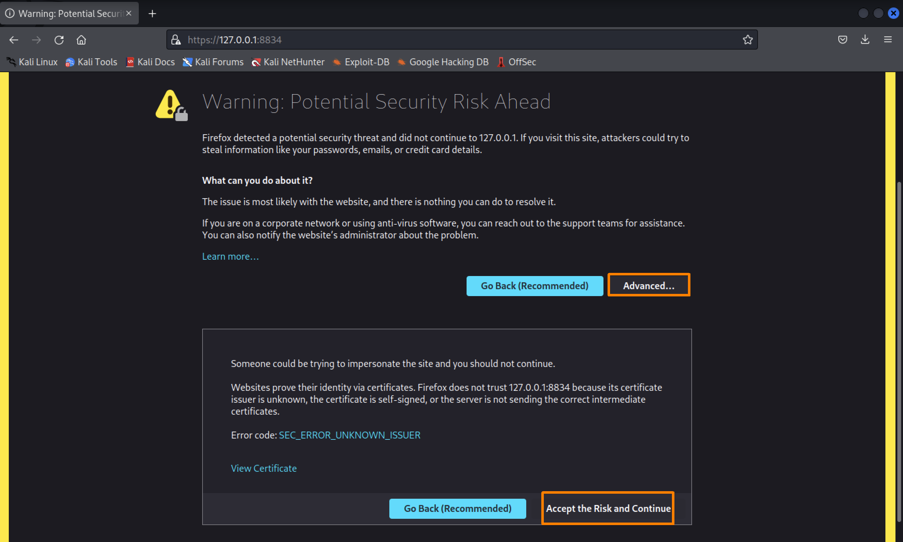

# Installing Nessus


```bash
sudo apt install ./Nessus-10.5.0-debian10_amd64.deb
```
## Start Nessus Service
```
sudo systemctl start nessusd.service
```
### Once Nessus is running, we can launch a browser and navigate to 
```
https://127.0.0.1:8834



```