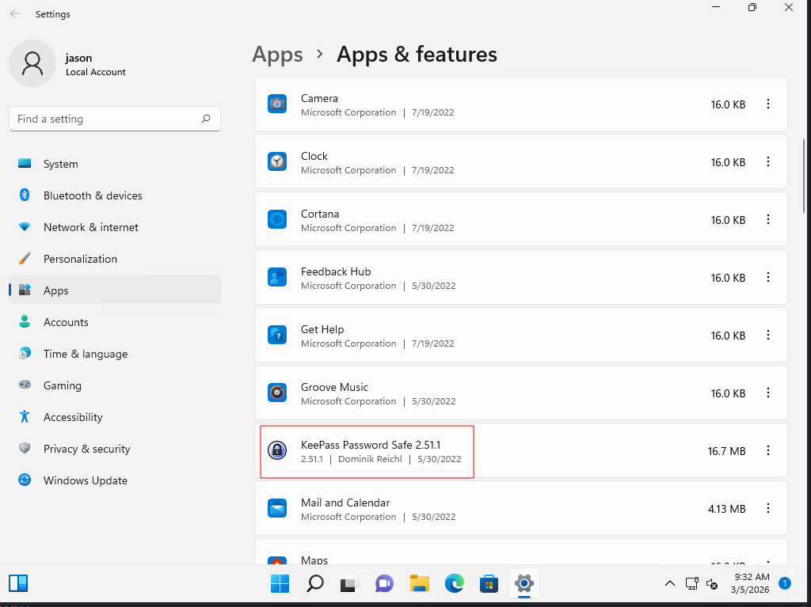
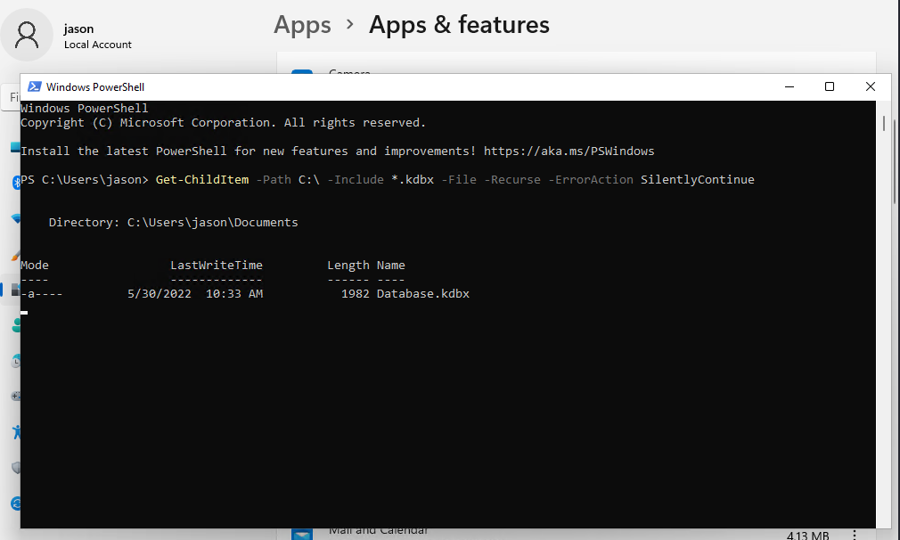

# Password Manager Tools

## 1Password and KeePass



```bash
KeePass .kdbx file

# Step 1: Locate the database files by searching for all .kdbx files on the system. Open Powershell: 

Get-ChildItem -Path C:\ -Include *.kdbx -File -Recurse -ErrorAction SilentlyContinue
```
