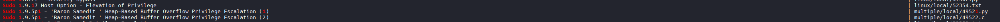

# Manual Enumeration

## User Context

```bash
id

#Results
uid=1000(joe) gid=1000(joe) groups=1000(joe),24(cdrom),25(floppy),29(audio),30(dip),44(video),46(plugdev),109(netdev),112(bluetooth),116(lpadmin),117(scanner)
```

## Enumerate Other Users

```bash
cat /etc/passwd
```

## Enumerate Hostname

```bash
hostname
```

## Enumerate Kernal

```bash
cat /etc/os-release

#And

uname -a
```

## Enumerate Processes

```bash
ps aux
```

## Enumerate TCP/IP Config

```bash

ip a

# Or

ifconfig
```

## Display Routing Table
```bash
routel

#Or 

route
```

## Active Network Connections and Listening Ports

```bash
ss -anp

# See something interesting? Example:
tcp                    LISTEN                  0                       511                                                                       127.0.0.1:8000                                                 0.0.0.0:*

# See what it is:
curl http://127.0.0.1:8000

# Website? Check common file locations
ls /var/www/html
ls /srv/http
ls /opt

```

## Firewall Rules

```bash
cat /etc/iptables/rules.v4
```

## Cron Jobs

```bash
ls -lah /etc/cron*

# To view Current Users Cron jobs:
crontab -l

#or

sudo crontab -l
```

## Writeable directory with current user

```bash
find / -writable -type d 2>/dev/null

# Take note of any locations that match cron jobs
```

## List Mounted Drives

```bash
cat /etc/fstab

#Then

mount

# View Available Disk

lsblk

# Enumerate list of drivers and kernal modules that are loaded

```bash
lsmod

# Results
Module                  Size  Used by
binfmt_misc            20480  1
rfkill                 28672  1
sb_edac                24576  0
crct10dif_pclmul       16384  0
crc32_pclmul           16384  0
ghash_clmulni_intel    16384  0
vmw_balloon            20480  0
...
drm                   495616  5 vmwgfx,drm_kms_helper,ttm
libata                270336  2 ata_piix,ata_generic
vmw_pvscsi             28672  2
scsi_mod              249856  5 vmw_pvscsi,sd_mod,libata,sg,sr_mod
i2c_piix4              24576  0
button                 20480  0

# Find out more about a specific module listed above 

/sbin/modinfo libata
```

## SUID-marked binaries (USed to impersonate the root user)

```bash
find / -perm -u=s -type f 2>/dev/null

# Results
/usr/bin/chsh
/usr/bin/fusermount
/usr/bin/chfn
/usr/bin/passwd
/usr/bin/sudo
/usr/bin/pkexec
/usr/bin/ntfs-3g
/usr/bin/gpasswd
/usr/bin/newgrp
/usr/bin/bwrap
/usr/bin/su
/usr/bin/umount
/usr/bin/mount
/usr/lib/policykit-1/polkit-agent-helper-1
/usr/lib/xorg/Xorg.wrap
/usr/lib/eject/dmcrypt-get-device
/usr/lib/openssh/ssh-keysign
/usr/lib/spice-gtk/spice-client-glib-usb-acl-helper
/usr/lib/dbus-1.0/dbus-daemon-launch-helper
/usr/sbin/pppd
```

## Abuse Sudo Version

```bash
sudo --version

#Results
Sudo version 1.8.31
Sudoers policy plugin version 1.8.31
Sudoers file grammar version 46
Sudoers I/O plugin version 1.8.31

# Searchsploit 
searchsploit sudo 1.8

# Results
------------------------------------------------------------------------------------------------------------------------------------------------------------------------------------------------------------------------------------------------------------------------------------------ ---------------------------------
 Exploit Title                                                                                                                                                                                                                                                                            |  Path
------------------------------------------------------------------------------------------------------------------------------------------------------------------------------------------------------------------------------------------------------------------------------------------ ---------------------------------
sudo 1.8.0 < 1.8.3p1 - 'sudo_debug' glibc FORTIFY_SOURCE Bypass + Privilege Escalation                                                                                                                                                                                                    | linux/local/25134.c
sudo 1.8.0 < 1.8.3p1 - Format String                                                                                                                                                                                                                                                      | linux/dos/18436.txt
sudo 1.8.0 to 1.9.12p1 - Privilege Escalation                                                                                                                                                                                                                                             | linux/local/51217.sh
Sudo 1.8.14 (RHEL 5/6/7 / Ubuntu) - 'Sudoedit' Unauthorized Privilege Escalation                                                                                                                                                                                                          | linux/local/37710.txt
Sudo 1.8.20 - 'get_process_ttyname()' Local Privilege Escalation                                                                                                                                                                                                                          | linux/local/42183.c
Sudo 1.8.25p - 'pwfeedback' Buffer Overflow                                                                                                                                                                                                                                               | linux/local/48052.sh
Sudo 1.8.25p - 'pwfeedback' Buffer Overflow (PoC)                                                                                                                                                                                                                                         | linux/dos/47995.txt
sudo 1.8.27 - Security Bypass                                                                                                                                                                                                                                                             | linux/local/47502.py
------------------------------------------------------------------------------------------------------------------------------------------------------------------------------------------------------------------------------------------------------------------------------------------ ---------------------------------
Shellcodes: No Results

# NOTE: Our version .31 does not fall into any of these. Maybe a later version will work.
# Run it again 
searchsploit sudo 1

#Results 
Sudo 1.9.5p1 - 'Baron Samedit ' Heap-Based Buffer Overflow Privilege Escalation (1)                                                                                                                                                                                                       | multiple/local/49521.py
Sudo 1.9.5p1 - 'Baron Samedit ' Heap-Based Buffer Overflow Privilege Escalation (2)                                                                                                                                                                                                       | multiple/local/49522.c

#Lets try the .py
searchsploit -m 49521.py

#Cpoy file over
sudo scp -P 2222 -i anita_hash 49521.py anita@192.168.195.245:/tmp/
```


```bash
# run it