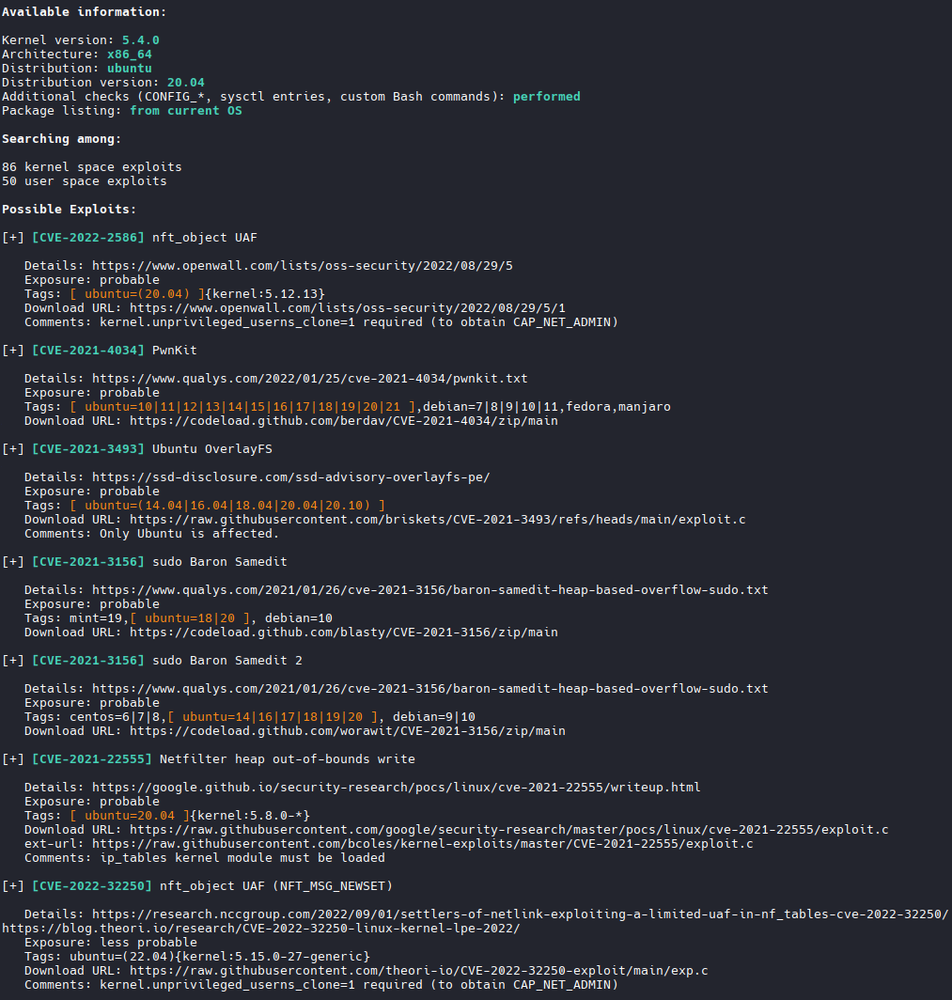

# Linux Automatic Enumeration

```bash
# Download Script
https://pentestmonkey.net/tools/unix-privesc-check/unix-privesc-check-1.4.tar.gz

# Transfer script over

"could not access lab"

# Run Script
./unix-privesc-check standard > output.txt

# Other notable tools
https://github.com/rebootuser/LinEnum
https://github.com/peass-ng/PEASS-ng/tree/master/linPEAS
```

# linPEAS

```bash
# Transfer File over with SSH ID
scp -i ~/oscp/122/ID_RSA KEY /usr/share/peass/linpeas/linpeas.sh USERNAME@172.16.196.14:/OUTPUT FOLDER/

#Example
scp -i ~/oscp/122/mario_id_rsa /usr/share/peass/linpeas/linpeas.sh mario@172.16.196.14:/tmp/

# Change permissions on target
chmod +x /tmp/linpeas.sh

# Run it
/tmp/linpeas.sh
```

# Linux Exploit Suggester

```bash

wget https://raw.githubusercontent.com/The-Z-Labs/linux-exploit-suggester/refs/heads/master/linux-exploit-suggester.sh

# Transfer it over example
scp -P 2222 -i anita_hash /home/kali/tools/linux-exploit-suggester.sh anita@192.168.195.245:/tmp/

# Change permissions
chmod +x /tmp/linux-exploit-suggester.sh

# Run it
/tmp/linux-exploit-suggester.sh

# Example can be found int 8.Practice boxes -> Relia
```


