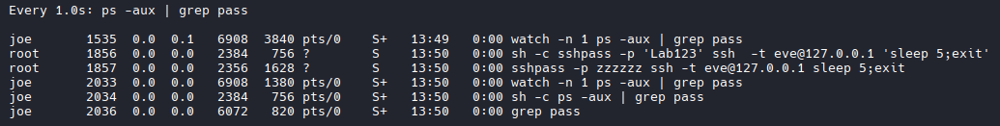
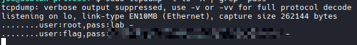

# Inspecting User Trails

```bash
env

# Results
...
XDG_SESSION_CLASS=user
TERM=xterm-256color
SCRIPT_CREDENTIALS=lab
USER=joe
LC_TERMINAL_VERSION=3.4.16
SHLVL=1
XDG_SESSION_ID=35
LC_CTYPE=UTF-8
XDG_RUNTIME_DIR=/run/user/1000
SSH_CLIENT=192.168.118.2 59808 22
PATH=/usr/local/bin:/usr/bin:/bin:/usr/local/games:/usr/games
DBUS_SESSION_BUS_ADDRESS=unix:path=/run/user/1000/bus
MAIL=/var/mail/joe
SSH_TTY=/dev/pts/1
OLDPWD=/home/joe/.cache
_=/usr/bin/env

# Could get a password 'lab'

```

# Switch to a User
```bash
su - root
# Enter Password

whoami
```

# List Sudo Capabilities
```bash
# Useful website:
https://gtfobins.org/#//^sudo$

# Command
sudo -l

# NOTE: If you see this `(ALL : ALL) ALL`, you can stay as your current user and run commands as root with: 
sudo -i
#Enter user password
# Results 
root@debian-privesc:/home/eve# whoami
root

```

# Inspecting Service Footprints

```bash
# Inspect processes with filter for the word pass:
watch -n 1 "ps -aux | grep pass"

#Discovered user `eve` and password `Lab123`
```


# Capture Traffic on Loopback Interface 

```bash
sudo tcpdump -i lo -A | grep "pass"

#Discovered user and password
```
