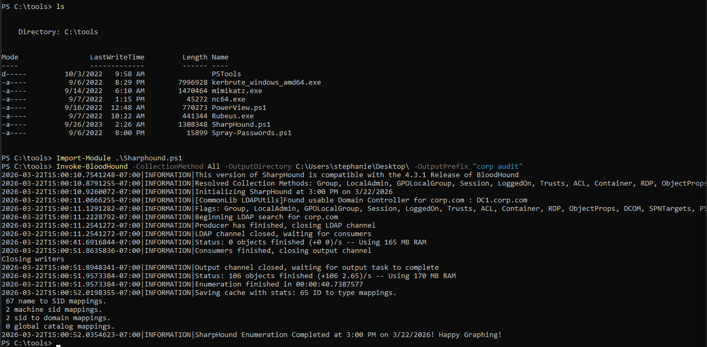
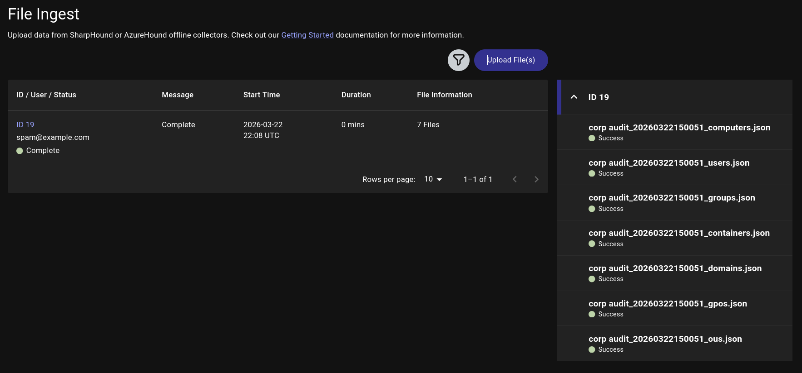

# Active Directory - automated enumeration

## Collecting data with SharpHound

```bash
powershell -ep bypass

# Load SharpHound.ps1
Import-Module .\Sharphound.ps1

# Invoke-BloodHound -CollectionMethod All -OutputDirectory C:\Users\stephanie\Desktop\ -OutputPrefix "corp audit"

# Check the file
ls C:\Users\stephanie\Desktop\
```


## Analysing data using BloodHound

```bash
# Start neo4j
sudo neo4j start

# Start Bloodhound
bloodhound
admin:waterfall (Hint)

# Clear all previous data first
On the left side tab -> Administration -> Databse Management -> Delete data
# Wait a minute
# Upload Data via the File Ingest Tab
```
