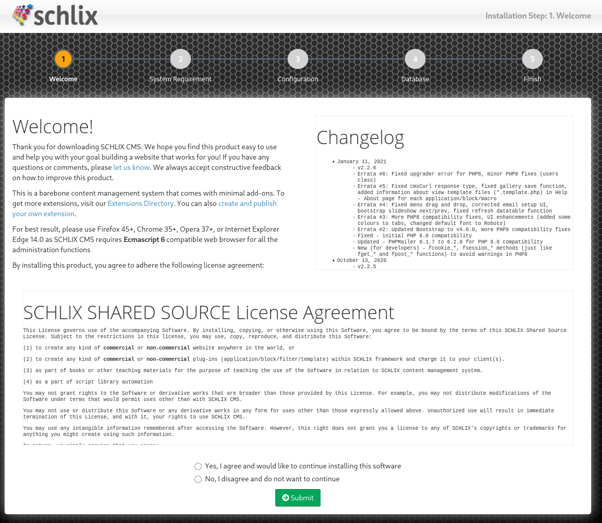

# Nmap

```bash
nmap -Pn -p- --open 192.168.225.248

#Results
PORT     STATE SERVICE
80/tcp   open  http
443/tcp  open  https
445/tcp  open  microsoft-ds
3306/tcp open  mysql
7680/tcp open  pando-pub
```

```bash
nmap -A -T4 -p 80,3306,7680 --open 192.168.225.248

#results
PORT     STATE SERVICE    VERSION
80/tcp   open  http       Apache httpd 2.4.48 ((Win64) OpenSSL/1.1.1k PHP/7.3.29)
| http-methods: 
|_  Potentially risky methods: TRACE
|_http-server-header: Apache/2.4.48 (Win64) OpenSSL/1.1.1k PHP/7.3.29
3306/tcp open  mysql      MariaDB 10.3.24 or later (unauthorized)
7680/tcp open  pando-pub?
```

# Directory Scan on Port 80

```bash
feroxbuster -u http://192.168.225.248 --scan-dir-listings

#Results
[####################] - 3m     30000/30000   147/s   http://192.168.225.248/ 
[####################] - 3m     30000/30000   159/s   http://192.168.225.248/vendor/bootstrap/css/ 
[####################] - 3m     30000/30000   167/s   http://192.168.225.248/vendor/bootstrap/js/ 
[####################] - 3m     30000/30000   159/s   http://192.168.225.248/assets/images/ 
[####################] - 3m     30000/30000   150/s   http://192.168.225.248/assets/js/ 
[####################] - 4m     30000/30000   130/s   http://192.168.225.248/vendor/jquery/ 
[####################] - 3m     30000/30000   159/s   http://192.168.225.248/assets/css/ 
[####################] - 4m     30000/30000   136/s   http://192.168.225.248/vendor/bootstrap/ 
[####################] - 3m     30000/30000   149/s   http://192.168.225.248/vendor/ 
[####################] - 3m     30000/30000   147/s   http://192.168.225.248/assets/ 
[####################] - 3m     30000/30000   157/s   http://192.168.225.248/assets/fonts/ 
[####################] - 3m     30000/30000   153/s   http://192.168.225.248/testing/ 
[####################] - 3m     30000/30000   162/s   http://192.168.225.248/testing/install/ 
[####################] - 3m     30000/30000   163/s   http://192.168.225.248/testing/system/ 
[####################] - 3m     30000/30000   181/s   http://192.168.225.248/testing/web/ 
[####################] - 4m     30000/30000   138/s   http://192.168.225.248/testing/system/js/ 
[####################] - 3m     30000/30000   163/s   http://192.168.225.248/testing/system/images/ 
[####################] - 3m     30000/30000   144/s   http://192.168.225.248/testing/system/themes/ 
[####################] - 4m     30000/30000   135/s   http://192.168.225.248/testing/Install/ 
[####################] - 3m     30000/30000   144/s   http://192.168.225.248/testing/system/languages/ 
[####################] - 3m     30000/30000   163/s   http://192.168.225.248/testing/system/Images/ 
[####################] - 3m     30000/30000   150/s   http://192.168.225.248/testing/system/skins/ 
[####################] - 3m     30000/30000   155/s   http://192.168.225.248/testing/system/blocks/ 
[####################] - 3m     30000/30000   165/s   http://192.168.225.248/testing/system/libs/ 
[####################] - 4m     30000/30000   134/s   http://192.168.225.248/testing/system/fonts/ 
[####################] - 3m     30000/30000   145/s   http://192.168.225.248/testing/system/apps/ 
[####################] - 3m     30000/30000   149/s   http://192.168.225.248/vendor/bootstrap/CSS/ 
[####################] - 3m     30000/30000   148/s   http://192.168.225.248/testing/web/main/ 
[####################] - 3m     30000/30000   181/s   http://192.168.225.248/assets/Images/ 
[####################] - 4m     30000/30000   136/s   http://192.168.225.248/testing/system/APPS/ 
```

# Manual inspection of pages



```bash
# What is Schlix CMS ?
```